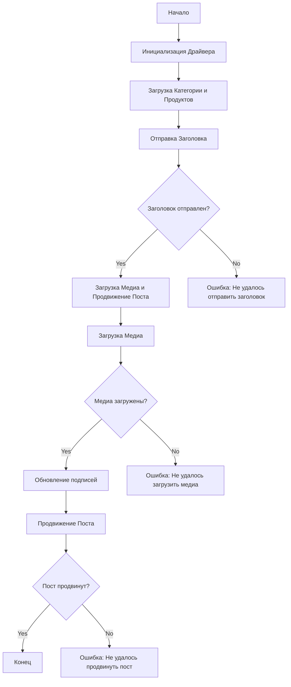

## Анализ кода `post_message_async.md`

### 1. <алгоритм>

**Блок-схема:**

1.  **Начало**:
    *   Скрипт начинает свою работу.
    *   Пример: `Начало выполнения скрипта постинга в Facebook`.

2.  **Инициализация драйвера**:
    *   Создается экземпляр класса `Driver`, который отвечает за взаимодействие с веб-страницей.
    *   Пример: `driver = Driver(...)`.

3.  **Загрузка данных о категории и продуктах**:
    *   Данные о категории и продуктах, которые будут использоваться для постинга, загружаются в объекты `SimpleNamespace`.
    *   Пример: `category = SimpleNamespace(title="Заголовок кампании", description="Описание кампании")`, `products = [SimpleNamespace(local_saved_image="путь/к/изображению.jpg", ...)]`.

4.  **Отправка заголовка**:
    *   Вызывается функция `post_title` для отправки заголовка и описания в текстовое поле Facebook.
    *   Пример: `post_title(driver, category)`.

5.  **Проверка успешности отправки заголовка**:
    *   Проверяется, успешно ли отправился заголовок.
    *   Если успешно, то переходим к шагу 6, иначе к шагу 9.

6.  **Загрузка медиа и продвижение поста**:
    *   Вызывается функция `promote_post`, которая, в свою очередь, вызывает `upload_media`, `update_images_captions` и, непосредственно, функцию продвижения поста.
    *   Пример: `await promote_post(driver, category, products)`.

7.  **Загрузка медиа**:
    *   Вызывается функция `upload_media` для загрузки изображений или видео на Facebook.
    *   Пример: `upload_media(driver, products)`.

8.  **Проверка успешности загрузки медиа**:
    *   Проверяется, успешно ли загрузились медиа файлы.
    *   Если успешно, то переходим к шагу 9, иначе к шагу 11.

9.   **Обновление подписей изображений**:
    *   Вызывается функция `update_images_captions`, для добавления описаний к загруженным медиа файлам.
    *   Пример: `update_images_captions(driver, products, textarea_list)`.

10. **Продвижение поста**:
    *   Завершается процесс продвижения поста.
     * Пример: `click(promote_button)`.

11. **Проверка успешности продвижения**:
    *   Проверяется, успешно ли продвинут пост.
    *   Если успешно, то переходим к шагу 12, иначе к шагу 13.

12. **Конец**:
    *   Скрипт завершает свою работу.
    *   Пример: `Завершение работы скрипта`.

13. **Ошибка отправки заголовка**:
    *   Выводится сообщение об ошибке: "Не удалось отправить заголовок".
    *   Скрипт завершается.

14. **Ошибка загрузки медиа**:
    *   Выводится сообщение об ошибке: "Не удалось загрузить медиа".
    *   Скрипт завершается.

15. **Ошибка продвижения поста**:
     * Выводится сообщение об ошибке "Не удалось продвинуть пост".
     * Скрипт завершается.

### 2. <mermaid>

**Зависимости:**

*   **`Start`**:  Начало выполнения скрипта.
*   **`InitDriver`**:  Инициализация экземпляра класса `Driver`, используемого для управления браузером и взаимодействия с веб-страницей Facebook.
*   **`LoadCategoryAndProducts`**: Загрузка данных о категории (заголовок, описание) и продуктах (пути к медиафайлам).
*   **`SendTitle`**: Отправка заголовка и описания в поле ввода поста на Facebook.
*   **`CheckTitleSuccess`**: Проверка успешности отправки заголовка. Решает, переходить ли к следующему шагу или выводить ошибку.
*   **`UploadMediaAndPromotePost`**: Функция, которая управляет загрузкой медиа и дальнейшим продвижением поста.
*  **`UploadMedia`**: Загрузка медиафайлов (изображений, видео) на Facebook.
*  **`CheckMediaSuccess`**: Проверка успешности загрузки медиафайлов.
*  **`UpdateCaptions`**: Обновление подписей к загруженным изображениям.
*   **`PromotePost`**:  Выполнение продвижения поста.
*   **`CheckPromoteSuccess`**: Проверка успешности продвижения поста.
*   **`End`**:  Конец выполнения скрипта.
*   **`TitleError`**: Обработка ошибки, если не удалось отправить заголовок.
*   **`MediaError`**: Обработка ошибки, если не удалось загрузить медиа.
*   **`PromoteError`**: Обработка ошибки, если не удалось продвинуть пост.

### 3. <объяснение>

**Импорты:**

*   `selenium`: Используется для автоматизации действий в веб-браузере (например, клики, ввод текста).  Взаимодействует с веб-страницами через драйвер браузера.
*   `asyncio`: Используется для асинхронного программирования, что позволяет выполнять несколько задач одновременно.
*   `pathlib`:  Используется для работы с путями к файлам, обеспечивает более удобный и кроссплатформенный способ управления файловой системой.
*   `types`: Используется для создания объектов `SimpleNamespace`, что позволяет удобно хранить данные с произвольными атрибутами.
*   `typing`:  Используется для аннотации типов, что делает код более читаемым и позволяет выявлять ошибки типов на этапе разработки.
*    `src.webdriver.driver`:  Импортируется кастомный класс `Driver`,  который вероятно обеспечивает  управление вебдрайвером, его настройку и создание.
*   `src.config`: Импортируется кастомный модуль `config`, который содержит информацию по конфигурации проекта и, скорее всего, содержит данные о локаторах веб-элементов Facebook.

**Классы:**

*   `Driver` (из `src.webdriver.driver`):  Это класс, который инкапсулирует в себе логику взаимодействия с браузером. Он предоставляет методы для поиска элементов, ввода текста, кликов и других операций.
    *   Атрибуты: могут включать экземпляр вебдрайвера, параметры настройки браузера и др.
    *   Методы: `find_element`, `send_keys`, `click` и другие методы для взаимодействия с веб-страницей.

**Функции:**

*   `post_title(d: Driver, category: SimpleNamespace) -> bool`:
    *   **Аргументы**:
        *   `d`: Экземпляр класса `Driver`, используемый для взаимодействия с веб-страницей.
        *   `category`: Объект `SimpleNamespace`, содержащий `title` и `description` для публикации.
    *   **Возвращаемое значение**: `True`, если заголовок успешно отправлен, иначе `None`.
    *   **Назначение**: Отправляет заголовок и описание в текстовое поле Facebook.
    *   **Пример**: `post_title(driver, category)`.
*   `upload_media(d: Driver, products: List[SimpleNamespace], no_video: bool = False) -> bool`:
    *   **Аргументы**:
        *   `d`: Экземпляр класса `Driver`.
        *   `products`: Список объектов `SimpleNamespace`, содержащих пути к медиафайлам.
        *   `no_video`: Флаг, определяющий необходимость пропускать загрузку видео (по умолчанию `False`).
    *   **Возвращаемое значение**: `True`, если медиафайлы успешно загружены, иначе `None`.
    *   **Назначение**: Загружает медиафайлы на Facebook.
    *   **Пример**: `upload_media(driver, products, no_video=True)`.
*   `update_images_captions(d: Driver, products: List[SimpleNamespace], textarea_list: List[WebElement]) -> None`:
    *   **Аргументы**:
        *   `d`: Экземпляр класса `Driver`.
        *   `products`: Список объектов `SimpleNamespace`, содержащих информацию для подписей.
        *   `textarea_list`: Список элементов `textarea`, в которые добавляются подписи.
    *   **Возвращаемое значение**: `None`.
    *   **Назначение**: Обновляет подписи к загруженным медиафайлам.
    *   **Пример**: `update_images_captions(driver, products, textareas)`.
*   `promote_post(d: Driver, category: SimpleNamespace, products: List[SimpleNamespace], no_video: bool = False) -> bool`:
    *   **Аргументы**:
        *   `d`: Экземпляр класса `Driver`.
        *   `category`: Объект `SimpleNamespace`, содержащий данные для заголовка и описания.
        *   `products`: Список объектов `SimpleNamespace` с данными о продуктах.
        *    `no_video`: Флаг, определяющий необходимость пропускать загрузку видео (по умолчанию `False`).
    *   **Возвращаемое значение**: `True`, если пост успешно продвинут, иначе `None`.
    *   **Назначение**: Выполняет все действия по отправке заголовка, загрузке медиа и продвижению поста на Facebook.
    *   **Пример**: `await promote_post(driver, category, products)`.

**Переменные:**

*   `driver`: Экземпляр класса `Driver`, используемый для взаимодействия с веб-страницей.
*   `category`: Объект `SimpleNamespace`, содержащий данные для заголовка и описания.
*   `products`: Список объектов `SimpleNamespace` с данными о продуктах (пути к файлам, описания).
*   `textarea_list`: Список веб-элементов `textarea`, используемых для ввода подписей.

**Потенциальные ошибки и области для улучшения:**

*   **Обработка ошибок**: Хотя в описании упоминается, что есть обработка ошибок, код не представлен, поэтому сложно оценить её эффективность. Нужно убедиться, что все возможные ошибки (например, отсутствие элементов, проблемы с сетью) обрабатываются корректно.
*   **Асинхронность**: Использование `asyncio` позволяет выполнять асинхронные операции. Однако важно убедиться, что все операции, которые могут быть выполнены асинхронно, выполняются именно так для максимальной эффективности.
*   **Логирование**: Отсутствует логирование операций. Добавление логирования поможет отслеживать работу скрипта и выявлять проблемы.
*   **Зависимости**: Зависимость от `selenium` может привести к проблемам при изменении структуры страниц Facebook.  Локаторы могут быть неактуальными, что может привести к сбоям. Необходимо проработать гибкий механизм поиска элементов.

**Цепочка взаимосвязей с другими частями проекта:**

*   Скрипт зависит от `src.webdriver.driver` для управления браузером, что указывает на наличие модуля, ответственного за настройку и управление вебдрайвером.
*   Используются `SimpleNamespace` из модуля `types`, что упрощает передачу данных внутри скрипта.
*   Используется модуль `src.config` для загрузки локаторов, что говорит о централизованном управлении конфигурациями проекта.
*   Скрипт является частью модуля `src.endpoints.advertisement.facebook.scenarios`, что предполагает наличие других сценариев автоматизации для Facebook.
*   Скрипт использует `asyncio`, что говорит о том, что другие части проекта также могут использовать асинхронное программирование.