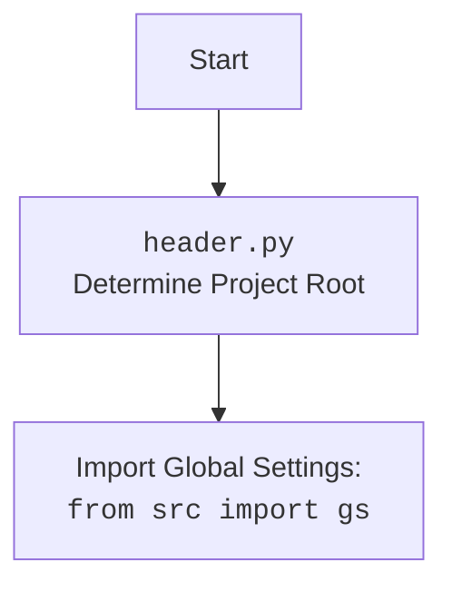

## Анализ кода `post_message_async.py`

### <алгоритм>

1.  **`post_title(d, category)`**:
    *   Принимает `Driver` и `SimpleNamespace` с данными категории (заголовок, описание).
    *   **Пример:** `category = SimpleNamespace(title="Заголовок", description="Описание")`
    *   Прокручивает страницу назад (`d.scroll`).
    *   Открывает поле ввода сообщения (`d.execute_locator(locator.open_add_post_box)`).
    *   Формирует сообщение: `message = f"{category.title}; {category.description};"`.
    *   Вставляет сообщение в поле (`d.execute_locator(locator.add_message, message)`).
    *   Возвращает `True` при успехе, иначе `None`.
2.  **`upload_media(d, products, no_video)`**:
    *   Принимает `Driver`, список `products` (SimpleNamespace с путями к медиа) и флаг `no_video`.
    *   **Пример:** `products = [SimpleNamespace(local_saved_image="image1.jpg", local_saved_video="video1.mp4"), SimpleNamespace(local_saved_image="image2.jpg")]`
    *   Открывает форму добавления медиа (`d.execute_locator(locator.open_add_foto_video_form)`).
    *   Перебирает `products`:
        *   Определяет путь к медиа: видео, если есть и `no_video` = `False`, иначе - изображение.
        *   Загружает медиа (`d.execute_locator(locator.foto_video_input, media_path)`).
    *   Открывает форму редактирования загруженных медиа (`d.execute_locator(locator.edit_uloaded_media_button)`).
    *   Получает список полей ввода подписи к изображению (`textarea_list = d.execute_locator(locator.edit_image_properties_textarea)`).
    *   Вызывает `update_images_captions` для добавления подписей.
    *   Возвращает `True` при успехе, иначе `None`.
3.  **`update_images_captions(d, products, textarea_list)`**:
    *   Принимает `Driver`, список `products`, список `textarea_list` (поля ввода подписи).
     *   Загружает локальные настройки из `translations.json`.
    *   Определяет `handle_product`, которая обрабатывает один `product` из списка:
        *   Формирует текст подписи для `product` в зависимости от его `language` и атрибутов.
        *   Вставляет подпись в соответствующее поле ввода, используя `send_keys`.
    *   Итерируется по `products` и вызывает `handle_product` асинхронно (используя `asyncio.to_thread`).
4.  **`promote_post(d, category, products, no_video)`**:
    *   Принимает `Driver`, `category` (SimpleNamespace), список `products` и флаг `no_video`.
     *   Вызывает `post_title` для добавления заголовка и описания.
    *   Вызывает `upload_media` для загрузки медиа.
    *    Кликает на кнопку завершения редактирования `d.execute_locator(locator.finish_editing_button)`.
    *    Кликает на кнопку публикации `d.execute_locator(locator.publish)`.
    *   Возвращает `True` при успехе.

### <mermaid>

```mermaid
flowchart TD
    subgraph post_message_async.py
        Start(Start) --> PostTitleCall[Вызов post_title(d, category)]
        PostTitleCall -- Success --> UploadMediaCall[Вызов upload_media(d, products, no_video)]
        PostTitleCall -- Fail --> End(End: Fail)

        UploadMediaCall -- Success --> FinishEditing[Вызов d.execute_locator(locator.finish_editing_button)]
        UploadMediaCall -- Fail --> End(End: Fail)

        FinishEditing -- Success --> PublishPost[Вызов d.execute_locator(locator.publish)]
        FinishEditing -- Fail --> End(End: Fail)
        
        PublishPost -- Success --> End(End: Success)
        PublishPost -- Fail --> End(End: Fail)

    end

    subgraph post_title(d, category)
        StartPostTitle(Start) --> ScrollPage[d.scroll(backward)]
        ScrollPage -- Success --> OpenPostBox[d.execute_locator(locator.open_add_post_box)]
        ScrollPage -- Fail --> EndPostTitleFail(End: Fail)

        OpenPostBox -- Success --> CreateMessage[message = f"{category.title}; {category.description};"]
        OpenPostBox -- Fail --> EndPostTitleFail(End: Fail)

         CreateMessage --> AddMessageToPostBox[d.execute_locator(locator.add_message, message)]
         AddMessageToPostBox -- Success --> EndPostTitleSuccess(End: Success)
         AddMessageToPostBox -- Fail --> EndPostTitleFail(End: Fail)
    end
        
    subgraph upload_media(d, products, no_video)
    	StartUploadMedia(Start) --> OpenMediaForm[d.execute_locator(locator.open_add_foto_video_form)]
    	OpenMediaForm -- Fail --> EndUploadMediaFail(End: Fail)
        OpenMediaForm -- Success --> IterateProducts[Iterate through products]

        IterateProducts --> CheckMediaType[Check if product has video and no_video=False]
    	CheckMediaType -- HasVideo --> GetVideoPath[media_path = product.local_saved_video]
    	CheckMediaType -- NoVideo --> GetImagePath[media_path = product.local_saved_image]

    	GetVideoPath --> UploadMedia[d.execute_locator(locator.foto_video_input, media_path)]
        GetImagePath --> UploadMedia
    	UploadMedia -- Fail --> EndUploadMediaFail(End: Fail)
    	UploadMedia -- Success -->  CheckNextProduct[Check next product]

    	CheckNextProduct -- NextProduct --> IterateProducts
    	CheckNextProduct -- NoMoreProducts --> OpenEditForm[d.execute_locator(locator.edit_uloaded_media_button)]
        OpenEditForm -- Fail --> EndUploadMediaFail(End: Fail)
    	OpenEditForm -- Success --> GetTextAreaList[textarea_list = d.execute_locator(locator.edit_image_properties_textarea)]
    	GetTextAreaList -- Fail --> EndUploadMediaFail(End: Fail)
    	GetTextAreaList -- Success --> UpdateCaptions[await update_images_captions(d, products, textarea_list)]
        UpdateCaptions --> EndUploadMediaSuccess(End: Success)
    end

   subgraph update_images_captions(d, products, textarea_list)
        StartUpdateCaptions(Start) --> LoadTranslations[Load translations from translations.json]
        LoadTranslations --> IterateProductsForCaptions[Iterate through products and textarea_list]
        IterateProductsForCaptions --> CallHandleProduct[asyncio.to_thread(handle_product, product, textarea_list, i)]
        CallHandleProduct --> CheckNextProductForCaptions[Check next product]
        CheckNextProductForCaptions -- NextProduct --> IterateProductsForCaptions
        CheckNextProductForCaptions -- NoMoreProducts --> EndUpdateCaptions(End)
   end

    subgraph handle_product(product, textarea_list, i)
        StartHandleProduct(Start) --> GetDirection[Determine text direction (LTR/RTL) based on product.language]
        GetDirection --> GenerateMessage[Generate message based on product details and direction]
        GenerateMessage --> SendKeysToTextArea[textarea_list[i].send_keys(message)]
        SendKeysToTextArea -- Success --> EndHandleProduct(End)
        SendKeysToTextArea -- Fail --> LogErrorSendKeys(Log error: Error in sending keys to textarea)
         LogErrorSendKeys --> EndHandleProduct(End)
    end
   
    
    Start --> PostTitleCall
    
    
    PostTitleCall --> StartPostTitle
    EndPostTitleSuccess --> PostTitleCall
    EndPostTitleFail --> PostTitleCall
    
    UploadMediaCall --> StartUploadMedia
    EndUploadMediaSuccess --> UploadMediaCall
    EndUploadMediaFail --> UploadMediaCall
        
    UpdateCaptions --> StartUpdateCaptions
     EndUpdateCaptions --> UpdateCaptions

```


### <объяснение>

1.  **Импорты:**
    *   `time`: Используется для добавления пауз в коде (например, `time.sleep()`).
    *   `asyncio`: Обеспечивает поддержку асинхронного программирования для выполнения операций ввода-вывода без блокировки основного потока.
    *   `pathlib.Path`: Используется для работы с файловыми путями.
    *   `types.SimpleNamespace`: Создает простые объекты для хранения атрибутов.
    *   `typing.Dict, typing.List`: Используются для аннотаций типов.
    *   `selenium.webdriver.remote.webelement.WebElement`: Представляет веб-элементы на странице, с которыми можно взаимодействовать.
    *   `src.gs`: Глобальные настройки проекта.
    *   `src.webdriver.driver.Driver`: Класс для управления браузером через Selenium.
    *   `src.utils.jjson.j_loads_ns, src.utils.jjson.pprint`: Функции для загрузки JSON и печати данных.
    *  `src.logger.logger`: Логгер для записи событий и ошибок.
2.  **Переменные:**
    *   `MODE`: Строка, указывающая режим работы (`'dev'` для разработки).
    *   `locator`: `SimpleNamespace`, содержащий локаторы веб-элементов, загруженные из JSON файла.
3.  **Функции:**
    *   **`post_title(d, category)`**:
        *   `d`: Экземпляр класса `Driver` для управления браузером.
        *   `category`: `SimpleNamespace` с атрибутами `title` (заголовок) и `description` (описание).
        *   **Назначение:** Публикует заголовок и описание в поле ввода сообщения.
        *   **Пример:** `post_title(driver, SimpleNamespace(title="Заголовок", description="Описание"))`.
        *  **Возвращаемое значение**: `True` если успешно, `None` если ошибка.
    *   **`upload_media(d, products, no_video=False)`**:
        *   `d`: Экземпляр класса `Driver`.
        *   `products`: Список объектов `SimpleNamespace`, каждый из которых содержит путь к медиа (`local_saved_image` или `local_saved_video`).
        *   `no_video`: Флаг, позволяющий игнорировать видео файлы при загрузке.
        *   **Назначение:** Загружает изображения и видео, обновляет подписи к ним.
        *   **Пример:** `await upload_media(driver, [SimpleNamespace(local_saved_image="img1.jpg"), SimpleNamespace(local_saved_video="video1.mp4")], no_video=True)`.
        *   **Возвращаемое значение**: `True` если успешно, `None` если ошибка.
    *   **`update_images_captions(d, products, textarea_list)`**:
        *   `d`: Экземпляр класса `Driver`.
        *    `products`: Список объектов `SimpleNamespace`, каждый из которых содержит данные о продукте (название, цена, скидка и т.д.).
        *   `textarea_list`: Список `WebElement`, представляющих поля ввода для подписей.
        *   **Назначение:** Асинхронно обновляет подписи к загруженным медиа, добавляя информацию о продуктах.
        *    **Пример:** `await update_images_captions(driver, [SimpleNamespace(product_title='Товар 1', original_price='100', language='ru')], [WebElement, WebElement])`
        *   **Возвращаемое значение**: `None`
    *    **`handle_product(product, textarea_list, i)`**:
        *   `product`: Объект `SimpleNamespace`, содержащий данные о продукте.
        *    `textarea_list`: Список `WebElement`, представляющих поля ввода для подписей.
         *   `i`: Индекс текущего продукта в списке.
        *   **Назначение:** Обрабатывает данные о продукте и генерирует подпись, добавляет подпись в поле ввода.
        *    **Возвращаемое значение**: `None`
    *   **`promote_post(d, category, products, no_video=False)`**:
        *   `d`: Экземпляр класса `Driver`.
        *   `category`: `SimpleNamespace` с атрибутами `title` и `description`.
        *   `products`: Список объектов `SimpleNamespace`, содержащих данные о медиа.
         *   `no_video`: Флаг, позволяющий игнорировать видео файлы при загрузке.
        *   **Назначение:**  Выполняет полный цикл публикации сообщения - добавление заголовка и описания, загрузка медиа, добавление подписей и публикация сообщения.
        *   **Пример:** `await promote_post(driver, SimpleNamespace(title="Заголовок", description="Описание"), [SimpleNamespace(local_saved_image="img1.jpg")], no_video=True)`.
        *   **Возвращаемое значение**: `True` если успешно, `None` если ошибка.
4.  **Классы:**
    *   `Driver`: Класс, предоставляющий методы для управления браузером (прокрутка, клики, ввод текста и т.д.). Используется для взаимодействия с веб-страницей.
5.  **Связи с другими частями проекта:**
    *   Использует `src.gs` для доступа к глобальным настройкам (пути к файлам).
    *   Использует `src.webdriver.driver.Driver` для взаимодействия с веб-браузером.
    *   Использует `src.utils.jjson` для загрузки JSON файлов.
    *   Использует `src.logger.logger` для ведения логов.
    *   Зависит от структуры локаторов, хранящихся в JSON файле.
    *   Использует `translations.json` для мультиязычной поддержки.
6.  **Потенциальные ошибки и области для улучшения:**
    *   Обработка ошибок загрузки медиа может быть улучшена.
    *   Отсутствует явная обработка таймаутов.
    *   Жестко заданные значения таймаутов (`d.wait(0.5)`, `d.wait(1.5)` и т.д.) могут быть сделаны настраиваемыми.
    *   Код не проверяет наличие атрибутов в `products` перед их использованием, что может вызвать `AttributeError`.
    *   Код  не обрабатывает ситуацию, когда список `textarea_list` пуст или не соответствует количеству изображений.
    *   В методе `handle_product` не обрабатываются некоторые возможные ошибки (например, при попытке отправить сообщение в невидимое поле).
    *    В методе `handle_product` логика формирования сообщения может быть более гибкой.
    *   В `handle_product` следует добавить обработку ошибок для `send_keys`.

Этот код является частью системы для автоматической публикации сообщений в Facebook. Он использует Selenium для взаимодействия с веб-страницей, асинхронность для параллельного выполнения задач и разделение логики на отдельные функции для повышения читаемости и поддерживаемости.