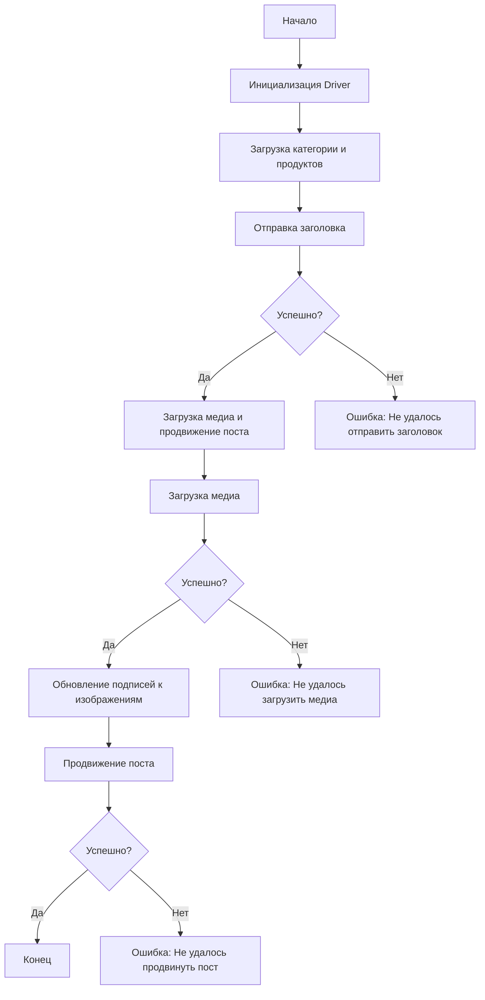
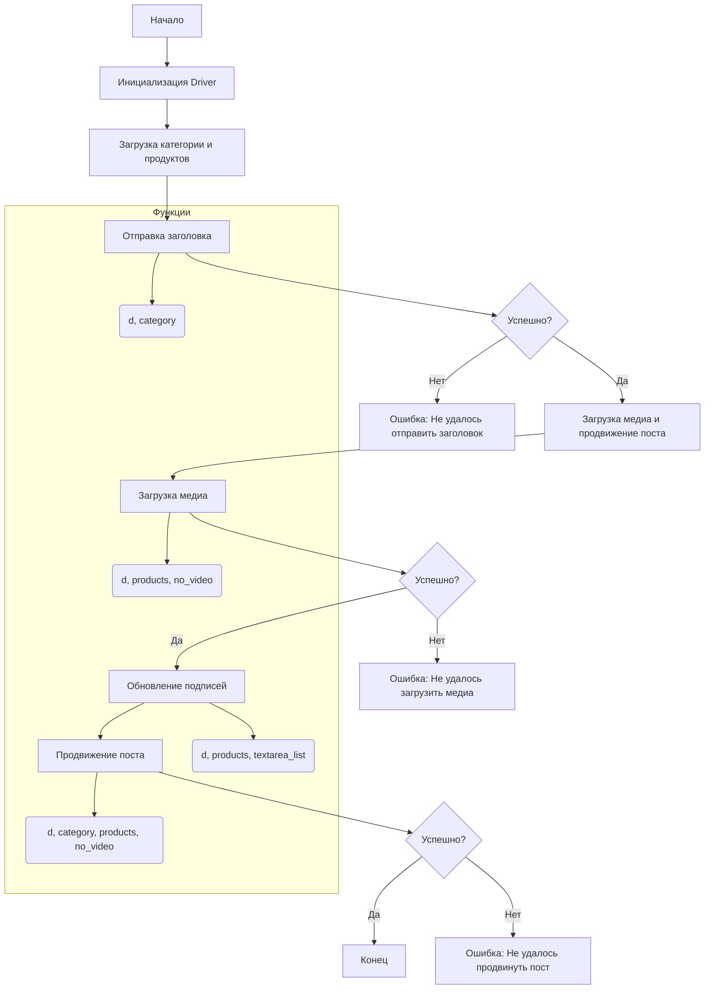

# Анализ кода сценария асинхронной публикации сообщения на Facebook

## <input code>

```rst
... module:: src.endpoints.advertisement.facebook.post_message_async
```
[English]()

## Сценарий асинхронной публикации сообщения на Facebook

... (описание и структура) ...



... (функции и примеры) ...


## <algorithm>

Алгоритм работы сценария асинхронной публикации сообщения на Facebook можно представить в виде следующей пошаговой блок-схемы:

1. **Начало (Start)**: Инициализируется начало выполнения сценария.
2. **Инициализация Driver (InitDriver)**: Создается экземпляр класса `Driver`, который отвечает за взаимодействие с веб-страницей Facebook. Пример: `driver = Driver(...)`.
3. **Загрузка категории и продуктов (LoadCategoryAndProducts)**: Загружаются данные о категории и продуктах, необходимые для публикации. Пример: `category = SimpleNamespace(title="...", description="...")`, `products = [...]`.
4. **Отправка заголовка (SendTitle)**: Функция `post_title` отправляет заголовок и описание в поле сообщения. Пример: `post_title(driver, category)`.
5. **Проверка успешности отправки заголовка (CheckTitleSuccess)**: Проверяется, успешно ли была отправлена информация о заголовке. Если успешно, то алгоритм переходит к этапу загрузки медиа, иначе – к ошибке "Не удалось отправить заголовок".
6. **Загрузка медиа и продвижение поста (UploadMediaAndPromotePost)**: Вызывается функция `promote_post`.
7. **Загрузка медиа (UploadMedia)**: Функция `upload_media` загружает медиафайлы (изображения, видео) на Facebook. Пример: `upload_media(driver, products)`.
8. **Проверка успешности загрузки медиа (CheckMediaSuccess)**: Проверяется, успешно ли была загружена медиа. Если успешно, то алгоритм переходит к обновлению подписей, иначе – к ошибке "Не удалось загрузить медиа".
9. **Обновление подписей (UpdateCaptions)**: Функция `update_images_captions` добавляет подписи к загруженным медиа.
10. **Продвижение поста (PromotePost)**: Функция `promote_post` завершает процесс продвижения поста.
11. **Проверка успешности продвижения поста (CheckPromoteSuccess)**: Проверяется, успешно ли был продвинут пост. Если успешно, то выполнение сценария завершено, иначе – к ошибке "Не удалось продвинуть пост".
12. **Конец (End)**: Сценарий завершается успешно.


## <mermaid>




## <explanation>

**Импорты:**

Код, к сожалению, не предоставляет полного кода, и импорты не видны, что затрудняет полное понимание их назначения и связи. Но по контексту можно предположить, что он импортирует классы и модули из `src.webdriver.driver` (для взаимодействия с браузером), `types` (для работы с пространствами имен), `typing` (для типов), `selenium` (для веб-автоматизации), `asyncio` (для асинхронности), `pathlib` (для работы с путями).

**Классы:**

- **`Driver`**:  Класс, отвечающий за взаимодействие с браузером, инициализацию и управление сессией. Этот класс, скорее всего, определён в модуле `src.webdriver.driver`.

**Функции:**

- **`post_title(d: Driver, category: SimpleNamespace) -> bool`**: Отправляет заголовок и описание кампании.  Возвращает `True`, если успешно, иначе `None`.
- **`upload_media(d: Driver, products: List[SimpleNamespace], no_video: bool = False) -> bool`**: Загружает медиафайлы. Возвращает `True`, если успешно, иначе `None`.
- **`update_images_captions(d: Driver, products: List[SimpleNamespace], textarea_list: List[WebElement]) -> None`**: Обновляет подписи к изображениям.
- **`promote_post(d: Driver, category: SimpleNamespace, products: List[SimpleNamespace], no_video: bool = False) -> bool`**: Управляет процессом продвижения поста. Возвращает `True`, если успешно, иначе `None`.

**Переменные:**

`driver`, `category`, `products` – переменные, содержащие экземпляр драйвера, данные о категории и продукты соответственно.

**Возможные ошибки и улучшения:**

- **Отсутствует обработка исключений:**  Код должен содержать обработку исключений (например, `try...except` блоки) для более надежного и устойчивого выполнения.
- **Недостаточная детализация:**  Не указаны важные детали (типы данных `SimpleNamespace`, `WebElement` и др.).
- **Сложная структура:**  Проверка успешности выполнения на каждом этапе (с помощью `try...except` или `if result`) упростит дебаггинг и улучшит читаемость кода.
- **Неявные зависимости:** Не указан полный путь к локаторам, что может привести к ошибкам.


**Взаимосвязь с другими частями проекта:**

Этот сценарий использует класс `Driver` из `src.webdriver.driver`.  Он взаимодействует с другими частями проекта через передачу данных (категории, продукты) и результаты операций. Возможно, существуют дополнительные зависимости от других модулей для загрузки локаторов, обработки данных продуктов и т. д.