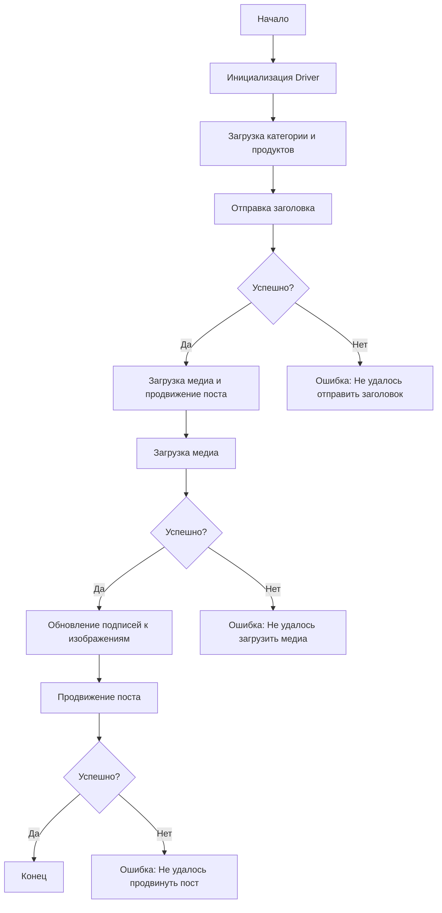

## АНАЛИЗ КОДА: `post_message_async.ru.md`

### 1. <алгоритм>

**Блок-схема работы скрипта асинхронной публикации сообщения на Facebook:**

1.  **Начало работы (`Start`):** Скрипт начинает свое выполнение.
    *   *Пример:* Вызов скрипта из терминала.

2.  **Инициализация `Driver` (`InitDriver`):** Создается экземпляр класса `Driver`, который используется для взаимодействия с браузером.
    *   *Пример:* `driver = Driver(browser='chrome', headless=True)`

3.  **Загрузка данных категории и продуктов (`LoadCategoryAndProducts`):** Загружаются данные о категории (заголовок и описание) и список продуктов (пути к медиафайлам).
    *   *Пример:*
        ```python
        category = SimpleNamespace(title="Заголовок", description="Описание")
        products = [
          SimpleNamespace(local_saved_image="path/to/image1.jpg"),
          SimpleNamespace(local_saved_image="path/to/image2.jpg")
        ]
        ```

4.  **Отправка заголовка (`SendTitle`):** Вызывается функция `post_title`, которая отправляет заголовок и описание кампании в поле сообщения на Facebook.
    *   *Пример:* `post_title(driver, category)`
    *   **Поток данных:** Данные `driver` и `category` передаются в функцию `post_title`.

5.  **Проверка успешности отправки заголовка (`CheckTitleSuccess`):** Проверяется, успешно ли отправлен заголовок.
    *   **`Да`:** Если заголовок успешно отправлен, переходим к загрузке медиа.
    *   **`Нет`:** Если заголовок не отправлен, выводим ошибку "Не удалось отправить заголовок" (`TitleError`).

6.  **Загрузка медиа и продвижение поста (`UploadMediaAndPromotePost`):** Вызывается функция `promote_post`, которая управляет процессом загрузки медиа и продвижения поста.
    *   *Пример:* `promote_post(driver, category, products, no_video=True)`
    *   **Поток данных:** Данные `driver`, `category`, `products`, `no_video` передаются в функцию `promote_post`.

7.  **Загрузка медиа (`UploadMedia`):** Вызывается функция `upload_media`, которая загружает медиафайлы (изображения, видео) на пост Facebook.
    *   *Пример:* `upload_media(driver, products, no_video=True)`
    *   **Поток данных:** Данные `driver`, `products`, `no_video` передаются в функцию `upload_media`.

8.  **Проверка успешности загрузки медиа (`CheckMediaSuccess`):** Проверяется, успешно ли загружены медиафайлы.
    *   **`Да`:** Если медиа успешно загружены, переходим к обновлению подписей.
    *   **`Нет`:** Если медиа не загружены, выводим ошибку "Не удалось загрузить медиа" (`MediaError`).

9.  **Обновление подписей (`UpdateCaptions`):** Вызывается функция `update_images_captions`, которая добавляет описания к загруженным медиафайлам.
    *   *Пример:* `update_images_captions(driver, products, textarea_list)`
    *   **Поток данных:** Данные `driver`, `products`, `textarea_list` передаются в функцию `update_images_captions`.

10. **Продвижение поста (`PromotePost`):** Завершается процесс продвижения поста.

11. **Проверка успешности продвижения поста (`CheckPromoteSuccess`):** Проверяется, успешно ли продвинут пост.
    *   **`Да`:** Если пост успешно продвинут, скрипт завершает работу.
    *   **`Нет`:** Если пост не продвинут, выводим ошибку "Не удалось продвинуть пост" (`PromoteError`).

12. **Завершение (`End`):** Скрипт завершает свое выполнение.

### 2. <mermaid>



**Описание зависимостей:**

- Диаграмма показывает последовательность действий, выполняемых скриптом для публикации сообщения на Facebook.
- Каждый блок представляет собой шаг процесса, а стрелки показывают порядок выполнения.
- Присутствуют условные переходы (`CheckTitleSuccess`, `CheckMediaSuccess`, `CheckPromoteSuccess`), которые определяют дальнейший поток выполнения в зависимости от результата предыдущего шага.
- В случае ошибок предусмотрены блоки с сообщениями об ошибках (`TitleError`, `MediaError`, `PromoteError`).
- Блоки с осмысленными именами отображают основные функции и проверки.

### 3. <объяснение>

**Импорты:**

-   `selenium`: Используется для автоматизации взаимодействия с браузером, например, для поиска элементов на странице, ввода текста, кликов.
-   `asyncio`: Используется для реализации асинхронных операций, что позволяет выполнять несколько задач параллельно.
-   `pathlib`: Предоставляет классы для работы с путями к файлам, что упрощает их обработку.
-   `types`: Используется для создания простых пространств имен (`SimpleNamespace`), которые могут содержать атрибуты с данными.
-   `typing`: Используется для аннотаций типов, что делает код более понятным и читаемым, упрощает отладку.

**Функции:**

1.  **`post_title(d: Driver, category: SimpleNamespace) -> bool`**:

    -   **Назначение:** Отправляет заголовок и описание кампании в поле сообщения Facebook.
    -   **Аргументы:**
        -   `d`: Экземпляр класса `Driver`, предоставляющего методы для взаимодействия с браузером.
        -   `category`: Объект `SimpleNamespace`, содержащий атрибуты `title` и `description`, которые будут отправлены в качестве заголовка и описания поста.
    -   **Возвращаемое значение:** `True`, если заголовок и описание успешно отправлены, `None` в случае неудачи.
    -   **Пример:** `post_title(driver, category=SimpleNamespace(title="Заголовок", description="Описание"))`

2.  **`upload_media(d: Driver, products: List[SimpleNamespace], no_video: bool = False) -> bool`**:

    -   **Назначение:** Загружает медиафайлы (изображения и видео) на пост Facebook.
    -   **Аргументы:**
        -   `d`: Экземпляр класса `Driver`.
        -   `products`: Список объектов `SimpleNamespace`, каждый из которых содержит пути к медиафайлам (например, `local_saved_image`).
        -   `no_video`: Флаг, определяющий, нужно ли пропускать загрузку видео (по умолчанию `False`).
    -   **Возвращаемое значение:** `True`, если медиафайлы успешно загружены, `None` в случае неудачи.
    -   **Пример:** `upload_media(driver, products=[SimpleNamespace(local_saved_image="path/to/image.jpg")], no_video=True)`

3.  **`update_images_captions(d: Driver, products: List[SimpleNamespace], textarea_list: List[WebElement]) -> None`**:

    -   **Назначение:** Асинхронно добавляет описания к загруженным медиафайлам (подписи к изображениям).
    -   **Аргументы:**
        -   `d`: Экземпляр класса `Driver`.
        -   `products`: Список объектов `SimpleNamespace`, содержащих детали для обновления, например, текст подписи.
        -   `textarea_list`: Список элементов `<textarea>`, куда добавляются подписи к изображениям.
    -   **Возвращаемое значение:** `None`.
    -   **Пример:** `update_images_captions(driver, products=[SimpleNamespace(caption="Описание")], textarea_list=[textarea_element1, textarea_element2])`

4.  **`promote_post(d: Driver, category: SimpleNamespace, products: List[SimpleNamespace], no_video: bool = False) -> bool`**:

    -   **Назначение:** Управляет процессом продвижения поста с заголовком, описанием и медиафайлами.
    -   **Аргументы:**
        -   `d`: Экземпляр класса `Driver`.
        -   `category`: Объект `SimpleNamespace` с деталями категории (заголовок, описание).
        -   `products`: Список объектов `SimpleNamespace` с деталями продуктов (пути к медиа).
        -   `no_video`: Флаг для пропуска загрузки видео.
    -   **Возвращаемое значение:** `True`, если пост успешно продвинут, `None` в случае неудачи.
    -   **Пример:** `promote_post(driver, category=SimpleNamespace(title="Заголовок", description="Описание"), products=[SimpleNamespace(local_saved_image="path/to/image.jpg")], no_video=True)`

**Переменные:**

-   `driver`: Экземпляр класса `Driver`, который управляет браузером.
-   `category`: Объект `SimpleNamespace`, содержащий заголовок и описание кампании.
-   `products`: Список объектов `SimpleNamespace`, содержащих пути к медиафайлам и, возможно, описания.
-   `no_video`: Булев флаг, указывающий, следует ли пропускать загрузку видео.
- `textarea_list`: Список веб элементов `textarea` для ввода подписей к изображениям.

**Потенциальные ошибки и улучшения:**

-   **Обработка ошибок:** В коде предусмотрена обработка ошибок (проверка успешности каждого шага), но ее можно улучшить, например, добавив логирование ошибок в файл или базу данных.
-   **Стабильность:** При работе с веб-страницами нужно учитывать, что они могут меняться, поэтому локаторы для поиска элементов должны быть достаточно надежными. Можно добавить ожидание загрузки элементов или использовать более точные методы поиска.
-   **Производительность:** Асинхронное добавление подписей к медиафайлам (`update_images_captions`) позволяет повысить производительность, но можно рассмотреть возможность асинхронной загрузки медиа.
-   **Гибкость:** Можно добавить параметры для настройки процесса загрузки и продвижения поста (например, возможность выбора типа поста, настройки таргетинга).
-  **`Driver` class:** В описании не показан код класса `Driver`, поэтому для полного понимания нужно рассмотреть его реализацию.

**Взаимосвязь с другими частями проекта:**

-   Этот скрипт является частью модуля `src.endpoints.advertisement.facebook`, что говорит о том, что он является одним из вариантов сценариев для рекламных кампаний в Facebook.
-   Скрипт использует `src.webdriver.driver`, поэтому он зависит от других модулей.
-   Скрипт использует класс `SimpleNamespace` из модуля `types`, поэтому он зависит от этого модуля.

В целом, скрипт хорошо структурирован и имеет ясную логику, однако его можно дополнительно улучшить с точки зрения стабильности, производительности и гибкости.