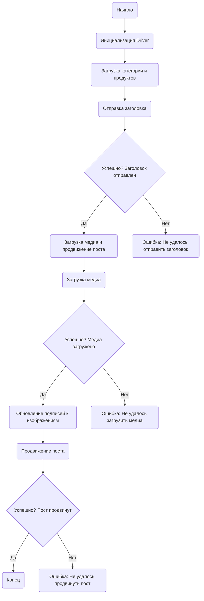

## Анализ кода `post_message_async.ru.md`

### 1. <алгоритм>

**Блок-схема работы скрипта `post_message_async.ru.md`:**

1.  **Начало (Start):**
    *   Скрипт начинает выполнение.
    *   _Пример: Запускается скрипт из командной строки или другого скрипта._
2.  **Инициализация Driver (InitDriver):**
    *   Создается экземпляр класса `Driver` из `src.webdriver.driver`.
    *   _Пример: `driver = Driver(browser_type='chrome', headless=True)`._
3.  **Загрузка категории и продуктов (LoadCategoryAndProducts):**
    *   Загружаются данные о категории (заголовок, описание) и список продуктов (медиафайлы, описания).
    *   _Пример: `category = SimpleNamespace(title="Акция", description="Скидки!")`, `products = [SimpleNamespace(local_saved_image='image1.jpg', caption='Описание 1'), SimpleNamespace(local_saved_image='image2.jpg', caption='Описание 2')]`._
4.  **Отправка заголовка (SendTitle):**
    *   Вызывается функция `post_title(driver, category)` для отправки заголовка и описания на Facebook.
    *   _Пример: `post_title(driver, category)`._
5.  **Проверка успешности отправки заголовка (CheckTitleSuccess):**
    *   Проверяется, успешно ли отправлен заголовок.
    *   **Да:** Переход к загрузке медиа.
        *   _Пример: Функция `post_title` вернула `True`._
    *   **Нет:** Выводится ошибка "Не удалось отправить заголовок" и выполнение скрипта может прерваться.
        *   _Пример: Функция `post_title` вернула `None`._
6.  **Загрузка медиа и продвижение поста (UploadMediaAndPromotePost):**
    *   Вызывается функция `promote_post(driver, category, products)` для загрузки медиа и продвижения поста.
    *   _Пример: `promote_post(driver, category, products)`._
7.  **Загрузка медиа (UploadMedia):**
    *   Вызывается функция `upload_media(driver, products)` для загрузки медиафайлов.
    *   _Пример: `upload_media(driver, products)`._
8.  **Проверка успешности загрузки медиа (CheckMediaSuccess):**
    *   Проверяется, успешно ли загружены все медиафайлы.
    *   **Да:** Переход к обновлению подписей к изображениям.
        *   _Пример: Функция `upload_media` вернула `True`._
    *   **Нет:** Выводится ошибка "Не удалось загрузить медиа" и выполнение скрипта может прерваться.
        *   _Пример: Функция `upload_media` вернула `None`._
9.  **Обновление подписей к изображениям (UpdateCaptions):**
    *   Вызывается функция `update_images_captions(driver, products, textarea_list)` для добавления подписей к медиафайлам.
    *   _Пример: `update_images_captions(driver, products, textarea_list)`._
10. **Продвижение поста (PromotePost):**
    *   Завершается процесс продвижения поста на Facebook.
    *   _Пример: Функция `promote_post` выполняет необходимые действия для завершения продвижения._
11. **Проверка успешности продвижения поста (CheckPromoteSuccess):**
    *   Проверяется, успешно ли продвинут пост.
    *   **Да:** Выполнение скрипта завершается (Конец).
        *   _Пример: Функция `promote_post` вернула `True`._
    *   **Нет:** Выводится ошибка "Не удалось продвинуть пост" и выполнение скрипта может прерваться.
        *   _Пример: Функция `promote_post` вернула `None`._
12. **Конец (End):**
    *   Выполнение скрипта завершено.
        *   _Пример: Скрипт закончил работу и можно закрывать программу._

### 2. <mermaid>



**Анализ зависимостей в `mermaid` диаграмме:**

Диаграмма `mermaid` описывает последовательность действий скрипта. Все узлы и связи в диаграмме представляют логические этапы и переходы в процессе публикации сообщения на Facebook. Здесь нет явных импортов, но подразумевается, что все функции и классы, используемые в диаграмме, импортированы в основном скрипте.

### 3. <объяснение>

**Импорты:**

*   `selenium`: Для управления веб-браузером и взаимодействия с веб-страницей.
*   `asyncio`: Для асинхронного выполнения операций (например, загрузка медиафайлов).
*   `pathlib`: Для работы с путями к файлам (неявно, но обычно используется при загрузке медиа).
*   `types`: Для создания объектов `SimpleNamespace`. Используется для упрощения работы с данными.
*   `typing`: Для аннотаций типов. Обеспечивает статическую проверку типов кода.

**Классы:**

*   `Driver` (из `src.webdriver.driver`):
    *   **Роль:** Абстракция для взаимодействия с веб-браузером.
    *   **Атрибуты:** Содержит экземпляр веб-драйвера `selenium`, настройки браузера.
    *   **Методы:** Методы для навигации по странице, поиска элементов, ввода текста, кликов и т.д.
    *   **Взаимодействие:** Используется во всех функциях (`post_title`, `upload_media`, `update_images_captions`, `promote_post`) для управления браузером.
*   `SimpleNamespace` (из `types`):
    *   **Роль:** Простой способ хранения данных без необходимости создания классов.
    *   **Атрибуты:** Произвольные, как ключи-значения.
    *   **Методы:** Нет.
    *   **Взаимодействие:** Используется для передачи данных о категории и продуктах в функции.
*   `WebElement` (из `selenium.webdriver.remote.webelement`):
  *   **Роль:** Представляет HTML элемент на веб-странице.
  *   **Атрибуты:** Содержит информацию об элементе, его свойства, location и т.д.
  *   **Методы:** Методы для взаимодействия с элементом (нажатие, получение значения, отправка текста).
  *   **Взаимодействие:** Используется в `update_images_captions` для работы с `textarea` элементами.

**Функции:**

*   `post_title(d: Driver, category: SimpleNamespace) -> bool | None`:
    *   **Аргументы:**
        *   `d`: Экземпляр `Driver`.
        *   `category`: `SimpleNamespace`, содержащий `title` и `description`.
    *   **Возвращает:** `True` при успешной отправке, `None` при неудаче.
    *   **Назначение:** Отправляет заголовок и описание на страницу Facebook.
    *   **Пример:**
        ```python
        category_data = SimpleNamespace(title="Новая акция", description="Специальное предложение!")
        result = post_title(driver, category_data)
        if result:
            print("Заголовок успешно отправлен")
        else:
            print("Ошибка при отправке заголовка")
        ```
*   `upload_media(d: Driver, products: List[SimpleNamespace], no_video: bool = False) -> bool | None`:
    *   **Аргументы:**
        *   `d`: Экземпляр `Driver`.
        *   `products`: Список объектов `SimpleNamespace` с информацией о медиафайлах.
        *   `no_video`: Флаг, если `True`, то загрузка видео пропускается.
    *   **Возвращает:** `True` при успешной загрузке, `None` при неудаче.
    *   **Назначение:** Загружает медиафайлы (изображения, видео) на страницу Facebook.
    *   **Пример:**
        ```python
        products_data = [SimpleNamespace(local_saved_image="image1.jpg"), SimpleNamespace(local_saved_image="image2.png")]
        result = upload_media(driver, products_data)
        if result:
            print("Медиа успешно загружено")
        else:
            print("Ошибка при загрузке медиа")
        ```
*   `update_images_captions(d: Driver, products: List[SimpleNamespace], textarea_list: List[WebElement]) -> None`:
    *   **Аргументы:**
        *   `d`: Экземпляр `Driver`.
        *   `products`: Список объектов `SimpleNamespace` с данными для подписей.
        *   `textarea_list`: Список `WebElement` текстовых полей для ввода подписей.
    *   **Возвращает:** `None`.
    *   **Назначение:** Добавляет подписи к загруженным медиафайлам.
    *   **Пример:**
        ```python
        textarea_elements = driver.find_elements(By.TAG_NAME, "textarea")
        product_captions = [SimpleNamespace(caption="Подпись 1"), SimpleNamespace(caption="Подпись 2")]
        update_images_captions(driver, product_captions, textarea_elements)
        ```
*   `promote_post(d: Driver, category: SimpleNamespace, products: List[SimpleNamespace], no_video: bool = False) -> bool | None`:
    *   **Аргументы:**
        *   `d`: Экземпляр `Driver`.
        *   `category`: `SimpleNamespace` с данными о категории (заголовок, описание).
        *   `products`: Список объектов `SimpleNamespace` с данными о медиафайлах.
        *   `no_video`: Флаг, если `True`, то загрузка видео пропускается.
    *   **Возвращает:** `True` при успешном продвижении, `None` при неудаче.
    *   **Назначение:** Запускает весь процесс продвижения поста (заголовок, медиа, подписи).
    *   **Пример:**
        ```python
        result = await promote_post(driver, category_data, products_data)
        if result:
            print("Пост успешно продвинут")
        else:
            print("Ошибка при продвижении поста")
        ```

**Переменные:**

*   Переменные создаются динамически в функциях и не описаны глобально, но `d` - это экземпляр класса `Driver`, `category` - это `SimpleNamespace` для категории, `products` это `List[SimpleNamespace]` для продуктов, `no_video` это Boolean флаг.
*   `textarea_list` это список `WebElement`.

**Потенциальные ошибки и области для улучшения:**

1.  **Обработка ошибок:**  Функции возвращают `True` или `None`. Лучше использовать исключения для более явной обработки ошибок и информации об ошибках.
2.  **Асинхронность:** Использование `async` и `await` в примере  `promote_post` требует асинхронного контекста, который не описан в тексте. Вероятно, здесь нужен `async def` и `await` для всех функций, которые выполняют асинхронные операции.
3.  **Логирование:** Отсутствует логирование действий.
4.  **Зависимости:** Необходимо более четкое указание зависимостей конкретных пакетов, например, импорт `By` из `selenium.webdriver.common.by`.
5.  **Проверка наличия элемента:** Перед взаимодействием с элементами нужно проверять их наличие.
6.  **Конфигурация:** Локаторы жестко закодированы, лучше вынести их в конфигурационные файлы.
7.  **Переиспользование:** Код может быть переиспользован, если вынести методы взаимодействия с элементами в отдельный класс (например, `FacebookPoster`).
8.  **Соединение с другими частями проекта:**

    *   Скрипт использует `src.webdriver.driver` для управления браузером.
    *   Локаторы элементов загружаются через конфигурацию, подразумевая связь с файлами конфигурации в `src`.

Это подробный анализ кода `post_message_async.ru.md`.