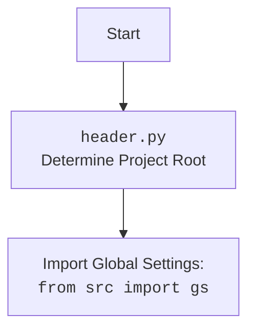

## Анализ кода `hypotez/src/endpoints/advertisement/facebook/scenarios/switch_account.py`

### 1. <алгоритм>

**Описание процесса переключения аккаунта Facebook:**

1.  **Инициализация:**
    *   Загружаются общие настройки проекта `gs` из `src`.
    *   Извлекаются локаторы элементов для взаимодействия со страницей Facebook из файла `post_message.json`, используя функцию `j_loads_ns` и сохраняются в переменной `locator` (тип `SimpleNamespace`).

2.  **Вызов функции `switch_account`:**
    *   Функция `switch_account` принимает экземпляр класса `Driver` (веб-драйвер) в качестве аргумента.
    *   Вызывается метод `execute_locator` у объекта `driver`, передавая ему локатор кнопки переключения аккаунта ( `locator.switch_to_account_button` ).
    *   Метод `execute_locator` выполняет действие, описанное в локаторе (например, клик на кнопку, если она существует и видна).

**Примеры:**

*   **Инициализация:** `gs` может содержать пути к директориям проекта, настройки веб-драйвера, и т.д. `j_loads_ns` преобразует JSON данные в объект `SimpleNamespace`, позволяя обращаться к локаторам, как к атрибутам объекта. `locator.switch_to_account_button` может содержать XPath, CSS селектор или другой способ нахождения нужного элемента на веб-странице.
*   **`switch_account`:** Экземпляр класса `Driver` уже должен быть инициализирован и настроен для работы с браузером. Если кнопка "Переключить" есть, она будет нажата. Если её нет, метод `execute_locator` может либо ничего не сделать, либо выдать ошибку в зависимости от реализации.

### 2. <mermaid>

```mermaid
flowchart TD
    Start[Start: <code>switch_account.py</code>] --> ImportModules[Import Modules]
    ImportModules --> LoadLocators[Load Locators: <br><code>locator = j_loads_ns(...)</code>]
    LoadLocators --> SwitchAccountFunction[Define Function: <br><code>def switch_account(driver: Driver):</code>]
    SwitchAccountFunction --> ExecuteLocator[Execute Locator: <br><code>driver.execute_locator(locator.switch_to_account_button)</code>]
    ExecuteLocator --> End[End]

    classDef grey fill:#f9f,stroke:#333,stroke-width:2px
    class ImportModules,LoadLocators,SwitchAccountFunction,ExecuteLocator grey
```

**Объяснение диаграммы:**

*   `Start`: Начало выполнения скрипта `switch_account.py`.
*   `ImportModules`: Импортируются необходимые модули и классы: `Path`, `SimpleNamespace`, `gs` (глобальные настройки), `Driver` (веб-драйвер), `j_loads_ns` (загрузка JSON в namespace).
*   `LoadLocators`: Загружаются локаторы элементов со страницы `post_message.json`, используя функцию `j_loads_ns` и сохраняются в `locator`.
*   `SwitchAccountFunction`: Определяется функция `switch_account`, которая принимает `Driver` в качестве аргумента.
*   `ExecuteLocator`: Внутри функции `switch_account` вызывается метод `execute_locator` объекта `driver`, с локатором кнопки переключения аккаунта `locator.switch_to_account_button`.
*   `End`: Завершение выполнения скрипта.

**Дополнительный `mermaid` блок для `header.py`:**

Так как в коде есть `from src import gs`, а `gs` это глобальные настройки, то следует добавить блок для `header.py` как в инструкции:

**Объяснение:**
   *   `Start`: начало инициализации проекта.
   *   `Header`: Выполняется логика файла `header.py`, которая, как правило, определяет корень проекта для корректной работы с путями.
   *   `import`: Импортируются глобальные настройки, доступные через переменную `gs`.

### 3. <объяснение>

**Импорты:**

*   `pathlib.Path`: Используется для создания и манипуляции с путями к файлам и директориям.
*   `types.SimpleNamespace`: Используется для создания объектов, атрибуты которых можно устанавливать динамически (удобно для хранения локаторов).
*   `src.gs`: Импортирует глобальные настройки проекта, содержащие, например, пути к файлам, настройки веб-драйвера.
*   `src.webdriver.driver.Driver`: Импортирует класс `Driver`, который отвечает за взаимодействие с веб-браузером.
*   `src.utils.jjson.j_loads_ns`: Импортирует функцию `j_loads_ns`, которая загружает данные из JSON файла и возвращает их в виде объекта `SimpleNamespace`.

**Переменные:**

*   `MODE`: Переменная, задающая режим работы (в данном случае `dev`). Используется, вероятно, для выбора различных настроек в зависимости от режима.
*   `locator`: Переменная типа `SimpleNamespace`, хранящая локаторы элементов страницы Facebook, загруженные из `post_message.json`.

**Функция `switch_account`:**

*   **Аргументы:**
    *   `driver`: Экземпляр класса `Driver`, представляющий собой веб-драйвер.
*   **Возвращаемое значение:**
    *   Функция ничего не возвращает ( `None` по умолчанию ).
*   **Назначение:**
    *   Функция принимает веб-драйвер и использует его для переключения аккаунта, нажимая на кнопку, локатор которой был загружен ранее.
*   **Примеры:**
    *   Предположим, что  `locator.switch_to_account_button` содержит локатор кнопки "Переключить" в виде CSS-селектора. При вызове `driver.execute_locator(locator.switch_to_account_button)`, веб-драйвер найдет элемент по этому селектору и кликнет по нему.

**Классы:**

*   `Driver`: Класс из `src.webdriver.driver`, предоставляющий интерфейс для управления веб-браузером. Он содержит методы для навигации по страницам, поиска элементов, ввода текста, кликов и т.д. Он используется в функции `switch_account` для взаимодействия с веб-страницей Facebook.

**Взаимосвязь с другими частями проекта:**

*   Скрипт `switch_account.py` является частью более крупного модуля `src.endpoints.advertisement.facebook`, который занимается автоматизацией задач, связанных с рекламой на Facebook.
*   Он использует общие настройки из `src.gs`, что позволяет ему легко интегрироваться с остальным проектом.
*   Он использует веб-драйвер (`src.webdriver.driver.Driver`) для автоматизации действий в браузере.
*   Локаторы элементов хранятся в отдельных файлах (`post_message.json`), что делает код более гибким и позволяет легко изменять локаторы без изменения кода.

**Потенциальные ошибки и области для улучшения:**

*   **Обработка ошибок:** Код не содержит обработки ошибок. Если, например, кнопка "Переключить" не будет найдена на странице, или веб-драйвер не будет доступен, это приведет к ошибке. Следует добавить блоки `try-except` для обработки потенциальных исключений.
*   **Логирование:** Отсутствует логирование действий, что затрудняет отслеживание хода выполнения программы.
*   **Конфигурация:** Жесткое кодирование режима ``. Возможно, стоит добавить возможность динамической конфигурации режима через переменные окружения или аргументы командной строки.
*   **Ожидания:** Необходимо использовать ожидания `webdriver.wait` чтобы убедиться, что веб-страница загружена и все элементы доступны до взаимодействия с ними, так как не всегда нужный элемент присутствует мгновенно.
*   **Универсальность**: Функция завязана на конкретный локатор кнопки переключения аккаунта. Возможно, стоит сделать её более универсальной, добавив возможность передавать локатор как аргумент.

**Цепочка взаимосвязей:**

1.  **`switch_account.py`**:
    *   Зависит от `src.gs` (глобальные настройки проекта).
    *   Использует `src.webdriver.driver.Driver` для управления браузером.
    *   Использует `src.utils.jjson.j_loads_ns` для загрузки локаторов из JSON.
    *   Входит в состав `src.endpoints.advertisement.facebook.scenarios` для выполнения сценариев по управлению рекламой на Facebook.

2.  **`src.gs`**:
    *   Определен в `header.py` как глобальный объект, содержащий настройки проекта.
    *   Используется многими модулями в проекте для доступа к глобальным настройкам.

3.  **`src.webdriver.driver.Driver`**:
    *   Использует `selenium` для управления браузером.
    *   Предоставляет абстракцию для взаимодействия с веб-страницей.

4.  **`src.utils.jjson.j_loads_ns`**:
    *   Используется для удобной работы с данными из JSON.
    *   Является частью утилитных функций проекта.

В целом, код представляет собой простой сценарий для переключения аккаунта в Facebook. Он использует модульную структуру и разделение ответственности. Однако, ему требуется доработка в плане обработки ошибок, логирования, и гибкости.