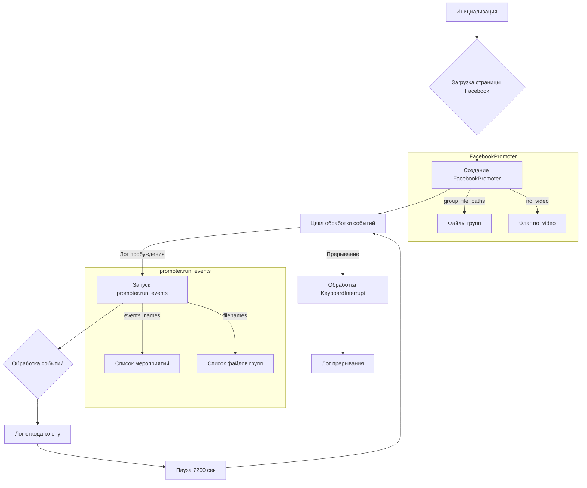

```MD
# <input code>

```python
## \file hypotez/src/endpoints/advertisement/facebook/start_event.py
# -*- coding: utf-8 -*-
#! venv/Scripts/python.exe
#! venv/bin/python/python3.12

"""
.. module: src.endpoints.advertisement.facebook 
	:platform: Windows, Unix
	:synopsis: Отправка мероприятий в группы фейсбук

"""
MODE = 'dev'

from math import log
import header
import time
from src.utils.jjson import j_loads
from src.webdriver.driver import Driver, Chrome
from src.endpoints.advertisement.facebook import FacebookPromoter
from src.logger import logger

d = Driver(Chrome)
d.get_url(r"https://facebook.com")

filenames:list[str] = [ "my_managed_groups.json",
                        "usa.json",
                        "he_il.json",
                        "ru_il.json",
                        "katia_homepage.json",
                        
                        "ru_usd.json",
                        "ger_en_eur.json",            
                        ]
excluded_filenames:list[str] = ["my_managed_groups.json",]

events_names:list = ["choice_day_01_10"]


promoter:FacebookPromoter = FacebookPromoter(d, group_file_paths=filenames, no_video = True)

try:
    while True:
        logger.debug(f"waikig up {time.strftime('%H:%M:%S')}",None,False)
        promoter.run_events(events_names = events_names, group_file_paths = filenames)
        logger.debug(f"going to sleep at {time.strftime('%H:%M:%S')}",None,False)
        time.sleep(7200)
        
except KeyboardInterrupt:
    logger.info("Campaign promotion interrupted.")
```

# <algorithm>

**Алгоритм работы скрипта:**

1. **Инициализация:** Импортируются необходимые модули, включая `FacebookPromoter`, `Driver`, `Chrome`,  `logger` и другие. Создается экземпляр драйвера `d` и загружается страница facebook.com.  Определяются списки `filenames` (пути к файлам с группами) и `events_names` (названия мероприятий). Создается экземпляр `FacebookPromoter`, передавая ему драйвер, список файлов и флаг `no_video`.

2. **Цикл обработки событий:**  Начинается бесконечный цикл `while True`.
   * **Логгирование пробуждения:**  Записывается в лог текущее время с сообщением "waikig up".
   * **Запуск событий:** Вызывается метод `promoter.run_events` для обработки событий `events_names` и `filenames`.  Это предполагает запуск запланированных действий для продвижения сообщений в указанных группах.  
   * **Логгирование отхода ко сну:** Записывается в лог текущее время с сообщением "going to sleep".
   * **Пауза:** Программа приостанавливается на 7200 секунд (2 часа).
3. **Обработка прерывания:**  В блоке `try...except KeyboardInterrupt` обрабатывается ситуация прерывания программы (например, при нажатии Ctrl+C). В этом случае выводится сообщение в лог о прерывании кампании.


**Пример данных:**

* `filenames`: `["my_managed_groups.json", "usa.json", ...]`
* `events_names`: `["choice_day_01_10", ...]`


# <mermaid>



# <explanation>

**Импорты:**

* `from math import log`: Импортирует функцию `log` из модуля `math`.  В данном коде она, вероятно, не используется.
* `import header`:  Импортирует модуль `header`. Без дальнейшей информации сложно судить о его назначении.  Он, вероятно, содержит конфигурационные параметры или вспомогательные функции.
* `import time`: Импортирует модуль `time` для работы с временем.
* `from src.utils.jjson import j_loads`: Импортирует функцию `j_loads` из модуля `jjson`, вероятно, для обработки JSON-данных из файлов.  `src.utils.jjson` - это модуль, находящийся в подпапке `utils` внутри папки `src`.
* `from src.webdriver.driver import Driver, Chrome`: Импортирует классы `Driver` и `Chrome` из модуля `driver` пакета `webdriver`, предназначенные для взаимодействия с веб-драйвером.
* `from src.endpoints.advertisement.facebook import FacebookPromoter`: Импортирует класс `FacebookPromoter` из модуля `facebook` пакета `endpoints/advertisement`.  Этот модуль, вероятно, содержит функциональность для работы с рекламой на Facebook.
* `from src.logger import logger`: Импортирует объект `logger` для ведения журнальных записей.  Этот импорт предназначен для записи сообщений о прогрессе выполнения, ошибках и других данных в лог-файл.

**Классы:**

* `Driver`:  Предположительно, класс для управления веб-драйвером.  `Chrome` - это, вероятно, подкласс `Driver` для Chrome-драйвера.  Метод `get_url` предназначен для перехода на указанный URL.
* `FacebookPromoter`: Класс для продвижения событий в группах Facebook. Метод `run_events`, по всей видимости, отвечает за выполнение этих операций.  Необходимо изучить реализацию этого класса для понимания точных действий.

**Функции:**

* `time.sleep(7200)`: Задержка на 7200 секунд.

**Переменные:**

* `MODE = 'dev'`: Переменная, вероятно, для обозначения режима работы (разработка, производство и т.д.)
* `filenames`, `excluded_filenames`, `events_names`: Список строк, содержащих имена файлов и названия событий для обработки.

**Возможные ошибки и улучшения:**

* **Отсутствие обработки ошибок:** Код не обрабатывает потенциальные ошибки при работе с файлами, веб-драйвером или API Facebook. Необходимо добавить обработку исключений (try-except блоки) в цикле `while True`, чтобы программа не падала при возникновении проблем.
* **Неясные имена переменных:** Некоторые переменные (например, `d`) имеют неинформативные имена. Используйте более описательные имена для повышения читаемости кода.
* **Зависимости:**  Обратите внимание на импорты из `src`.  Это указывает на структуру проекта, где модули расположены в разных подпапках (`utils`, `webdriver`, `endpoints/advertisement/facebook`, `logger`).  Необходимо убедиться, что все импортируемые модули доступны и правильно установлены.  Проверьте папку `src` на наличие этих модулей и их корректную настройку.
* **Повторность кода:** Может быть возможно сконфигурировать `FacebookPromoter` для более гибкого управления временем и повторением запуска.


**Цепочка взаимосвязей:**

Код взаимодействует с файлами JSON, веб-драйвером, Facebook API и модулями логирования.  `FacebookPromoter` отвечает за выполнение основной логики продвижения.  `Driver` предоставляет интерфейс для взаимодействия с веб-браузером. `logger` обеспечивает мониторинг и отладку.  Программа периодически проверяет файлы JSON, чтобы получить новые события для продвижения.