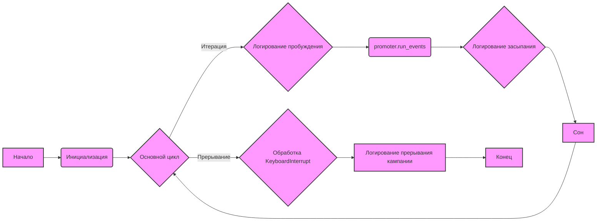

## Анализ кода `hypotez/src/endpoints/advertisement/facebook/start_event.py`

### 1. <алгоритм>

**Блок-схема:**

1.  **Инициализация:**
    *   Устанавливается `MODE = 'dev'`.
    *   Импортируются необходимые модули: `math.log`, `header`, `time`, `src.utils.jjson.j_loads`, `src.webdriver.driver.Driver`, `src.webdriver.driver.Chrome`, `src.endpoints.advertisement.facebook.FacebookPromoter`, `src.logger.logger.logger`.
    *   Создается экземпляр драйвера Chrome: `d = Driver(Chrome)`.
    *   Драйвер открывает страницу Facebook: `d.get_url("https://facebook.com")`.
    *   Определяются списки файлов: `filenames` (список всех файлов групп) и `excluded_filenames` (список исключенных файлов).
    *   Определяется список названий событий: `events_names` (например, "choice_day_01_10").
    *   Создается экземпляр `FacebookPromoter`: `promoter = FacebookPromoter(d, group_file_paths=filenames, no_video = True)`.
2.  **Основной цикл (бесконечный):**
    *   **Начало итерации:**
        *   Логируется сообщение о пробуждении (время). Пример: `logger.debug("waikig up 10:30:00", None, False)`.
        *   Вызывается метод `promoter.run_events()` для запуска событий, передавая список событий и список файлов групп.
        *   Логируется сообщение о засыпании (время). Пример: `logger.debug("going to sleep at 10:35:00", None, False)`.
        *   Программа "засыпает" на 2 часа (7200 секунд): `time.sleep(7200)`.
    *   **Повторение:** Цикл переходит к началу и повторяется, пока не будет прерван.
3.  **Обработка прерывания:**
    *   **`KeyboardInterrupt`:** Если пользователь прерывает выполнение программы (например, нажав Ctrl+C), логгируется сообщение о прерывании кампании: `logger.info("Campaign promotion interrupted.")`.

**Пример потока данных:**

1.  **Инициализация:**
    *   `Driver(Chrome)` создает экземпляр Chrome Driver, который используется для автоматизации браузера.
    *   `filenames`, `excluded_filenames`, `events_names` - списки данных, используемых `FacebookPromoter`.
    *   `FacebookPromoter` получает драйвер и пути к файлам групп для управления событиями.
2.  **Основной цикл:**
    *   `promoter.run_events()` использует драйвер `d` и списки `filenames` и `events_names` для публикации событий в группах Facebook.
3.  **Логирование:**
    *   `logger` ведет записи о текущем состоянии программы (пробуждение, сон, прерывание).

### 2. <mermaid>

**Объяснение диаграммы `mermaid`:**

*   **A (Начало):** Начальная точка выполнения скрипта.
*   **B (Инициализация):** Этап настройки переменных, создания объектов драйвера и промоутера. Зависимости:
    *   `src.webdriver.driver.Driver` и `src.webdriver.driver.Chrome`: для управления браузером.
    *   `src.endpoints.advertisement.facebook.FacebookPromoter`: для управления публикацией событий.
    *   `filenames`, `excluded_filenames`, `events_names`: списки, используемые `FacebookPromoter`.
*   **C (Основной цикл):** Бесконечный цикл для запуска событий.
*   **D (Логирование пробуждения):** Запись в лог о начале итерации. Зависимость:
    *   `src.logger.logger.logger`: для ведения лога.
*   **E (promoter.run_events):** Вызов метода для публикации событий. Зависимости:
    *   Экземпляр `FacebookPromoter`, созданный в B.
*   **F (Логирование засыпания):** Запись в лог перед сном. Зависимость:
    *   `src.logger.logger.logger`: для ведения лога.
*   **G (Сон):** Пауза в выполнении программы. Зависимость:
    *   `time`: для управления временем.
*   **H (Обработка KeyboardInterrupt):** Обработка прерывания выполнения программы.
*   **I (Логирование прерывания кампании):** Запись в лог о прерывании кампании. Зависимость:
    *   `src.logger.logger.logger`: для ведения лога.
*  **J (Конец):** Конечная точка выполнения скрипта.

### 3. <объяснение>

**Импорты:**

*   `math.log`: Используется для математических операций, хотя в данном коде не используется. Возможно, это остаток от предыдущей версии или планировалось к использованию.
*   `header`: Назначение этого модуля неясно из предоставленного кода. Подразумевается, что это кастомный модуль.
*   `time`: Используется для работы со временем, в частности для задержки (`time.sleep`) и получения текущего времени для логирования (`time.strftime`).
*   `src.utils.jjson.j_loads`: Используется для загрузки данных из JSON-файлов.
*   `src.webdriver.driver.Driver`, `src.webdriver.driver.Chrome`: Используются для создания и управления веб-драйвером Chrome, который автоматизирует действия в браузере.
*   `src.endpoints.advertisement.facebook.FacebookPromoter`: Кастомный класс для управления публикацией событий в Facebook.
*   `src.logger.logger.logger`: Объект логгера для записи событий и ошибок.

**Переменные:**

*   `MODE`: Строковая переменная, установленная в значение 'dev'. Вероятно, используется для определения режима работы (например, разработка или продакшн).
*   `d`: Экземпляр класса `Driver`, представляющий веб-драйвер Chrome.
*   `filenames`: Список строк, содержащий названия JSON файлов, содержащих информацию о группах Facebook.
*   `excluded_filenames`: Список строк, содержащий названия JSON файлов, которые должны быть исключены.
*    `events_names`: Список строк, содержащий названия событий.
*   `promoter`: Экземпляр класса `FacebookPromoter`, который управляет процессом публикации событий.

**Классы:**

*   `Driver`, `Chrome`: Классы, входящие в состав `src.webdriver`, предназначенные для управления браузером Chrome.
*   `FacebookPromoter`: Кастомный класс, ответственный за публикацию событий в группах Facebook. Он принимает на вход `Driver` для управления браузером и список `group_file_paths` для определения целевых групп.

**Функции:**

*   `time.sleep(seconds)`: Приостанавливает выполнение программы на указанное количество секунд. В данном случае, скрипт "засыпает" на 2 часа (7200 секунд) между итерациями.
*   `time.strftime('%H:%M:%S')`: Форматирует текущее время в строку в формате "ЧЧ:ММ:СС".
*   `logger.debug(message, exc_info, flag)`: Записывает сообщение отладки в лог.
*   `logger.info(message)`: Записывает информационное сообщение в лог.
*   `promoter.run_events(events_names, group_file_paths)`: Метод класса `FacebookPromoter`, который отвечает за фактическую публикацию событий в группах Facebook. Принимает список названий событий и список путей к файлам групп в качестве аргументов.
*   `d.get_url(url)`: Метод класса `Driver`, который загружает страницу по указанному URL в браузере.

**Взаимосвязи с другими частями проекта:**

*   `src.utils.jjson`: Обеспечивает функциональность для работы с JSON-файлами, которые вероятно содержат информацию о группах Facebook.
*   `src.webdriver`: Предоставляет механизмы для управления браузером, необходимые для автоматизации действий на Facebook.
*   `src.logger`: Обеспечивает логирование событий, что помогает в отладке и мониторинге работы программы.
*   `src.endpoints.advertisement.facebook`: Является частью модуля, отвечающего за рекламные кампании в Facebook.

**Потенциальные ошибки и области для улучшения:**

*   **Неопределенность `header`:** Модуль `header` импортируется, но его назначение неясно. Стоит уточнить, что он делает, и убрать импорт, если он не используется.
*   **Жестко заданные значения:**
    *   `filenames`, `excluded_filenames` и `events_names` заданы статично в коде. Возможно, стоит предусмотреть возможность их настройки через файл конфигурации или аргументы командной строки.
    *   Время сна (7200 секунд) также является жестко заданным значением и может быть параметризовано.
*   **Обработка ошибок:**
    *   Код обрабатывает только прерывание `KeyboardInterrupt`. Следует добавить обработку других потенциальных исключений, таких как ошибки сетевого подключения или ошибки при взаимодействии с Facebook.
*   **Бесконечный цикл:** Бесконечный цикл может быть нежелателен в некоторых сценариях. Можно предусмотреть возможность завершения цикла по определенному условию или таймеру.
*   **Отсутствие комментариев:** Код может быть дополнен комментариями, объясняющими назначение отдельных блоков и переменных.

**Цепочка взаимосвязей:**

1.  Скрипт `start_event.py` инициирует рекламную кампанию на Facebook.
2.  Он использует `src.webdriver` для управления браузером и взаимодействия со страницами Facebook.
3.  Он использует `src.endpoints.advertisement.facebook.FacebookPromoter` для организации публикации событий.
4.  `FacebookPromoter` использует `src.utils.jjson` для загрузки данных о группах из JSON-файлов.
5.  Все действия скрипта логируются с помощью `src.logger`.

В целом, этот скрипт представляет собой автоматизированный инструмент для публикации событий в группах Facebook. Он обладает некоторой гибкостью, но может быть улучшен с точки зрения читаемости, надежности и настраиваемости.