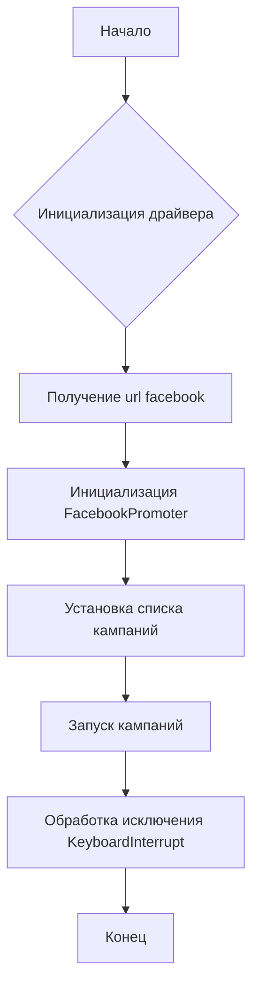

## <input code>

```python
## \file hypotez/src/endpoints/advertisement/facebook/start_posting_katia.py
# -*- coding: utf-8 -*-
#! venv/Scripts/python.exe
#! venv/bin/python/python3.12

"""
.. module: src.endpoints.advertisement.facebook 
	:platform: Windows, Unix
	:synopsis: Отправка рекламных объявлений в группы фейсбук (Katia?)

"""
MODE = 'dev'


import header 
from src.webdriver.driver import Driver, Chrome
from src.endpoints.advertisement.facebook.promoter import FacebookPromoter
from src.logger import logger

d = Driver(Chrome)
d.get_url(r"https://facebook.com")

filenames:list = ['katia_homepage.json',]
campaigns:list = [ 'sport_and_activity',
                  'bags_backpacks_suitcases',
                    'pain',
                    'brands',
                    'mom_and_baby',
                    'house',
                ]
promoter = FacebookPromoter(d, group_file_paths = filenames, no_video = False)

try:
    promoter.run_campaigns(campaigns)
except KeyboardInterrupt:
    logger.info("Campaign promotion interrupted.")
```

## <algorithm>



**Пример:**

1. **Инициализация драйвера:** Создается экземпляр класса `Driver` с использованием `Chrome` (вероятно, для управления веб-драйвером).
2. **Получение url facebook:**  Метод `d.get_url()` загружает страницу facebook.
3. **Инициализация FacebookPromoter:** Создается объект `FacebookPromoter`, принимающий на вход драйвер (`d`), список файлов с данными групп (`filenames`) и флаг `no_video`.
4. **Установка списка кампаний:** Определяются списки `filenames` (вероятно, содержащие данные о группах) и `campaigns` (имена кампаний для рекламы).
5. **Запуск кампаний:** Метод `promoter.run_campaigns(campaigns)` запускает процесс отправки объявлений в заданные кампании. Эта функция, скорее всего, взаимодействует с Facebook API или библиотеками для авторизации и публикации.
6. **Обработка исключения KeyboardInterrupt:**  Если пользователь прерывает выполнение программы, логируется сообщение об ошибке.

**Передача данных:**

- `Driver` передает управлению веб-драйвером.
- `FacebookPromoter` принимает данные для работы с рекламой от `Driver` и `filenames` (возможно, содержащие данные для таргетирования объявлений).

## <mermaid>

```mermaid
graph LR
    subgraph "Модули"
        A[header] --> |импорт| B(start_posting_katia);
        C[Driver] --> |импорт| B;
        D[Chrome] --> |импорт| C;
        E[FacebookPromoter] --> |импорт| B;
        F[logger] --> |импорт| B;
    end
    subgraph "Классы"
        C[Driver] --> G[Driver(Chrome)];
        G --> H[get_url];
        E[FacebookPromoter] --> I[FacebookPromoter(d, group_file_paths, no_video)];
        I --> J[run_campaigns];
        
        
    end
    subgraph "Данные"
    B --> K(filenames);
    B --> L(campaigns);
    
    end
    B --> M[promoter];
    M --> J;
    J --> N{Результат кампании};
    N --> O[Логгирование];
```

## <explanation>

**Импорты:**

- `header`: Возможно, модуль с дополнительными настройками или импортами. Необходимо проверить содержимое `header.py` для подробной информации.
- `src.webdriver.driver`:  Содержит классы для работы с веб-драйвером (например, ChromeDriver). `Driver` и `Chrome` — классы для управления веб-драйверами.
- `src.endpoints.advertisement.facebook.promoter`: Содержит класс `FacebookPromoter`, ответственный за отправку объявлений.
- `src.logger`: Модуль для ведения журнала (logging).

**Классы:**

- `Driver`:  Вероятно, абстрактный базовый класс для управления веб-драйверами, имеющий метод `get_url()` для навигации по страницам.  `Chrome` — конкретная реализация для работы с ChromeDriver.
- `FacebookPromoter`: Класс для запуска рекламных кампаний в Facebook.  Его метод `run_campaigns` отвечает за логику отправки объявлений.  Атрибут `group_file_paths` хранит пути к файлам с данными о группах.

**Функции:**

- `d.get_url(r"https://facebook.com")`:  Получает страницу facebook.com, вероятно, для авторизации или предварительной подготовки сессии.
- `promoter.run_campaigns(campaigns)`:  Запускает процесс отправки объявлений в заданные кампании. Этот метод требует более глубокой проверки, чтобы понять его логику.

**Переменные:**

- `MODE`: Строковая константа, вероятно, используется для выбора режима работы (например, 'dev' или 'prod').
- `filenames`, `campaigns`:  Списки, содержащие имена файлов с данными о группах и названия кампаний.
- `d`: Объект класса `Driver`, представляющий веб-драйвер.
- `promoter`: Объект класса `FacebookPromoter`.

**Возможные ошибки и улучшения:**

- **Обработка ошибок:** Не хватает обработки ошибок при взаимодействии с Facebook API или веб-драйвером.  Например, следует добавить обработку `try...except` для ситуаций, когда запрос к API не удался.
- **Тестирование:** Необходимо добавить тесты для проверки корректности работы методов, особенно `run_campaigns`.
- **Логирование:**  Дополнительное логирование может улучшить отладку (например, вывод шагов работы).
- **Время ожидания:** Следует добавить механизм управления временем ожидания для избежания ошибок, связанных с не успевшими загрузиться страницами.
- **Авторизация:** Не ясно, как происходит авторизация в Facebook.  Проверка на наличие данных для авторизации.
- **Обновление:** Необходимо учитывать возможность изменений в структуре Facebook API.

**Взаимосвязи с другими частями проекта:**

- Код зависит от `src.webdriver`, `src.endpoints.advertisement`, `src.logger` и, вероятно, других модулей в `src`.  Следует проверить подключение `header` для понимания его роли в проекте.
- Необходимо проверить логику работы `FacebookPromoter`, чтобы понять, как он взаимодействует с другими частями проекта.

**Примечание:** Без доступа к файлам `header.py`, `src/webdriver/driver.py`, `src/endpoints/advertisement/facebook/promoter.py`, `src/logger.py`,  и более детальной информации о работе `FacebookPromoter`, сложно дать более подробный анализ.