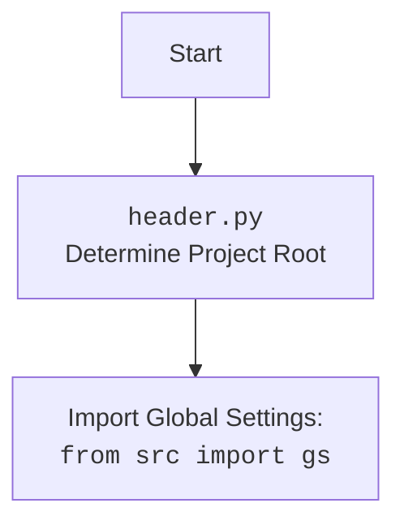

## Анализ кода `hypotez/src/endpoints/advertisement/facebook/start_posting_katia.py`

### 1. <алгоритм>

**Блок-схема:**

```mermaid
graph LR
    A[Начало] --> B{Инициализация режима };
    B --> C[Импорт модулей];
    C --> D{Создание экземпляра Driver(Chrome)};
    D --> E[Переход по URL "https://facebook.com"];
    E --> F{Определение списка файлов конфигурации `filenames`};
    F --> G{Определение списка рекламных кампаний `campaigns`};
    G --> H{Создание экземпляра FacebookPromoter};
    H --> I{Запуск продвижения рекламных кампаний через promoter.run_campaigns(campaigns)};
    I --> J{Обработка исключения KeyboardInterrupt};
    J --> K{Логирование прерывания и завершение};
    I -- Нет прерывания --> L[Завершение];
     K --> L;
```

**Примеры:**

*   **Инициализация:** `MODE` устанавливается в `dev`, что может влиять на поведение скрипта (например, логирование или использование тестовых данных).
*   **Импорт модулей:** импортируются необходимые модули для управления браузером (`Driver`, `Chrome`), выполнения логики продвижения (`FacebookPromoter`) и логирования (`logger`).
*   **Создание драйвера:** создается экземпляр `Chrome` для управления браузером. `d = Driver(Chrome)`
*   **Переход по URL:**  `d.get_url(r"https://facebook.com")` открывает страницу Facebook в браузере.
*   **Списки:** `filenames` содержит имена файлов JSON с данными для групп, а `campaigns` содержит список названий рекламных кампаний.
*   **Создание `FacebookPromoter`:**  экземпляр класса `FacebookPromoter` создается с передачей драйвера, списка файлов и флагом `no_video` - `False`.
*   **Запуск кампании:** `promoter.run_campaigns(campaigns)` запускает продвижение для указанных кампаний.
*   **Обработка исключения:** при нажатии Ctrl+C (прерывание с клавиатуры) программа корректно завершает работу, оставляя запись в логе.

### 2. <mermaid>

```mermaid
flowchart TD
    Start[Start] --> InitMode[Инициализация ];
    InitMode --> ImportModules[Импорт модулей];
    ImportModules --> CreateDriver[Создание экземпляра Driver(Chrome)];
    CreateDriver --> NavigateURL[Переход по URL "https://facebook.com"];
    NavigateURL --> DefineFilenames[Определение списка файлов конфигурации filenames];
    DefineFilenames --> DefineCampaigns[Определение списка рекламных кампаний campaigns];
    DefineCampaigns --> CreatePromoter[Создание экземпляра FacebookPromoter];
    CreatePromoter --> RunCampaigns[Запуск продвижения рекламных кампаний promoter.run_campaigns(campaigns)];
    RunCampaigns --> HandleInterrupt{Обработка KeyboardInterrupt?};
    HandleInterrupt -- Да --> LogInterrupt[Логирование прерывания];
    LogInterrupt --> End[End];
    HandleInterrupt -- Нет --> End;

    classDef imported fill:#f9f,stroke:#333,stroke-width:2px;
    ImportModules --> header[<code>header.py</code>]:::imported
    ImportModules --> webdriver[<code>src.webdriver.driver.py</code>]:::imported
    ImportModules --> facebook_promoter[<code>src.endpoints.advertisement.facebook.promoter.py</code>]:::imported
    ImportModules --> logger[<code>src.logger.logger.py</code>]:::imported

    style header fill:#ccf,stroke:#333,stroke-width:2px
     style webdriver fill:#ccf,stroke:#333,stroke-width:2px
     style facebook_promoter fill:#ccf,stroke:#333,stroke-width:2px
     style logger fill:#ccf,stroke:#333,stroke-width:2px
```



**Объяснение:**

*   **`Start`**: Начало выполнения скрипта.
*   **`InitMode`**:  Установка режима работы скрипта в `dev`.
*   **`ImportModules`**:  Импортирование необходимых модулей.
*   **`CreateDriver`**: Создание экземпляра драйвера браузера Chrome для управления браузером.
*   **`NavigateURL`**: Открытие страницы Facebook.
*   **`DefineFilenames`**: Определение списка файлов JSON с настройками групп.
*   **`DefineCampaigns`**: Определение списка рекламных кампаний.
*   **`CreatePromoter`**: Создание экземпляра класса `FacebookPromoter`, который отвечает за продвижение.
*   **`RunCampaigns`**: Запуск процесса продвижения рекламных кампаний.
*    **`HandleInterrupt`**: Проверка, было ли прерывание с клавиатуры (Ctrl+C).
*   **`LogInterrupt`**: Логирование информации о прерывании, если оно произошло.
*   **`End`**: Завершение выполнения скрипта.
*   **`header.py`**:  Модуль, определяющий корень проекта и загружающий глобальные настройки.
*   **`src.webdriver.driver.py`**: Модуль, отвечающий за управление браузером.
*   **`src.endpoints.advertisement.facebook.promoter.py`**: Модуль, содержащий логику продвижения в Facebook.
*   **`src.logger.logger.py`**:  Модуль для логирования событий.

### 3. <объяснение>

**Импорты:**

*   `import header`: Импортирует модуль `header.py`, который, вероятно, определяет корень проекта и загружает глобальные настройки. Это позволяет скрипту правильно находить другие части проекта.
*   `from src.webdriver.driver import Driver, Chrome`: Импортирует классы `Driver` и `Chrome` из модуля `src.webdriver.driver`. Эти классы отвечают за управление веб-браузером (в данном случае, Chrome) для автоматизации действий на странице.
*   `from src.endpoints.advertisement.facebook.promoter import FacebookPromoter`: Импортирует класс `FacebookPromoter` из модуля `src.endpoints.advertisement.facebook.promoter`. Этот класс содержит логику для продвижения рекламных объявлений в Facebook.
*   `from src.logger.logger import logger`: Импортирует объект `logger` из модуля `src.logger.logger`. Этот объект используется для логирования событий в процессе работы скрипта.

**Переменные:**

*   `MODE:str = 'dev'`: Глобальная переменная, определяющая режим работы скрипта (здесь установлен режим разработки `dev`). Может использоваться для управления уровнем логирования, выбора тестовых данных и т.д.
*   `d:Driver`: Экземпляр класса `Driver`, представляющий драйвер для управления браузером.
*   `filenames:list = ['katia_homepage.json',]`: Список строк, содержащий имена файлов JSON. Эти файлы, вероятно, содержат конфигурации групп Facebook для постинга.
*   `campaigns:list = ['sport_and_activity', 'bags_backpacks_suitcases', 'pain', 'brands', 'mom_and_baby', 'house',]`: Список строк, содержащий названия рекламных кампаний.
*   `promoter:FacebookPromoter`: Экземпляр класса `FacebookPromoter`, который используется для запуска рекламных кампаний.

**Классы:**

*   `Driver` (из `src.webdriver.driver`): Класс, отвечающий за создание и управление драйвером браузера. Он предоставляет методы для навигации по страницам, взаимодействия с элементами и т.д.
*   `Chrome` (из `src.webdriver.driver`): Конкретная реализация драйвера для браузера Chrome.
*   `FacebookPromoter` (из `src.endpoints.advertisement.facebook.promoter`): Основной класс для продвижения рекламных объявлений. Принимает на вход драйвер, список файлов с данными по группам и флаг, указывающий, нужно ли использовать видео. Он имеет метод `run_campaigns`, который запускает продвижение для заданных кампаний.

**Функции:**

*   `d.get_url(r"https://facebook.com")`: Метод объекта `Driver` для перехода по указанному URL.
*   `promoter.run_campaigns(campaigns)`: Метод объекта `FacebookPromoter` для запуска продвижения рекламных кампаний из списка `campaigns`.
*  `logger.info("Campaign promotion interrupted.")`: Метод объекта `logger` для записи информационного сообщения в лог.

**Цепочка взаимосвязей:**

1.  **Запуск скрипта:** `start_posting_katia.py` – это точка входа.
2.  **Инициализация:** скрипт определяет `MODE`, импортирует необходимые модули, создаёт драйвер Chrome для управления браузером, открывает Facebook, и готовит данные для работы.
3.  **Создание промоутера:** создается экземпляр `FacebookPromoter`, который использует драйвер и данные для продвижения.
4.  **Запуск продвижения:** метод `run_campaigns` класса `FacebookPromoter` использует данные о кампаниях, управляет браузером через драйвер для автоматизации постинга.
5.  **Логирование:**  `logger` используется для записи сообщений о ходе работы и прерываниях.
6.  **`header.py`**: Устанавливает корень проекта и загружает глобальные настройки, используется всеми модулями.
7.  **`src.webdriver.driver`**: Предоставляет абстракцию для управления браузером, обеспечивая кроссбраузерность.
8.  **`src.endpoints.advertisement.facebook.promoter`**: Реализует конкретную логику по продвижению в Facebook, инкапсулируя бизнес-логику.

**Потенциальные ошибки и области для улучшения:**

*   **Обработка ошибок:** в блоке `try...except` обрабатывается только `KeyboardInterrupt`. Хорошей практикой было бы предусмотреть обработку других возможных исключений (например, ошибки сети, ошибки авторизации, ошибки при работе с JSON-файлами).
*   **Конфигурация:** `filenames` и `campaigns` заданы статически. Было бы лучше вынести их в конфигурационный файл для большей гибкости.
*   **Расширяемость:** логика работы с каждой рекламной кампанией не очевидна и может потребовать доработки. Полезно было бы сделать так, чтобы каждой кампании соответствовал определенный набор действий в рамках `FacebookPromoter`.
*   **Логирование:**  Использовать более детальное логирование, включая шаги внутри цикла `run_campaigns` промоутера.
*   **Режим `dev`**: было бы полезно определить, что конкретно означает режим `dev` и как он влияет на исполнение скрипта.

**Дополнительно:**

*  Стоит рассмотреть возможность добавления механизма для отслеживания успешности размещения и ведения журнала размещений.
*  Механизм ротации учетных записей, если это необходимо, для обхода ограничений Facebook.