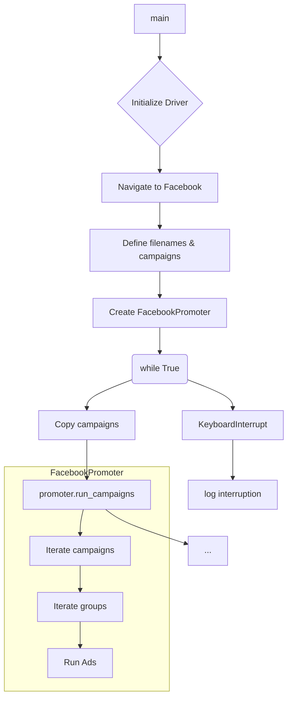

# <input code>

```python
## \file hypotez/src/endpoints/advertisement/facebook/start_posting_my_groups.py
# -*- coding: utf-8 -*-\
#! venv/Scripts/python.exe
#! venv/bin/python/python3.12

"""
.. module: src.endpoints.advertisement.facebook 
	:platform: Windows, Unix
	:synopsis: Отправка рекламных объявлений в группы фейсбук (my groups?)

"""
MODE = 'dev'


import header 
import copy
from src.webdriver.driver import Driver, Chrome
from src.endpoints.advertisement.facebook.promoter import FacebookPromoter
from src.logger import logger

d = Driver(Chrome)
d.get_url(r"https://facebook.com")

filenames:list = ['my_managed_groups.json',]  

campaigns:list = ['brands',
                  'mom_and_baby',
                  'pain',
                  'sport_and_activity',
                  'house',
                  'bags_backpacks_suitcases',
                  'man']

promoter = FacebookPromoter(d, group_file_paths = filenames, no_video = True)

try:
    while True:
        
        promoter.run_campaigns(campaigns = copy.copy(campaigns), group_file_paths = filenames)
        ...

        
except KeyboardInterrupt:
    logger.info("Campaign promotion interrupted.")
```

# <algorithm>

**Шаг 1:** Импортирует необходимые модули.  
* `header`: Предполагает наличие модуля для общего использования.
* `copy`: Для создания копий списков.
* `Driver` и `Chrome` из `src.webdriver.driver`: Для управления веб-драйвером.
* `FacebookPromoter` из `src.endpoints.advertisement.facebook.promoter`: Для логики продвижения в Facebook.
* `logger` из `src.logger`: Для ведения журнала.


**Шаг 2:** Инициализирует веб-драйвер и переходит на страницу Facebook.


**Шаг 3:** Определяет списки `filenames` (пути к файлам с данными о группах) и `campaigns` (названия рекламных кампаний).


**Шаг 4:** Создаёт экземпляр класса `FacebookPromoter`, передавая ему драйвер и пути к файлам.


**Шаг 5:** В цикле `while True`:
    * Делает копию `campaigns` (чтобы не менять исходный список).
    * Вызывает метод `run_campaigns` у `FacebookPromoter`, передавая ему копию `campaigns` и `filenames`.
    * Ожидает выполнения `run_campaigns`


**Шаг 6:**  Обрабатывает исключение `KeyboardInterrupt` при прерывании программы.


**Пример:**

Предположим, что `run_campaigns`  запускает цикл, размещая рекламу по каждой кампании в каждой группе, указанной в `filenames`.

# <mermaid>



**Объяснение диаграммы:**

*   `main`: Главный блок программы.
*   `Initialize Driver` и `Navigate to Facebook`: Инициализация и навигация драйвера.
*   `Define filenames & campaigns`: Определение данных о группах и кампаниях.
*   `Create FacebookPromoter`: Создание объекта для управления продвижением.
*   `while True`: Бесконечный цикл для непрерывной работы.
*   `Copy campaigns`: Создание копий списков, чтобы не модифицировать оригинальные.
*   `promoter.run_campaigns`:  Функция, выполняющая продвижение.
*   `...`:  Предполагаемые действия внутри цикла.
*   `KeyboardInterrupt`: Обработка прерывания программы.
*   `FacebookPromoter`: Вложенный блок, показывающий внутреннюю логику работы объекта FacebookPromoter.
*   `Iterate campaigns`, `Iterate groups`, `Run Ads`:  Логические блоки, ответственные за итерацию по списку кампаний, группам и выполнение продвижения в них.

**Зависимости:**

*   `src.webdriver.driver` отвечает за взаимодействие с веб-драйвером.
*   `src.endpoints.advertisement.facebook.promoter` содержит логику размещения рекламы в Facebook.
*   `src.logger` предоставляет механизмы для ведения журнала.
*   `header`: Предполагается внутренний модуль, необходимый для работы.

# <explanation>

**Импорты:**

*   `header`:  Неизвестный модуль, но предположительно содержит общие функции или конфигурацию для приложения.
*   `copy`: Для создания копий списков, что важно, чтобы избежать побочных эффектов при работе с `run_campaigns`.
*   `Driver`, `Chrome` из `src.webdriver.driver`: Управление веб-драйвером (вероятно, Selenium).
*   `FacebookPromoter` из `src.endpoints.advertisement.facebook.promoter`: Класс для работы с продвижением в Facebook, содержащий логику размещения рекламы в выбранных группах.
*   `logger` из `src.logger`: Для логирования операций.

**Классы:**

*   `Driver`: Вероятно, класс для управления веб-драйвером, отвечающим за взаимодействие с браузером (например, ChromeDriver).
*   `FacebookPromoter`: Класс, содержащий логику продвижения рекламных кампаний в Facebook.  Атрибуты: `d` (веб-драйвер), `group_file_paths`, `no_video`.  Методы: `run_campaigns`, которые и выполняет основную логику.  Взаимодействие: получает списки кампаний и путей к файлам с данными о группах, ищет данные в файлах, а затем выполняет продвижение кампаний.


**Функции:**

*   `get_url` в классе `Driver`: Перенаправляет браузер на указанный URL.
*   `run_campaigns` в классе `FacebookPromoter`:  Этот метод является ключевым для выполнения продвижения. Он итеративно выполняет действия для каждой кампании и каждой группы из переданных списков.


**Переменные:**

*   `MODE`: Строковая переменная, вероятно, для настройки режима работы (например, 'dev', 'prod').
*   `filenames`: Список путей к файлам, содержащим информацию о группах.
*   `campaigns`: Список названий кампаний, которые нужно продвигать.

**Возможные ошибки и улучшения:**

*   Отсутствие ясности в отношении `header` и его функциональности. Необходимо прояснить зависимости.
*   Отсутствует обработка ошибок внутри `run_campaigns`. Возможны исключения при работе с файлами, запросами к Facebook и т.д. Необходимо добавить обработку ошибок, чтобы программа не аварийно завершалась.
*   `...` - блоки кода не показаны, но требуют дальнейшей разработки. Необходимо знать, какие действия предпринимаются внутри цикла.
*   Отсутствие проверки на валидность вводимых данных (файлов и кампаний).
*   Нехватка подробной информации о структуре данных внутри `my_managed_groups.json` и о том, как `FacebookPromoter` парсит эти данные для работы с группами.
*   Отсутствие проверки состояния соединения с Facebook.

**Взаимосвязи с другими частями проекта:**

`FacebookPromoter` взаимодействует с `Driver` для работы с браузером, с `logger` для логирования, а `header` - вероятно, содержит общие конфигурации, необходимые для работы с Facebook.  Необходима информация о том, как `my_managed_groups.json` и другие файлы, содержащие данные о группах, взаимодействуют с остальными частями проекта.