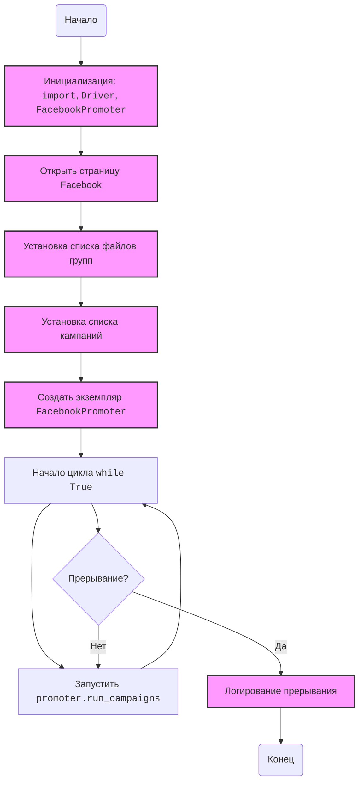
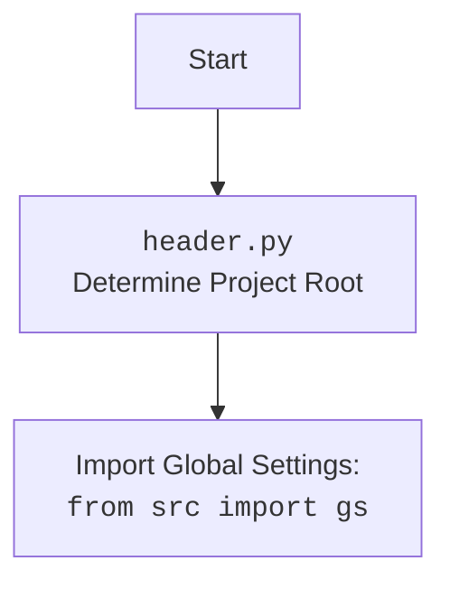

## АНАЛИЗ КОДА: `src/endpoints/advertisement/facebook/start_posting_my_groups.py`

### 1. <алгоритм>

1. **Инициализация**:
   - Импортируются необходимые модули: `header`, `copy`, `Driver` (из `src.webdriver.driver`), `Chrome` (из `src.webdriver.driver`), `FacebookPromoter` (из `src.endpoints.advertisement.facebook.promoter`), `logger` (из `src.logger.logger`).
   - Создается экземпляр `Driver` с использованием `Chrome`, который будет управлять браузером.
     ```python
     d = Driver(Chrome) # Создание драйвера браузера Chrome
     ```
   - Открывается веб-страница Facebook.
     ```python
     d.get_url(r"https://facebook.com") # Открытие facebook.com в браузере
     ```
   - Задаются имена файлов с данными о группах (`filenames`).
     ```python
     filenames:list = ['my_managed_groups.json'] # Список файлов с информацией о группах
     ```
   - Определяется список рекламных кампаний (`campaigns`).
     ```python
      campaigns:list = [
            'brands',
            'mom_and_baby',
            'pain',
            'sport_and_activity',
            'house',
            'bags_backpacks_suitcases',
            'man'
        ] # Список кампаний для продвижения
     ```
   - Создается экземпляр `FacebookPromoter` с передачей драйвера, списка файлов групп и опции `no_video=True`, который будет управлять процессом публикации.
      ```python
      promoter = FacebookPromoter(d, group_file_paths = filenames, no_video = True)
       # Создание объекта для продвижения в Facebook с настройками
      ```

2. **Запуск рекламных кампаний**:
   - В бесконечном цикле `while True:`:
     - Запускается метод `run_campaigns` объекта `promoter` с копией списка кампаний и файлов групп.
       ```python
       promoter.run_campaigns(campaigns = copy.copy(campaigns), group_file_paths = filenames) # Запуск кампаний для продвижения в цикле
       ```
   - Цикл продолжается до тех пор, пока не будет прерван с помощью `KeyboardInterrupt`.
     ```python
     ... # Прочие действия, которые могут быть добавлены в цикл
     ```
3. **Обработка прерывания**:
   - При получении сигнала `KeyboardInterrupt`:
     - Выводится сообщение в лог о прерывании продвижения.
     ```python
      except KeyboardInterrupt:
         logger.info("Campaign promotion interrupted.") # Логирование прерывания
     ```

### 2. <mermaid>



**Объяснение `mermaid` диаграммы:**

-   **flowchart TD**: Определяет тип диаграммы как блок-схему с направлением сверху вниз.
-   **Start**: Начало процесса.
-   **Init**: Блок инициализации, где происходит импорт модулей, создание драйвера и инициализация переменных.
-   **OpenURL**: Открытие страницы facebook.com через Selenium webdriver.
-   **SetFileNames**: Установка списка файлов с информацией о группах.
-  **SetCampaigns**: Установка списка рекламных кампаний.
-   **CreatePromoter**: Создание экземпляра класса `FacebookPromoter`, который будет управлять рекламными кампаниями.
-  **LoopStart**: Начало бесконечного цикла while.
-   **RunCampaigns**: Запуск метода run_campaigns у экземпляра FacebookPromoter для продвижения рекламных кампаний в заданные группы.
-   **InterruptCheck**: Проверка наличия прерывания (KeyboardInterrupt).
-   **LogInterrupt**: Логирование прерывания процесса, если оно произошло.
-   **End**: Конец процесса.
-   **classDef import ...**:  Определяет стиль для блоков, которые связаны с инициализацией.

Диаграмма `header.py` показывает, что `header.py` определяет корень проекта и импортирует глобальные настройки.

### 3. <объяснение>

**Импорты:**

*   **`import header`**: Импортирует модуль `header`, вероятно, для определения корня проекта и импорта глобальных настроек.
*   **`import copy`**: Импортирует модуль `copy`, который используется для создания поверхностной копии списка `campaigns` перед передачей его в метод `run_campaigns`, чтобы изменения в списке не влияли на исходный.
*   **`from src.webdriver.driver import Driver, Chrome`**: Импортирует классы `Driver` и `Chrome` из модуля `src.webdriver.driver`. `Driver` - это абстракция для управления веб-браузером, `Chrome` - конкретная реализация для браузера Chrome.
*   **`from src.endpoints.advertisement.facebook.promoter import FacebookPromoter`**: Импортирует класс `FacebookPromoter`, который, вероятно, отвечает за управление процессом продвижения в Facebook.
*   **`from src.logger.logger import logger`**: Импортирует объект `logger` из модуля `src.logger.logger` для логирования событий.

**Классы:**

*   **`Driver`**: Класс для управления браузером, предоставляющий методы для навигации по веб-страницам.
    - Атрибуты и методы могут включать:
        - создание экземпляра драйвера для конкретного браузера
        - открытие URL
        - взаимодействие с элементами веб-страницы
*   **`Chrome`**: Класс, представляющий драйвер для Chrome.
*   **`FacebookPromoter`**: Класс, ответственный за продвижение в Facebook.
    - Атрибуты могут включать:
        - объект `Driver` для управления браузером
        - список файлов с информацией о группах
        - параметры кампании
    - Методы могут включать:
        - `run_campaigns`:  Метод для запуска кампании продвижения.

**Функции:**

*   **`d.get_url(r"https://facebook.com")`**: Метод объекта `d` класса `Driver`, используемый для открытия указанного URL в браузере.
    - Аргументы: Строка, представляющая URL.
    - Возвращает: Ничего.
*   **`promoter.run_campaigns(campaigns=copy.copy(campaigns), group_file_paths=filenames)`**: Метод объекта `promoter` класса `FacebookPromoter`, запускающий продвижение рекламной кампании.
    - Аргументы:
        - `campaigns`: Список рекламных кампаний.
        - `group_file_paths`: Список файлов с данными о группах.
    - Возвращает: Ничего.

**Переменные:**

*   **`d`**: Экземпляр класса `Driver`, представляющий управление браузером.
*   **`filenames`**: Список строк, представляющих имена файлов с данными о группах.
*   **`campaigns`**: Список строк, представляющих имена рекламных кампаний.
*   **`promoter`**: Экземпляр класса `FacebookPromoter`, ответственный за продвижение в Facebook.

**Потенциальные ошибки и области для улучшения:**

*   **Бесконечный цикл без остановки**: Текущий код содержит бесконечный цикл `while True`. Если не планируется, что скрипт будет работать вечно, необходимо предусмотреть механизм остановки или условие выхода из цикла.
*   **Обработка исключений**: В коде обрабатывается только `KeyboardInterrupt`.  Могут возникать другие исключения, которые могут привести к падению скрипта.  Нужно добавить более общую обработку исключений (например, `try-except Exception`) для более стабильной работы.
*   **Отсутствие логики паузы между запусками**: После выполнения `promoter.run_campaigns` сразу же происходит следующий запуск.  Может потребоваться добавить логику ожидания или паузы.
*   **Жестко заданные значения**: `filenames` и `campaigns` заданы жестко в коде. Можно рассмотреть возможность загрузки этих значений из конфигурационного файла, чтобы сделать код более гибким.
*   **Непонятный код `...`**: В цикле находится `...`, это место должно быть заполнено конкретной логикой.

**Взаимосвязи с другими частями проекта:**

*   **`src.webdriver.driver`**: Этот модуль предоставляет абстракцию для управления браузером, и, как следствие, `start_posting_my_groups.py` напрямую зависит от него.
*   **`src.endpoints.advertisement.facebook.promoter`**: Этот модуль предоставляет логику продвижения в Facebook и используется в `start_posting_my_groups.py`.
*   **`src.logger.logger`**: Этот модуль предоставляет механизм логирования и используется для отслеживания событий, происходящих в скрипте.
*   **`header.py`**: Этот модуль нужен для определения корня проекта и подгрузки настроек.

Этот анализ предоставляет подробное понимание функциональности кода и его места в структуре проекта.