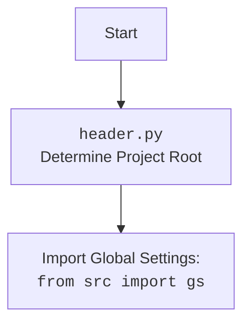

## Проект `hypotez`
## Роль `code explainer`

Анализ кода файла `/src/endpoints/advertisement/facebook/start_posting_my_groups.py`.

### 1. <алгоритм>

1.  **Инициализация**:
    *   Импортируются необходимые модули и классы: `header`, `copy`, `Driver`, `Chrome`, `FacebookPromoter`, `logger`.
    *   Создается экземпляр класса `Driver` с использованием `Chrome`.
    *   Открывается веб-страница Facebook.
    *   Определяются имена файлов, содержащих информацию о группах Facebook (`my_managed_groups.json`).
    *   Определяется список рекламных кампаний (`brands`, `mom_and_baby`, `pain`, `sport_and_activity`, `house`, `bags_backpacks_suitcases`, `man`).
    *   Создается экземпляр класса `FacebookPromoter` с передачей драйвера, списка файлов групп и флагом `no_video`.

2.  **Запуск рекламных кампаний**:
    *   В бесконечном цикле `while True:`:
        *   Вызывается метод `run_campaigns` у экземпляра `promoter` с передачей списка кампаний и списка файлов групп. Используется `copy.copy(campaigns)` для создания копии списка кампаний.

3.  **Обработка прерывания**:
    *   При возникновении исключения `KeyboardInterrupt`:
        *   Выводится сообщение в лог с использованием `logger.info("Campaign promotion interrupted.")`.

### 2. <mermaid>

```mermaid
flowchart TD
    Start --> Initialize[Инициализация: <br>Импорт модулей, создание экземпляров классов Driver и FacebookPromoter]
    Initialize --> OpenFacebook[Открыть Facebook: <br>d.get_url("https://facebook.com")]
    OpenFacebook --> DefineCampaigns[Определение кампаний и файлов групп]
    DefineCampaigns --> RunCampaignsLoop[Запуск рекламных кампаний в бесконечном цикле]
    RunCampaignsLoop --> RunCampaigns[promoter.run_campaigns(campaigns, group_file_paths)]
    RunCampaigns --> RunCampaigns # Loop back to itself
    RunCampaignsLoop --> KeyboardInterruptHandler[KeyboardInterrupt]
    KeyboardInterruptHandler --> LogInterrupt[logger.info("Campaign promotion interrupted.")]
    LogInterrupt --> End[Конец]
```

#### Объяснение зависимостей:

*   `Driver`, `Chrome`: Используются для управления браузером Chrome.
*   `FacebookPromoter`: Класс, отвечающий за запуск рекламных кампаний в Facebook.
*   `logger`: Используется для логирования информации о процессе выполнения программы.
*   `header`: Определяет корень проекта.
*   `copy`: Используется для создания копии списка кампаний, чтобы избежать изменений в исходном списке.



### 3. <объяснение>

#### Импорты:

*   `header`: Подключает файл `header.py`, который, вероятно, определяет корень проекта.
*   `copy`: Используется для создания копии списка кампаний, чтобы избежать изменения исходного списка.
*   `src.webdriver.driver.Driver`, `src.webdriver.driver.Chrome`: Импортируются классы `Driver` и `Chrome` из модуля `src.webdriver.driver`. `Driver` вероятно является базовым классом для управления браузером, а `Chrome` - его реализацией для браузера Chrome.
*   `src.endpoints.advertisement.facebook.promoter.FacebookPromoter`: Импортируется класс `FacebookPromoter` из модуля `src.endpoints.advertisement.facebook.promoter`. Этот класс, вероятно, отвечает за запуск рекламных кампаний в Facebook.
*   `src.logger.logger.logger`: Импортируется объект `logger` из модуля `src.logger.logger`. Используется для логирования информации о процессе выполнения программы.

#### Переменные:

*   `d`: Экземпляр класса `Driver`, используемый для управления браузером Chrome.
*   `filenames`: Список строк, содержащих имена файлов с информацией о группах Facebook.
*   `campaigns`: Список строк, содержащих названия рекламных кампаний.
*   `promoter`: Экземпляр класса `FacebookPromoter`, используемый для запуска рекламных кампаний.

#### Функции:

*   `FacebookPromoter.run_campaigns(campaigns, group_file_paths)`: Запускает рекламные кампании, используя переданный список кампаний и список файлов групп.

#### Области для улучшения:

*   В коде используется бесконечный цикл `while True:`, который может привести к неконтролируемому выполнению программы. Необходимо предусмотреть механизм для выхода из цикла при достижении определенного условия.
*   Обработка исключения `KeyboardInterrupt` позволяет корректно завершить программу при нажатии Ctrl+C, но не обрабатывает другие возможные исключения, которые могут возникнуть в процессе выполнения. Необходимо добавить обработку других исключений.
*   В коде используется `copy.copy(campaigns)` для создания копии списка кампаний. Возможно, более эффективным было бы использование `campaigns[:]`.
*   Строка `...` указывает на пропущенный код. Необходимо добавить реализацию логики для этого участка кода.

#### Взаимосвязи с другими частями проекта:

*   `src.webdriver.driver`: Предоставляет классы для управления браузером.
*   `src.endpoints.advertisement.facebook.promoter`: Отвечает за запуск рекламных кампаний в Facebook.
*   `src.logger.logger`: Обеспечивает логирование информации о процессе выполнения программы.