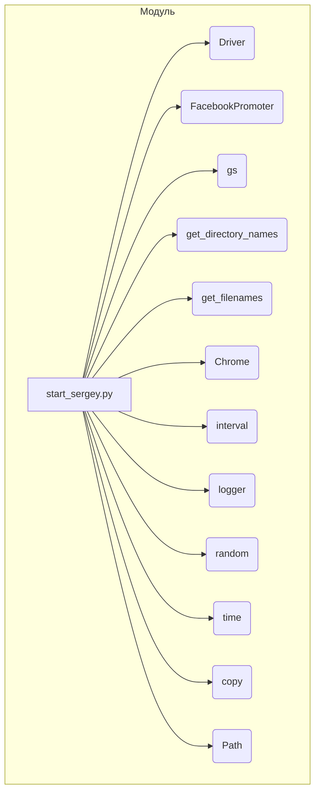

# <input code>

```python
## \file hypotez/src/endpoints/advertisement/facebook/start_sergey.py
# -*- coding: utf-8 -*-\
#! venv/Scripts/python.exe
#! venv/bin/python/python3.12

"""
.. module: src.endpoints.advertisement.facebook 
	:platform: Windows, Unix
	:synopsis: Отправка рекламных объявлений в группы фейсбук (Казаринов?)

"""
MODE = 'dev'

import header
import random
import time
import copy
from pathlib import Path 

from src import gs
from src.utils.file import get_directory_names, get_filenames
from src.webdriver.driver import Driver, Chrome
from src.endpoints.advertisement.facebook import FacebookPromoter
from src.logger import logger
from src.utils.date_time import interval

# Определение групп и категорий
group_file_paths_ru: list[str] = ["sergey_pages.json"]
adv_file_paths_ru: list[str] = ["ru_ils.json"]
group_file_paths_he: list[str] = ["sergey_pages.json"]
adv_file_paths_he: list[str] = ["he_ils.json"]
group_categories_to_adv = ['sales', 'biz']

def run_campaign(d: Driver, promoter_name: str, campaigns: list | str, group_file_paths: list, language: str, currency: str):
    """Запуск рекламной кампании.

    Args:
        d (Driver): Экземпляр драйвера.
        promoter_name (str): Имя рекламодателя.
        campaigns (list): Список кампаний.
        group_file_paths (list): Пути к файлам с группами.
        language (str): Язык рекламной кампании.
        currency (str): Валюта рекламной кампании.
    """

    promoter = FacebookPromoter(d, promoter=promoter_name)
    promoter.run_campaigns(
        campaigns=campaigns,
        group_file_paths=group_file_paths,
        group_categories_to_adv=group_categories_to_adv,
        language=language,
        currency=currency,
        no_video=False
    )


def campaign_cycle(d: Driver):
    """Цикл для управления запуском кампаний.

    Args:
        d (Driver): Экземпляр драйвера.
        aliexpress_adv (bool): Флаг для определения рекламодателя.
    """

    file_paths_ru = copy.copy(group_file_paths_ru)
    file_paths_ru.extend(adv_file_paths_ru)    # <- промо в группы
    file_paths_he = copy.copy(group_file_paths_he)
    file_paths_he.extend(adv_file_paths_he)

    # Список словарей [{language:currency}]
    language_currency_pairs = [{"HE": "ILS"}, {"RU": "ILS"},]

    for lc in language_currency_pairs:
        for language, currency in lc.items():
            group_file_paths = file_paths_ru if language == "RU" else file_paths_he

            campaigns = ['kazarinov_ru'] if language == "RU" else ['kazarinov_he']
            for c in campaigns:
                run_campaign(
                    d, 'kazarinov', c, 
                    group_file_paths=group_file_paths, 
                    language=language, 
                    currency=currency
                )

            campaigns = get_directory_names(gs.path.google_drive / 'aliexpress' / 'campaigns')
            run_campaign(
                d, 'aliexpress', campaigns, 
                group_file_paths=group_file_paths,
                language=language, 
                currency=currency 
            )


    return True


def main():
    """Основная функция для запуска рекламных кампаний."""
    try:
        d = Driver(Chrome)
        d.get_url(r"https://facebook.com")
        aliexpress_adv = True

        while True:
            if interval():
                print("Good night!")
                time.sleep(1000)

            # Первый цикл для русскоязычных кампаний
            campaign_cycle(d)
            ...

            # Логирование и задержка
            logger.debug(f"going to sleep at {time.strftime('%H:%M:%S')}", None, False)
            t = random.randint(30, 360)
            print(f"sleeping {t} sec")
            time.sleep(t)

    except KeyboardInterrupt:
        logger.info("Campaign promotion interrupted.")

if __name__ == "__main__":
    main()
```

# <algorithm>

**Блок-схема алгоритма:**

```mermaid
graph TD
    A[Начало] --> B{Инициализация драйвера};
    B --> C[Запуск цикла];
    C --> D[Проверка интервала времени];
    D -- Да --> E[Выполнение campaign_cycle];
    D -- Нет --> F[Задержка];
    E --> G[Логирование и случайная задержка];
    F --> G;
    G --> C;
    C --> H[Обработка прерывания];
    H --> I[Конец];
    
    subgraph "campaign_cycle"
        E1[file_paths_ru = copy(group_file_paths_ru)] --> E2[file_paths_ru.extend(adv_file_paths_ru)];
        E3[file_paths_he = copy(group_file_paths_he)] --> E4[file_paths_he.extend(adv_file_paths_he)];
        E2 --> E5{Проход по language_currency_pairs};
        E5 -- RU --> E6[Вызов run_campaign(kazarinov, RU campaigns)];
        E6 --> E7[Вызов run_campaign(aliexpress, RU campaigns)];
        E5 -- HE --> E8[Вызов run_campaign(kazarinov, HE campaigns)];
        E8 --> E9[Вызов run_campaign(aliexpress, HE campaigns)];
        E5 --> E10[Конец цикла language_currency_pairs];
        E10 --> E11[Возврат True];
    end
```

**Описание:** Код запускает рекламные кампании на Facebook.  Он циклически выполняет  `campaign_cycle`,  который запускает рекламные кампании для различных языков и рекламодателей.  Данные передаются между функциями в виде аргументов.


# <mermaid>



**Объяснение диаграммы:**

Диаграмма показывает взаимосвязь модулей, используемых в `start_sergey.py`.  `start_sergey.py` использует классы `Driver`, `FacebookPromoter`, и  зависит от различных модулей, включая утилиты для работы с файлами и  времени, а также от `logger` для логирования.


# <explanation>

**Импорты:**

- `header`: Возможно, модуль для специфической настройки среды. Необходимо его проанализировать.
- `random`, `time`, `copy`: Стандартные библиотечные модули для генерации случайных чисел, работы со временем и копирования данных.
- `pathlib`: Модуль для работы с путями к файлам.
- `gs`: Модуль, предположительно, предоставляющий доступ к Google Sheets или аналогичным хранилищам. (зависит от `src`)
- `get_directory_names`, `get_filenames`: Возможно, пользовательские функции для работы с файловой системой из пакета `src.utils.file`.
- `Driver`, `Chrome`: Классы для работы с браузером (webdriver) из пакета `src.webdriver.driver`.
- `FacebookPromoter`: Класс для управления рекламными кампаниями на Facebook из `src.endpoints.advertisement.facebook`.
- `logger`: Модуль для логирования из `src.logger`.
- `interval`: Функция для проверки определенного интервала времени из `src.utils.date_time`.


**Классы:**

- `Driver`: Предположительно, абстрактный класс или интерфейс для работы с драйвером веб-драйвера.
- `Chrome`: Реализация класса `Driver` для работы с Chrome.
- `FacebookPromoter`: Класс для запуска рекламных кампаний на Facebook.  Необходимо детально изучить его методы (`run_campaigns`) и атрибуты.


**Функции:**

- `run_campaign`: Функция для запуска рекламной кампании. Принимает на вход драйвер, имя рекламодателя, список кампаний, пути к файлам с группами, язык и валюту.  Функция инициализирует `FacebookPromoter` и вызывает метод `run_campaigns`.
- `campaign_cycle`: Функция для циклического запуска рекламных кампаний. Собирает необходимые файлы и параметры для запуска различных кампаний и производит запуск кампаний через `run_campaign`.
- `main`: Главный метод программы. Настраивает драйвер, запускает бесконечный цикл с вызовом `campaign_cycle` и обработкой прерываний.


**Переменные:**

- `MODE`: Переменная для определения режима работы (в данном случае `'dev'`).
- `group_file_paths_ru`, `adv_file_paths_ru`, `group_file_paths_he`, `adv_file_paths_he`: Переменные, содержащие пути к файлам с группами и рекламными объявлениями для разных языков.
- `group_categories_to_adv`: Список категорий для рекламных объявлений.
- `language_currency_pairs`: Список словарей для пар языка/валюты.


**Возможные ошибки и улучшения:**

- **Зависимости от внешних ресурсов:** Код сильно зависит от файлов (`sergey_pages.json`, `ru_ils.json`, ...), хранящихся в определенных директориях.  Необходимо более устойчивый способ доступа к этим данным, например, используя конфигурационные файлы или базы данных.
- **Обработка ошибок:**  Нехватка проверки корректности данных, полученных из файлов.
- **Многократные инициализации драйвера:** Во время цикла `while True` `Driver` инициализируется, что может быть неэффективно. Возможно, стоит инициализировать его только один раз и передавать в качестве аргумента функциям.
- **Управление состоянием:** Отсутствие явного управления состоянием рекламных кампаний (например, информация о том, завершены ли текущие кампании).
- **Журналирование:** Журнал должен содержать больше информации о том, что происходит в каждом шаге (например, информация о запускаемых кампаниях).


**Цепочка взаимосвязей:**

`start_sergey.py` использует классы и функции из пакетов `src.webdriver.driver`, `src.endpoints.advertisement.facebook`, `src.logger`, и `src.utils.date_time`. Он также использует функции из `src.utils.file` для обработки файлов. `gs` module и его переменные `gs.path.google_drive` показывают, что проект интегрируется с  Google Drive для хранения данных кампаний.  `header` нуждается в отдельном анализе для понимания его роли.