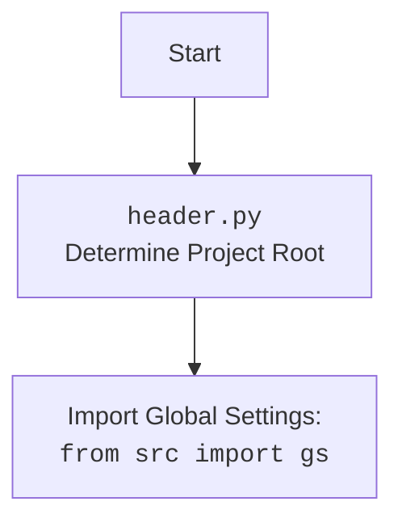

## ИНСТРУКЦИЯ:

Анализируй предоставленный код подробно и объясни его функциональность. Ответ должен включать три раздела:  

1. **<алгоритм>**: Опиши рабочий процесс в виде пошаговой блок-схемы, включая примеры для каждого логического блока, и проиллюстрируй поток данных между функциями, классами или методами.  
2. **<mermaid>**: Напиши код для диаграммы в формате `mermaid`, проанализируй и объясни все зависимости,  
    которые импортируются при создании диаграммы.  
    **ВАЖНО!** Убедитесь, что все имена переменных, используемые в диаграмме `mermaid`,  
    имеют осмысленные и описательные имена. Имена переменных вроде `A`, `B`, `C`, и т.д., не допускаются!  
    
    **Дополнительно**: Если в коде есть импорт `import header`, добавьте блок `mermaid` flowchart, объясняющий `header.py`:\
    ```mermaid\
    flowchart TD\
        Start --> Header[<code>header.py</code><br> Determine Project Root]\
    \
        Header --> import[Import Global Settings: <br><code>from src import gs</code>] \
    ```

3. **<объяснение>**: Предоставьте подробные объяснения:  
   - **Импорты**: Их назначение и взаимосвязь с другими пакетами `src.`.  
   - **Классы**: Их роль, атрибуты, методы и взаимодействие с другими компонентами проекта.  
   - **Функции**: Их аргументы, возвращаемые значения, назначение и примеры.  
   - **Переменные**: Их типы и использование.  
   - Выделите потенциальные ошибки или области для улучшения.  

Дополнительно, постройте цепочку взаимосвязей с другими частями проекта (если применимо).  

Это обеспечивает всесторонний и структурированный анализ кода.
## Формат ответа: `.md` (markdown)
**КОНЕЦ ИНСТРУКЦИИ**

# Анализ кода `hypotez/src/endpoints/advertisement/facebook/start_sergey.py`

## 1. <алгоритм>

```mermaid
graph LR
    A[Начало программы] --> B(Инициализация драйвера Chrome);
    B --> C{Цикл while True};
    C -- True --> D{interval()};
    D -- True --> E(Вывод "Good night!" и ожидание);
    D -- False --> F(Запуск campaign_cycle);
    F --> G(Логирование и задержка);
    G --> C;
    C -- KeyboardInterrupt --> H(Логирование прерывания);
    H --> I[Конец программы];
    E --> C;
    
    subgraph campaign_cycle
    	F --> F1(Копирование путей к файлам групп);
    	F1 --> F2(Добавление путей к файлам с объявлениями);
    	F2 --> F3(Цикл по языковым парам);
        F3 --> F4{Определение group_file_paths по языку}
        F4 --> F5(Определение списка кампаний);
        F5 --> F6{Цикл по кампаниям};
            F6 --> F7(Запуск run_campaign);
            F7 --> F6;
        F6 -- Конец цикла --> F8(Получение списка кампаний из Google Drive);
        F8 --> F9(Запуск run_campaign для aliexpress);
        F9 --> F3;
    F3 -- Конец цикла --> F10(Возврат True);
    end
    
    subgraph run_campaign
    	F7 --> R1(Создание экземпляра FacebookPromoter);
    	R1 --> R2(Запуск рекламных кампаний через promoter.run_campaigns);
    	F9 --> R1
    end
    
    style A fill:#f9f,stroke:#333,stroke-width:2px
    style I fill:#f9f,stroke:#333,stroke-width:2px
```

**Примеры:**
*   **Инициализация драйвера Chrome**: Создается экземпляр драйвера для управления браузером Chrome.
*   **Цикл `while True`**: Бесконечный цикл, который повторяет рекламную кампанию.
*   **`interval()`**: Функция, которая проверяет, пора ли прервать цикл на ночное время.
*   **`campaign_cycle(d)`**: Запускает цикл рекламных кампаний для разных языковых групп.
    *   Внутри `campaign_cycle` создается список словарей языковых пар `[{"HE": "ILS"},{"RU": "ILS"}]`.
    *   Для каждой пары определяется список файлов групп и кампаний.
        *   Например, для языка `"RU"` используются файлы из `file_paths_ru`.
        *   Для языка `"HE"` используются файлы из `file_paths_he`.
    *   Затем запускается `run_campaign` для каждого языка, валюты и кампании.
        *   Например, `run_campaign(d, 'kazarinov', 'kazarinov_ru', group_file_paths=file_paths_ru, language='RU', currency='ILS')`.
        *   Затем запускается `run_campaign` для кампаний aliexpress.
*   **`run_campaign(d, promoter_name, campaigns, group_file_paths, language, currency)`**: Создает экземпляр `FacebookPromoter` и запускает рекламные кампании.
    *  Например, вызывается `promoter.run_campaigns(campaigns=['kazarinov_ru'], group_file_paths=['sergey_pages.json', 'ru_ils.json'], group_categories_to_adv=['sales', 'biz'], language='RU', currency='ILS', no_video=False)`.
*   **Логирование и задержка**: После цикла `campaign_cycle` выполняется логирование и устанавливается случайная задержка.

## 2. <mermaid>

```mermaid
flowchart TD
    Start[Начало] --> ImportModules[Импорт модулей];
    ImportModules --> DefineVariables[Определение переменных];
    DefineVariables --> RunCampaignFunc[Определение функции run_campaign];
    RunCampaignFunc --> CampaignCycleFunc[Определение функции campaign_cycle];
    CampaignCycleFunc --> MainFunc[Определение функции main];
    MainFunc --> DriverInit[Инициализация драйвера];
    DriverInit --> GetUrl[Открытие URL Facebook];
    GetUrl --> MainLoop[Главный цикл while True];
    
    subgraph Главный цикл
        MainLoop --> IntervalCheck{Проверка interval()};
        IntervalCheck -- True --> SleepNight[Сон на ночь];
        SleepNight --> MainLoop;
        IntervalCheck -- False --> RunCampaignCycle[Вызов campaign_cycle() ];
        RunCampaignCycle --> LogAndSleep[Логирование и ожидание];
        LogAndSleep --> MainLoop;
    end
    
    MainLoop -- KeyboardInterrupt --> InterruptLog[Логирование прерывания];
    InterruptLog --> End[Конец программы];
    
    subgraph Function run_campaign
        RunCampaignFunc --> CreatePromoter[Создание FacebookPromoter];
        CreatePromoter --> RunPromoterCampaign[Вызов promoter.run_campaigns() ];
    end
        
    subgraph Function campaign_cycle
        CampaignCycleFunc --> CopyFilePaths[Копирование путей к файлам групп];
        CopyFilePaths --> ExtendFilePaths[Расширение путей к файлам с объявлениями];
        ExtendFilePaths --> LoopLanguageCurrency[Цикл по парам язык-валюта];
        
        subgraph Cycle Language Currency
            LoopLanguageCurrency --> DetermineGroupFilePaths{Определение group_file_paths по языку};
            DetermineGroupFilePaths --> DefineCampaigns[Определение списка кампаний];
            DefineCampaigns --> LoopCampaigns[Цикл по кампаниям];
            subgraph Cycle Campaigns
                LoopCampaigns --> CallRunCampaign[Вызов run_campaign];
                CallRunCampaign --> LoopCampaigns;
            end
            LoopCampaigns -- Конец цикла --> GetAliExpressCampaigns[Получение кампаний AliExpress из Google Drive];
            GetAliExpressCampaigns --> CallRunCampaignAliExpress[Вызов run_campaign для AliExpress];
            CallRunCampaignAliExpress --> LoopLanguageCurrency;
        end
         LoopLanguageCurrency -- Конец цикла --> ReturnTrue[Возврат True];
     end

    style Start fill:#f9f,stroke:#333,stroke-width:2px
    style End fill:#f9f,stroke:#333,stroke-width:2px
```


**Зависимости (импорты):**

*   `header`: Определяет корень проекта и импортирует глобальные настройки.
*   `random`: Для генерации случайных чисел, используется для задержки между циклами.
*   `time`: Для работы со временем, используется для ожидания и логирования.
*   `copy`: Для создания копий списков, чтобы избежать изменения оригинальных данных.
*   `pathlib`: Для работы с путями к файлам, упрощает манипуляции с файловой системой.
*   `src`:
    *   `gs`: Глобальные настройки проекта.
    *   `src.utils.file`:  `get_directory_names` - получает список директорий, `get_filenames` - получает список имен файлов.
    *   `src.webdriver.driver`:  `Driver`, `Chrome` - для управления браузером.
    *   `src.endpoints.advertisement.facebook`: `FacebookPromoter` - для запуска рекламных кампаний.
    *   `src.logger.logger`: `logger` - для логирования.
    *   `src.utils.date_time`: `interval` - для проверки интервала времени.

## 3. <объяснение>

**Импорты:**

*   `header`: Модуль, который, вероятно, отвечает за определение корня проекта и загрузку общих настроек. Это позволяет коду работать независимо от текущего рабочего каталога. Он импортируется для получения доступа к глобальным настройкам проекта через `src.gs`.
*   `random`: Используется для генерации случайных чисел, которые применяются для создания случайных задержек между циклами выполнения рекламных кампаний. Это позволяет имитировать поведение пользователя и избегать блокировок со стороны Facebook.
*   `time`: Предоставляет функции для работы со временем, такие как `sleep` для задержки выполнения и `strftime` для форматирования времени в строке.
*   `copy`: Используется для создания копий списков (например, `group_file_paths_ru`, `group_file_paths_he`) перед их модификацией, чтобы избежать нежелательных изменений оригинальных данных.
*    `pathlib`:  Предназначен для более удобной работы с путями к файлам и директориям в кроссплатформенном режиме. Это делает код более читаемым и портативным.

**Импорты из `src`:**

*   `src.gs`: Содержит глобальные настройки проекта, такие как пути к файлам, URL-адреса, параметры API и т. д. Это централизованное хранилище конфигураций, которое позволяет легко изменять параметры программы без необходимости редактировать код.
*   `src.utils.file`: Предоставляет утилиты для работы с файлами и директориями, такие как получение списка имен файлов и директорий.
    *   `get_directory_names`: Используется для получения списка директорий с кампаниями из Google Drive.
    *    `get_filenames`: используется для получения списка файлов.
*   `src.webdriver.driver`: Отвечает за управление веб-браузером.
    *   `Driver`: Базовый класс для управления браузером.
    *   `Chrome`: Класс, который наследуется от `Driver` и реализует управление браузером Chrome.
*   `src.endpoints.advertisement.facebook.FacebookPromoter`: Основной класс, который отвечает за выполнение рекламных кампаний на Facebook. Он использует драйвер браузера для управления интерфейсом Facebook и отправки рекламных объявлений.
*   `src.logger.logger`: Обеспечивает функциональность логирования. `logger` используется для записи информации о выполнении программы, ошибок и других событий в лог-файл или консоль.
*   `src.utils.date_time`: Содержит функции для работы с датой и временем, в частности `interval`, которая вероятно проверяет текущее время и возвращает `True` если сейчас нерабочее время.

**Классы:**

*   `Driver`: Абстрактный класс для управления браузером. Имеет методы для открытия URL, навигации, взаимодействия с элементами страницы. Конкретная реализация `Chrome` наследует этот класс и реализует управление браузером Chrome.
*   `FacebookPromoter`: Класс, который отвечает за запуск рекламных кампаний в Facebook. Он принимает экземпляр драйвера, имя рекламодателя, пути к файлам с группами и объявлениями и выполняет продвижение рекламных объявлений. У него есть метод `run_campaigns` который запускает рекламные кампании.

**Функции:**

*   `run_campaign(d, promoter_name, campaigns, group_file_paths, language, currency)`:
    *   `d`: Экземпляр драйвера браузера.
    *   `promoter_name`: Имя рекламодателя.
    *   `campaigns`: Список названий кампаний или имя одной кампании.
    *   `group_file_paths`: Список путей к файлам с группами.
    *   `language`: Язык рекламной кампании (`"RU"`, `"HE"`).
    *   `currency`: Валюта рекламной кампании (`"ILS"`).
    *   Создает экземпляр `FacebookPromoter` и вызывает метод `run_campaigns`, передавая ему необходимые параметры.
*   `campaign_cycle(d)`:
    *   `d`: Экземпляр драйвера браузера.
    *   Управляет циклом рекламных кампаний. Копирует пути к файлам, расширяет их, итерирует по языковым парам, запускает `run_campaign` для каждой кампании, и для кампаний aliexpress.
    *  Возвращает `True` если цикл отработал.
*   `main()`:
    *   Основная функция запуска. Инициализирует драйвер, открывает страницу Facebook, устанавливает флаг `aliexpress_adv`, запускает бесконечный цикл, вызывая `campaign_cycle`, логирует время и уходит в сон на случайное время.

**Переменные:**

*   `MODE`:  Определяет режим работы программы (`'dev'`).
*   `group_file_paths_ru`, `adv_file_paths_ru`, `group_file_paths_he`, `adv_file_paths_he`: Списки путей к файлам с группами и объявлениями для русского и иврита.
*   `group_categories_to_adv`: Список категорий групп для продвижения.
*  `language_currency_pairs`: Список словарей с языковыми парами и валютами.
*   `aliexpress_adv`: Флаг для переключения между рекламными кампаниями (`True`).

**Потенциальные ошибки и области для улучшения:**

*   **Обработка ошибок**: В коде присутствует только `KeyboardInterrupt`. Не хватает обработки других возможных исключений.
*   **Конфигурация**: Пути к файлам и имена кампаний захардкожены, лучше использовать `gs` для конфигурации.
*   **Масштабируемость**: Код не является гибким, так как все настройки прописаны в переменных, не учитывается количество кампаний и языков.
*   **Мониторинг**: Отсутствует мониторинг выполнения кампаний, например, отправка отчетов.
*   **Зависимости**: Сложная структура зависимостей между файлами, можно рассмотреть упрощение и рефакторинг.
*   **`interval()`**: Функция не определена, необходимо ее реализовывать.

**Взаимосвязь с другими частями проекта:**
*   Файл `header.py` отвечает за установку корня проекта и импорт глобальных настроек `src.gs`.
*  Файл `src.webdriver.driver.py` отвечает за создание и управление драйвером браузера, который используется для взаимодействия с Facebook.
*   `FacebookPromoter` отвечает за запуск рекламных кампаний.
*   `src.logger` используется для логирования.

Этот анализ предоставляет всестороннее понимание функциональности кода, включая алгоритм работы, структуру классов и функций, а также потенциальные области для улучшения.