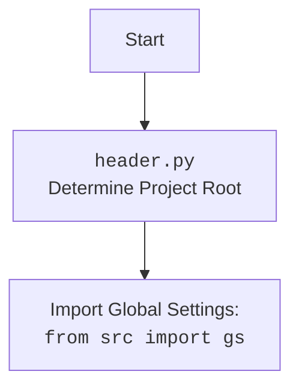

# Анализ кода `hypotez/src/endpoints/advertisement/header.py`

## <алгоритм>

1.  **Определение переменных окружения**: 
    *   `MODE` устанавливается в `'dev'`.
    *   Импортируются необходимые библиотеки: `sys`, `json`, `Version` из `packaging.version`, `Path` из `pathlib`.
2.  **Функция `set_project_root`**:
    *   Принимает `marker_files` (кортеж имен файлов/директорий) для поиска корня проекта. По умолчанию `('__root__',)`.
    *   Находит абсолютный путь к директории, где находится текущий файл (`__file__`).
    *   Устанавливает начальное значение `__root__` как текущая директория.
    *   Проходит по текущей директории и ее родительским директориям.
    *   Проверяет, существует ли в каждой директории хотя бы один из `marker_files`. Если да, то устанавливает эту директорию как корень проекта (`__root__`) и прерывает цикл.
        *   Пример: Если `marker_files` = `('__root__',)` и в директории `/home/user/project` существует файл `__root__`, то `/home/user/project` будет корнем проекта.
    *   Если корень проекта не в списке путей поиска (`sys.path`), то добавляет его в начало списка.
    *   Возвращает путь к корню проекта.
3.  **Вызов `set_project_root`**:
    *   Вызывает `set_project_root()` и сохраняет результат в глобальную переменную `__root__`.
4.  **Импорт настроек и документации**:
    *   Импортирует `gs` из `src`, предположительно содержащий общие настройки проекта.
    *   Инициализирует переменную `settings` значением `None`.
    *   Пытается открыть и загрузить JSON файл настроек из `gs.path.root / 'src' / 'settings.json'` в `settings`. Если файл не найден или JSON некорректен, переходит к следующему шагу.
    *   Инициализирует переменную `doc_str` значением `None`.
    *   Пытается открыть и прочитать файл документации `README.MD` из `gs.path.root / 'src' / 'README.MD'` в `doc_str`. Если файл не найден, или ошибка чтения,  переходит к следующему шагу.
5.  **Инициализация переменных**:
    *   Извлекает из `settings` значения для:
        *   `__project_name__` (по умолчанию `'hypotez'`).
        *   `__version__` (по умолчанию `''`).
        *   `__author__` (по умолчанию `''`).
        *   `__copyright__` (по умолчанию `''`).
        *   `__cofee__` (по умолчанию "Treat the developer to a cup of coffee for boosting enthusiasm in development: https://boosty.to/hypo69").
    *   Устанавливает `__doc__` значением `doc_str`, или `''` если `doc_str` равен `None`
    *   Устанавливает `__details__` значением `''`.

## <mermaid>

```mermaid
flowchart TD
    Start --> FindProjectRoot[<code>set_project_root()</code><br> Locate Project Root Directory];
    FindProjectRoot --> GetParentDirs[Get Current and Parent Directories];
    GetParentDirs --> CheckMarkerFiles[Check for Marker Files in Each Directory];
    CheckMarkerFiles -- Marker File Found --> SetRoot[Set Project Root];
    CheckMarkerFiles -- Marker File Not Found -->  ContinueSearch[Continue Search in Parent Directories]
    ContinueSearch -- No more parent directories --> SetCurrentDirAsRoot[Set Current Directory as Root]
    SetRoot --> AddRootToPath[Add Root to sys.path]
    SetCurrentDirAsRoot --> AddRootToPath
    AddRootToPath --> ReturnRoot[Return Project Root Path];
    ReturnRoot --> SetGlobalRoot[Set <code>__root__</code> Global Variable];
    SetGlobalRoot --> ImportGlobalSettings[Import Global Settings: <br> <code>from src import gs</code>];
    ImportGlobalSettings --> LoadSettings[Load <code>settings.json</code> into <br><code>settings</code> Dictionary];
    LoadSettings -- Success --> ReadReadme[Read <code>README.MD</code> into <br><code>doc_str</code> string]
    LoadSettings -- Fail --> ReadReadme
    ReadReadme --> InitProjectVars[Initialize Project Variables <br><code>__project_name__</code>, <code>__version__</code>,<br><code>__doc__</code>, etc.]
    InitProjectVars --> End;

    classDef important fill:#f9f,stroke:#333,stroke-width:2px;
    class FindProjectRoot, SetRoot, AddRootToPath, SetGlobalRoot important;

```



## <объяснение>

### Импорты

*   `sys`: Предоставляет доступ к некоторым переменным и функциям, которые взаимодействуют с интерпретатором Python. Используется для добавления пути к корню проекта в `sys.path`, чтобы другие модули могли его находить.
*   `json`:  Используется для работы с JSON файлами. Загрузка файла настроек `settings.json`.
*   `packaging.version`: Позволяет работать с версиями, сравнивать и проверять их. В этом коде импортируется класс `Version`, но в самом коде он не используется. Вероятно, он был импортирован для будущей функциональности.
*   `pathlib`: Предоставляет кроссплатформенный способ работы с путями файлов и директорий. Используется для получения пути к файлу, его родительских директорий и для проверки наличия файлов и директорий.
*   `from src import gs`: Импортирует модуль `gs` из пакета `src`, который предположительно содержит глобальные настройки проекта, такие как пути и другие общие данные. Это позволяет модулю `header.py` получить доступ к корню проекта через `gs.path.root`.

### Функция `set_project_root`

*   **Аргументы**:
    *   `marker_files`:  кортеж имен файлов или директорий, которые используются для определения корневой директории. По умолчанию `('__root__', )`.
*   **Возвращаемое значение**:
    *   `Path`: путь к корневой директории проекта.
*   **Назначение**:
    *   Определяет корневую директорию проекта путем поиска маркеров (файлов или директорий) вверх по дереву директорий. Это позволяет запускать скрипты из любой поддиректории проекта, не полагаясь на жестко заданные пути.
*   **Пример**:
    *   Если скрипт `header.py` расположен в `/home/user/project/src/endpoints/advertisement` и в `/home/user/project` существует файл `__root__`, то функция вернет `Path('/home/user/project')`.
*   **Логика**:
    *   Начинает поиск с директории, где находится текущий файл.
    *   Проходит по родительским директориям.
    *   Возвращает первую директорию, в которой найден хотя бы один из `marker_files`.
    *   Если маркер не найден, возвращается директория, где расположен скрипт.

### Переменные

*   `MODE`: Строка, устанавливающая режим работы скрипта (в данном случае `'dev'`).
*   `__root__`: Объект `Path`, хранящий путь к корневой директории проекта. Определяется функцией `set_project_root` и используется для поиска файлов настроек и документации.
*   `settings`: Словарь, хранящий настройки проекта, загруженные из файла `settings.json`. Может быть `None`, если файл не найден или не может быть загружен.
*   `doc_str`: Строка, хранящая содержимое файла документации `README.MD`. Может быть `None`, если файл не найден или не может быть прочитан.
*   `__project_name__`: Строка, хранящая имя проекта, загруженное из настроек или установленное по умолчанию.
*   `__version__`: Строка, хранящая версию проекта, загруженную из настроек.
*   `__doc__`: Строка, хранящая содержимое файла `README.MD`.
*  `__details__`: Строка, хранящая дополнительную информацию, устанавливается в  `''`
*   `__author__`: Строка, хранящая имя автора проекта, загруженное из настроек.
*   `__copyright__`: Строка, хранящая информацию о копирайте проекта, загруженную из настроек.
*   `__cofee__`: Строка, хранящая текст с призывом поддержать разработчика.

### Потенциальные ошибки и области для улучшения

*   **Обработка ошибок**: Исключения при открытии и чтении `settings.json` и `README.MD` обрабатываются общим `except` без конкретного логирования или вывода предупреждения. Это может затруднить отладку. Желательно добавить логирование или вывод предупреждений при ошибках загрузки файлов настроек.
*   **Отсутствие проверки `settings`**: Код предполагает наличие ключей в словаре `settings`, не проверяя их существование перед использованием. В случае отсутствия ключа в файле настроек, будет возвращено значение по умолчанию для `settings.get()`. Желательно проверять ключи, перед их использованием.
*   **Условный импорт `packaging.version`**: Пакет `packaging.version` импортируется, но не используется в предоставленном коде. Возможно, его использование планировалось в дальнейшем.

### Взаимосвязи с другими частями проекта

*   **`src.gs`**: Этот модуль является ключевым для получения доступа к общим настройкам и путям проекта. `header.py` зависит от `gs` для определения корня проекта и поиска файла `settings.json`.
*   **`settings.json`**: Файл настроек, который определяет различные параметры проекта, такие как имя проекта, версия, автор и другие. `header.py` читает этот файл для получения необходимых данных.
*   **`README.MD`**: Файл документации, который считывается для получения общей информации о проекте.
*   **Другие модули**: `header.py` предназначен для определения глобальных переменных и настроек проекта, которые могут использоваться в других модулях.

Этот код обеспечивает централизованное управление настройками проекта и его структурой. Он ищет корень проекта, загружает настройки и предоставляет их другим модулям, что упрощает управление и разработку проекта.