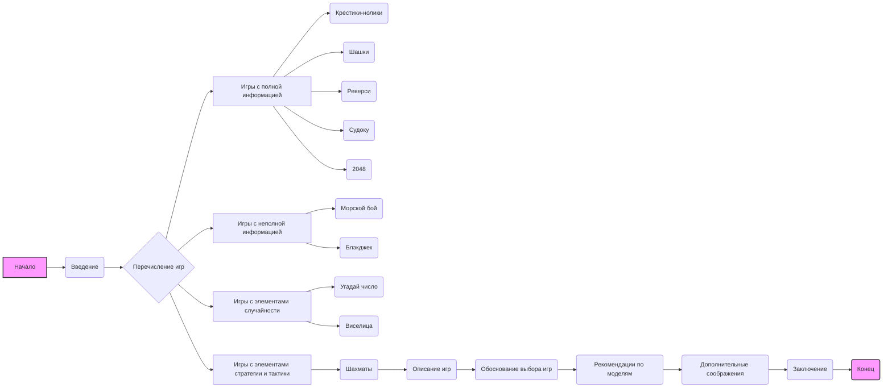

## Анализ кода

### <алгоритм>

1.  **Начало**: Текст начинается с общего представления о том, что такое игры для обучения моделей машинного обучения.
2.  **Введение**: Объяснение, что выбор игр зависит от сложности и типа модели.
3.  **Перечисление игр**: Представление 10 игр, разделенных на категории:
    *   **Игры с полной информацией**: Крестики-нолики, Шашки, Реверси, Судоку, 2048.
    *   **Игры с неполной информацией**: Морской бой, Блэкджек.
    *   **Игры с элементами случайности**: Угадай число, Виселица.
    *   **Игры с элементами стратегии и тактики**: Шахматы.
4.  **Описание каждой игры**: Краткое описание правил каждой из перечисленных игр.
5.  **Обоснование выбора игр**: Объяснение, почему эти игры подходят для обучения моделей:
    *   Простые правила.
    *   Ограниченное количество состояний.
    *   Наличие обучающих данных.
6.  **Рекомендации по использованию моделей**: Предложение подходящих типов моделей в зависимости от сложности игр:
    *   Логистическая регрессия, деревья решений, случайный лес для простых игр.
    *   Нейронные сети, алгоритмы поиска для игр со сложной стратегией.
    *   Методы Монте-Карло для игр со случайностью.
7.  **Дополнительные соображения**: Обсуждение необходимых шагов для обучения модели:
    *   Создание виртуального окружения.
    *   Определение метрик оценки.
    *   Возможность усложнения игры.
8.  **Заключение**: Подчеркивание важности выбора игры для обучения модели и возможности углубления в конкретные игры или методы обучения.
9.  **Конец**: Завершение текста вопросом, мотивирующим к дальнейшему изучению.

### <mermaid>

**Объяснение зависимостей в mermaid диаграмме:**

*   `A[Начало]` – начало блок-схемы.
*   `B(Введение)` – введение в тему.
*   `C{Перечисление игр}` – блок, где игры разделяются на категории.
*   `D[Игры с полной информацией]`, `E[Игры с неполной информацией]`, `F[Игры с элементами случайности]`, `G[Игры с элементами стратегии и тактики]` – категории игр.
*   `H(Крестики-нолики)`, `I(Шашки)`, `J(Реверси)`, `K(Судоку)`, `L(2048)`, `M(Морской бой)`, `N(Блэкджек)`, `O(Угадай число)`, `P(Виселица)`, `Q(Шахматы)` – конкретные игры.
*   `R(Описание игр)` – описание правил игр.
*   `S(Обоснование выбора игр)` – причины выбора этих игр.
*   `T(Рекомендации по моделям)` – рекомендации по моделям.
*   `U(Дополнительные соображения)` – дополнительные шаги для обучения модели.
*   `V(Заключение)` – заключение по теме.
*   `W(Конец)` – конец блок-схемы.

### <объяснение>

**Импорты:**

В данном коде импорты отсутствуют, поскольку это текст в формате Markdown, а не исполняемый код на языке программирования. В контексте Markdown используются только текстовые элементы, заголовки, списки и т.д.

**Классы:**

Классы также отсутствуют, поскольку это текст, а не объектно-ориентированный код.

**Функции:**

Функции отсутствуют, поскольку это текст, а не код.

**Переменные:**

В данном тексте в явном виде переменные не используются. Текст представляет собой описание и структурированную информацию. Однако, можно рассматривать такие элементы, как:

*   **Игры:** Являются концептуальными переменными, которые могут принимать разные значения, например, "Крестики-нолики", "Шахматы".
*   **Категории игр:** "Игры с полной информацией", "Игры с неполной информацией" и т.д. – это концептуальные группировки, которые можно рассматривать как переменные типа "категория".
*   **Типы моделей:** "Логистическая регрессия", "Нейронные сети" – это также переменные, которые описывают методы машинного обучения.

**Объяснение:**

Текст представляет собой обзор 10 игр, которые подходят для обучения моделей машинного обучения. Описаны разные категории игр, начиная от простых игр с полной информацией до сложных игр с элементами стратегии и случайности.

Текст предоставляет рекомендации по использованию различных моделей машинного обучения, в зависимости от сложности игры. Например, для простых игр предлагаются простые модели, такие как логистическая регрессия, а для более сложных игр предлагаются нейронные сети и алгоритмы поиска.

Кроме того, текст затрагивает важные аспекты, такие как создание виртуального окружения, определение метрик оценки и возможность усложнения игры.

**Потенциальные ошибки и области для улучшения:**

*   **Отсутствие конкретики в описании моделей:** Можно было бы привести более подробные примеры конкретных архитектур нейронных сетей или алгоритмов поиска.
*   **Недостаточно подробное описание метрик оценки:** Не указаны конкретные метрики, которые можно было бы использовать для оценки качества игры модели.
*   **Нет примеров обучающих данных:** Не указаны возможные источники данных для обучения.

**Цепочка взаимосвязей с другими частями проекта:**

Этот текст (файл `about.ru.md`) является частью раздела документации или объяснительных материалов проекта, связанного с машинным обучением и играми. Он может быть связан со следующими частями проекта:

*   **API для игр:** Описанные игры могут быть реализованы как API, доступные для обучения моделей.
*   **Обучающие скрипты:** Этот текст описывает потенциальные направления и цели для создания обучающих скриптов.
*   **Метрики:** В проекте могут быть реализованы метрики, описанные в разделе "Дополнительные соображения".
*   **Документация:** Этот файл может быть частью более общей документации по проекту, объясняющей концепцию использования игр для обучения моделей.