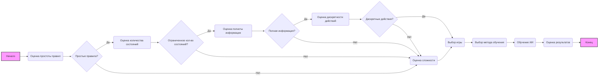

## Анализ документа "Игры, которые легко научить машину играть"

### 1. <алгоритм>

Представленный документ не содержит исполняемого кода, а является описательным текстом о выборе игр для обучения ИИ. Алгоритм здесь можно представить как процесс выбора игры на основе заданных критериев:

1.  **Начало**: Определить цель исследования в области ИИ.
2.  **Оценка простоты правил**: Проверить, насколько легко формализовать правила игры.
    *   **Пример**: "Крестики-нолики" имеют простые правила, в отличие от "Dota 2".
3.  **Оценка количества состояний**: Определить, сколько всего возможных состояний (позиций) в игре.
    *   **Пример**: "Крестики-нолики" имеют ограниченное количество состояний, "Го" - очень большое.
4.  **Оценка наличия полной информации**: Проверить, видна ли вся информация для всех игроков.
    *   **Пример**: В "Шахматы" информация полная, в "Покер" — не полная.
5.  **Оценка дискретности действий**: Определить, из какого количества опций игрок может выбирать свои действия.
    *   **Пример**: В "Шахматы" и "Крестики-нолики" действия дискретны, в играх с физикой (где нужно контролировать силу броска или траекторию движения) - нет.
6.  **Выбор игры**: На основе оценки предыдущих шагов выбрать игру, наиболее подходящую для обучения ИИ.
7.  **Метод обучения**: Выбрать метод обучения ИИ (подкрепление, обучение с учителем, обучение без учителя).
8.  **Обучение ИИ**: Использовать выбранный метод обучения на выбранной игре.
9.  **Оценка результатов**: Измерить успешность обучения, сравнивая результаты ИИ с результатами других игроков.
10. **Конец**: Анализ результатов, возможная доработка или выбор другой игры.

### 2. <mermaid>

**Объяснение диаграммы:**

*   `A` (Начало): Начальная точка процесса выбора игры для обучения ИИ.
*   `B` (Оценка простоты правил): Этап проверки, насколько легко формализовать правила игры.
*   `C` (Простые правила?): Решение, являются ли правила игры достаточно простыми для обучения ИИ.
*   `D` (Оценка количества состояний): Оценка количества возможных состояний игры.
*   `E` (Ограниченное кол-во состояний?): Решение, ограничено ли количество состояний в игре.
*   `F` (Оценка полноты информации): Оценка, является ли информация для всех игроков полной.
*  `G` (Оценка сложности): В случае невыполнения критериев игра попадает на оценку сложности.
*   `H` (Полная информация?): Решение, является ли информация полной.
*   `I` (Оценка дискретности действий): Оценка дискретности действий.
*   `J` (Дискретные действия?): Решение, являются ли действия дискретными.
*   `K` (Выбор игры): Этап выбора игры, на основе предыдущих проверок.
*   `L` (Выбор метода обучения): Выбор метода обучения для ИИ.
*   `M` (Обучение ИИ): Процесс обучения ИИ на выбранной игре.
*   `N` (Оценка результатов): Оценка результатов обучения ИИ.
*   `O` (Конец): Завершающий этап процесса.

### 3. <объяснение>

**Импорты:**

*   В данном документе нет импортов, так как это текстовое описание, а не код.

**Классы:**

*   В данном документе нет классов.

**Функции:**

*   В данном документе нет функций.

**Переменные:**

*   В данном документе нет переменных.

**Объяснение:**

Данный документ представляет собой руководство по выбору игр для обучения искусственного интеллекта (ИИ). Он описывает критерии, на которые следует обращать внимание при выборе игры, и приводит примеры игр, которые подходят для различных целей обучения. Основные критерии включают:

*   **Простота правил:** Чем проще правила, тем легче обучить модель. Например, "Крестики-нолики" проще, чем "Шахматы".
*   **Количество возможных состояний:** Меньшее количество состояний упрощает анализ игры. "Крестики-нолики" имеют меньше состояний, чем "Го".
*   **Полная информация:** Игры, где вся информация видна всем игрокам, проще для обучения. "Шахматы" предоставляют полную информацию, а "Покер" — нет.
*   **Дискретные действия:** Игры, где действия можно выбирать из ограниченного набора опций, легче для построения стратегии.

В документе приводятся примеры различных игр, которые могут быть использованы для обучения ИИ:

*   **Игры с полной информацией и дискретными действиями**: Шашки, шахматы, крестики-нолики, го, реверси, судоку.
*   **Игры с неполной информацией**: Покер, блэкджек.
*   **Игры с элементами случайности**: Морской бой, угадай слово.
*   **Игры реального времени**: StarCraft, Dota 2.
*   **Игры с большим количеством состояний**: Шахматы и Го на больших досках.

Также описываются различные методы обучения ИИ:

*   **Подкрепление**: Обучение через пробы и ошибки.
*   **Обучение с учителем**: Использование набора данных с правильными ходами.
*   **Обучение без учителя**: Самостоятельное изучение структуры данных.

**Цепочка взаимосвязей с другими частями проекта:**

Этот документ является частью описания функциональности раздела "AI Games" и определяет какие игры могут быть использованы для обучения ИИ. Он не имеет прямой связи с конкретным кодом, но служит руководством при разработке или выборе игр, на которых будет обучаться ИИ в данном проекте.