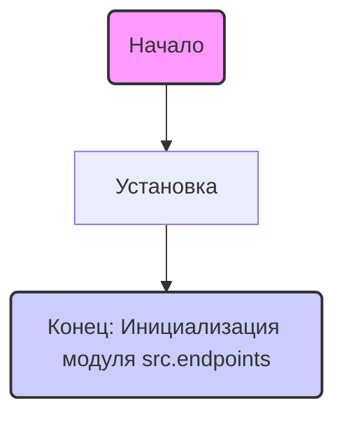
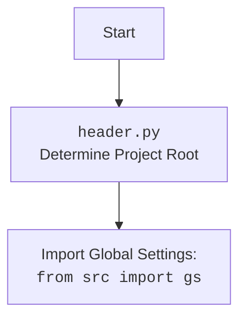

## <алгоритм>

1. **Начало:** Инициализация модуля `src.endpoints`. Установка режима ``.
2. **Импорт модулей (закомментировано):**  В коде присутствуют закомментированные строки импорта, которые, судя по названиям, относятся к взаимодействию с внешними системами, такими как PrestaShop и Telegram-ботом Казаринова. Эти импорты неактивны, но их назначение можно предположить по их именам.
3. **Конец:** Модуль `src.endpoints` инициализирован и готов к дальнейшей работе. В текущем виде этот модуль не выполняет никаких активных действий.

Пример:
- В режиме разработки `MODE` установлено значение `'dev'`.
- Закомментированные импорты могут быть раскомментированы для активации функциональности, связанной с PrestaShop и Telegram-ботом.

## <mermaid>

**Объяснение зависимостей `mermaid`:**

*   **Start:** Начало выполнения программы, начало модуля.
*   **ModeInit:** Инициализация переменной `MODE` со значением 'dev'.
*   **End:** Завершение инициализации модуля `src.endpoints`.

Используемые переменные в диаграмме имеют осмысленные имена:
* `Start` и `End` показывают начало и конец процесса инициализации.
* `ModeInit` описывает инициализацию переменной `MODE`.

## <объяснение>

**Импорты:**

*   В данном коде нет активных импортов. Однако присутствуют закомментированные строки:
    *   `from .prestashop import ...`: Этот импорт, вероятно, предназначен для взаимодействия с API PrestaShop. Модуль `prestashop` (судя по названиям импортируемых классов) включает функциональность для работы с категориями, клиентами, языками, продуктами, магазинами, поставщиками, складами и запросом прайс-листов.
    *   `from .kazarinov import KazarinovTelegramBot`: Этот импорт, вероятно, предназначен для интеграции с Telegram-ботом Казаринова.

**Классы:**
В данном коде нет активных определений классов. Однако, судя по закомментированным импортам, проект, вероятно, использует следующие классы:

*   **PrestaShop**: Класс для основного взаимодействия с API PrestaShop.
*   **PrestaCategory**: Класс для управления категориями товаров в PrestaShop.
*   **PrestaCustomer**: Класс для управления клиентами в PrestaShop.
*   **PrestaLanguage**: Класс для управления языками в PrestaShop.
*   **PrestaProduct**: Класс для управления продуктами в PrestaShop.
*   **PrestaShopShop**: Класс для управления магазинами в PrestaShop.
*   **PrestaSupplier**: Класс для управления поставщиками в PrestaShop.
*   **PrestaWarehouse**: Класс для управления складами в PrestaShop.
*   **PriceListRequester**: Класс для запроса прайс-листов из PrestaShop.
*   **KazarinovTelegramBot**: Класс для управления Telegram-ботом.

**Функции:**
В данном коде нет явных определений функций.

**Переменные:**

*   `MODE`: Глобальная переменная, установленная в значение `'dev'`. Эта переменная, вероятно, используется для определения режима работы приложения. В данном случае, режим разработчика.

**Потенциальные ошибки и области для улучшения:**
*   **Закомментированные импорты:**  Закомментированные импорты указывают на то, что функциональность, связанная с PrestaShop и Telegram-ботом, неактивна.
*   **Отсутствие активного кода:** В текущем виде файл не выполняет никакой полезной работы, кроме инициализации переменной `MODE`.
*   **Неопределенность назначения:**  Файл `__init__.py` обычно используется для определения пакета и может включать в себя логику инициализации пакета. В данном случае, кроме установки `MODE`, нет никакой инициализации.

**Взаимосвязь с другими частями проекта:**
*   Модуль `src.endpoints` является частью пакета `src` и, предположительно, предназначен для обработки входящих запросов или для интеграции с внешними сервисами (на что намекают закомментированные импорты).
*   Вероятная связь с `header.py`, который определяет корневую директорию проекта и загружает глобальные настройки.
*   Если раскомментировать импорты, модуль будет связан с PrestaShop и Telegram-ботом Казаринова, обеспечивая функциональность интеграции с этими сервисами.