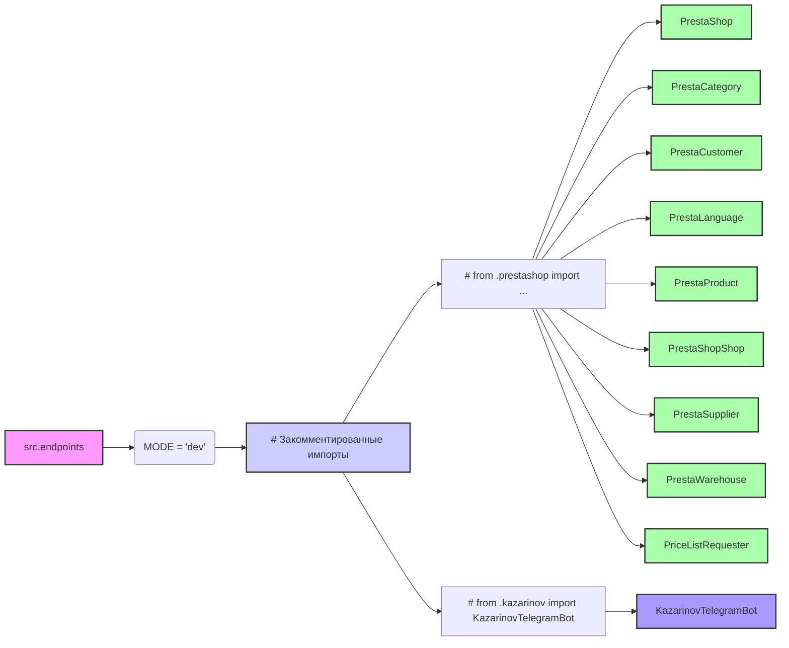

## Анализ кода `hypotez/src/endpoints/__init__.py`

### <алгоритм>

1. **Инициализация**:
   - Задается переменная `MODE` со значением `'dev'`. Это может использоваться для определения режима работы приложения (разработка, продакшн и т.д.).
   - Этот блок не выполняет никаких других действий, так как закомментированны все импорты.

2. **Закомментированные импорты**:
   - Присутствуют закомментированные строки, которые импортируют различные модули из пакетов `prestashop` и `kazarinov`. Эти импорты не активны в текущей версии кода.
   - Модули `prestashop` импортируют классы для работы с API PrestaShop (например, `PrestaShop`, `PrestaCategory`, `PrestaCustomer`, `PrestaLanguage`, `PrestaProduct`, `PrestaShopShop`, `PrestaSupplier`, `PrestaWarehouse`, `PriceListRequester`).
   - Модуль `kazarinov` импортирует `KazarinovTelegramBot` для интеграции с Telegram.

### <mermaid>

**Описание диаграммы mermaid:**

-   `A[src.endpoints]` – обозначает текущий модуль `src.endpoints`, который является отправной точкой диаграммы.
-   `B(MODE = 'dev')` – показывает инициализацию переменной `MODE` со значением `'dev'`, которая определяет режим работы приложения.
-   `C[# Закомментированные импорты]` – представляет блок, содержащий закомментированные импорты. Это указывает на то, что импорты неактивны, но они задокументированы в коде.
-   `D[# from .prestashop import ...]` – обозначает закомментированный блок импорта из модуля `prestashop`.
-   `E[# from .kazarinov import KazarinovTelegramBot]` – обозначает закомментированный блок импорта из модуля `kazarinov`.
-   `F[PrestaShop]`, `G[PrestaCategory]`, `H[PrestaCustomer]`, `I[PrestaLanguage]`, `J[PrestaProduct]`, `K[PrestaShopShop]`, `L[PrestaSupplier]`, `M[PrestaWarehouse]`, `N[PriceListRequester]` – представляют классы, которые должны быть импортированы из модуля `prestashop`.
-    `O[KazarinovTelegramBot]` – представляет класс, который должен быть импортирован из модуля `kazarinov`.
-   `classDef class_prestashop fill:#afa,stroke:#333,stroke-width:2px;` – задает стиль для классов, связанных с `prestashop`.
-  `classDef class_kazarinov fill:#a9f,stroke:#333,stroke-width:2px;` – задает стиль для классов, связанных с `kazarinov`.

Диаграмма показывает, что `src.endpoints` содержит инициализацию переменной `MODE` и закомментированные импорты из `prestashop` и `kazarinov`. В текущей версии кода эти импорты не активны, но диаграмма показывает их структуру и назначение.

### <объяснение>

**Импорты:**

-   В данном файле импорты отсутствуют, так как все они закомментированы.
    -   `from .prestashop import ...`: Эта строка предполагает импорт классов для взаимодействия с API PrestaShop.
        - `PrestaShop`: Основной класс для работы с API PrestaShop.
        - `PrestaCategory`: Класс для работы с категориями товаров PrestaShop.
        - `PrestaCustomer`: Класс для работы с клиентами PrestaShop.
        - `PrestaLanguage`: Класс для работы с языками PrestaShop.
        - `PrestaProduct`: Класс для работы с товарами PrestaShop.
        - `PrestaShopShop`: Класс для работы с магазинами PrestaShop (если PrestaShop имеет мультимагазин).
        - `PrestaSupplier`: Класс для работы с поставщиками PrestaShop.
        - `PrestaWarehouse`: Класс для работы со складами PrestaShop.
        - `PriceListRequester`: Класс для формирования запросов на прайс-листы.
    - `from .kazarinov import KazarinovTelegramBot`: Импортирует класс `KazarinovTelegramBot` из модуля `kazarinov`. Это предполагает интеграцию с Telegram через бот.
-   **Взаимосвязь с другими пакетами `src`**: Закомментированные импорты намекают на взаимодействие с `src.prestashop` и `src.kazarinov`. Эти пакеты, вероятно, содержат логику для работы с PrestaShop и Telegram соответственно.

**Классы:**

- В данном файле нет объявленных классов, однако, закомментированные импорты подразумевают использование классов из других модулей (например, `PrestaShop`, `KazarinovTelegramBot` и т.д.). Их роль - это взаимодействие с внешними API PrestaShop и Telegram.

**Функции:**

-  В данном файле нет объявленных функций.

**Переменные:**

-   `MODE`:
    -   Тип: Строка (`str`).
    -   Значение: `'dev'`.
    -   Использование: Определяет режим работы приложения. В данном случае это режим разработки.

**Потенциальные ошибки и области для улучшения:**

1.  **Неактивные импорты:** В текущем виде все импорты закомментированы. Это может указывать на то, что функционал, связанный с PrestaShop и Telegram, временно отключен или еще не реализован.
2.  **Отсутствие документации**: Отсутсвие документации о том как используется переменная `MODE`, может вызывать трудности при масштабировании проекта, и интеграции новыми разработчиками.
3.  **Настройка режимов**: Использование переменной `MODE` в качестве строковой переменной не безопасно. Необходимо использовать более строгий подход.
4.  **Зависимости**: Необходима доработка для отображения полных взаимосвязей между модулями.

**Цепочка взаимосвязей с другими частями проекта:**

-   Пакет `src.endpoints` предназначен для обработки входящих запросов и, возможно, для взаимодействия с другими частями проекта. Закомментированные импорты указывают на возможную интеграцию с:
    -   `src.prestashop`: Для управления данными в интернет-магазине PrestaShop.
    -   `src.kazarinov`: Для отправки уведомлений через Telegram.

Этот файл служит как точка входа для обработки входящих запросов, но в текущем состоянии он неактивен. Необходима активация импортов и реализация функциональности для полноценной работы.