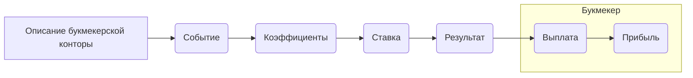

# Анализ кода

**1. <input code>**

```
## Букмекер: Простыми словами

**Букмекер** – это человек или компания, которая принимает ставки на различные события, чаще всего на спортивные. По сути, они предлагают вам угадать, кто победит в матче, кто забьет гол или какой будет счет. 

Если вы угадываете правильно, то выигрываете деньги, при этом сумма выигрыша зависит от того, насколько маловероятным было ваше предсказание. Чем менее вероятно событие, тем выше коэффициент, который вам предлагают, и тем больше вы сможете выиграть, если угадаете.

### Как это работает?
1. **Событие:** Букмекерская контора предлагает множество событий для ставок: футбольные матчи, теннисные турниры, хоккейные лиги и многое другое.
2. **Коэффициенты:** Каждому возможному исходу события присваивается коэффициент. Чем выше коэффициент, тем менее вероятным считается исход.
3. **Ставка:** Вы выбираете событие и делаете ставку на тот исход, который, по вашему мнению, произойдет.
4. **Результат:** После того, как событие произошло, букмекерская контора подсчитывает выигрыши и выплачивает их тем, кто угадал.

### Почему букмекеры это делают?
Букмекеры зарабатывают на том, что устанавливают коэффициенты таким образом, чтобы в среднем выигрывать больше, чем проигрывать. Они анализируют множество данных, чтобы определить вероятность каждого исхода и предложить такие коэффициенты, которые принесут им прибыль.

### Важно помнить:
* **Риск:** Ставки на спорт – это азартная игра, и всегда есть риск проиграть.
* **Законность:** В большинстве стран букмекерская деятельность регулируется законом.
* **Ответственность:** Ставьте только те суммы, которые вы можете позволить себе потерять.

**Хотите узнать больше о ставках?** Могу рассказать о разных типах ставок, стратегиях и многом другом. 

**Есть ли у вас еще какие-нибудь вопросы?** 

*Например, вы можете спросить:*
* Что такое коэффициент?
* Какие бывают виды ставок?
* Как выбрать надежную букмекерскую контору?
* Какие стратегии используют игроки?

**Пожалуйста, не забывайте, что азартные игры могут вызывать зависимость. Играйте ответственно!**
```

**2. <algorithm>**

Данный код не содержит алгоритма в традиционном понимании, это текстовое описание работы букмекерской конторы.  Блок-схема не требуется.

**3. <mermaid>**



**4. <explanation>**

Код представляет собой текстовое описание принципов работы букмекерской конторы.  Он не содержит программного кода, поэтому анализ, связанный с импортами, классами, функциями и переменными, не применим.

* **Импорты**: Отсутствуют.
* **Классы**: Отсутствуют.
* **Функции**: Отсутствуют.
* **Переменные**: Отсутствуют.

**Возможные ошибки/улучшения:**

* Отсутствует техническая реализация.  Описание слишком общее и не дает информации о конкретных процессах и технологиях. Для более подробного анализа нужен код, описывающий API, базы данных, алгоритмы расчета коэффициентов и т.д.
* Отсутствуют конкретные примеры.  Текстовое описание недостаточно конкретно, чтобы понять, как работает букмекерская контора на практике.

**Цепочка взаимосвязей с другими частями проекта**:

Так как нет кода, то и взаимосвязей с другими частями проекта определить нельзя.  Для построения такой цепочки необходим сам программный код.

**Вывод:**

Код представляет собой текстовое описание концепции букмекерской конторы. Для детального анализа и построения взаимосвязей необходим программный код, реализующий эту концепцию.