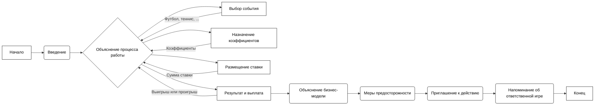

## Анализ кода `hypotez/src/endpoints/bookmaker/about.ru.md`

### 1. <алгоритм>

Данный файл представляет собой текст в формате Markdown, который объясняет, что такое букмекер и как он работает. Это не исполняемый код, поэтому "алгоритм" здесь - это, скорее, последовательность изложения информации для пользователя:

1.  **Введение:**
    *   Текст начинается с простого объяснения того, кто такой букмекер.
    *   *Пример*: "Букмекер – это человек или компания, которая принимает ставки..."

2.  **Объяснение процесса работы:**
    *   Объясняется, как работает букмекерский бизнес.
    *   *Пример*: "1. Событие: Букмекерская контора предлагает множество событий для ставок..."
    *   Последовательно описываются шаги:
        *   Выбор события.
        *   Назначение коэффициентов.
        *   Размещение ставки.
        *   Определение результатов и выплат.

3.  **Объяснение бизнес-модели:**
    *   Поясняется, как букмекеры зарабатывают деньги.
    *   *Пример*: "Букмекеры зарабатывают на том, что устанавливают коэффициенты..."
    *   Используется анализ данных для установления коэффициентов и получения прибыли.

4.  **Меры предосторожности:**
    *   Указание на риски, связанные со ставками, необходимость соблюдения законности и важность ответственной игры.
    *   *Пример*: "*Риск: Ставки на спорт – это азартная игра, и всегда есть риск проиграть.*"

5.  **Приглашение к действию (Call to Action):**
    *   Предлагается пользователю задавать вопросы и получать дополнительную информацию о ставках.
    *   *Пример*: "**Хотите узнать больше о ставках?** Могу рассказать о разных типах ставок..."
    *   Приведены примеры возможных вопросов.

6.  **Напоминание об ответственной игре:**
    *   Финальное напоминание о рисках и необходимости играть ответственно.
    *   *Пример*: "**Пожалуйста, не забывайте, что азартные игры могут вызывать зависимость. Играйте ответственно!**"

### 2. <mermaid>

**Разбор диаграммы `mermaid`:**

*   `graph LR`: Задает направление графа слева направо.
*   `A[Начало]`: Начало процесса.
*   `B(Введение)`: Узел, представляющий введение, где объясняется, кто такой букмекер.
*   `C{Объяснение процесса работы}`: Узел, описывающий процесс работы букмекера (разветвление на этапы).
*   `D[Выбор события]`: Узел описывает выбор события для ставки.
*   `E[Назначение коэффициентов]`: Узел описывает назначение коэффициентов для ставок.
*   `F[Размещение ставки]`: Узел описывает процесс размещения ставки пользователем.
*   `G[Результат и выплата]`: Узел описывает определение результата и выплату выигрышей.
*   `H(Объяснение бизнес-модели)`: Узел, объясняющий, как букмекеры зарабатывают.
*   `I(Меры предосторожности)`: Узел, описывающий предостережения и риски, связанные с азартными играми.
*   `J(Приглашение к действию)`: Узел, предлагающий пользователю задать вопросы.
*   `K(Напоминание об ответственной игре)`: Узел с напоминанием об ответственной игре.
*   `L[Конец]`: Конец процесса.
*   `-->`: Обозначает направление потока информации.
*   `D -- "Футбол, теннис, ..." --> C`, `E -- "Коэффициенты" --> C`, `F -- "Сумма ставки" --> C`, `G -- "Выигрыш или проигрыш" --> C`: Показывает, какие данные вводятся или выводятся на конкретных этапах процесса.
*   `classDef plain fill:#ffffff,stroke:#000,stroke-width:1px,color:#000;`: Определяет стиль для узлов диаграммы (белый фон, черная обводка).
*   `class A,B,C,D,E,F,G,H,I,J,K,L plain;`: Применяет определенный стиль к узлам.

### 3. <объяснение>

**Импорты:**

*   В данном файле нет импортов, так как это текстовый файл в формате Markdown.

**Классы:**

*   В данном файле нет классов, так как это текстовый файл в формате Markdown.

**Функции:**

*   В данном файле нет функций, так как это текстовый файл в формате Markdown.

**Переменные:**

*   В данном файле нет переменных, так как это текстовый файл в формате Markdown. Вся информация представлена в виде текста.

**Объяснение:**

Этот Markdown-файл представляет собой текстовое описание работы букмекерской конторы. Он не содержит исполняемого кода, а служит для информирования пользователя. Основные аспекты, которые он покрывает:

*   **Определение букмекера:** Дает простое объяснение, кто такой букмекер.
*   **Процесс работы:** Описывает шаги процесса ставок от выбора события до получения выигрыша.
*   **Бизнес-модель:** Раскрывает, как букмекеры зарабатывают деньги, устанавливая коэффициенты.
*   **Меры предосторожности:** Подчеркивает риски азартных игр и важность ответственного поведения.
*   **Приглашение к действию:** Побуждает пользователя задавать вопросы и получать дополнительную информацию.

**Потенциальные ошибки и области для улучшения:**

*   **Отсутствие интерактивности:** Это статичный текст, который не предоставляет интерактивного взаимодействия с пользователем.
*   **Возможность перевода:** Для мультиязычной поддержки, текст должен быть переведен на другие языки.
*   **Недостаток подробностей:**  Текст представляет собой общее введение, возможно стоит добавить больше подробностей о разных типах ставок или стратегиях.

**Цепочка взаимосвязей с другими частями проекта:**

*   Этот файл, вероятно, используется как справочный материал в рамках веб-приложения, в разделе "О букмекерах" или FAQ.
*   Он может быть связан с другими Markdown-файлами в каталоге `src/endpoints/bookmaker`, предоставляющими дополнительную информацию о букмекерских ставках.

В целом, файл `about.ru.md` выполняет свою задачу, предоставляя базовое понимание того, что такое букмекер и как он работает.