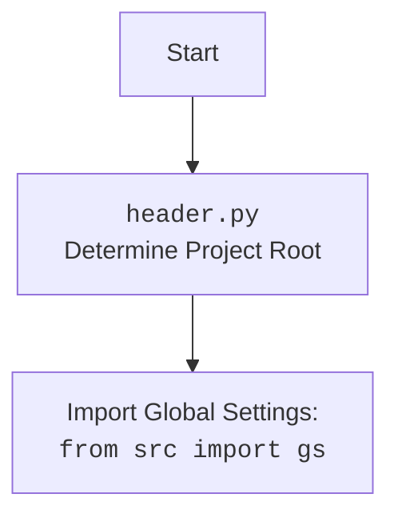

## Анализ кода `hypotez/src/endpoints/bookmaker/header.py`

### 1. **<алгоритм>**

1.  **`set_project_root(marker_files)`:**
    *   Начало: Получаем абсолютный путь к текущему файлу (`__file__`) и его родительскую директорию.
        *   Пример: Если `__file__` - `/path/to/hypotez/src/endpoints/bookmaker/header.py`, то `current_path` станет `/path/to/hypotez/src/endpoints/bookmaker`.
    *   Инициализируем переменную `__root__` текущим путём.
    *   Перебираем текущий путь и его родительские директории.
        *   Пример:  `/path/to/hypotez/src/endpoints/bookmaker`, `/path/to/hypotez/src/endpoints`, `/path/to/hypotez/src`, `/path/to/hypotez`, `/path/to/`
    *   Для каждой директории проверяем наличие любого из `marker_files` (`__root__`, `.git`).
        *   Пример: Проверяется наличие файла `__root__` или директории `.git` в каждой родительской директории.
    *   Если маркерный файл найден, обновляем `__root__` и останавливаем поиск.
        *   Пример: Если файл `.git` найден в директории `/path/to/hypotez`, то `__root__` становится `/path/to/hypotez`
    *   Добавляем `__root__` в `sys.path`, если его там еще нет.
    *   Возвращаем путь `__root__`.
2.  **Инициализация `__root__`:**
    *   Вызываем `set_project_root()` и присваиваем результат переменной `__root__`.
3.  **Чтение `settings.json`:**
    *   Формируем путь к файлу `settings.json`:  `gs.path.root / 'src' / 'settings.json'`.
    *   Открываем файл `settings.json` в режиме чтения.
    *   Загружаем JSON-данные в словарь `settings`.
    *   В случае ошибок `FileNotFoundError` или `json.JSONDecodeError` игнорируем исключение.
4.  **Чтение `README.MD`:**
    *   Формируем путь к файлу `README.MD`: `gs.path.root / 'src' / 'README.MD'`.
    *   Открываем файл `README.MD` в режиме чтения.
    *   Читаем содержимое файла в строку `doc_str`.
    *   В случае ошибок `FileNotFoundError` или `json.JSONDecodeError` игнорируем исключение.
5.  **Инициализация глобальных переменных:**
    *   `__project_name__`:  Берется из `settings` по ключу "project_name", если `settings` не `None`, иначе устанавливается в "hypotez".
    *   `__version__`: Берется из `settings` по ключу "version", если `settings` не `None`, иначе устанавливается в "".
    *   `__doc__`: Присваивается значение `doc_str`, если оно не `None`, иначе устанавливается в "".
    *   `__details__`: Инициализируется пустой строкой `''`.
    *   `__author__`: Берется из `settings` по ключу "author", если `settings` не `None`, иначе устанавливается в "".
    *   `__copyright__`: Берется из `settings` по ключу "copyrihgnt", если `settings` не `None`, иначе устанавливается в "".
    *   `__cofee__`: Берется из `settings` по ключу "cofee", если `settings` не `None`, иначе устанавливается в дефолтное значение.

### 2. **<mermaid>**

```mermaid
flowchart TD
    Start --> FindRoot[<code>set_project_root()</code><br> Find Project Root Directory]
    FindRoot --> CheckMarkers[Check for marker files:<br> '__root__' or '.git']
    CheckMarkers --Found--> SetRoot[Set project root directory]
    CheckMarkers --Not Found--> CheckParent[Check parent directories]
    CheckParent --Have Parents--> FindRoot
    CheckParent --No Parents--> SetRoot
    SetRoot --> AddToSysPath[Add root to sys.path]
    AddToSysPath --> ImportGS[Import Global Settings:<br><code>from src import gs</code>]
    ImportGS --> ReadSettings[Read <code>settings.json</code>]
    ReadSettings --> ReadReadme[Read <code>README.MD</code>]
    ReadReadme --> SetGlobalVars[Set global variables]
    SetGlobalVars --> End
    
    style FindRoot fill:#f9f,stroke:#333,stroke-width:2px
    style CheckMarkers fill:#ccf,stroke:#333,stroke-width:2px
     style SetRoot fill:#ccf,stroke:#333,stroke-width:2px
     style CheckParent fill:#ccf,stroke:#333,stroke-width:2px
     style AddToSysPath fill:#ccf,stroke:#333,stroke-width:2px
     style ImportGS fill:#ccf,stroke:#333,stroke-width:2px
      style ReadSettings fill:#ccf,stroke:#333,stroke-width:2px
      style ReadReadme fill:#ccf,stroke:#333,stroke-width:2px
      style SetGlobalVars fill:#ccf,stroke:#333,stroke-width:2px
```



**Объяснение зависимостей:**

*   **`flowchart TD`**: Объявляет диаграмму типа "flowchart" (блок-схема) с направлением "TD" (top-down).
*   **`Start`, `FindRoot`, `CheckMarkers`, `SetRoot`, `AddToSysPath`, `ImportGS`, `ReadSettings`, `ReadReadme`, `SetGlobalVars`, `End`**:  Узлы диаграммы, представляющие этапы выполнения кода.
*   **`-->`**: Стрелки, показывающие поток управления.
*   `CheckMarkers --Found--> SetRoot`: Обозначает поток данных, в случае если маркер был найден.
*   `CheckMarkers --Not Found--> CheckParent`: Обозначает поток данных, в случае если маркер не был найден.
*    `CheckParent --Have Parents--> FindRoot`: Обозначает поток данных, в случае если родительская папка существует.
*     `CheckParent --No Parents--> SetRoot`: Обозначает поток данных, в случае если родительской папки не существует.
*   `style` - устанавливает стили для узлов, позволяя выделить основные этапы.

**Импортированные зависимости:**
*   `import sys`: используется для добавления пути к проекту в `sys.path` (для поиска модулей).
*   `import json`: используется для чтения данных из `settings.json`.
*   `from packaging.version import Version`: используется для работы с версиями пакетов.
*    `from pathlib import Path`: используется для работы с путями к файлам и каталогам.
*    `from src import gs`: Импортирует глобальные настройки проекта, включая пути `gs.path.root`.

### 3. **<объяснение>**

**Импорты:**

*   **`sys`**:  Модуль `sys` используется для манипулирования средой выполнения Python. В данном случае, он используется для добавления корневой директории проекта в `sys.path`, что позволяет импортировать модули из этой директории.
*   **`json`**: Модуль `json` используется для работы с JSON-данными. Здесь он используется для чтения файла `settings.json`, содержащего настройки проекта.
*   **`packaging.version.Version`**:  Этот класс используется для работы с версиями пакетов. Хотя в текущем коде он не используется напрямую, он импортируется, возможно, для будущих расширений, связанных с управлением версиями.
*   **`pathlib.Path`**:  Класс `Path` из модуля `pathlib` используется для представления файловых путей как объектов, упрощая операции с файлами и каталогами. Здесь он используется для поиска корневой директории проекта и формирования путей к файлам.
*   **`src`**: `from src import gs`  импортирует глобальные настройки проекта из пакета `src`, предполагается, что `gs` это модуль или объект, содержащий, например, пути к директориям проекта.

**Функции:**

*   **`set_project_root(marker_files: tuple = ('__root__', '.git')) -> Path`**:
    *   **Аргументы**:
        *   `marker_files`: кортеж с именами файлов или директорий, используемых для определения корневой директории проекта. По умолчанию `('__root__', '.git')`.
    *   **Возвращает**:
        *   `Path`: объект `Path`, представляющий корневую директорию проекта.
    *   **Назначение**:
        *   Функция определяет корневую директорию проекта, начиная с директории, содержащей данный файл (`header.py`), и ищет вверх по иерархии директорий, пока не найдет одну из маркерных директорий или файлов.
        *   После определения корневой директории, добавляет её в `sys.path`, что позволяет импортировать модули из этой директории.
        *   Если маркерные файлы не найдены, то возвращает директорию в которой находится файл `header.py`.
    *  **Пример**:
        ```python
        root_path = set_project_root()
        print(root_path) # Выведет путь к корневой директории
        ```

**Переменные:**

*   **`__root__`**:  Переменная типа `Path`, хранит путь к корневой директории проекта.
*   **`settings`**:  Словарь (`dict`), содержащий настройки проекта, прочитанные из файла `settings.json`. Может быть `None`, если файл не удалось прочитать.
*   **`doc_str`**:  Строка (`str`), содержащая содержимое файла `README.MD`. Может быть `None`, если файл не удалось прочитать.
*  **`__project_name__`**: Строка, хранит имя проекта. По умолчанию `"hypotez"`.
*   **`__version__`**:  Строка, хранит версию проекта. По умолчанию `''`.
*   **`__doc__`**: Строка, хранит содержимое документации (`README.MD`). По умолчанию `''`.
*   **`__details__`**: Строка, предназначена для хранения дополнительной информации о проекте. По умолчанию `''`.
*   **`__author__`**: Строка, хранит имя автора проекта. По умолчанию `''`.
*    **`__copyright__`**: Строка, хранит информацию об авторских правах. По умолчанию `''`.
*   **`__cofee__`**: Строка, хранит сообщение для поддержки проекта. По умолчанию: `"Treat the developer to a cup of coffee for boosting enthusiasm in development: https://boosty.to/hypo69"`.

**Цепочка взаимосвязей с другими частями проекта:**

1.  **Определение корневой директории**: `header.py` отвечает за определение корневой директории проекта. Это важный шаг для всех остальных модулей, которые зависят от правильного определения путей к файлам и пакетам.
2.  **Глобальные настройки**: `header.py` загружает файл `settings.json`, который содержит глобальные настройки проекта. Эти настройки (например, имя проекта, версия) используются во многих других частях проекта.
3.  **Использование `gs`**:  Импорт `from src import gs` показывает, что данный модуль зависит от глобальных настроек, которые могут включать пути к файлам, переменные среды и т.д.
4.  **Документация**: `header.py` читает `README.MD`, и сохраняет его содержимое в глобальной переменной, что может использоваться для предоставления информации о проекте.

**Потенциальные ошибки и области для улучшения:**

1.  **Обработка исключений**: Код использует пустые блоки `except` для `FileNotFoundError` и `json.JSONDecodeError`. Желательно логировать эти ошибки, чтобы можно было отслеживать проблемы при загрузке `settings.json` и `README.MD`.
2.  **Зависимость от `gs`**: Код зависит от модуля `gs`, который не определен в данном файле. Важно убедиться, что этот модуль правильно настроен в `src` и доступен.
3.  **Неявное поведение**: Код ожидает, что `settings.json` будет содержать все необходимые ключи. Отсутствие некоторых ключей обрабатывается через вызов метода `get`, который имеет default value,  но было бы хорошо проверять наличие нужных ключей в `settings` или использовать Pydantic для валидации и обработки настроек.
4.  **Неизменяемые глобальные переменные:**  `__project_name__`, `__version__`, `__doc__`, `__details__`, `__author__`, `__copyright__`, `__cofee__` -  являются глобальными переменными,  лучше использовать property если это необходимо, но нужно помнить что их изменяемость может вызывать проблемы в параллельном исполнении.
5. **Расширяемость**:  Желательно, чтобы функция  `set_project_root()` принимала список маркерных файлов через аргумент и имела более гибкую настройку (например, поиск не только по родительским директориям).