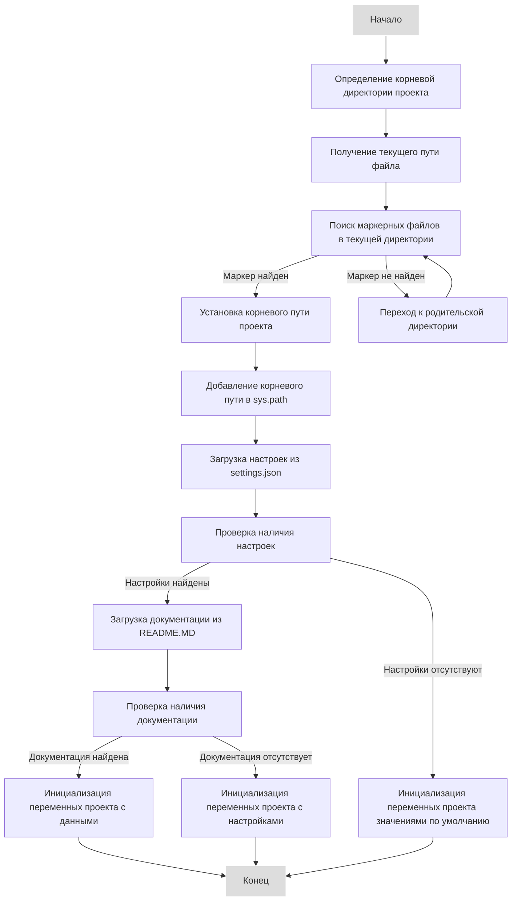
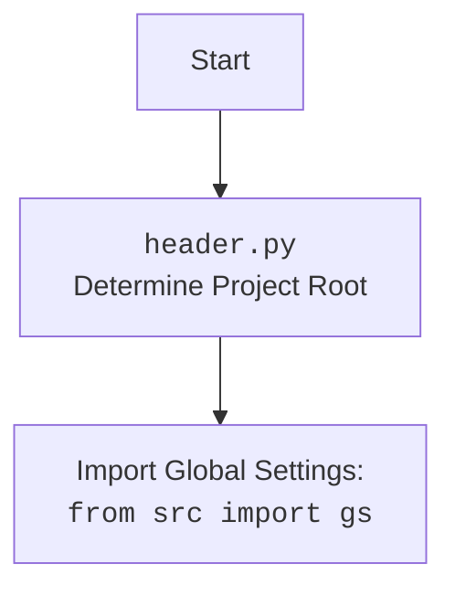

## ИНСТРУКЦИЯ:

Анализируй предоставленный код подробно и объясни его функциональность. Ответ должен включать три раздела:

1.  **<алгоритм>**: Опиши рабочий процесс в виде пошаговой блок-схемы, включая примеры для каждого логического блока, и проиллюстрируй поток данных между функциями, классами или методами.
2.  **<mermaid>**: Напиши код для диаграммы в формате `mermaid`, проанализируй и объясни все зависимости,
    которые импортируются при создании диаграммы.
    **ВАЖНО!** Убедитесь, что все имена переменных, используемые в диаграмме `mermaid`,
    имеют осмысленные и описательные имена. Имена переменных вроде `A`, `B`, `C`, и т.д., не допускаются!

    **Дополнительно**: Если в коде есть импорт `import header`, добавьте блок `mermaid` flowchart, объясняющий `header.py`:
    ```mermaid
    flowchart TD
        Start --> Header[<code>header.py</code><br> Determine Project Root]

        Header --> import[Import Global Settings: <br><code>from src import gs</code>]
    ```

3.  **<объяснение>**: Предоставьте подробные объяснения:
    -   **Импорты**: Их назначение и взаимосвязь с другими пакетами `src.`.
    -   **Классы**: Их роль, атрибуты, методы и взаимодействие с другими компонентами проекта.
    -   **Функции**: Их аргументы, возвращаемые значения, назначение и примеры.
    -   **Переменные**: Их типы и использование.
    -   Выделите потенциальные ошибки или области для улучшения.

Дополнительно, постройте цепочку взаимосвязей с другими частями проекта (если применимо).

Это обеспечивает всесторонний и структурированный анализ кода.
## Формат ответа: `.md` (markdown)
**КОНЕЦ ИНСТРУКЦИИ**
```markdown
## <алгоритм>

**1. Определение корневой директории проекта:**

    *   **Начало**:  Функция `set_project_root` вызывается без аргументов, и по умолчанию ищет маркерные файлы (`__root__`) в файловой системе.
    *   **Определение текущего пути:** Определяется абсолютный путь к директории, где находится файл `header.py`. Пример: `/home/user/hypotez/src/endpoints`.
    *   **Поиск маркерных файлов**:
        *   Проверяется наличие маркерных файлов (`__root__`) в текущей директории.
        *   Если маркерные файлы не найдены, происходит итерация по родительским директориям.
        *   Например, если маркерный файл `__root__` находится в `/home/user/hypotez`, то путь будет определен как `/home/user/hypotez`.
    *   **Установка корневого пути**: Если корневая директория определена, то она добавляется в `sys.path` для возможности импорта пакетов проекта.
    *   **Возврат**: Функция возвращает `Path` объект, представляющий корневую директорию проекта.

**2. Загрузка настроек из `settings.json`:**

   *   **Построение пути**: Формируется путь к файлу `settings.json` относительно корневой директории проекта: `/home/user/hypotez/src/settings.json`.
   *   **Чтение файла**:
         *   Пытаемся открыть файл `settings.json`.
         *   Если файл открыт успешно, то его содержимое считывается и преобразуется в словарь Python с помощью `json.load()`.
         *   Если файл не найден (`FileNotFoundError`) или  `json.JSONDecodeError`, то присваивается переменной settings = None.

**3. Загрузка документации из `README.MD`:**

   *   **Построение пути**: Формируется путь к файлу `README.MD` относительно корневой директории проекта: `/home/user/hypotez/src/README.MD`.
   *   **Чтение файла**:
        *   Пытаемся открыть файл `README.MD`.
        *   Если файл открыт успешно, то его содержимое считывается и присваивается переменной `doc_str`.
        *   Если файл не найден (`FileNotFoundError`) или  `json.JSONDecodeError`, то переменной `doc_str` присваивается `None`.

**4. Инициализация переменных проекта:**

   *   Из словаря настроек `settings` извлекаются следующие значения:
        *   `__project_name__`: имя проекта (по умолчанию 'hypotez').
        *   `__version__`: версия проекта (по умолчанию пустая строка).
        *   `__doc__`: документация проекта (содержимое `README.MD`).
        *   `__details__`:  описание, по умолчанию пустая строка.
        *   `__author__`: автор проекта (по умолчанию пустая строка).
        *  `__copyright__`: авторские права (по умолчанию пустая строка).
        *  `__cofee__`: сообщение для поддержки разработчика.
    *   Если `settings` не удалось загрузить, используются значения по умолчанию.

## <mermaid>





**Анализ зависимостей `mermaid`:**

*   **flowchart TD**: Определяет тип диаграммы как блок-схему (flowchart) с направлением сверху вниз (TD - Top Down).
*   **Start, FindRoot, GetCurrentPath, CheckMarker, SetRootPath, AddToSysPath, LoadSettings, CheckSettings, LoadReadme, CheckReadme, InitVarsWithData, InitVarsWithSettings, InitDefaultVars, End**: Узлы (блоки) диаграммы, представляющие этапы алгоритма.
*   **-->**: Соединительные стрелки, показывающие поток выполнения.
*   **-- "текст" -->**: Соединительные стрелки с текстовыми метками, описывающие условие перехода.
*   **classDef plain fill:#ddd,stroke:#fff,stroke-width:1px;** - определяет стиль для некоторых узлов диаграммы.
*   **class Start,End plain** - применяет стиль `plain` к узлам `Start` и `End`.

## <объяснение>

### Импорты:

*   `sys`: Модуль для работы с системными переменными, используется для добавления корневой директории проекта в `sys.path`, чтобы обеспечить импорт модулей из проекта.
*   `json`: Модуль для работы с JSON, используется для чтения данных из файла `settings.json`.
*   `packaging.version`: Используется для работы с версиями пакетов.
*   `pathlib.Path`: Модуль для работы с файловыми путями, создает объект `Path` для работы с файловой системой.
*   `from src import gs`: импортирует глобальные настройки проекта `gs` из пакета `src`.

### Функции:

*   `set_project_root(marker_files=('__root__')) -> Path`:
    *   **Аргументы:**
        *   `marker_files` (tuple, по умолчанию `('__root__')`): Кортеж с именами файлов или директорий, по наличию которых будет определена корневая директория проекта.
    *   **Возвращает:**
        *   `Path`: Объект `pathlib.Path`, представляющий путь к корневой директории проекта.
    *   **Назначение:** Находит корневую директорию проекта, начиная с директории текущего файла, поднимаясь вверх по дереву директорий, пока не найдет хотя бы один из маркерных файлов. Добавляет найденный корневой каталог в `sys.path` чтобы были доступны импорты из других частей проекта.
    *   **Пример:**
        ```python
        root_dir = set_project_root()
        print(root_dir) # Path('/home/user/hypotez')
        ```

### Переменные:

*   `MODE`: Глобальная переменная, определяющая режим работы приложения (по умолчанию `dev`).
*   `__root__`: `Path`-объект, представляющий корневую директорию проекта. Вычисляется при вызове `set_project_root()`.
*   `settings`: Словарь, содержащий настройки проекта, загруженные из `settings.json`.
*   `doc_str`: Строка, содержащая документацию проекта, загруженную из `README.MD`.
*    `__project_name__`: Строка, содержащая название проекта, значение берётся из настроек `settings` или дефолтное значение 'hypotez'.
*   `__version__`: Строка, содержащая версию проекта.
*   `__doc__`: Строка, содержащая документацию проекта.
*   `__details__`: Строка, содержащая детали проекта.
*    `__author__`: Строка, содержащая автора проекта, значение берётся из настроек `settings` или дефолтное значение.
*   `__copyright__`: Строка, содержащая авторские права проекта, значение берётся из настроек `settings` или дефолтное значение.
*    `__cofee__`: Строка, содержащая сообщение для поддержки разработчика, значение берётся из настроек `settings` или дефолтное значение.

### Взаимосвязь с другими частями проекта:

*   **`src.gs`**: Импортирует глобальные настройки проекта, включая путь к корневой директории, используется для доступа к другим частям проекта.
*   **`settings.json`**: Файл, содержащий настройки проекта, такие как имя проекта, версия, автор и прочие данные, необходимые для инициализации проекта.
*  **`README.MD`**: Файл, содержащий документацию проекта, используется для получения описания проекта.

### Потенциальные ошибки и области для улучшения:

*   **Обработка ошибок:** При загрузке `settings.json` и `README.MD` используется `try-except`, но не происходит никакой обработки исключений кроме пропуска. Желательно добавить логирование или другие действия для обработки ошибок.
*   **Использование констант:** Строковые литералы для имен файлов (`'__root__'`, `'src'`, `'settings.json'`, `'README.MD'`) могут быть вынесены в константы для улучшения читаемости и поддержки.
*  **Зависимость от наличия файлов:** Код не обрабатывает ситуацию, когда файлы `settings.json` или `README.MD` отсутствуют. Можно добавить fallback значения или предупреждения.

### Заключение

Данный код отвечает за определение корневой директории проекта, загрузку настроек из `settings.json` и документации из `README.MD`, а также инициализацию глобальных переменных проекта. Он является важной частью инициализации проекта, обеспечивая доступ к ресурсам и настройкам.
```