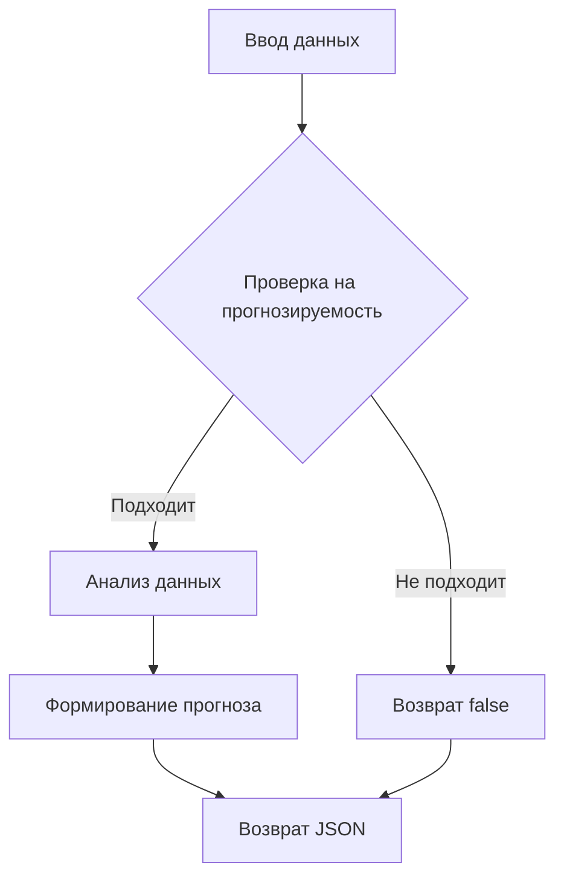

# Анализ кода

```
Вот пример текста промпта для модели машинного обучения:  

---

**Промпт:**  

Вам предоставлены входные данные в текстовом или числовом формате. Ваша задача:  
1. **Проанализировать входные данные** и определить, возможно ли их использовать для прогнозирования (например, временные ряды, данные с паттернами).  
2. Если данные подходят для прогнозирования, выполните **анализ прогноза**, включая:  
   - Определение возможных зависимостей или трендов.  
   - Оценку значимости данных для прогноза.  
   - Пример прогноза, если это применимо.  

**Формат ответа:**  
```json
{
  "is_forecastable": true, 
  "analysis": {
    "patterns_detected": "описание выявленных паттернов",
    "trend": "описание тренда (если применимо)",
    "forecast_period": "период, на который можно прогнозировать (если применимо)"
  },
  "forecast": "примерный прогноз, если возможно, иначе null"
}
```

**Пример входных данных:**  
- Временной ряд чисел: `[12, 14, 15, 20, 25, ...]`.  
- Таблица с несколькими столбцами: даты, продажи, категории.  
- Текстовые описания с метаданными.  

**Пример результата (если прогноз невозможен):**  
```json
{
  "is_forecastable": false,
  "analysis": {
    "reason": "Недостаточно данных или структура данных не подходит для прогнозирования"
  },
  "forecast": null
}
```

**Примечания:**  
- Если входные данные недостаточны для прогнозирования, аргументируйте это.  
- Используйте статистический и контекстуальный анализ для проверки.  
- Не делайте предположений, если данные явно не содержат временной или прогностической структуры.  

```
```

## <algorithm>

Этот код представляет собой пример *prompt* (запрос) для модели машинного обучения, который описывает ожидаемый формат входных данных и ожидаемый формат результата.

**Шаг 1:** Модель получает входные данные.

**Шаг 2:** Модель проверяет, подходит ли структура данных для прогнозирования (например, временной ряд, данные с паттернами).

**Шаг 3:** Если данные подходят, модель выполняет анализ:
   * Определяет возможные зависимости и тренды.
   * Оценивает значимость данных для прогноза.
   * Если возможно, делает прогноз.

**Шаг 4:** Модель формирует результат в формате JSON, содержащем:
   * `is_forecastable`: true/false, указывает, можно ли прогнозировать.
   * `analysis`: информация об анализе, включая паттерны, тренды и прогнозируемый период.
   * `forecast`: примерный прогноз (или null, если прогноз невозможен).

**Пример:**
Ввод: `[12, 14, 15, 20, 25, ...]`
Результат: `{"is_forecastable": true, "analysis": {"trend": "возрастание", "forecast_period": "следующие 5 значений"}, "forecast": [30, 35, 40, 45, 50]}`

## <mermaid>



## <explanation>

Этот код не является программой в традиционном смысле. Он представляет собой текстовое описание *prompt* (запрос) для модели машинного обучения.  Этот prompt определяет формат входных данных и ожидаемый результат.

* **Импорты:** Нет импортов. Код представляет собой чисто текстовое описание.
* **Классы:** Нет классов.
* **Функции:** Нет функций.
* **Переменные:** Нет переменных.
* **Описание:** Код описывает формат входных данных и формат выходных данных для модели машинного обучения, которая должна выполнить прогноз. Это не код, а спецификация ожидаемого поведения.

**Возможные ошибки/улучшения:**

* Prompt может быть более сложным, добавляя ограничения на объем данных, требования к точности прогноза и т.п.
* Можно добавить примеры не-прогнозируемых данных, чтобы лучше прояснить задачу модели.

**Взаимосвязи с другими частями проекта:**

Этот prompt является частью  программы, которая обучает или использует модель машинного обучения. Внешний код (или библиотеки) будут отвечать за:

* **Обработку ввода**: Получение входных данных в соответствии с описанными в prompt форматами.
* **Обучение модели**: Тренировка модели машинного обучения на примерах.
* **Использование модели**: Применение обученной модели для прогнозирования.

Взаимосвязь состоит в том, что этот prompt определяет *вход* и *выход* для процесса обучения и использования модели, но не содержит реализации алгоритмов самих обучения или прогнозирования.