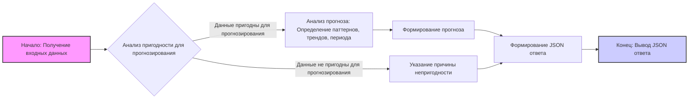

## Анализ кода промпта для модели машинного обучения

### <алгоритм>

1. **Получение входных данных:**
   - Модель принимает входные данные в текстовом или числовом формате.
   - *Пример*: `[12, 14, 15, 20, 25, ...]` (временной ряд) или табличные данные.

2. **Анализ пригодности данных для прогнозирования (`is_forecastable`):**
   - Модель анализирует входные данные на предмет наличия паттернов, трендов или временной структуры, пригодных для прогнозирования.
   - *Пример*: Если данные представляют собой случайный набор чисел, модель определяет `is_forecastable` как `false`. Если данные являются временным рядом с восходящим трендом, то `is_forecastable` будет `true`.

3. **Если данные подходят для прогнозирования (`is_forecastable` == `true`):**
   - **Анализ прогноза:**
        - Выявление паттернов: Модель определяет закономерности в данных (например, сезонность, циклы).
           *Пример*: "обнаружена сезонность с пиками в летние месяцы".
        - Описание тренда: Модель определяет общее направление изменения данных (рост, падение, стагнация).
            *Пример*: "обнаружен восходящий тренд".
        - Определение периода прогнозирования: Модель оценивает, на какой период времени можно сделать прогноз на основе данных.
            *Пример*: "можно прогнозировать на следующие 3 месяца".

    - **Формирование прогноза (`forecast`):**
        - Модель генерирует прогноз на основе анализа, используя соответствующие методы (например, линейная регрессия, ARIMA).
        *Пример*: `[28, 31, 34]` (прогноз на следующие три значения временного ряда).
        - Если прогноз невозможен, то значение `forecast` устанавливается в `null`.

4. **Если данные не подходят для прогнозирования (`is_forecastable` == `false`):**
   - Модель предоставляет причину, почему данные непригодны для прогнозирования.
   - *Пример*: `"reason": "Недостаточно данных или структура данных не подходит для прогнозирования"`.
   - `forecast` устанавливается в `null`.

5. **Формирование JSON-ответа:**
    - Модель формирует JSON-ответ в соответствии с заданным форматом, включающий поля `is_forecastable`, `analysis` и `forecast`.
    - *Пример*:
        ```json
        {
          "is_forecastable": true,
          "analysis": {
             "patterns_detected": "обнаружен восходящий тренд",
             "trend": "увеличение значений со временем",
              "forecast_period": "можно прогнозировать на 5 значений вперед"
           },
          "forecast": "[27, 29, 31, 33, 35]"
         }
        ```

### <mermaid>



**Объяснение диаграммы:**

-   `A` (Начало: Получение входных данных): Начальная точка, где модель получает данные для анализа.
-   `B` (Анализ пригодности для прогнозирования): Узел, где модель решает, можно ли использовать данные для прогнозирования. В зависимости от результата, поток данных идет по одной из двух веток.
-   `C` (Анализ прогноза: Определение паттернов, трендов, периода): Узел, где анализируются данные с целью выявления трендов, паттернов и оценки периода прогнозирования.
-   `D` (Формирование прогноза): На основе анализа формируется прогноз.
-   `E` (Указание причины непригодности): В случае, если данные непригодны, указывается причина.
-    `F` (Формирование JSON ответа): Формируется JSON ответ включающий в себя поля: `is_forecastable`, `analysis`, `forecast`.
-   `G` (Конец: Вывод JSON ответа): Конечная точка, где модель выводит JSON ответ.

**Зависимости:**
Диаграмма не показывает импорты, поскольку представлен только текст промпта. Однако при реализации этого алгоритма в коде, могут потребоваться импорты:

*   **`json`**: Для работы с форматом JSON (сериализация/десериализация данных).
*   **`numpy`** или **`pandas`**: Для анализа числовых данных, особенно временных рядов.
*   **`statsmodels`** или **`scikit-learn`**: Для статистического анализа и построения моделей прогнозирования.

### <объяснение>

**Описание:**

Данный текст описывает промпт для модели машинного обучения, предназначенный для анализа данных и прогнозирования. Промпт предоставляет модели чёткие инструкции по анализу входных данных и формированию структурированного JSON-ответа.

**Импорты:**

В данном случае импорты не описаны, так как предоставлен только текст промпта. При его реализации могут потребоваться следующие импорты:

*   `json`: Для работы с JSON форматом.
*   `numpy` или `pandas`: Для работы с числовыми и табличными данными.
*   `statsmodels` или `scikit-learn`: Для построения моделей прогнозирования.

**Классы:**

В данном тексте нет описаний классов. Однако, при реализации, вероятно, потребуются классы для:

*   Предобработки данных.
*   Анализа данных (например, выявление трендов и паттернов).
*   Построения и применения моделей прогнозирования.
*   Формирования JSON-ответа.

**Функции:**

В тексте промпта функции явно не описаны, но можно выделить следующие необходимые функции:

*   `analyze_data(data)`: Принимает входные данные и определяет, подходят ли они для прогнозирования. Возвращает `is_forecastable` и, при необходимости, данные для дальнейшего анализа.
*   `perform_forecast_analysis(data)`: Принимает данные, пригодные для прогнозирования, анализирует их и определяет паттерны, тренды, период прогнозирования. Возвращает словарь с результатами анализа.
*   `generate_forecast(data)`: Принимает данные и на основе анализа генерирует прогноз. Возвращает прогноз или `null` если прогноз невозможен.
*   `create_response(is_forecastable, analysis, forecast)`: Формирует JSON-ответ в соответствии с заданным форматом.

**Переменные:**

*   `input_data`: Переменная, содержащая входные данные.
*   `is_forecastable`: Булевая переменная, указывающая, можно ли использовать данные для прогнозирования.
*   `analysis`: Словарь с результатами анализа (паттерны, тренды, период прогнозирования или причина непригодности).
*   `forecast`: Прогноз или `null`, если прогноз невозможен.
*   `response`: Словарь (или JSON-строка), содержащий сформированный ответ.

**Потенциальные ошибки и области для улучшения:**

*   **Неопределённость методов анализа:** Промпт не определяет конкретные статистические или машинные методы для анализа и прогнозирования, что может привести к разной интерпретации и реализации.
*   **Обработка ошибок:** В промпте не описано как обрабатывать ошибки ввода, отсутствующие данные или невалидные форматы.
*   **Масштабируемость:** Промпт не учитывает, как обрабатывать большие объёмы данных.
*   **Оценка качества прогноза:** Не предусмотрена оценка качества полученного прогноза.
*   **Уточнение требований к данным:** Не указано какие типы данных могут быть использованы и как их следует интерпретировать.

**Взаимосвязь с другими частями проекта:**

Этот промпт является частью системы прогнозирования и может быть связан с другими частями проекта:

*   **Сбор данных:** Модули, собирающие данные из различных источников.
*   **Хранение данных:** Модули, отвечающие за хранение обработанных данных и результатов прогнозирования.
*   **Интерфейс:** Модуль для представления результатов пользователю.
*   **Мониторинг:** Модуль для отслеживания качества прогнозов и их корректировки.

**Пример реализации на Python (с использованием псевдокода):**

```python
import json
import numpy as np
# from sklearn.linear_model import LinearRegression #пример для моделирования

def analyze_data(data):
    """Определяет, подходят ли данные для прогнозирования."""
    if isinstance(data, list) and all(isinstance(item, (int, float)) for item in data):
        #проверка данных как временной ряд
        if len(data) > 5: # условный порог
          return True, data
    #проверка других структур данных (таблицы, текст)
    return False, None

def perform_forecast_analysis(data):
    """Анализирует данные и определяет паттерны, тренды, период."""
    # Реализация анализа данных. Псевдокод
    
    # Пример анализа на основе временного ряда
    trend = "восходящий" if data[-1] > data[0] else "нисходящий" if data[-1] < data[0] else "стагнация"
    analysis = {
        "patterns_detected": "нет данных",
        "trend": trend,
        "forecast_period": "не определен"
    }

    return analysis

def generate_forecast(data):
     """Генерирует прогноз."""
     if data and len(data) > 5 :
        # Реализация прогноза. Псевдокод

        # Пример прогноза на основе временного ряда, добавляя к последнему значению среднее различие между значениями
        diffs = np.diff(data)
        avg_diff = np.mean(diffs)
        forecast_length = 3
        forecast = [data[-1] + avg_diff * (i + 1) for i in range(forecast_length)]
        return forecast
     return None


def create_response(is_forecastable, analysis, forecast):
    """Формирует JSON-ответ."""
    response = {
        "is_forecastable": is_forecastable,
        "analysis": analysis,
        "forecast": forecast
    }
    return json.dumps(response, indent=2)


# Пример использования
input_data = [12, 14, 15, 20, 25, 27, 29]
# input_data = [1,2,1,2,1,2,1]

is_forecastable, data = analyze_data(input_data)

if is_forecastable:
    analysis_results = perform_forecast_analysis(data)
    forecast_result = generate_forecast(data)
    response = create_response(is_forecastable, analysis_results, forecast_result)
else:
    analysis_results = {"reason": "Недостаточно данных или структура данных не подходит для прогнозирования"}
    response = create_response(is_forecastable, analysis_results, None)

print(response)
```

Этот анализ предоставляет полное представление о функциональности промпта и его потенциальном использовании в проекте.