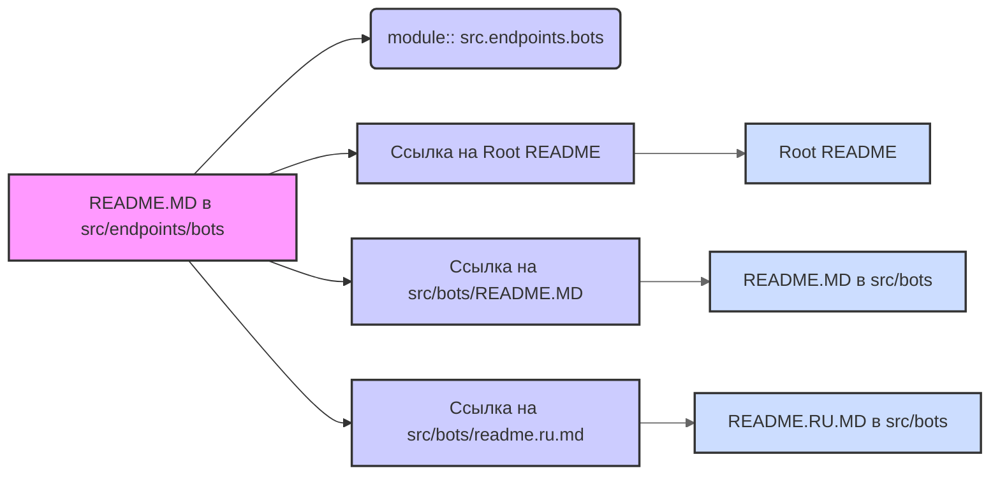

# Анализ кода `src/endpoints/bots/README.MD`

## <алгоритм>

Файл `README.MD` в каталоге `src/endpoints/bots` не содержит исполняемого кода. Это файл разметки Markdown, который предоставляет информацию о модуле `src.endpoints.bots`. 

**Пошаговая "блок-схема" (концептуальная для MD-файла):**

1.  **Начало**: Пользователь открывает файл `README.MD` в браузере или текстовом редакторе.
2.  **Раздел: `module:: src.endpoints.bots`**: Эта строка указывает, что данный README относится к модулю `src.endpoints.bots`. Это скорее метаинформация, чем выполняемый шаг.
3.  **Ссылка на корневой README:** `[Root ↑](https://github.com/hypo69/hypo/blob/master/REDAME.MD)`: Предоставляет ссылку на корневой файл README всего проекта. Это навигационный элемент.
4.  **Ссылка на родительский каталог src:** `[src](https://github.com/hypo69/hypo/blob/master/src/bots/REDAME.MD)`: Предоставляет ссылку на файл README в родительском каталоге `src`, что указывает на контекст в котором находится `src/endpoints/bots`.
5.  **Ссылка на русский README:** `[Русский](https://github.com/hypo69/hypo/blob/master/src/bots/readme.ru.md)`: Предоставляет ссылку на README в русском языке в каталоге `src/bots`. Возможно есть другая версия этого документа в родительском каталоге `src`.
6. **Завершение**: Пользователь просматривает информацию и может перейти по ссылкам для дальнейшего ознакомления.

## <mermaid>

**Анализ `mermaid` диаграммы:**

*   **`graph LR`**: Указывает, что это диаграмма направленного графа, отображаемая слева направо.
*   **`A[README.MD в src/endpoints/bots]`**: Представляет текущий файл `README.MD`, с которого начинается анализ.
*   **`B(module:: src.endpoints.bots)`**: Показывает метаданные (информация о модуле) в текущем файле.
*   **`C[Ссылка на Root README]`**: Показывает, что в текущем файле присутствует ссылка на корневой файл `README.MD` всего проекта.
*    **`D[Ссылка на src/bots/README.MD]`**: Показывает ссылку на родительский файл `README.MD`.
*   **`E[Ссылка на src/bots/readme.ru.md]`**: Показывает ссылку на родительский файл `README.RU.MD`.
*  **`F[Root README]`**: Показывает что ссылка с текущего файла ведет в корневой файл `README.MD`.
*   **`G[README.MD в src/bots]`**: Показывает что ссылка с текущего файла ведет в родительский файл `README.MD`.
*  **`H[README.RU.MD в src/bots]`**: Показывает что ссылка с текущего файла ведет в родительский файл `README.RU.MD`.
*   **Стили**:  Применяются стили для лучшей читаемости диаграммы.
*   **Связи**: Стрелки показывают связи между файлами и их контентом.

**Зависимости:**

Диаграмма показывает зависимость текущего файла от:
*   Информация о модуле `src.endpoints.bots`.
*   Корневого `README.MD` файла всего проекта (навигация вверх).
*   Родительского `README.MD` файла `src/bots` (контекст).
*   Русского `README.RU.MD` файла `src/bots`.

## <объяснение>

### Импорты

В этом файле нет импортов, так как это Markdown файл и он не содержит исполняемый код. Он служит для документации.

### Классы

В файле нет классов, так как это Markdown файл.

### Функции

В файле нет функций, так как это Markdown файл.

### Переменные

В файле нет переменных, так как это Markdown файл.

### Объяснение и детали

*   **`module:: src.endpoints.bots`**: Эта строка указывает, что данный README относится к модулю `src.endpoints.bots`. Это помогает организовать документацию и понимать, к какому разделу кода относится данный файл.
*   **Ссылки**: Ссылки предназначены для навигации по проекту. Они позволяют пользователю легко перемещаться между разными частями документации и понять общую структуру проекта.

### Потенциальные ошибки и области для улучшения

*   **Отсутствие подробного описания:** Файл не содержит подробного описания функциональности модуля `src.endpoints.bots`. В дальнейшем, если в этом каталоге появятся исполняемые файлы, здесь следует дать более подробное описание.
*   **Недостаток контекста:** Текущий README-файл предоставляет лишь ссылки и метаданные, не раскрывая сути модуля.
*   **Отсутствие структуры документации:** В данный момент файл просто содержит ссылки и информацию о модуле, но не содержит разделов, которые могут быть полезны для пользователей (например, описание API, примеры использования, etc).

### Цепочка взаимосвязей с другими частями проекта

1.  **Структура каталогов:** Файл находится в директории `src/endpoints/bots`, что указывает на его роль как часть API endpoints, связанные с ботами.
2.  **Корневой `README.MD`:** Ссылка на корневой `README.MD` обеспечивает контекст всего проекта и позволяет пользователю получить общее представление о его структуре.
3.  **Родительский `README.MD` и `README.RU.MD`:** Ссылка на `README.MD` и `README.RU.MD` в директории `src/bots` обеспечивает связь с другими модулями, связанными с ботами и предоставляет контекст на уровне подсистемы.

**В итоге:**
Файл `src/endpoints/bots/README.MD` является частью документации проекта и выполняет функцию навигации по проекту, предоставляя общую информацию о каталоге. В дальнейшем, этот файл нужно будет дополнить информацией о конкретном модуле, когда в нем появится исполняемый код.