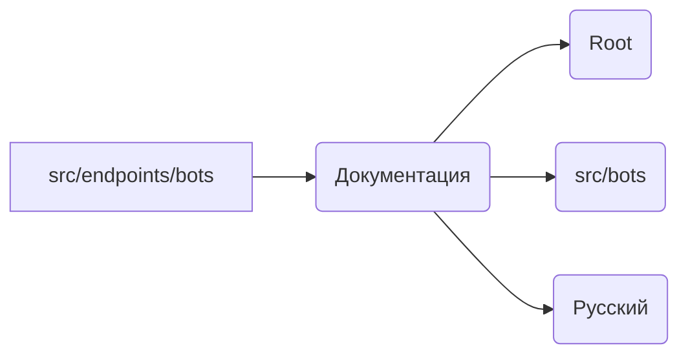

```MD
# Анализ кода из src/endpoints/bots/README.MD

## <input code>

```rst
.. module: src.endpoints.bots
```

```
[Root ↑](https://github.com/hypo69/hypo/blob/master/REDAME.MD)

[src](https://github.com/hypo69/hypo/blob/master/src/bots/REDAME.MD)

[Русский](https://github.com/hypo69/hypo/blob/master/src/bots/readme.ru.md)
```

## <algorithm>

К сожалению, предоставленный код — это не код, а документация (README). Он не содержит исполняемого кода, поэтому алгоритм работы не может быть описан.  Схема и примеры отсутствуют.

## <mermaid>



## <explanation>

Данный фрагмент кода не является кодом, а представляет собой текстовую документацию в формате reStructuredText (`.rst`).  Он задает контекст для модуля `src.endpoints.bots` в виде заголовков и ссылок на другие части проекта (README, `src/bots`, локализованную версию).

* **Импорты**: Нет импортов, так как это не код, а описание.
* **Классы**: Нет классов, так как это не код, а описание.
* **Функции**: Нет функций, так как это не код, а описание.
* **Переменные**: Нет переменных, так как это не код, а описание.

**Возможные ошибки или области для улучшений**:

Документация не содержит никакой конкретной информации о функциональности модуля `src.endpoints.bots`.  Она лишь указывает на то, где можно найти дополнительную информацию.  Для улучшения необходимо добавить описание функций, классов, атрибутов и других элементов модуля в формате, удобном для понимания.

**Взаимосвязь с другими частями проекта:**

Фрагмент указывает на взаимосвязь с файлами проекта, такими как `REDAME.MD` (корневой файл), `src/bots/REDAME.MD` и `src/bots/readme.ru.md`.  Это демонстрирует структурированный подход к документированию проекта, что является важным аспектом. В связке с полным кодом, документация помогала бы пользователям понять, какие зависимости имеются в данной части проекта.