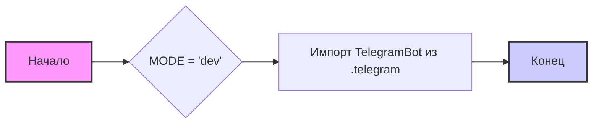

## Анализ кода `hypotez/src/endpoints/bots/__init__.py`

### <алгоритм>

1.  **Инициализация переменной `MODE`**: 
    *   Переменная `MODE` устанавливается в значение `'dev'`.
    *   _Пример:_ `MODE = 'dev'`
2.  **Импорт `TelegramBot`**:
    *   Импортируется класс `TelegramBot` из модуля `src.endpoints.bots.telegram`.
    *   _Пример:_ `from .telegram import TelegramBot`
3.  **Завершение**:
    *   Код заканчивается, инициируя модуль `src.endpoints.bots`.

### <mermaid>

**Описание диаграммы `mermaid`:**

*   `A`: **Начало** - обозначает начальную точку выполнения скрипта.
*   `B`: **`MODE = 'dev'`** - блок, представляющий присваивание строкового значения `'dev'` переменной `MODE`.
*   `C`: **Импорт `TelegramBot` из `.telegram`** - блок, представляющий импорт класса `TelegramBot` из модуля `telegram` в текущем пакете.
*   `D`: **Конец** - обозначает конечную точку выполнения скрипта.

**Анализ зависимостей в `mermaid`:**

1.  **`MODE`:** В данном случае это переменная, которая инициализируется строковым значением `'dev'`. Она не является зависимостью в смысле импорта, но ее значение может влиять на дальнейшее поведение программы.
2.  **`TelegramBot`:** Этот класс импортируется из модуля `telegram` и является зависимостью, так как данный модуль использует его функциональность. Если бы он не был импортирован, использование `TelegramBot` привело бы к ошибке.

### <объяснение>

#### Импорты:

*   `from .telegram import TelegramBot`:
    *   **Назначение**: Импортирует класс `TelegramBot` из модуля `telegram.py`, расположенного в той же директории (`.`) что и `__init__.py`.
    *   **Взаимосвязь с другими пакетами**: Этот импорт устанавливает связь между текущим пакетом (`src.endpoints.bots`) и модулем `telegram`, позволяя использовать класс `TelegramBot` для создания и управления ботами Telegram.

#### Переменные:

*   `MODE = 'dev'`:
    *   **Тип**: Строка.
    *   **Использование**: Переменная `MODE` предположительно используется для определения режима работы приложения (например, `dev` для разработки и `prod` для production). В данном случае установлено значение для режима разработки.

#### Общее:

*   **Роль модуля:**  `__init__.py` делает директорию `src.endpoints.bots` пакетом Python, что позволяет импортировать модули и классы из этой директории как `src.endpoints.bots.telegram`.
*   **Структура:** Файл является точкой входа в пакет `bots`, и его основная задача - сделать доступным функционал для создания телеграмм ботов, путем импортирования класса `TelegramBot`.
*   **Потенциальные улучшения:**
    *   В `MODE` может быть использована переменная окружения, для более гибкого изменения режима работы.
    *   Можно добавить импорт других ботов (если есть в наличии) или общих функций, используемых разными ботами.
* **Цепочка взаимосвязей:**
    1.  `hypotez/src/endpoints/bots` - это пакет, в котором находится данный `__init__.py` файл.
    2. `src.endpoints.bots.telegram` - содержит определение класса `TelegramBot`.
    3.  Другие модули или скрипты в проекте могут импортировать `TelegramBot` через `from src.endpoints.bots import TelegramBot` для создания и управления ботами.

**Заключение:**

Этот файл является отправной точкой пакета `bots`, определяя базовые настройки (переменная `MODE`) и предоставляя доступ к классам для работы с телеграмм ботами (класс `TelegramBot`). Он играет важную роль в модульной структуре проекта, позволяя использовать функциональность ботов в других частях приложения.