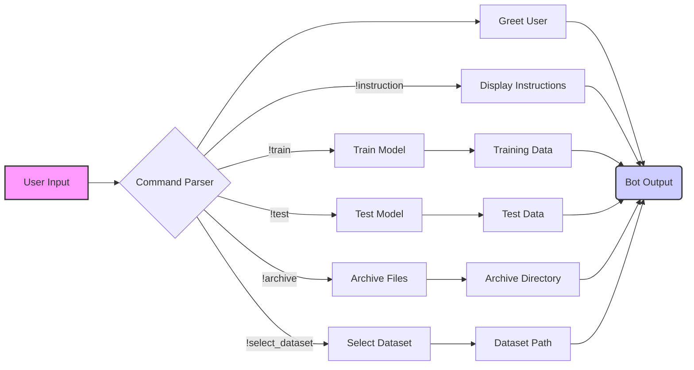

## Анализ кода: Инструкции для бота

### 1. <алгоритм>

Этот код представляет собой набор инструкций для бота, которые могут быть использованы для обучения, тестирования и управления данными. Каждая строка начинается с восклицательного знака (`!`), за которым следует команда и ее параметры. Вот пошаговое описание каждой команды:

1.  **`!hi`**:
    *   **Назначение:** Приветствие пользователя.
    *   **Пример:** Когда пользователь отправляет `!hi`, бот отвечает приветствием.
    *   **Поток данных:** Пользовательский ввод -> бот -> приветственное сообщение.

2.  **`!train <data> <data_dir> <positive> <attachment>`**:
    *   **Назначение:** Обучение модели с предоставленными данными.
    *   **Параметры:**
        *   `<data>`: Данные для обучения из файла.
        *   `<data_dir>`: Директория, содержащая обучающие данные.
        *   `<positive>`:  Указывает на то, что данные являются положительными примерами.
        *   `<attachment>`: Данные для обучения в виде прикрепленного файла.
    *   **Примеры:**
        *   `!train file.txt /path/to/data true`: Обучение с данными из `file.txt` и `true` как положительным примером.
        *   `!train data_dir=/path/to/data positive=true`: Обучение с данными из директории `/path/to/data` и `true` как положительным примером.
        *   `!train attachment=file.txt positive=true`: Обучение с данными из прикрепленного `file.txt` и `true` как положительным примером.
    *   **Поток данных:** Пользовательский ввод -> разбор параметров -> передача данных в модуль обучения модели.

3.  **`!test <test_data>`**:
    *   **Назначение:** Тестирование модели с предоставленными JSON-данными.
    *   **Параметры:**
        *   `<test_data>`: JSON-данные для тестирования.
    *   **Пример:** `!test {"input": "текст", "expected": "результат"}`
    *   **Поток данных:** Пользовательский ввод -> разбор JSON -> передача данных в модуль тестирования модели.

4.  **`!archive <directory>`**:
    *   **Назначение:** Архивация файлов в указанной директории.
    *   **Параметры:**
        *   `<directory>`: Директория для архивации.
    *   **Пример:** `!archive /path/to/files`
    *   **Поток данных:** Пользовательский ввод -> директория -> модуль архивации.

5.  **`!select_dataset <path_to_dir_positive> <positive>`**:
    *   **Назначение:** Выбор набора данных из указанной директории.
    *   **Параметры:**
        *   `<path_to_dir_positive>`: Путь к директории с положительными примерами.
        *   `<positive>`: Указывает, что это положительные примеры (например, `true` или `false`).
    *   **Пример:** `!select_dataset /path/to/positive_data true`
    *   **Поток данных:** Пользовательский ввод -> путь к директории -> модуль выбора набора данных.

6.  **`!instruction`**:
    *   **Назначение:** Отображение инструкций.
    *   **Пример:** Когда пользователь отправляет `!instruction`, бот отображает этот документ.
    *   **Поток данных:** Пользовательский ввод -> бот -> вывод инструкций.

### 2. <mermaid>

**Анализ зависимостей:**

Диаграмма `mermaid` описывает поток данных и взаимодействие между компонентами бота. Вот как следует понимать узлы и связи:

*   **User Input**: Начальная точка, где пользователь вводит команду.
*   **Command Parser**: Разбирает введенную команду и определяет ее тип и параметры.
*   **Greet User**: Обрабатывает команду `!hi` и отправляет приветственное сообщение.
*   **Train Model**: Обрабатывает команду `!train`, передает данные в модуль обучения.
*   **Test Model**: Обрабатывает команду `!test`, передает данные в модуль тестирования.
*   **Archive Files**: Обрабатывает команду `!archive`, запускает архивирование файлов.
*   **Select Dataset**: Обрабатывает команду `!select_dataset`, выбирает набор данных для обучения.
*   **Display Instructions**: Обрабатывает команду `!instruction`, выводит инструкцию.
*   **Training Data**, **Test Data**, **Archive Directory**, **Dataset Path**:  представляют собой данные, которые передаются соответствующим модулям.
*   **Bot Output**: Финальная точка, где бот выводит результат обработки команды.

### 3. <объяснение>

**Импорты:**

В предоставленном коде нет явных импортов, поскольку это просто набор инструкций, а не код, который можно запустить. Однако в реальной реализации бот должен был бы импортировать необходимые модули для:

*   **Разбора команд**: Например, модули для разбора текста и выделения команд и параметров.
*   **Обучения модели**: Библиотеки машинного обучения (например, TensorFlow, PyTorch).
*   **Тестирования модели**: Инструменты для оценки качества модели.
*   **Архивации файлов**: Библиотеки для создания архивов (например, `zipfile` в Python).
*   **Работы с файловой системой**: Модули для доступа к файлам и директориям (`os`, `pathlib`).
*   **Обработки JSON**: Библиотеки для работы с JSON данными.

**Классы:**

В данном коде классов не определено. Однако для реализации логики бота могли бы использоваться следующие классы:

*   **`Bot`**: Основной класс, который управляет обработкой команд и взаимодействием с пользователем.
    *   **Атрибуты**:
        *   `model`: Объект обученной модели.
        *   `data_manager`: Объект для управления данными.
    *   **Методы**:
        *   `process_command(command)`: Разбирает и выполняет команду.
        *   `train(data, data_dir, positive, attachment)`: Инициирует процесс обучения модели.
        *   `test(test_data)`: Проводит тестирование модели.
        *   `archive(directory)`: Архивация файлов.
        *   `select_dataset(path_to_dir_positive, positive)`: Выбирает набор данных.
        *   `display_instruction()`: Выводит инструкцию.
*   **`Model`**: Класс, представляющий модель машинного обучения.
    *   **Атрибуты**:
        *   `trained_model`:  Объект, представляющий обученную модель.
    *   **Методы**:
        *   `train(data)`: Обучение модели на данных.
        *   `test(test_data)`: Оценка производительности модели.
        *   `predict(input_data)`: Прогнозирование на основе входных данных.
*   **`DataManager`**: Класс для управления наборами данных.
    *   **Атрибуты**:
        *   `datasets`: Словарь, хранящий пути к наборам данных.
    *   **Методы**:
        *   `select_dataset(path, positive)`:  Выбор набора данных.
        *   `load_data(path)`: Загрузка данных из указанного пути.
*   **`CommandParser`**: Класс для разбора команд.
    *   **Методы**:
        *   `parse(command)`: Разбирает команду на действие и аргументы.

**Функции:**

Функций в представленном коде нет. Однако в реальной реализации могли бы существовать следующие функции:

*   **`process_command(command)`**: Функция для обработки команд.
    *   **Аргументы**:
        *   `command`: Строка с введенной командой.
    *   **Возвращаемое значение**: Ответ бота в виде строки.
    *   **Назначение**: Разбирает команду и вызывает соответствующий метод класса `Bot`.
    *   **Пример**: Вызывает `bot.train(data, data_dir, positive, attachment)`, если команда `!train`.
*  **`greet_user()`**: Функция для приветствия пользователя.
    *   **Возвращаемое значение**: Строка с приветствием.
    *   **Назначение**: Отправка приветственного сообщения.
    *   **Пример**: `return "Приветствую!"`
*   **`archive_files(directory)`**: Функция для архивации файлов.
    *   **Аргументы**:
        *   `directory`: Путь к директории, которую необходимо архивировать.
    *   **Возвращаемое значение**: Сообщение об успехе или ошибке архивации.
    *   **Назначение**: Архивация файлов из указанной директории.
    *   **Пример**: Использование `zipfile` в Python.

**Переменные:**

В данном коде переменные явно не используются, так как это инструкция, а не программа. В реальной реализации будут использоваться следующие переменные:

*   `command`: Строка, содержащая введенную пользователем команду.
*   `data`, `data_dir`, `positive`, `attachment`: Переменные, хранящие данные и параметры для обучения.
*   `test_data`: Переменная, хранящая данные для тестирования модели в формате JSON.
*   `directory`: Путь к директории для архивации.
*  `path_to_dir_positive`, `positive`: Переменные для выбора набора данных.

**Потенциальные ошибки и области для улучшения:**

*   **Отсутствие обработки ошибок:** Не определена логика обработки некорректных команд, неверных параметров или ошибок во время обучения/тестирования.
*   **Отсутствие валидации:** Нет проверки входных данных (например, существование файлов или директорий).
*   **Безопасность:** Не учтены вопросы безопасности (например, возможность выполнения вредоносных операций через команды).
*  **Модульность**: Код можно сделать более модульным, разделив логику на отдельные классы и функции.
*  **Расширяемость**: Код должен быть спроектирован так, чтобы в будущем можно было легко добавлять новые команды и функциональность.

**Взаимосвязи с другими частями проекта:**

Данный код является частью системы управления ботом. В зависимости от конкретной реализации, он может взаимодействовать с:

*   **Модулями машинного обучения**: Для обучения и тестирования моделей.
*   **Модулями управления данными**: Для загрузки и хранения данных.
*   **Интерфейсом пользователя**: Для получения команд и отправки ответов.
*   **Системой логирования**: Для записи действий и ошибок.
*   **Системой безопасности**: Для защиты от несанкционированного доступа и выполнения вредоносных операций.