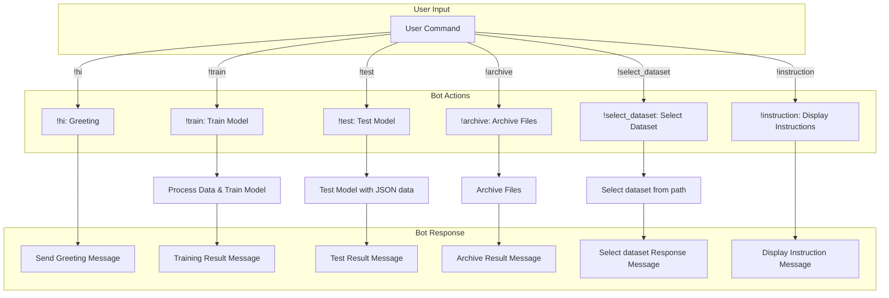

## ИНСТРУКЦИЯ:

Анализируй предоставленный код подробно и объясни его функциональность. Ответ должен включать три раздела:  

1. **<алгоритм>**: Опиши рабочий процесс в виде пошаговой блок-схемы, включая примеры для каждого логического блока, и проиллюстрируй поток данных между функциями, классами или методами.  
2. **<mermaid>**: Напиши код для диаграммы в формате `mermaid`, проанализируй и объясни все зависимости, 
    которые импортируются при создании диаграммы. 
    **ВАЖНО!** Убедитесь, что все имена переменных, используемые в диаграмме `mermaid`, 
    имеют осмысленные и описательные имена. Имена переменных вроде `A`, `B`, `C`, и т.д., не допускаются!  
    
    **Дополнительно**: Если в коде есть импорт `import header`, добавьте блок `mermaid` flowchart, объясняющий `header.py`:\
    ```mermaid
    flowchart TD
        Start --> Header[<code>header.py</code><br> Determine Project Root]
    
        Header --> import[Import Global Settings: <br><code>from src import gs</code>] 
    ```

3. **<объяснение>**: Предоставьте подробные объяснения:  
   - **Импорты**: Их назначение и взаимосвязь с другими пакетами `src.`.  
   - **Классы**: Их роль, атрибуты, методы и взаимодействие с другими компонентами проекта.  
   - **Функции**: Их аргументы, возвращаемые значения, назначение и примеры.  
   - **Переменные**: Их типы и использование.  
   - Выделите потенциальные ошибки или области для улучшения.  

Дополнительно, постройте цепочку взаимосвязей с другими частями проекта (если применимо).  

Это обеспечивает всесторонний и структурированный анализ кода.
## Формат ответа: `.md` (markdown)
**КОНЕЦ ИНСТРУКЦИИ**

### <алгоритм>

Этот код представляет собой набор команд для управления ботом, вероятно, на основе модели машинного обучения.  Вот пошаговый разбор:

1.  **`!hi`**:
    *   **Пример:** Пользователь отправляет сообщение `!hi`.
    *   **Действие:** Бот отвечает приветствием.
    *   **Поток данных:** Ввод: `!hi` -> Вывод: "Приветствие"

2.  **`!train <data> <data_dir> <positive> <attachment>`**:
    *   **Пример 1:** `!train my_data.json ./data true` (используется файл данных)
    *   **Пример 2:** `!train ./my_data_dir ./data_output false` (используется директория данных)
    *   **Пример 3:** `!train attachment_id ./data true` (используется вложение файла)
    *   **Действие:** Бот обучается на предоставленных данных. Данные могут быть файлом, директорией или вложением. `positive` определяет, является ли набор данных позитивным.
    *   **Поток данных:** Ввод: `!train <data> <data_dir> <positive> <attachment>` -> обработка данных, обучение модели -> Вывод: сообщения об успешном/неуспешном обучении.

3.  **`!test <test_data>`**:
    *   **Пример:** `!test test_data.json`
    *   **Действие:** Бот тестирует модель на предоставленных тестовых данных в формате JSON.
    *   **Поток данных:** Ввод: `!test <test_data>` -> тестирование модели -> Вывод: результаты тестирования.

4.  **`!archive <directory>`**:
    *   **Пример:** `!archive ./archive_dir`
    *   **Действие:** Бот архивирует файлы, находящиеся в указанной директории.
    *   **Поток данных:** Ввод: `!archive <directory>` -> архивирование файлов -> Вывод: сообщения об успехе/неудаче архивирования.

5.  **`!select_dataset <path_to_dir_positive> <positive>`**:
    *   **Пример:** `!select_dataset ./positive_data true`
    *   **Действие:** Бот выбирает датасет для обучения из указанной директории, используя `positive` для определения, является ли он позитивным.
    *   **Поток данных:** Ввод: `!select_dataset <path_to_dir_positive> <positive>` -> выбор датасета -> Вывод: сообщения об успехе/неудаче выбора датасета.

6.  **`!instruction`**:
    *   **Пример:** Пользователь отправляет `!instruction`.
    *   **Действие:** Бот отображает инструкцию о доступных командах.
    *   **Поток данных:** Ввод: `!instruction` -> Вывод: инструкция.

### <mermaid>



**Объяснение `mermaid`:**

*   **`flowchart TD`**: Объявляет тип диаграммы - блок-схему (flowchart) с направлением сверху вниз (TD).
*   **`User Input`**: Обозначает ввод пользователя.
    *   **`UserInput[User Command]`**:  Представляет произвольную команду пользователя.
*   **`Bot Actions`**: Обозначает действия, выполняемые ботом.
    *   **`hiCommand[!hi: Greeting]`**: Команда `!hi` для приветствия.
    *   **`trainCommand[!train: Train Model]`**: Команда `!train` для обучения модели.
    *   **`testCommand[!test: Test Model]`**: Команда `!test` для тестирования модели.
    *   **`archiveCommand[!archive: Archive Files]`**: Команда `!archive` для архивирования файлов.
    *   **`selectDatasetCommand[!select_dataset: Select Dataset]`**: Команда `!select_dataset` для выбора датасета.
    *   **`instructionCommand[!instruction: Display Instructions]`**: Команда `!instruction` для отображения инструкции.
*   **Стрелки `-->`**: Показывают поток управления (ввод/вывод).
*   **`Bot Response`**: Обозначает ответы бота.
    *   **`hiResponse[Send Greeting Message]`**: Ответ на команду `!hi` - приветственное сообщение.
    *   **`trainResponse[Training Result Message]`**: Ответ на команду `!train` - сообщение о результате обучения.
    *   **`testResponse[Test Result Message]`**: Ответ на команду `!test` - сообщение с результатами тестирования.
    *    **`archiveResponse[Archive Result Message]`**: Ответ на команду `!archive` - сообщение о результатах архивирования.
     *   **`selectDatasetResponse[Select dataset Response Message]`**: Ответ на команду `!select_dataset` - сообщение о результате выбора датасета.
    *    **`instructionResponse[Display Instruction Message]`**: Ответ на команду `!instruction` - инструкция.
*   **`trainModel`, `testModel`, `archiveFiles`, `selectDataset`**: Внутренние процессы, выполняемые ботом.

### <объяснение>

**Общее назначение:**
Этот код определяет набор команд, которые позволяют пользователю взаимодействовать с ботом. Эти команды обеспечивают функциональность обучения, тестирования и архивирования данных, а также выбора датасета для обучения. Код представляет собой интерфейс командной строки для управления основными операциями бота.

**Разбор команд:**

*   **`!hi`**:
    *   **Назначение:** Простая команда для приветствия пользователя. Используется для проверки работоспособности бота.
    *   **Пример:** Бот может ответить: "Здравствуйте! Рад вас видеть."
    *   **Связь:** Не требует импорта и является самостоятельной командой.
*   **`!train <data> <data_dir> <positive> <attachment>`**:
    *   **Назначение:** Команда для обучения модели.  Позволяет использовать файл, директорию с данными или вложение.
    *   **Аргументы:**
        *   `<data>`: Путь к файлу с данными, если используется файл.
        *   `<data_dir>`: Путь к директории с данными, если используется директория.
        *   `<positive>`: Логическое значение (например, `true`/`false` или `1`/`0`) определяющее, является ли набор данных позитивным.
        *   `<attachment>`: Идентификатор вложения файла.
    *   **Примеры:**
        *   `!train data.json ./dataset true`: Обучение на основе данных из файла `data.json` в директории `dataset` (с позитивной маркировкой).
        *  `!train ./my_data_dir ./data_output false`: Обучение из директории `my_data_dir`.
        * `!train attachment_123 ./data_output true`: Обучение из вложения `attachment_123`.
    *   **Связь:** Эта команда предполагает взаимодействие с кодом, который обрабатывает ввод данных и запускает процесс обучения.
*   **`!test <test_data>`**:
    *   **Назначение:** Команда для тестирования модели на предоставленных тестовых данных в формате JSON.
    *   **Аргументы:**
        *   `<test_data>`: Путь к файлу с тестовыми данными в формате JSON.
    *   **Пример:** `!test test_set.json`
    *   **Связь:**  Эта команда вызывает код, выполняющий тестирование модели.
*   **`!archive <directory>`**:
    *   **Назначение:** Команда для архивирования файлов из указанной директории.
    *   **Аргументы:**
        *   `<directory>`: Путь к директории для архивирования.
    *   **Пример:** `!archive ./data_dir`
    *   **Связь:**  Вызывает код, который выполняет архивацию.
*   **`!select_dataset <path_to_dir_positive> <positive>`**:
    *   **Назначение:** Команда для выбора датасета для обучения. Позволяет указать путь к директории и является ли датасет позитивным.
    *   **Аргументы:**
        *   `<path_to_dir_positive>`: Путь к директории с датасетом.
        *   `<positive>`: Логическое значение, указывающее, является ли датасет позитивным.
    *   **Пример:** `!select_dataset ./positive_set true`
    *   **Связь:** Эта команда влияет на данные, используемые в последующих командах обучения `!train`.
*   **`!instruction`**:
    *   **Назначение:** Команда для вывода инструкций по доступным командам.
    *   **Пример:** Пользователь видит список доступных команд и их описание.
    *   **Связь:** Не требует импорта и является самодостаточной командой для справки.

**Потенциальные ошибки и области для улучшения:**

1.  **Отсутствие обработки ошибок:** Код не предусматривает обработку ошибок, возникающих при работе с файлами, директориями или моделью.  Необходимы проверки на существование файлов, корректность данных и т.д.
2.  **Безопасность:** Обработка путей и имен файлов должна быть безопасной, чтобы предотвратить уязвимости.
3.  **Отсутствие валидации ввода:** Необходима валидация аргументов команд, чтобы избежать ошибок из-за неверных типов или форматов данных.
4.  **Конкретная реализация**: Описание не содержит конкретной реализации функций, это лишь набор инструкций для бота. В реальном приложении нужно имплементировать каждую из этих команд в соответствующие функции.
5.  **Улучшение сообщений:** Сообщения об ошибках и успехе могли бы быть более подробными и полезными для пользователя.
6.  **Логирование**: Необходима система логирования для отслеживания действий бота и ошибок.

**Связь с другими частями проекта:**
Этот код, вероятно, используется в качестве интерфейса для бота, а его функциональность, вероятно, связана с другими частями проекта, отвечающими за:

*   **Обработку и чтение данных:** (Загрузка из файла, парсинг JSON)
*   **Обучение модели:** (Реализация алгоритмов машинного обучения)
*   **Тестирование модели:** (Метрики оценки)
*   **Архивирование:** (Работа с файловой системой, zip архивы)
*   **Управление датасетами:** (Выбор, подготовка данных).

Этот код является основой для командного интерфейса бота, и его полная функциональность зависит от реализации остальной части проекта.