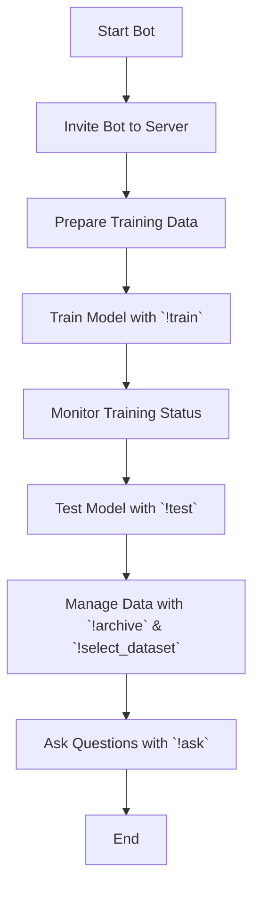

## Анализ кода

### <алгоритм>

1. **Запуск бота:**
   - **Описание:** Убедитесь, что бот запущен и успешно подключен к Discord.
   - **Пример:** В консоли должно быть сообщение "Logged in as YourBotName#1234".
   - **Поток данных:** Запуск скрипта бота → Подключение к Discord API.

2. **Приглашение бота на сервер:**
   - **Описание:** Убедитесь, что бот добавлен на сервер Discord и имеет необходимые права (чтение и отправка сообщений).
   - **Пример:** Бот виден в списке пользователей сервера.
   - **Поток данных:** Пользователь добавляет бота на сервер Discord.

3. **Подготовка обучающих данных:**
   - **Описание:** Подготовка данных для обучения модели в виде текста или файла.
   - **Пример:**
     - Текстовые данные: "Это пример обучающего текста".
     - Файл: `training_data.txt` с текстом.
   - **Поток данных:** Пользователь подготавливает данные → Данные сохраняются в переменную или файл.

4. **Команда обучения (`!train`):**
   - **Описание:** Запуск процесса обучения модели.
   - **Примеры:**
     - `!train "Sample training data" positive=True` (обучение с текстом).
     - Прикрепление файла + `!train positive=True` (обучение с файлом).
   - **Поток данных:** Команда `!train` → Получение данных (текст или файл) → Отправка на обучение модели → Вывод статуса обучения.

5. **Мониторинг обучения:**
   - **Описание:** Отслеживание статуса процесса обучения.
   - **Пример:** Бот отвечает: "Model training started. Job ID: <job_id>".
   - **Поток данных:** Модель обучается → Бот отслеживает прогресс → Вывод статуса пользователю.

6. **Проверка статуса обучения:**
   - **Описание:** (Дополнительный шаг) Проверка текущего статуса обучения по ID.
   - **Пример:** (Необходимо добавить команду)
   - **Поток данных:** Запрос статуса →  Проверка статуса обучения по ID → Вывод статуса пользователю.

7. **Тестирование модели (`!test`):**
   - **Описание:** Проверка обученной модели на тестовых данных.
   - **Пример:** `!test {"input": "Test input data"}`
   - **Поток данных:** Команда `!test` → Получение тестовых данных JSON → Отправка на модель → Получение предсказаний → Вывод предсказаний пользователю.

8. **Дополнительные команды:**
   - **Архивирование файлов (`!archive`):** Архивирование директории.
     - **Пример:** `!archive /path/to/directory`
   - **Выбор набора данных (`!select_dataset`):** Выбор директории с данными.
     - **Пример:** `!select_dataset /path/to/positive_data positive=True`
   - **Поток данных:** Команда `!archive` или `!select_dataset` → Выполнение действия → Подтверждение пользователю.

9. **Команда вопросов и ответов (`!ask`):**
   - **Описание:** Отправка запроса модели и получение ответа.
   - **Пример:** `!ask What is the capital of France?`
   - **Поток данных:** Команда `!ask` → Отправка запроса модели → Получение ответа → Вывод ответа пользователю.

### <mermaid>

**Анализ зависимостей:**

- **`Start Bot`**: Начало работы бота, включает подключение к Discord API.
- **`Invite Bot to Server`**: Обеспечивает доступ бота к серверу, где он будет работать.
- **`Prepare Training Data`**: Подготовка данных для обучения модели, может быть текстовой или файловой.
- **`Train Model with !train`**: Запускает обучение модели с помощью команды `!train`, принимает текстовые или файловые данные.
- **`Monitor Training Status`**: Отслеживает процесс обучения модели и выводит статус.
- **`Test Model with !test`**: Проверяет обученную модель с тестовыми данными с помощью команды `!test`, принимает JSON.
- **`Manage Data with !archive & !select_dataset`**: Управляет данными с помощью команд `!archive` и `!select_dataset`, позволяя архивировать и выбирать наборы данных.
- **`Ask Questions with !ask`**: Использует обученную модель для ответов на вопросы, инициированные командой `!ask`.
- **`End`**: Окончание процесса использования бота.

### <объяснение>

**Общее:**

Этот документ представляет собой пошаговую инструкцию по использованию Discord-бота для обучения и тестирования модели машинного обучения, а также для взаимодействия с ней через команды. Бот позволяет обучать модель на текстовых данных или файлах, тестировать её на JSON, архивировать данные и выбирать наборы данных для обучения.

**Разбор по шагам:**

1. **Запуск бота и приглашение на сервер:**
    - Бот должен быть запущен и добавлен на сервер Discord для взаимодействия с ним.
2.  **Подготовка обучающих данных:**
    - Обучающие данные могут быть представлены как текст или файл. Это важный шаг, так как качество данных напрямую влияет на качество модели.
3.  **Обучение модели (`!train`):**
    - Команда `!train` с текстом или файлом запускает процесс обучения модели.
    - `positive=True` - это аргумент, который может влиять на метку или тип обучения.
    - Бот отслеживает и сообщает статус обучения.
4.  **Тестирование модели (`!test`):**
    - Команда `!test` с JSON-данными запускает тестирование модели.
    - Результаты предсказания выводятся пользователю.
5.  **Управление данными:**
    - Команда `!archive` для архивирования файлов/директорий.
    - Команда `!select_dataset` для выбора набора данных для обучения.
6. **Команда вопросов и ответов (`!ask`):**
   - Команда `!ask` позволяет пользователю отправлять вопросы модели и получать ответы.

**Переменные и их типы:**

- `training_data`: Текстовая строка или путь к файлу (строка).
- `job_id`: Идентификатор задачи обучения (строка или число).
- `test_data`: JSON-строка для тестирования модели.
- `directory_path`: Путь к директории (строка).
- `path_to_dir_positive`: Путь к директории положительных данных (строка).

**Потенциальные ошибки и области для улучшения:**

1. **Обработка ошибок**: В данном документе не описано, как бот обрабатывает ошибки при обучении или тестировании модели. Необходимо добавить обработку ошибок и уведомления об этом пользователю.
2. **Проверка формата данных:** Нужно проверять формат данных перед обучением и тестированием (например, наличие JSON).
3. **Асинхронность**: Процессы обучения и тестирования могут быть длительными.  Следует использовать асинхронные операции, чтобы бот не блокировался во время ожидания завершения этих операций.
4. **Мониторинг статуса обучения**: Можно добавить больше информации о процессе обучения (например, процент завершения, метрики качества).
5. **Безопасность:** Необходимо предусмотреть меры безопасности при загрузке и использовании файлов.

**Цепочка взаимосвязей с другими частями проекта (предположение):**

- Вероятно, в проекте есть класс `Model` (где реализована логика обучения, тестирования и ответов на вопросы), с которым бот взаимодействует для обучения и получения ответов.
- Есть логика обработки и парсинга команд Discord, для определения, какую команду вызвал пользователь (`!train`, `!test`, `!archive`, `!select_dataset`, `!ask`).
- Используется Discord API для отправки сообщений и получения данных от пользователей.
- Есть логика работы с файловой системой для загрузки, сохранения и архивирования данных.