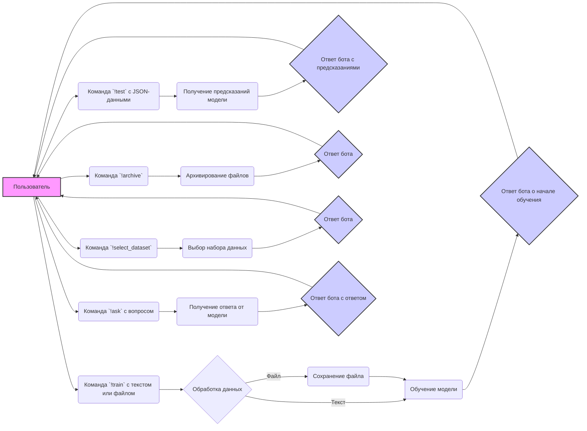
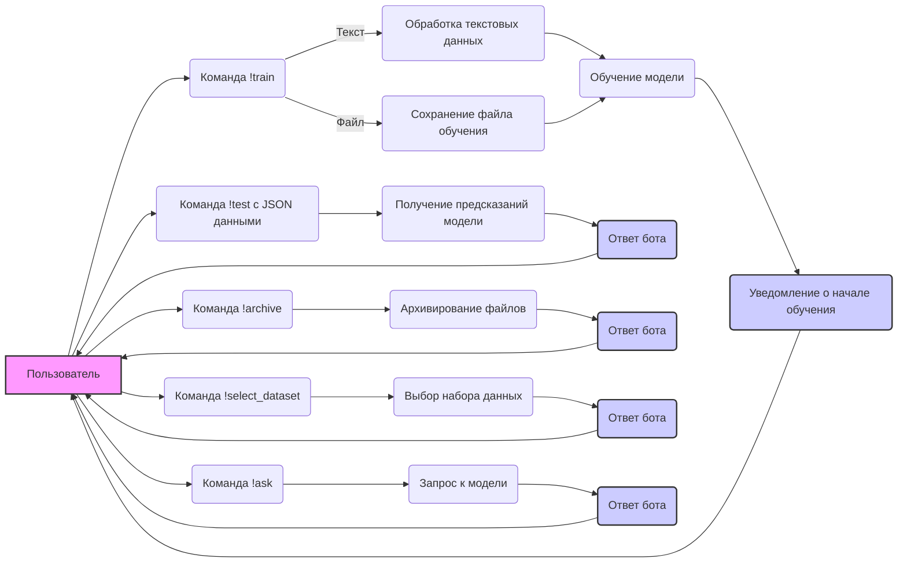

## Анализ кода: discord_bot_trainer.md

### 1. <алгоритм>

**Общий рабочий процесс:**

1.  **Запуск бота:** Убедитесь, что бот запущен и готов к работе.
    *   _Пример_: В консоли отображается сообщение `Logged in as YourBotName#1234`.
2.  **Приглашение бота на сервер:** Убедитесь, что бот приглашен на ваш Discord-сервер и имеет необходимые разрешения.
3.  **Подготовка данных для обучения:**
    *   **Текстовые данные:** Подготовьте строку с текстовыми данными для обучения модели.
        *   _Пример_: `"Sample training data"`
    *   **Файл с данными:** Подготовьте файл с данными для обучения.
        *   _Пример_: Файл `training_data.txt` на локальном компьютере.
4.  **Использование команды обучения (`!train`):**
    *   **Обучение с текстом:** Отправьте команду с текстом.
        *   _Пример_: `!train "Sample training data" positive=True`
    *   **Обучение из файла:** Отправьте команду с прикрепленным файлом.
        *   _Пример_: `!train positive=True` (с прикрепленным файлом `training_data.txt`)
5.  **Мониторинг обучения:** Бот должен ответить сообщением о начале обучения.
    *   _Пример_: `Model training started. Job ID: <job_id>`
6.  **Проверка статуса обучения (опционально):** Можно добавить команду для запроса статуса обучения.
7.  **Тестирование модели (`!test`):** Отправьте команду с JSON-строкой тестовых данных.
    *   _Пример_: `!test {"input": "Test input data"}`
8.  **Дополнительные команды:**
    *   **Архивирование файлов (`!archive`):**
        *   _Пример_: `!archive /path/to/directory`
    *   **Выбор набора данных (`!select_dataset`):**
        *   _Пример_: `!select_dataset /path/to/positive_data positive=True`
9.  **Q&A команда (`!ask`):**
    *   **Задать вопрос:**
        *   _Пример_: `!ask What is the capital of France?`
    *   **Получить ответ:** Бот должен ответить, используя обученную модель.
        *   _Пример_: `Model response: The capital of France is Paris.`

**Поток данных:**

### 2. <mermaid>

**Анализ зависимостей:**

Диаграмма `mermaid` описывает взаимодействие пользователя с ботом и внутренние процессы бота. 

*   **User (Пользователь)**: Инициирует команды и получает ответы от бота.
*   **Команды (`!train`, `!test`, `!archive`, `!select_dataset`, `!ask`)**:  Взаимодействия, инициированные пользователем.
*   **Обработка данных (`ProcessTextData`, `SaveTrainingFile`, `SelectDataset`):**  Подготовка данных для обучения, сохранения или выбора данных.
*   **Обучение модели (`TrainModel`):** Процесс обучения модели на предоставленных данных.
*   **Моделирование (`ModelPrediction`, `QueryModel`):** Запрос предсказаний модели на тестовых данных или в ответ на вопросы.
*   **Ответы бота (`TrainingStarted`, `BotResponse`, `ArchiveResponse`, `SelectDatasetResponse`, `AskResponse`):** Ответные сообщения бота для пользователя.

**Используемые переменные:**

*   `User`: Представляет пользователя, взаимодействующего с ботом.
*   `TrainCommand`:  Команда для обучения модели.
*   `ProcessTextData`: Функция обработки текстовых данных для обучения.
*   `SaveTrainingFile`: Функция сохранения файла с данными для обучения.
*   `TrainModel`: Функция или процесс обучения модели.
*   `TrainingStarted`: Уведомление бота о начале обучения.
*    `TestCommand`: Команда для тестирования модели.
*   `ModelPrediction`: Функция получения предсказаний модели.
*   `BotResponse`: Ответ бота с предсказаниями.
*    `ArchiveCommand`: Команда для архивирования файлов.
*   `ArchiveFiles`: Функция архивирования файлов.
*   `ArchiveResponse`: Ответ бота после архивирования.
*    `SelectDatasetCommand`: Команда для выбора набора данных.
*   `SelectDataset`: Функция выбора набора данных.
*   `SelectDatasetResponse`: Ответ бота после выбора набора данных.
    * `AskCommand`: Команда для запроса ответа от модели
    * `QueryModel`: Функция запроса модели
    * `AskResponse`: Ответ бота с ответом модели

Все переменные имеют осмысленные имена, что упрощает понимание диаграммы и потока данных.

### 3. <объяснение>

**Импорты:**

В предоставленном коде нет импортов, поскольку это описание работы бота, а не фактический код на Python/NodeJS. Однако в реальном коде бота, вероятно, будут импорты:

*   `discord.py` (для Python) или `discord.js` (для Node.js): Для взаимодействия с API Discord.
*   `json`: Для работы с JSON-данными.
*   `os`, `path`: Для работы с файловой системой.
*   Модуль для работы с моделью машинного обучения (например, `transformers` для Python, если используется Hugging Face Transformers).

**Классы:**

В описании не приводятся конкретные классы, но можно предположить, что есть как минимум один класс:

*   `Model`: Этот класс отвечает за обучение, тестирование и использование модели. Скорее всего, он будет иметь методы:
    *   `train(data, is_positive)`:  Обучение модели на основе предоставленных данных.
    *   `test(data)`: Тестирование модели и возврат предсказаний.
    *   `predict(data)`:  Получение предсказания для данных.
    *   `ask(question)`:  Получение ответа от модели на вопрос.
    *   `load_model(path)`: Загрузка обученной модели.
    *  `save_model(path)`: Сохранение обученной модели.

**Функции:**

В описании не приводятся конкретные функции, но они подразумеваются в процессе обработки команд:

*   `handle_train_command(message, model)`:
    *   **Аргументы:** `message` (сообщение Discord), `model` (экземпляр класса `Model`).
    *   **Возвращаемое значение:** None.
    *   **Назначение:** Обрабатывает команду `!train`, получает данные (текст или файл), запускает обучение модели, отправляет ответное сообщение.
    *   **Пример:** Получает сообщение `!train "Sample training data" positive=True` или `!train positive=True` с прикрепленным файлом.
*   `handle_test_command(message, model)`:
    *   **Аргументы:** `message`, `model`.
    *   **Возвращаемое значение:** None.
    *   **Назначение:** Обрабатывает команду `!test`, получает JSON-данные, тестирует модель, отправляет ответ с предсказаниями.
    *   **Пример:** Получает сообщение `!test {"input": "Test input data"}`.
*   `handle_archive_command(message)`:
    *  **Аргументы:** `message`.
    *  **Возвращаемое значение:** None.
    *  **Назначение:** Обрабатывает команду `!archive`, получает путь к директории, архивирует файлы, отправляет ответ.
    *   **Пример:** Получает сообщение `!archive /path/to/directory`.
*    `handle_select_dataset_command(message)`:
     *   **Аргументы:** `message`.
     *   **Возвращаемое значение:** None.
     *   **Назначение:** Обрабатывает команду `!select_dataset`, получает путь к директории и флаг `positive`,  выбирает набор данных, отправляет ответ.
     *   **Пример:** Получает сообщение `!select_dataset /path/to/positive_data positive=True`.
* `handle_ask_command(message, model)`:
    *   **Аргументы:** `message`, `model`.
    *   **Возвращаемое значение:** None.
    *   **Назначение:** Обрабатывает команду `!ask`, получает вопрос от пользователя, запрашивает у модели ответ, отправляет ответное сообщение.
    *   **Пример:** Получает сообщение `!ask What is the capital of France?`

**Переменные:**

*   `bot`: Объект бота Discord (экземпляр класса `discord.Client` или аналогичного).
*   `model`: Экземпляр класса `Model`.
*   `job_id`: Идентификатор задания на обучение модели.
*  `data`: Данные для обучения, тестирования или запроса от модели.
* `is_positive`:  Флаг для указания типа данных в `!train` и `!select_dataset`.

**Потенциальные ошибки и улучшения:**

*   **Обработка ошибок:** Не хватает обработки ошибок (например, если файл не найден или JSON-данные невалидны).
*   **Асинхронность:** Операции обучения модели могут быть длительными, поэтому необходима асинхронная обработка, чтобы бот не зависал.
*   **Валидация данных:** Нужна валидация данных, приходящих от пользователя (например, проверка, что JSON-строка является валидной).
*   **Логирование:** Необходимо логирование для отслеживания работы бота и диагностики ошибок.
*   **Безопасность:** При работе с файлами необходимо убедиться в безопасности их обработки.

**Взаимосвязи с другими частями проекта:**

*   **Модуль работы с моделью**:  Бот использует модуль, который предоставляет методы для обучения, тестирования и использования модели (например, `transformers`).
*   **Конфигурация**: Настройки бота (токен Discord, пути к файлам) могут быть вынесены в отдельный конфигурационный файл.
*  **Сохранение данных**: Бот должен иметь доступ к системе хранения, куда сохраняет обученные модели и файлы с данными.

Этот подробный анализ позволяет лучше понять, как работает бот и какие части проекта он затрагивает.