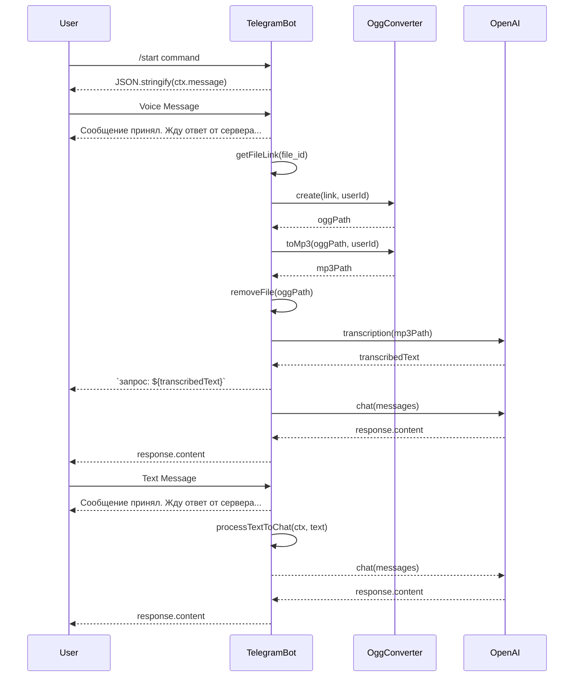

## Анализ кода `src/endpoints/bots/chat_gpt_nodejs/chatgpt-telegram/src/main.js`

### <алгоритм>

1.  **Инициализация бота:**
    *   Создается экземпляр `Telegraf` с использованием токена, полученного из конфигурации.
    *   Пример: `const bot = new Telegraf(config.get('TELEGRAM_TOKEN'))`
2.  **Обработка команды `/start`:**
    *   Бот ожидает команду `/start`.
    *   Когда команда получена, бот отправляет JSON-представление объекта `ctx.message` в ответ пользователю.
    *   Пример: Пользователь отправляет `/start`, бот отвечает: `{"message_id":123,"from":{"id":1111111111,"is_bot":false,"first_name":"Имя","username":"username","language_code":"ru"},"chat":{"id":1111111111,"first_name":"Имя","username":"username","type":"private"},"date":1678886400,"text":"/start","entities":[{"offset":0,"length":6,"type":"bot_command"}]}`
3.  **Обработка голосовых сообщений:**
    *   Бот ожидает сообщения с типом `voice`.
    *   Когда голосовое сообщение получено:
        *   Бот отправляет пользователю сообщение `Сообщение принял. Жду ответ от сервера...`.
        *   Получает ссылку на файл голосового сообщения.
        *   Извлекает `userId` из `ctx.message`.
        *   Создает файл `.ogg` из голосового сообщения, используя `ogg.create()`.
        *   Преобразует файл `.ogg` в `.mp3` используя `ogg.toMp3()`.
        *   Удаляет исходный файл `.ogg`.
        *   Выполняет транскрипцию файла `.mp3` в текст используя `openai.transcription()`.
        *   Отправляет транскрибированный текст пользователю.
        *   Формирует массив сообщений для `openai.chat()`, где роль пользователя `USER`, а содержимое - транскрибированный текст.
        *   Получает ответ от `openai.chat()` и отправляет его пользователю.
        *   Обрабатывает возможные ошибки, логирует их в консоль.
    *   Пример:
        *   Пользователь отправляет голосовое сообщение,
        *   Бот отвечает: `Сообщение принял. Жду ответ от сервера...`, `запрос: Привет бот`, `Привет! Как я могу тебе помочь?`
4.  **Обработка текстовых сообщений:**
    *   Бот ожидает сообщения с типом `text`.
    *   Когда текстовое сообщение получено:
         *   Инициализирует `ctx.session`, если это первая сессия пользователя.
        *   Бот отправляет пользователю сообщение `Сообщение принял. Жду ответ от сервера...`.
        *   Вызывает `processTextToChat()` с контекстом и текстом сообщения.
        *   Обрабатывает возможные ошибки, логирует их в консоль.
    *   Пример:
        *   Пользователь отправляет `Привет бот`,
        *   Бот отвечает: `Сообщение принял. Жду ответ от сервера...`, `Привет! Как я могу тебе помочь?`
5.  **Запуск бота:**
    *   Запускается бот, который начинает прослушивание входящих сообщений.
    *   Пример: `bot.launch()`
6.  **Обработка сигналов завершения:**
    *   Бот корректно завершает свою работу при получении сигналов `SIGINT` (например, при нажатии Ctrl+C) и `SIGTERM` (сигнал завершения процесса).
    *   Пример:  `process.once('SIGINT', () => bot.stop('SIGINT'))`

### <mermaid>

### <объяснение>

**Импорты:**

*   `import { Telegraf } from 'telegraf'`: Импортирует класс `Telegraf` из библиотеки `telegraf`. Этот класс является основным для создания и управления ботом Telegram.
*   `import { message } from 'telegraf/filters'`: Импортирует фильтр `message` из `telegraf/filters`, который используется для фильтрации входящих сообщений по типу (например, `text`, `voice`).
*  `import { code } from 'telegraf/format'`: Импортирует функцию `code` из `telegraf/format` для форматирования текста в виде кода.
*   `import config from 'config'`: Импортирует модуль `config`, который используется для управления настройками приложения, включая токен Telegram бота.
*   `import { ogg } from './ogg.js'`: Импортирует модуль `ogg` из файла `ogg.js` (из текущей директории). Модуль `ogg` вероятно содержит функции для обработки и конвертации аудиофайлов `.ogg`.
*   `import { openai } from './openai.js'`: Импортирует модуль `openai` из файла `openai.js` (из текущей директории). Модуль `openai` вероятно содержит функции для взаимодействия с OpenAI API, например, транскрипции речи в текст и генерации ответов.
*   `import { removeFile } from './utils.js'`: Импортирует функцию `removeFile` из файла `utils.js` (из текущей директории). Функция, вероятно, удаляет файлы из файловой системы.

**Классы:**
   *  `Telegraf`: Основной класс библиотеки `telegraf`, представляющий Telegram бота.

**Функции:**

*   `bot.command('start', async(ctx) : { ... })`:
    *   **Аргументы:** `ctx` (объект контекста, содержит информацию о сообщении и отправителе).
    *   **Возвращаемое значение:**  `Promise<void>`
    *   **Назначение:** Обрабатывает команду `/start`, отправляет JSON-представление объекта `ctx.message` в ответ пользователю.
*   `bot.on(message('voice'), async (ctx) : { ... })`:
    *   **Аргументы:** `ctx` (объект контекста).
    *   **Возвращаемое значение:** `Promise<void>`
    *   **Назначение:** Обрабатывает входящие голосовые сообщения.
        *   Извлекает ссылку на голосовое сообщение.
        *   Конвертирует голосовое сообщение в текст, используя `ogg` и `openai`.
        *   Отправляет пользователю расшифрованный текст и ответ от openai.
*  `bot.on(message('text'), async (ctx) : { ... })`:
    *   **Аргументы:** `ctx` (объект контекста).
    *   **Возвращаемое значение:** `Promise<void>`
    *   **Назначение:** Обрабатывает текстовые сообщения.
        *  Инициализирует `ctx.session`, если это первая сессия пользователя.
        *  Вызывает `processTextToChat()`, передавая контекст и текст.
*  `process.once('SIGINT', () => bot.stop('SIGINT'))`:
    *   **Аргументы:** нет
    *   **Возвращаемое значение:** нет
    *   **Назначение:**  Устанавливает обработчик сигнала `SIGINT` (прерывание, обычно Ctrl+C), чтобы бот корректно останавливался.
* `process.once('SIGTERM', () => bot.stop('SIGTERM'))`:
     *   **Аргументы:** нет
    *   **Возвращаемое значение:** нет
    *   **Назначение:** Устанавливает обработчик сигнала `SIGTERM` (завершение), чтобы бот корректно останавливался.

**Переменные:**

*   `bot`: Экземпляр класса `Telegraf`, представляющий Telegram бота.
*   `config`: Объект конфигурации, содержащий настройки приложения.
*   `INITIAL_SESSION`:  Объект представляющий данные сессии пользователя по умолчанию.
*   `link`: Объект, содержащий ссылку на файл голосового сообщения.
*   `userId`: ID пользователя в виде строки.
*   `oggPath`: Путь к файлу .ogg.
*   `mp3Path`: Путь к файлу .mp3.
*   `text`: Расшифрованный текст голосового сообщения.
*   `messages`: Массив объектов сообщений для `openai.chat()`.
*  `response`: Ответ от `openai.chat()`.

**Потенциальные ошибки и улучшения:**

*   **Обработка ошибок:** Обработка ошибок ограничивается логированием в консоль, возможно, стоит добавить более гибкую систему уведомлений, например, отправку сообщения об ошибке пользователю.
*   **`processTextToChat`:**  Не определена в данном файле. Необходимо добавить реализацию или импортировать ее.
*   **`INITIAL_SESSION`:**  Не определена в данном файле. Необходимо добавить определение или импортировать ее.
*   **Валидация:** Добавить валидацию входных данных (например, проверка, что `ctx.message.voice` существует).
*   **Асинхронность:** Использовать `async/await` для улучшения читаемости и контроля асинхронных операций.

**Цепочка взаимосвязей:**

1.  `main.js` использует `telegraf` для работы с Telegram ботом.
2.  `main.js` использует `config` для получения токена бота.
3.  `main.js` использует `ogg.js` для конвертации голосовых сообщений в текстовый формат.
4.  `main.js` использует `openai.js` для транскрипции и генерации ответов.
5.  `main.js` использует `utils.js` для удаления временных файлов.