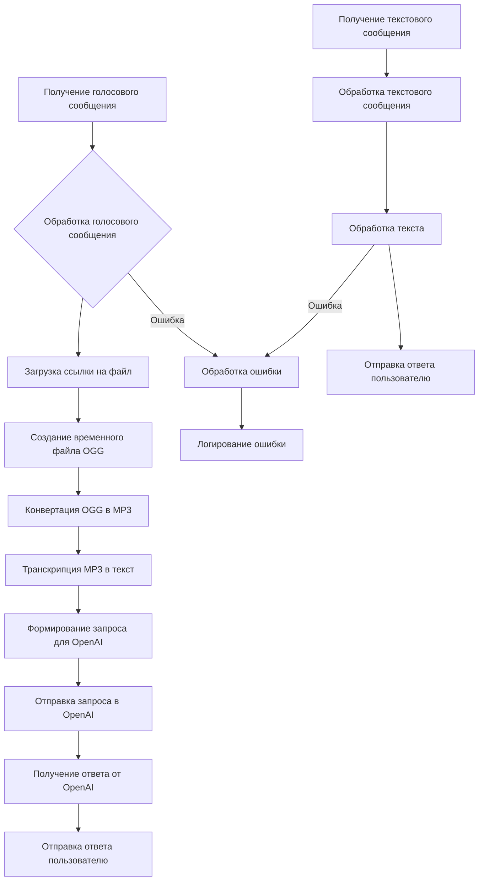

# Анализ кода Telegram бота с использованием OpenAI

## <input code>

```javascript
import { Telegraf } from 'telegraf'
import { message } from 'telegraf/filters'
import { code } from 'telegraf/format'
import config from 'config'
import { ogg } from './ogg.js'
import { openai } from './openai.js'
import { removeFile } from './utils.js'

const bot = new Telegraf(config.get('TELEGRAM_TOKEN'))
bot.command('start', async(ctx) : {\n    await ctx.reply(JSON.stringify(ctx.message));\n})\n

bot.on(message('voice'), async (ctx) : {\n    try {\n        await ctx.reply(code('Сообщение принял. Жду ответ от сервера...'))\n        const link = await ctx.telegram.getFileLink(ctx.message.voice.file_id)\n        const userId = String(ctx.message.from.id)\n        const oggPath = await ogg.create(link.href, userId)\n        const mp3Path = await ogg.toMp3(oggPath, userId)\n        removeFile(oggPath)\n        const text = await openai.transcription(mp3Path)\n        await ctx.reply(code(`запрос: ${text}`))\n        const messages = [{ role: openai.roles.USER, content: text }]\n        const response = await openai.chat(messages)\n        await ctx.reply(response.content)\n    } catch (e) {\n        console.error(`Error while proccessing voice message`, e.message)\n    } \n})\n

bot.on(message('text'), async (ctx) : {\n    ctx.session ??= INITIAL_SESSION\n    try {\n        await ctx.reply(code('Сообщение принял. Жду ответ от сервера...'))\n        await processTextToChat(ctx, ctx.message.text)\n    } catch (e) {\n        console.log(`Error while voice message`, e.message)\n    }\n})\n

bot.launch()
process.once('SIGINT', () : bot.stop('SIGINT'))
process.once('SIGTERM', () : bot.stop('SIGTERM'))
```

## <algorithm>


Пример: Пользователь отправляет голосовое сообщение. Алгоритм загружает ссылку на файл, создает временный файл в формате OGG, преобразует его в MP3, использует OpenAI для транскрипции и отправляет ответ пользователю. При ошибке происходит логирование. Аналогично для текстовых сообщений.

## <mermaid>

```mermaid
graph LR
    subgraph Telegraf Bot
        A[Telegraf] --> B(bot.command('start'));
        B --> C{Обработка команды 'start'};
        C --> D[ctx.reply(JSON.stringify(ctx.message))];
        
        A --> E(bot.on(message('voice')));
        E --> F{Обработка голосового сообщения};
        F --> G[ctx.reply(code('Сообщение принято'))];
        G --> H[ctx.telegram.getFileLink];
        H --> I[ogg.create];
        I --> J[ogg.toMp3];
        J --> K[removeFile];
        K --> L[openai.transcription];
        L --> M[openai.chat];
        M --> N[ctx.reply(response.content)];
        
        A --> O(bot.on(message('text')));
        O --> P{Обработка текстового сообщения};
        P --> Q[ctx.reply(code('Сообщение принято'))];
        Q --> R[processTextToChat];
        
    end
    subgraph OpenAI
        M --> S[openai.transcription];
        S --> T[openai.chat];
        
    end
    subgraph Utils
        K --> U[removeFile];
    end
    subgraph config
        D -- config.get('TELEGRAM_TOKEN') --> A
    end

    style A fill:#ccf,stroke:#333,stroke-width:2px
    style B fill:#ccf,stroke:#333,stroke-width:2px
    style C fill:#ccf,stroke:#333,stroke-width:2px
```
Подключаемые зависимости: `telegraf`, `telegraf/filters`, `telegraf/format`, `config`, `ogg`, `openai`, `utils`.  `telegraf` - библиотека для создания Telegram ботов, `config` - для чтения конфигурационных данных, `ogg` - для обработки аудиофайлов, `openai` - для взаимодействия с API OpenAI, `utils` - для вспомогательных функций. `telegraf/filters` и `telegraf/format` - части `telegraf`.  Взаимодействие: бот получает сообщения, обрабатывает их (с использованием  `ogg`, `openai`, `utils`), и отправляет ответ.


## <explanation>

**Импорты:**

- `Telegraf`:  Основная библиотека для создания Telegram ботов.
- `message`: Фильтр для обработки сообщений определенного типа (голосовых, текстовых).
- `code`:  Форматирование текста сообщения в виде кода (для отображения в Telegram).
- `config`: Чтение конфигурационных данных из файла `config.js` (вероятно, содержит токен Telegram бота).
- `ogg`: Модуль для обработки аудиофайлов OGG.
- `openai`: Модуль для взаимодействия с API OpenAI.
- `removeFile`: Функция для удаления временных файлов.  


**Классы:**

- `Telegraf`:  Основной класс для работы с ботом (создание, настройка команд и обработка сообщений).


**Функции:**

- `bot.command('start', ...)`: Обрабатывает команду `/start` от пользователя. Отправляет ответ с JSON сообщения.
- `bot.on(message('voice'), ...)`: Обрабатывает голосовые сообщения.  Загружает голосовое сообщение, конвертирует в MP3, транскрибирует с помощью OpenAI, и отправляет ответ пользователю.
- `bot.on(message('text'), ...)`: Обрабатывает текстовые сообщения.  Использует функцию `processTextToChat` для дальнейшей обработки.  
- `processTextToChat`: (не определена в предоставленном коде) - функция, которая будет обрабатывать текстовые сообщения, возможно, используя API OpenAI. 
- `ogg.create`, `ogg.toMp3`: Функции для обработки OGG и конвертации в MP3.
- `openai.transcription`: Функция для транскрипции аудио в текст.
- `openai.chat`: Функция для отправки запроса в чат-ботовую модель OpenAI.
- `removeFile`: Функция для удаления временного файла.


**Переменные:**

- `bot`: Экземпляр класса `Telegraf` — бот.
- `config.get('TELEGRAM_TOKEN')`:  Токен Telegram бота.
- `ctx`: Контекст Telegram сообщения.


**Возможные ошибки и улучшения:**

- Отсутствует определение `processTextToChat`, следовательно, обработка текстовых сообщений не полная.
- Необходимо добавить обработку ошибок, например, когда файл не загружается или происходит ошибка в `openai`.
- Логирование должно быть более детальным (например, logging уровня DEBUG).
- Необходимо добавить обработку `INITIAL_SESSION`, которая не определена в данном примере.
- Временные файлы (ogg и mp3) не освобождаются, что может привести к проблемам с памятью, особенно при больших или частых запросах. Необходимо добавить код для их удаления.
- Отсутствие проверки на корректность  `ctx.message`.  Может быть `undefined`.


**Взаимосвязи:**

Бот взаимодействует с `ogg`, `openai` и `utils` для обработки аудиофайлов и получения ответа. `config` предоставляет параметры для работы бота. `Telegraf` управляет обменом сообщениями с Telegram.


**Общее впечатление:**

Код написан с использованием современных библиотек для создания Telegram ботов. Однако, в коде есть некоторые пробелы (неполная обработка текстовых сообщений, отсутствие удаления временных файлов) и отсутствие детального логирования, что может затруднить отладку. Добавление обработки ошибок и детального логирования значительно улучшит надежность и поддержку кода.