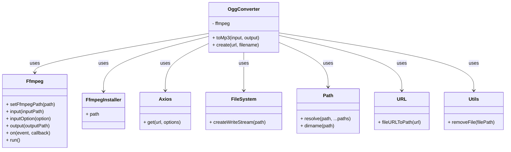
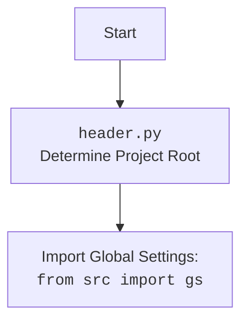

## АНАЛИЗ КОДА

### 1. <алгоритм>

**1. Инициализация `OggConverter`:**

*   Создается экземпляр класса `OggConverter`.
*   В конструкторе устанавливается путь к `ffmpeg` с помощью `ffmpeg.setFfmpegPath(installer.path)`.

**2. `create(url, filename)`:**

    *   **Пример:** `ogg.create('https://example.com/voice.oga', 'myvoice')`
    *   Функция асинхронно загружает аудиофайл из заданного `url`.
    *   Определяет путь `oggPath` для сохранения файла (`__dirname/../voices/myvoice.ogg`).
    *   Используя `axios`, делает GET-запрос по `url` и получает `response` типа `stream`.
    *   Создается `stream` для записи файла по пути `oggPath`.
    *   Данные из `response.data` передаются в `stream`.
    *   После завершения записи возвращается `Promise`, который резолвится с путем `oggPath`.
        
        ```
        flowchart TD
            subgraph create(url, filename)
                A[Определить oggPath] --> B{GET запрос по url};
                B --> C[Создать stream для записи oggPath];
                C --> D{Передать response.data в stream};
                D --> E[resolve(oggPath) после записи];
            end
        ```
    
**3. `toMp3(input, output)`:**

*   **Пример:** `ogg.toMp3('__dirname/../voices/myvoice.ogg', 'myvoice')`
*   Функция преобразует аудиофайл из формата `ogg` в формат `mp3`.
*   Определяет путь `outputPath` для сохранения файла (`__dirname/../voices/myvoice.mp3`).
*   Использует `ffmpeg` для конвертации из `input` в `outputPath` c ограничением длительности до 30 секунд `-t 30`.
*   После завершения конвертации удаляется исходный файл `input` и возвращает `Promise`, который резолвится с путем `outputPath`.
  
        ```
        flowchart TD
            subgraph toMp3(input, output)
                A[Определить outputPath] --> B{Конвертация ffmpeg(input)};
                B --> C[Удалить input];
                C --> D[resolve(outputPath)];
            end
        ```

### 2. <mermaid>



**Объяснение зависимостей:**

*   **`OggConverter`**: Класс, инкапсулирующий логику конвертации аудио.
*   **`Axios`**: Используется для выполнения HTTP-запросов (загрузка аудиофайла по URL).
*   **`Ffmpeg`**: Используется для конвертации аудио из OGG в MP3.
*   **`FfmpegInstaller`**: Используется для получения пути к исполняемому файлу ffmpeg.
*   **`FileSystem`**: Модуль Node.js, используется для записи потока данных в файл.
*   **`Path`**: Используется для работы с путями к файлам.
*   **`URL`**: Используется для преобразования URL в путь к файлу.
*   **`Utils`**: Используется для удаления временных файлов.



### 3. <объяснение>

**Импорты:**

*   `axios`: Используется для создания HTTP-запросов для скачивания OGG-файлов по URL.
*   `fs`: Используется `createWriteStream` для записи потока данных в файл.
*   `path`: Используется для работы с путями к файлам, в частности `dirname` и `resolve`.
*   `url`: `fileURLToPath` для преобразования URL-путей в пути файловой системы.
*   `ffmpeg`: `fluent-ffmpeg` библиотека для управления `ffmpeg` и конвертирования аудио.
*   `@ffmpeg-installer/ffmpeg`: Используется для автоматической установки `ffmpeg`.
*   `./utils.js`: `removeFile` для удаления файла после обработки.

**Классы:**

*   **`OggConverter`**:
    *   **Роль**: Инкапсулирует логику конвертации OGG в MP3.
    *   **Атрибуты**: `ffmpeg` - экземпляр `fluent-ffmpeg`.
    *   **Методы**:
        *   `constructor()`: Инициализирует `ffmpeg`, устанавливая путь к исполняемому файлу.
        *   `toMp3(input, output)`: Асинхронно конвертирует аудиофайл из OGG в MP3, удаляет исходный OGG.
        *   `create(url, filename)`: Асинхронно скачивает аудиофайл по URL и сохраняет его в формате OGG.

**Функции:**

*   `create(url, filename)`:
    *   **Аргументы:** `url` (URL аудиофайла), `filename` (имя файла без расширения).
    *   **Возвращаемое значение:** `Promise`, который резолвится с путем к сохраненному OGG файлу.
    *   **Назначение:** Скачивание аудиофайла и сохранение его в формате OGG.
*   `toMp3(input, output)`:
    *   **Аргументы:** `input` (путь к OGG файлу), `output` (имя выходного MP3 файла без расширения).
    *   **Возвращаемое значение:** `Promise`, который резолвится с путем к сконвертированному MP3 файлу.
    *   **Назначение:** Конвертация OGG в MP3 и удаление исходного OGG файла.

**Переменные:**

*   `__dirname`: Путь к текущей директории, используется для построения путей к файлам.
*   `ogg`: Экземпляр класса `OggConverter`, экспортируемый для использования в других модулях.

**Потенциальные ошибки и области для улучшения:**

*   **Обработка ошибок**: Логирование ошибок при `axios` и `ffmpeg` не является достаточным. Желательно добавить более детальную обработку и, возможно, выкидывать исключения, чтобы вызывающий код мог их обработать.
*   **Удаление файлов**: Удаление исходного OGG-файла после конвертации в MP3 происходит без дополнительной проверки. Может потребоваться более надежная логика для предотвращения потери данных.
*   **Обработка исключений**: В `toMp3` и `create` `try...catch` блоки ловят ошибки, но только логируют их, не прокидывая дальше. Это может затруднить отладку и обработку ошибок вызывающими функциями.
*   **Расширение конфигурации**: В будущем может потребоваться возможность настройки параметров `ffmpeg`, таких как кодек и битрейт.

**Взаимосвязь с другими частями проекта:**

*   Этот модуль предназначен для обработки голосовых сообщений, поступающих, например, от Telegram бота.
*   Результаты работы модуля (пути к MP3-файлам) могут использоваться для дальнейшей обработки (например, отправки пользователю или распознавания речи).
*   Используется `utils.js` который должен лежать в той же директории.

**Цепочка взаимосвязей:**

1.  Telegram бот получает голосовое сообщение от пользователя.
2.  Бот вызывает метод `create` класса `OggConverter` для скачивания и сохранения OGG-файла.
3.  Бот вызывает метод `toMp3` класса `OggConverter` для конвертации OGG в MP3.
4.  Бот использует полученный MP3-файл для дальнейшей обработки (например, распознавания речи или отправки пользователю).