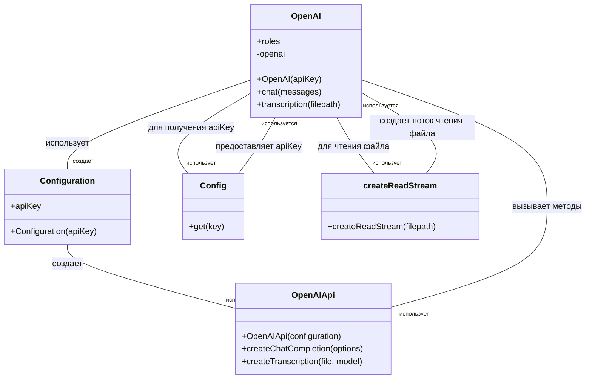

# Анализ кода `openai.js`

## <алгоритм>

1.  **Инициализация:**
    *   Создается экземпляр класса `OpenAI`.
    *   Конфигурируется `OpenAIApi` с использованием `apiKey` из файла `config`.
    *   Устанавливаются константы `roles` для определения ролей в диалоге.
    *   Пример:
        ```javascript
        const openaiInstance = new OpenAI('your-api-key'); // API key берется из конфига
        ```
2.  **`chat(messages)`:**
    *   Принимает массив `messages` (объекты с `role` и `content`).
    *   Отправляет запрос к OpenAI API для завершения чата (`createChatCompletion`).
    *   Обрабатывает ответ и возвращает первое сообщение от ассистента.
    *   Обрабатывает ошибки и выводит их в консоль.
    *   Пример:
        ```javascript
        const messages = [
          { role: 'user', content: 'Привет!' },
          { role: 'assistant', content: 'Привет, чем могу помочь?' },
          { role: 'user', content: 'Расскажи анекдот.' }
        ];
        openaiInstance.chat(messages).then(response => console.log(response));
        ```
3.  **`transcription(filepath)`:**
    *   Принимает путь к файлу `filepath`.
    *   Создает поток чтения файла с помощью `createReadStream(filepath)`.
    *   Отправляет запрос к OpenAI API для транскрипции аудиофайла (`createTranscription`), используя модель `whisper-1`.
    *   Возвращает текст транскрипции.
    *   Обрабатывает ошибки и выводит их в консоль.
    *   Пример:
        ```javascript
        openaiInstance.transcription('/path/to/audio.mp3').then(text => console.log(text));
        ```

## <mermaid>



### Объяснение `mermaid` диаграммы:

*   `OpenAI` - класс, реализующий логику взаимодействия с OpenAI API.
*   `Configuration` - класс, представляющий конфигурацию API (включает в себя `apiKey`).
*   `OpenAIApi` - класс, предоставляемый библиотекой `openai` для вызова API.
*   `Config` - класс/модуль, предоставляющий доступ к настройкам приложения (например, `apiKey`).
*   `createReadStream` - функция из модуля `fs` для создания потока чтения файла.

**Зависимости:**

*   `OpenAI` создаёт объект `Configuration`.
*   `Configuration` передаётся в конструктор `OpenAIApi`.
*   `OpenAI` использует методы `OpenAIApi` для `chat` и `transcription`.
*   `OpenAI` получает `apiKey` из объекта `Config`.
*   `OpenAI` использует `createReadStream` для чтения файла в `transcription`.
*   `Config` предоставляет доступ к `apiKey` для `OpenAI`.
*   `createReadStream` создает поток файла для `OpenAI`.

## <объяснение>

### Импорты:

*   `import { Configuration, OpenAIApi } from 'openai'`
    *   Импортирует классы `Configuration` и `OpenAIApi` из пакета `openai`.
    *   `Configuration` используется для настройки подключения к API OpenAI.
    *   `OpenAIApi` предоставляет методы для взаимодействия с API OpenAI (например, для создания чатов и транскрипций).
*   `import config from 'config'`
    *   Импортирует объект `config` из пакета `config`.
    *   Предполагается, что `config` содержит конфигурации приложения, включая API-ключ OpenAI.
*   `import { createReadStream } from 'fs'`
    *   Импортирует функцию `createReadStream` из модуля `fs` Node.js.
    *   Используется для создания потока чтения файла при транскрипции аудио.

### Класс `OpenAI`:

*   **Роль:** Класс инкапсулирует логику взаимодействия с OpenAI API.
*   **Атрибуты:**
    *   `roles`: Объект с константами, представляющими роли в чате (`ASSISTANT`, `USER`, `SYSTEM`).
    *   `openai`: Экземпляр `OpenAIApi`, используемый для отправки запросов к API OpenAI.
*   **Методы:**
    *   `constructor(apiKey)`:
        *   Принимает API-ключ в качестве аргумента.
        *   Создаёт экземпляр `Configuration` с предоставленным ключом.
        *   Создаёт экземпляр `OpenAIApi` с полученной конфигурацией.
    *   `async chat(messages)`:
        *   Принимает массив `messages` (объекты с `role` и `content`) в качестве аргумента.
        *   Отправляет запрос к OpenAI API для завершения чата с использованием `createChatCompletion`.
        *   Возвращает сообщение от ассистента (первое сообщение из массива `choices`).
        *   Обрабатывает ошибки с помощью `try...catch` и выводит сообщение об ошибке в консоль.
    *   `async transcription(filepath)`:
        *   Принимает путь к файлу в качестве аргумента.
        *   Создаёт поток чтения файла с помощью `createReadStream`.
        *   Отправляет запрос к OpenAI API для транскрипции аудиофайла с использованием `createTranscription`.
        *   Возвращает текст транскрипции.
        *   Обрабатывает ошибки с помощью `try...catch` и выводит сообщение об ошибке в консоль.

### Переменные:

*   `apiKey`: Строка, представляющая API-ключ для доступа к OpenAI API. Получается из файла конфигурации с помощью `config.get('OPENAI_KEY')`.
*   `messages`: Массив объектов, представляющих сообщения в чате. Каждый объект имеет поля `role` и `content`.
*   `filepath`: Строка, представляющая путь к файлу, который нужно транскрибировать.

### Потенциальные ошибки и области для улучшения:

*   **Обработка ошибок:**
    *   Обработка ошибок в методах `chat` и `transcription` ограничена выводом сообщения в консоль.
    *   В производственной среде требуется более надежная обработка ошибок (например, повторные попытки, логирование, отправка уведомлений и т.д.).
*   **Управление API-ключом:**
    *   API-ключ может быть чувствительной информацией, его следует хранить и управлять им более безопасно (например, через переменные окружения, хранилища секретов и т.д.).
*   **Конфигурация:**
    *   Использование пакета `config` предполагает наличие специального файла конфигурации. Нужно обеспечить корректную настройку и доступность этого файла.
*   **Типизация:**
    *   Отсутствуют определения типов для `messages` и других структур данных. Это может усложнить чтение кода и вызвать ошибки.
    *   Можно добавить использование TypeScript для более строгой типизации.
*   **Модель:**
    *   В методе `chat` используется жестко заданная модель `'gpt-3.5-turbo'`.
    *   Было бы полезно сделать модель настраиваемой через параметры.

### Цепочка взаимосвязей с другими частями проекта:

*   **`config`:** Файл конфигурации приложения предоставляет API-ключ OpenAI.
*   **Telegram Bot (предположительно):** Скорее всего, данный модуль используется для интеграции с Telegram-ботом. Класс `OpenAI` предоставляет функции для генерации ответов на сообщения пользователей и транскрипции голосовых сообщений, которые могут быть отправлены через Telegram-бота.
*   **Другие модули:** В зависимости от структуры проекта, этот модуль может взаимодействовать с другими модулями, такими как модули для обработки сообщений, управления пользователями, или хранения данных.

### Вывод:

Код представляет собой класс `OpenAI` для взаимодействия с OpenAI API, предоставляющий функции для чата и транскрипции. Код относительно простой, но есть области для улучшения, такие как обработка ошибок, безопасность хранения API-ключа, типизация и конфигурация. Этот модуль играет важную роль в интеграции с ботом (вероятно Telegram), позволяя ему генерировать текст и транскрибировать аудио.