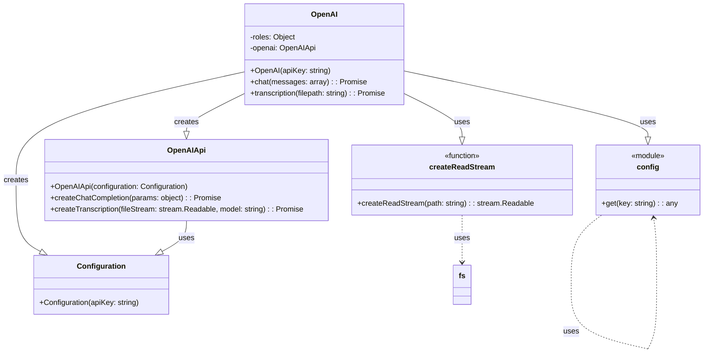

## АНАЛИЗ КОДА: `hypotez/src/endpoints/bots/chat_gpt_nodejs/chatgpt-telegram/src/openai.js`

### 1. <алгоритм>

**1. Инициализация класса `OpenAI`:**

   -  Создаётся экземпляр класса `OpenAI`.
   -  Принимается аргумент `apiKey` (ключ API OpenAI).
   -  Создаётся объект `Configuration` с переданным `apiKey`.
   -  Создаётся объект `OpenAIApi` с использованием созданного объекта `Configuration`.
   -  Присваивается объект `OpenAIApi` в свойство `openai` экземпляра `OpenAI`.

   *Пример:*
   ```javascript
   const openaiInstance = new OpenAI("YOUR_API_KEY");
   // Создает объект this.openai
   ```

**2. Метод `chat(messages)`:**
   -  Принимает массив `messages` (история чата).
   -  Использует `this.openai.createChatCompletion` для отправки запроса к OpenAI API.
   -  Указывается модель `gpt-3.5-turbo`.
   -  Возвращает ответ от API, извлекая текст сообщения из `response.data.choices[0].message`.
   -  В случае ошибки выводит сообщение в консоль.

    *Пример:*
        ```javascript
        const chatMessages = [{ role: 'user', content: 'Привет!' }];
        const responseMessage = await openaiInstance.chat(chatMessages);
        // responseMessage вернет объект с текстом ответа
        ```

**3. Метод `transcription(filepath)`:**

   -  Принимает `filepath` (путь к файлу аудио).
   -  Создаёт поток для чтения файла с помощью `createReadStream(filepath)`.
   -  Использует `this.openai.createTranscription` для отправки аудио на транскрибацию в OpenAI API, модель `whisper-1`.
   -  Возвращает полученный текст из `response.data.text`.
   -  В случае ошибки выводит сообщение в консоль.

    *Пример:*
        ```javascript
        const audioFilePath = '/path/to/audio.mp3';
        const transcribedText = await openaiInstance.transcription(audioFilePath);
        // transcribedText вернет распознанный текст из аудио
        ```
**4. Экспорт экземпляра `openai`:**
    - Экспортируется новый экземпляр `OpenAI` под именем `openai`, получающий API ключ из конфигурации (используя `config.get('OPENAI_KEY')`).

### 2. <mermaid>



**Объяснение:**

-   **`OpenAI`**: Основной класс, инкапсулирующий взаимодействие с OpenAI API. Хранит API ключ и предоставляет методы `chat` и `transcription`.
-   **`Configuration`**: Класс из библиотеки `openai`, используется для хранения конфигурации API, в данном случае API ключа.
-   **`OpenAIApi`**: Класс из библиотеки `openai`, предоставляет методы для взаимодействия с API OpenAI, такие как `createChatCompletion` и `createTranscription`.
-   **`config`**: Модуль `config` (предположительно `node-config`) используется для получения API ключа из конфигурационного файла.
-   **`createReadStream`**: Функция из модуля `fs` (файловой системы), используется для создания потока чтения из файла.

**Зависимости:**

-  `OpenAI` зависит от `Configuration` и `OpenAIApi` (использует их для создания экземпляра и обращения к API).
-   `Configuration` получает `apiKey` в конструкторе.
-  `OpenAIApi` использует `Configuration` для настройки API.
-   `OpenAI` использует модуль `config` для получения API ключа.
-   `OpenAI` использует функцию `createReadStream` для чтения файлов.
-  Модуль `config` сам является модулем и использует другие части проекта для получения конфигураций.
-  Функция `createReadStream` использует модуль `fs` для работы с файловой системой.

### 3. <объяснение>

**Импорты:**

-   `import { Configuration, OpenAIApi } from 'openai';`: Импортирует классы `Configuration` и `OpenAIApi` из библиотеки `openai`. `Configuration` используется для настройки доступа к OpenAI API, а `OpenAIApi` предоставляет методы для отправки запросов.
-   `import config from 'config';`: Импортирует модуль `config`, который, вероятно, используется для управления конфигурацией приложения (например, для получения API ключа). Этот модуль, как правило, читает конфигурации из файлов или переменных окружения.
-  `import { createReadStream } from 'fs';`: Импортирует функцию `createReadStream` из модуля `fs` (file system), которая используется для создания читаемого потока из файла, необходимого для передачи файла в метод `createTranscription`.

**Класс `OpenAI`:**

-   **Роль:** Класс `OpenAI` является оболочкой для взаимодействия с OpenAI API. Он инкапсулирует логику отправки запросов на генерацию текста и транскрибацию.
-   **Атрибуты:**
    -   `roles`: Объект, содержащий константы для ролей в чате (`ASSISTANT`, `USER`, `SYSTEM`).
    -   `openai`: Экземпляр класса `OpenAIApi`, используемый для связи с OpenAI API.
-   **Методы:**
    -   `constructor(apiKey)`: Конструктор класса, принимает API ключ, создает объект `Configuration` и инициализирует `OpenAIApi`.
    -   `async chat(messages)`: Асинхронный метод, принимает массив сообщений (историю чата), отправляет запрос на генерацию текста к OpenAI API (`createChatCompletion`) и возвращает ответ. В случае ошибки выводит сообщение в консоль.
    -   `async transcription(filepath)`: Асинхронный метод, принимает путь к файлу аудио, создает поток чтения файла, отправляет запрос на транскрибацию к OpenAI API (`createTranscription`) и возвращает текст. В случае ошибки выводит сообщение в консоль.

**Функции:**

-   **`async chat(messages)`:**
    -   **Аргументы:** `messages` - массив объектов, где каждый объект представляет сообщение и содержит поля `role` (роль отправителя: `user`, `assistant`, `system`) и `content` (текст сообщения).
    -   **Возвращаемое значение:** Объект с текстом ответа, полученный от OpenAI API.
    -   **Назначение:** Отправляет массив сообщений в OpenAI и получает ответ от модели.
-   **`async transcription(filepath)`:**
    -   **Аргументы:** `filepath` - строка, путь к аудио файлу, который нужно транскрибировать.
    -   **Возвращаемое значение:** Строка с текстом, полученным в результате транскрибации аудио файла.
    -   **Назначение:** Отправляет аудио файл в OpenAI API для распознавания текста и возвращает результат.

**Переменные:**

-   `roles`: Объект, определяющий возможные роли в диалоге (assistant, user, system).
-  `openai`: Экземпляр класса `OpenAI`, инициализированный с использованием API ключа из конфигурации.

**Потенциальные ошибки и улучшения:**

1.  **Обработка ошибок**: В `catch` блоках методов `chat` и `transcription` только логируется ошибка. Желательно реализовать более надежную обработку ошибок, например, генерацию исключений, которые можно будет обработать в вызывающем коде, или повторную отправку запроса.
2. **Конфигурация модели:** Модель `gpt-3.5-turbo` захардкодена в коде. Было бы лучше вынести ее в конфигурацию.
3. **Логирование:** Логирование ошибок (console.log) следует заменить на более продвинутую систему логирования, например с использованием `winston` или `pino`.
4. **Типизация:** Было бы желательно добавить типизацию с использованием TypeScript для повышения надежности и читаемости кода.
5.  **Абстракция:** Класс `OpenAI` можно сделать более абстрактным, чтобы можно было использовать различные модели и API OpenAI без изменения кода.

**Взаимосвязь с другими частями проекта:**

-  Экземпляр `openai` используется в других частях проекта для отправки запросов к OpenAI API, например, в контроллерах, которые обрабатывают сообщения от Telegram-бота. `config` используется для настройки, `fs` для чтения файлов.
-   Класс `OpenAI` является частью слоя сервисов (или аналогичного), который обрабатывает бизнес-логику, связанную с AI, в отличие от слоев контроллеров или представления.
-  Этот код является частью `chatgpt-telegram`, следовательно, в коде есть связь с telegram-ботом.

В целом, код представляет собой хорошо структурированный класс для взаимодействия с OpenAI API. Улучшения могут быть связаны с более гибкой обработкой ошибок, конфигурацией и добавлением типизации.