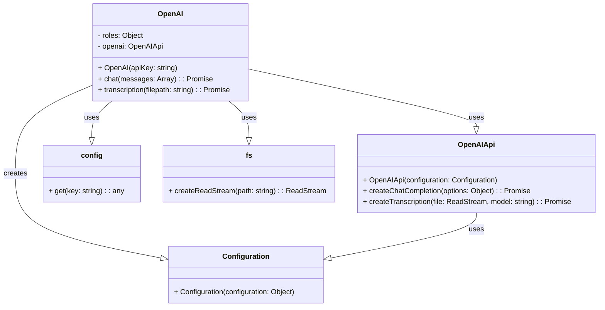

## <алгоритм>
1. **Инициализация `OpenAI`**:
    - При создании экземпляра `OpenAI`, класс принимает `apiKey` в качестве аргумента.
    - Создаётся объект `Configuration` с переданным `apiKey`.
    - Создаётся экземпляр `OpenAIApi` с использованием объекта `Configuration`, который сохраняется в `this.openai`.
    - Пример: `const openaiInstance = new OpenAI('YOUR_API_KEY');`

2. **Метод `chat`**:
    - Принимает массив объектов `messages`, представляющих историю диалога.
    - Вызывает `this.openai.createChatCompletion` с моделью `gpt-3.5-turbo` и переданным массивом сообщений.
    - В случае успеха, возвращает `message` из первого варианта ответа `response.data.choices[0].message`.
    - В случае ошибки, выводит сообщение об ошибке в консоль.
    - Пример:
      ```javascript
      const messages = [
        { role: 'user', content: 'Привет, как дела?' }
      ];
      openaiInstance.chat(messages).then(response => console.log(response));
      ```

3. **Метод `transcription`**:
    - Принимает `filepath` - путь к аудиофайлу.
    - Создаёт `readStream` для файла по указанному пути.
    - Вызывает `this.openai.createTranscription` с `readStream` и моделью `whisper-1`.
    - В случае успеха, возвращает `text` из `response.data.text`.
    - В случае ошибки, выводит сообщение об ошибке в консоль.
    - Пример:
      ```javascript
      openaiInstance.transcription('/path/to/audio.mp3').then(text => console.log(text));
      ```

4. **Экспорт `openai`**:
    - Создаётся и экспортируется экземпляр класса `OpenAI`, используя ключ `OPENAI_KEY` из файла `config`.
    - Пример: `import { openai } from './openai.js';`

## <mermaid>

**Описание зависимостей:**

*   **`OpenAI`**: Основной класс, инкапсулирующий взаимодействие с OpenAI API. Зависит от `Configuration`, `OpenAIApi`, `fs` и `config`.
*   **`Configuration`**: Класс из `openai` для настройки соединения с OpenAI API, требует `apiKey`.
*   **`OpenAIApi`**: Класс из `openai` для отправки запросов к OpenAI API, использует объект `Configuration`.
*   **`config`**: Используется для получения ключа API из конфигурационного файла.
*    **`fs`**:  Используется для создания потока чтения файла при транскрипции аудио.

## <объяснение>

### Импорты:

*   `import { Configuration, OpenAIApi } from 'openai'`: Импортирует классы `Configuration` и `OpenAIApi` из пакета `openai`.  
    `Configuration` используется для настройки соединения с OpenAI API, `OpenAIApi` для отправки запросов к API.

*   `import config from 'config'`: Импортирует объект `config` из пакета `config`.
    Используется для получения значения API-ключа из конфигурационного файла.

*   `import { createReadStream } from 'fs'`: Импортирует функцию `createReadStream` из встроенного модуля `fs` Node.js.
    Используется для создания потока чтения файла при транскрипции аудио.

### Классы:

*   **`OpenAI`**:
    *   **Роль**:  Инкапсулирует логику взаимодействия с OpenAI API.
    *   **Атрибуты**:
        *   `roles`: Объект, определяющий роли в сообщениях для чата (`ASSISTANT`, `USER`, `SYSTEM`).
        *   `openai`: Экземпляр `OpenAIApi`, используемый для отправки запросов.
    *   **Методы**:
        *   `constructor(apiKey)`: Конструктор класса, принимает `apiKey`, создает экземпляр `Configuration` и инициализирует `OpenAIApi`.
        *   `async chat(messages)`: Метод для отправки запросов к OpenAI API для чата. Принимает массив сообщений и возвращает ответ.
        *   `async transcription(filepath)`: Метод для отправки запросов к OpenAI API для транскрипции. Принимает путь к файлу и возвращает текст.

### Функции:
*   Отсутствуют, но есть методы класса.

### Переменные:

*   `apiKey`: Строка, представляющая API-ключ для OpenAI. Получается через `config.get('OPENAI_KEY')`.
*   `messages`: Массив объектов, представляющих диалог (используется в `chat`). Каждый объект имеет поля `role` (одна из ролей) и `content` (текст сообщения).
*   `filepath`: Строка, представляющая путь к файлу для транскрипции (используется в `transcription`).
*   `response`: Объект, содержащий ответ от OpenAI API (используется в `chat` и `transcription`).

### Потенциальные ошибки и улучшения:

*   **Обработка ошибок**:  Обработка ошибок ограничивается выводом сообщения в консоль. В production-окружении необходимо более детальное логирование ошибок и возвращение информативных сообщений об ошибках.
*   **Управление моделью**: Модель для чата (`gpt-3.5-turbo`) и транскрипции (`whisper-1`) задана статически. Можно добавить возможность выбора модели через параметры.
*   **Валидация ввода**: Необходимо добавить валидацию входящих параметров, например, проверку типа `filepath`, корректность `messages` и т.д.
*   **Таймауты**: Необходимо добавить таймауты для запросов к API, чтобы избежать блокировки приложения в случае проблем с сетью или API.

### Взаимосвязи с другими частями проекта:

*   Этот файл предоставляет функциональность для взаимодействия с OpenAI API. Другие части проекта могут использовать экспортируемый `openai` экземпляр для отправки запросов для чата или транскрипции.
*   `config` используется для получения ключа API, что предполагает наличие конфигурационного файла с настройками проекта.

**Дополнительно**: 
- Файл `header.py` не импортируется в данном коде, поэтому блок mermaid  для `header.py` не требуется.
```