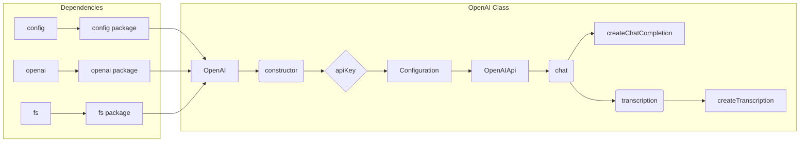

```MD
# Анализ кода openai.js

## <input code>

```javascript
import { Configuration, OpenAIApi } from 'openai'
import config from 'config'
import { createReadStream } from 'fs'
class OpenAI {
    roles = {
        ASSISTANT: 'assistant',
        USER: 'user',
        SYSTEM: 'system',
    }
    constructor(apiKey) {
        const configuration = new Configuration({
            apiKey,
        })
        this.openai = new OpenAIApi(configuration)
    }
    async chat(messages) {
        try {
            const response = await this.openai.createChatCompletion({
                model: 'gpt-3.5-turbo',
                messages,
            })
            return response.data.choices[0].message
        } catch (e) {
            console.log('Error while gpt chat', e.message)
        }
    }
    async transcription(filepath) {
        try {
            const response = await this.openai.createTranscription(
                createReadStream(filepath),
                'whisper-1'
            )
            return response.data.text
        } catch (e) {
            console.log('Error while transcription', e.message)
        }
    }
}
export const openai = new OpenAI(config.get('OPENAI_KEY'))
```

## <algorithm>

**Блок-схема:**

```mermaid
graph TD
    A[Инициализация OpenAI] --> B{Получение API ключа};
    B --> C[Создание экземпляра Configuration];
    C --> D[Создание экземпляра OpenAIApi];
    D --> E[Функция chat];
    E --> F[Запрос к OpenAI (createChatCompletion)];
    F --> G[Обработка ответа];
    G --> H[Возврат сообщения];
    E -.-> I[Обработка ошибки];
    I -.-> J[Лог ошибки];
    D --> K[Функция transcription];
    K --> L[Запрос к OpenAI (createTranscription)];
    L --> M[Обработка ответа];
    M --> N[Возврат текста];
    K -.-> O[Обработка ошибки];
    O -.-> P[Лог ошибки];
    
    subgraph OpenAI Class
        C --> D
        D --> E
        D --> K
    end
```

**Пример данных:**

* **`messages` (для `chat`)**: `[{ role: 'user', content: 'Привет!' }]`
* **`filepath` (для `transcription`)**:  `/path/to/audio.mp3`


## <mermaid>



**Объяснение диаграммы:**

Диаграмма показывает зависимость класса `OpenAI` от внешних пакетов `config`, `openai`, и `fs`.  Класс `OpenAI` использует `config` для получения API ключа,  `openai` для взаимодействия с API OpenAI, и `fs` для работы с файлами.

## <explanation>

**Импорты:**

* `import { Configuration, OpenAIApi } from 'openai'`: Импортирует необходимые классы для взаимодействия с API OpenAI.  `Configuration`  и `OpenAIApi`  – части библиотеки `openai`, которая предоставляет интерфейс для работы с API OpenAI.
* `import config from 'config'`: Импортирует модуль `config`.  Предполагается, что этот модуль предоставляет доступ к конфигурационным данным, в данном случае – API ключу для OpenAI.
* `import { createReadStream } from 'fs'`: Импортирует функцию `createReadStream` из модуля `fs` (Node.js's file system module), которая используется для чтения файлов.  Это необходимо для работы с аудиофайлами.


**Классы:**

* `OpenAI`:  Представляет собой класс для взаимодействия с API OpenAI.  Он хранит в себе экземпляр `OpenAIApi`, необходимый для выполнения запросов.
*   `roles`: Статический атрибут, хранящий значения ролей, используемых в запросах к OpenAI.


**Функции:**

* `constructor(apiKey)`: Конструктор класса `OpenAI`.  Принимает `apiKey` (ключ API OpenAI) и инициализирует экземпляр `OpenAIApi`, который используется для последующих запросов.
* `chat(messages)`: Асинхронная функция для отправки запросов на чат-бот OpenAI. Принимает массив сообщений `messages` в формате, ожидаемом OpenAI. Возвращает объект сообщения или `undefined` (в случае ошибки).
* `transcription(filepath)`: Асинхронная функция для транскрибирования аудиофайла. Принимает путь к файлу `filepath`.  Возвращает текст транскрипции или `undefined` (в случае ошибки).


**Переменные:**

* `apiKey`: Хранит ключ API OpenAI, полученный из конфигурации.
* `openai`: Экземпляр `OpenAIApi` для взаимодействия с OpenAI.


**Возможные ошибки и улучшения:**

* **Обработка ошибок:**  Обработка ошибок (блоком `try...catch`) - важный шаг, так как API запросы могут завершаться ошибками. Но можно добавить более подробные сообщения об ошибках.
* **Типизация:** Использование типов данных (например, с TypeScript) сделало бы код более надежным, обеспечивая явное указание ожидаемых типов данных для аргументов и возвращаемых значений.
* **Обработка больших ответов:** Для очень больших ответов от модели GPT, можно добавить пагинацию или другие стратегии для обработки больших потоков данных.
* **Управление кэшем:**  Если используется повторно запросы с одними и теми же данными, можно добавить кеширование ответов для повышения производительности.
* **Проверка входных данных:** Проверка корректности `messages` и `filepath` добавит надежность.


**Взаимосвязь с другими частями проекта:**

Код `openai.js` напрямую зависит от модуля `config` для получения API ключа.  Файлы аудио, которые обрабатываются `transcription` методом, могут храниться в файловой системе приложения.  Этот код скорее всего используется другими частями приложения (например, ботами Telegram) для интеграции с OpenAI.