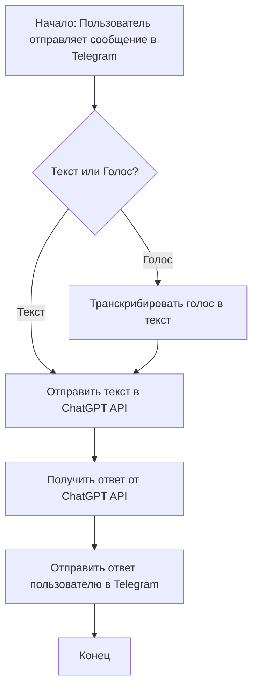
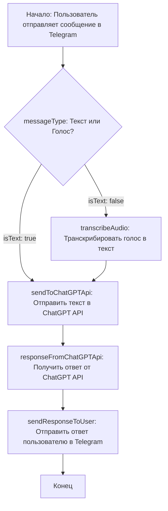

# Анализ кода: Голосовой помощник chatgpt - telegram

## <алгоритм>

Представленный код представляет собой ссылку на статью о создании голосового помощника ChatGPT для Telegram. Это не исполняемый код, а, скорее, описание концепции. Поэтому алгоритм будет основываться на общем понимании того, как работает такой бот.

**Блок-схема общего процесса:**

**Пояснение блоков:**

1.  **Начало:** Пользователь взаимодействует с ботом Telegram.
    *   *Пример:* Пользователь отправляет текстовое сообщение или голосовое сообщение боту.

2.  **Текст или Голос?:** Проверка типа входящего сообщения от пользователя.
    *   *Пример:* Если сообщение - текст, то переходим к блоку C. Если голос - к блоку D.

3.  **Отправить текст в ChatGPT API:** Отправка текстового запроса к ChatGPT API.
    *   *Пример:* Текст "Расскажи о космосе" отправляется к ChatGPT API.

4.  **Транскрибировать голос в текст:** Преобразование голосового сообщения в текстовый формат.
    *   *Пример:* Голосовое сообщение "Привет, как дела?" преобразуется в текст "Привет, как дела?".

5.  **Получить ответ от ChatGPT API:** Получение сгенерированного ответа от ChatGPT.
    *   *Пример:* ChatGPT API возвращает ответ на запрос "Расскажи о космосе", содержащий информацию о космосе.

6.  **Отправить ответ пользователю в Telegram:** Отправка ответа пользователю в Telegram.
    *   *Пример:* Бот отправляет пользователю ответ ChatGPT: "Космос - это ...".

7.  **Конец:** Завершение процесса обработки одного запроса.

## <mermaid>

**Разбор зависимостей и переменных:**

*   `messageType`: Переменная, определяющая тип входящего сообщения (текст или голос).
*   `isText`: Булева переменная, определяющая, является ли сообщение текстовым.
*   `sendToChatGPTApi`: Функция для отправки текста в ChatGPT API.
*   `transcribeAudio`: Функция для преобразования голосового сообщения в текст.
*   `responseFromChatGPTApi`: Переменная, содержащая ответ от ChatGPT API.
*   `sendResponseToUser`: Функция для отправки ответа пользователю.

## <объяснение>

**Импорты:**

В предоставленном коде (ссылке на статью) нет явных импортов. Однако, исходя из контекста, можно предположить, что в реальной реализации будут использоваться следующие библиотеки:

*   `telegram`: Для работы с API Telegram-бота.
*   `openai`: Для работы с ChatGPT API.
*   `speech_recognition` (или аналогичная): Для транскрипции голоса в текст.
*   `requests` или `httpx`: Для отправки HTTP-запросов к API.
*  `dotenv`: Для управления переменными окружения.

**Классы:**

В концепции такого бота обычно используются классы для структурирования кода.

*  **TelegramBot:** Класс, отвечающий за взаимодействие с API Telegram, обработку входящих сообщений и отправку ответов пользователям.
    *   *Атрибуты:* Токен бота, ID пользователя, ...
    *   *Методы:* `handle_message()`, `send_message()`, `process_voice()`, ...

*   **ChatGPTClient:** Класс, взаимодействующий с ChatGPT API.
    *   *Атрибуты:* API-ключ, параметры модели.
    *   *Методы:* `send_prompt()`, `get_response()`.

*   **SpeechToText:** Класс для транскрибации голоса в текст.
    *  *Атрибуты*: Модель распознавания речи.
    *  *Методы*: `transcribe(audio_file)`.

**Функции:**

*   **`handle_message(message)`**: Обрабатывает входящее сообщение от пользователя.
    *   *Аргументы:* Сообщение от пользователя (текст или голосовое).
    *   *Возвращаемое значение:* Нет.
    *   *Назначение:* Определяет тип сообщения (текст или голос), вызывает соответствующие функции обработки и отправляет ответ.
    *   *Пример:* `handle_message("Привет!")` - обрабатывает текстовое сообщение "Привет!".
*   **`send_message(chat_id, text)`**: Отправляет текстовое сообщение пользователю.
    *   *Аргументы:* `chat_id` - идентификатор чата пользователя, `text` - текст сообщения.
    *   *Возвращаемое значение:* Нет.
    *   *Назначение:* Отправляет ответ в Telegram.
    *   *Пример:* `send_message(123456789, "Привет, как дела?")` - отправляет сообщение пользователю с ID 123456789.
*   **`process_voice(voice_message)`**: Обрабатывает голосовое сообщение.
    *   *Аргументы:* `voice_message` - голосовое сообщение от пользователя.
    *   *Возвращаемое значение:* Текст, полученный из голосового сообщения.
    *   *Назначение:* Транскрибирует голос в текст.
    *   *Пример:* `process_voice(voice_file)` - транскрибирует голосовой файл `voice_file`.
*   **`send_prompt(prompt)`**: Отправляет запрос в ChatGPT API.
    *   *Аргументы:* `prompt` - текстовый запрос.
    *   *Возвращаемое значение:* Ответ от ChatGPT API.
    *   *Назначение:* Получает ответ от ChatGPT.
    *   *Пример:* `send_prompt("Расскажи о космосе")` - отправляет запрос и получает ответ от ChatGPT.

**Переменные:**

*   `bot_token`: Токен Telegram-бота, используемый для аутентификации.
*   `openai_api_key`: API-ключ для доступа к ChatGPT API.
*   `chat_id`: Идентификатор чата пользователя в Telegram.
*  `message`: Объект, представляющий сообщение от пользователя.
* `text`: Строка, представляющая текст сообщения.
*   `response`: Строка, представляющая ответ от ChatGPT API.

**Потенциальные ошибки и области для улучшения:**

*   **Обработка ошибок**: Необходима более детальная обработка ошибок при взаимодействии с API Telegram и ChatGPT, а также при транскрипции голоса.
*   **Защита API-ключей**: API-ключи не должны быть жестко закодированы в коде, их нужно хранить в переменных окружения.
*  **Скорость транскрибации**: Время обработки голосовых сообщений может быть достаточно большим.
*   **Контекст беседы**:  Хранение контекста диалога для более релевантных ответов от ChatGPT.
*   **Управление токенами ChatGPT**: Управление длиной диалога и обрезка контекста для соответствия лимитам токенов.
*   **Многопоточность/Асинхронность**: Улучшение производительности с помощью многопоточности или асинхронного выполнения задач.
*  **Управление переменными окружения**: Использование библиотеки dotenv для управления переменными окружения.

**Взаимосвязи с другими частями проекта:**

Этот бот является частью более крупной системы, которая может включать:

*   **Базу данных**: Для хранения истории сообщений, пользовательских настроек и т.д.
*   **Систему мониторинга**: Для отслеживания состояния бота и возможных ошибок.
*   **Систему аутентификации**: Для безопасного доступа к API.

Этот анализ дает полное представление о функциональности голосового помощника ChatGPT для Telegram,  его основных компонентах, а также возможных областях для улучшения.