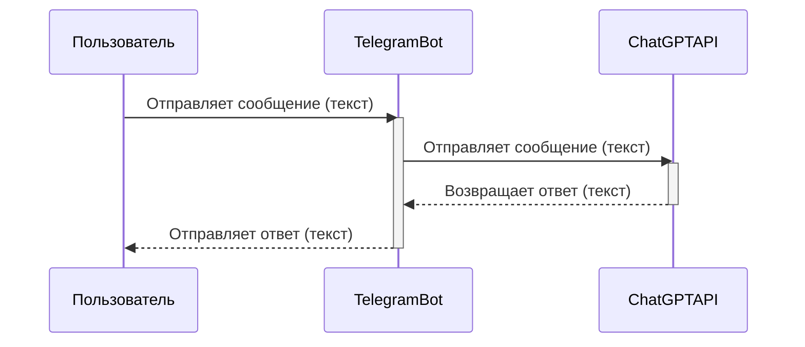

## Анализ кода: Голосовой помощник ChatGPT в Telegram

### <алгоритм>

1. **Пользователь взаимодействует с Telegram ботом:** Пользователь отправляет текстовое сообщение боту в Telegram.
   * _Пример:_ Пользователь пишет "Привет, как дела?" в чат с ботом.

2. **Telegram бот принимает сообщение:** Бот, написанный на Node.js с использованием API Telegram, получает сообщение пользователя.
   * _Пример:_ Node.js сервер получает сообщение "Привет, как дела?" от Telegram API.

3. **Бот отправляет сообщение в ChatGPT:** Полученное сообщение пересылается в ChatGPT API для обработки.
   * _Пример:_ Node.js сервер отправляет запрос с текстом "Привет, как дела?" в ChatGPT API.

4. **ChatGPT обрабатывает сообщение и генерирует ответ:** ChatGPT анализирует сообщение пользователя и генерирует текстовый ответ.
   * _Пример:_ ChatGPT отвечает: "Привет! У меня всё отлично, спасибо, что спросили. Чем могу помочь?"

5. **Бот получает ответ от ChatGPT:** Node.js сервер получает ответ от ChatGPT API.
   * _Пример:_ Node.js сервер получает ответ "Привет! У меня всё отлично, спасибо, что спросили. Чем могу помочь?"

6. **Бот отправляет ответ пользователю:** Бот отправляет полученный ответ пользователю в Telegram.
   * _Пример:_ Бот отправляет сообщение "Привет! У меня всё отлично, спасибо, что спросили. Чем могу помочь?" пользователю в Telegram.

7. **Цикл повторяется:** Пользователь может отправить следующее сообщение, и процесс повторяется, позволяя вести непрерывный диалог.

### <mermaid>

**Анализ диаграммы:**

-   `Пользователь`: Представляет человека, который взаимодействует с Telegram ботом.
-   `TelegramBot`: Представляет Node.js сервер, работающий с Telegram API, который получает сообщения от пользователей и отправляет их в ChatGPT.
-   `ChatGPTAPI`: Представляет API, который обрабатывает текстовые сообщения и генерирует ответы.
-   Диаграмма показывает последовательность сообщений между этими тремя участниками. Пользователь отправляет текст в `TelegramBot`. `TelegramBot` пересылает текст в `ChatGPTAPI`, и получает ответ, который потом пересылает `Пользователю`.

### <объяснение>

**Объяснение функциональности:**

Представленный код описывает архитектуру простого чат-бота, интегрированного с ChatGPT и Telegram. Пользователь общается с ботом через Telegram, Node.js сервер обрабатывает сообщения и взаимодействие с ChatGPT API.

**Импорты:**

В данном фрагменте кода нет явных импортов, так как это описание архитектуры. Однако, при реализации такого бота, потребовались бы следующие библиотеки Node.js:

-   `node-telegram-bot-api`: Для взаимодействия с Telegram API, отправки и приема сообщений.
-   `openai`: Для использования ChatGPT API, отправки текстовых запросов и получения ответов.
-   `dotenv`: (опционально) Для загрузки переменных окружения (например, ключа API).

**Классы:**

В представленном коде нет классов, поскольку это описание. Но если бы реализация была на Node.js, можно представить следующие классы:

-   `TelegramBot`:
    *   Атрибуты: `token` (токен Telegram бота), `bot` (экземпляр `node-telegram-bot-api`), `chatGPTClient` (экземпляр клиента ChatGPT).
    *   Методы: `onMessage(message)` (метод обработки входящего сообщения), `sendMessage(chatId, text)` (метод отправки сообщения пользователю).
-   `ChatGPTClient`:
    *   Атрибуты: `apiKey` (ключ API ChatGPT).
    *   Методы: `send(text)` (метод отправки сообщения в ChatGPT API и получение ответа).

**Функции:**

-   `onMessage(message)`: Аргумент `message` - это объект, представляющий сообщение пользователя, полученное из Telegram. Функция извлекает текст сообщения, отправляет его в ChatGPT, и отправляет ответ обратно пользователю.
    *   _Пример:_ `onMessage({chat: {id: 123456}, text: 'Привет, как дела?'})`
-   `sendMessage(chatId, text)`: Аргументы: `chatId` - ID чата в Telegram, `text` - текст сообщения. Функция отправляет сообщение в Telegram.
    *   _Пример:_ `sendMessage(123456, 'Привет! У меня всё хорошо!')`
-   `send(text)`: Аргумент `text` - текст сообщения. Функция отправляет сообщение в ChatGPT API и возвращает сгенерированный ответ.
    *   _Пример:_ `send('Привет, как дела?')` возвращает 'Привет! У меня всё отлично, спасибо, что спросили. Чем могу помочь?'

**Переменные:**

-   `token`: Строка, представляющая токен Telegram бота.
-   `apiKey`: Строка, представляющая ключ API ChatGPT.
-   `chatId`: Число, ID чата в Telegram.
-   `text`: Строка, представляющая текст сообщения.

**Потенциальные ошибки и области для улучшения:**

-   **Обработка ошибок:** Не учтена обработка ошибок при отправке сообщений в Telegram и ChatGPT API (например, неправильный ключ API или проблемы с сетью). Необходимо добавить блоки try-catch.
-   **Асинхронность:** Запросы к API являются асинхронными. Необходимо правильно использовать `async/await` или `Promise` для обработки асинхронных операций.
-   **Безопасность:** API ключи не должны быть жестко закодированы в коде. Необходимо использовать переменные окружения или другие механизмы для управления секретами.
-   **Контекст:** ChatGPT не сохраняет контекст диалога в этой упрощенной схеме. Необходимо сохранять историю разговоров, чтобы ChatGPT мог понимать контекст предыдущих сообщений.
-   **Ограничения API:** ChatGPT API может иметь ограничения на количество запросов, что следует учитывать при проектировании бота.

**Цепочка взаимосвязей с другими частями проекта:**

1.  **Telegram API:**  Бот зависит от API Telegram для получения и отправки сообщений.
2.  **ChatGPT API:** Бот использует API ChatGPT для генерации текстовых ответов.
3.  **Сервер Node.js:** Все взаимодействия управляются сервером Node.js, который является основой бота.
4.  **Файл конфигурации (.env):** Для хранения токена Telegram и API ключа ChatGPT (если используется dotenv).
5.  **Дополнительные модули (при необходимости):** Логирование, мониторинг, управление контекстом.

В целом, эта архитектура демонстрирует простой, но рабочий пример интеграции ChatGPT в Telegram через Node.js. Дальнейшее развитие может включать добавление функциональности, такой как сохранение истории чата, обработку ошибок, и улучшение пользовательского интерфейса.