## Анализ кода `hypotez/src/endpoints/bots/chat_gpt_nodejs/header.py`

### 1. <алгоритм>

1.  **Инициализация**:
    *   Устанавливается `MODE` в значение `'dev'`.
    *   Импортируются необходимые модули: `sys`, `json`, `Version` из `packaging.version`, `Path` из `pathlib`.
    *   Определяется функция `set_project_root` для поиска корневой директории проекта.
2.  **Определение корневой директории проекта**:
    *   Функция `set_project_root` ищет корневой каталог проекта, начиная с текущего каталога, в котором находится файл `header.py`.
    *   Поиск осуществляется путём итерации по родительским директориям.
    *   Поиск останавливается, когда в одной из директорий найден один из файлов-маркеров (по умолчанию: `pyproject.toml`, `requirements.txt`, `.git`).
    *   Найденный путь сохраняется в переменной `__root__` и добавляется в `sys.path` для возможности импорта модулей из проекта.
    *   Пример: Если структура проекта `/home/user/my_project/src/bots/openai_bots/header.py`, а файл `.git` находится в `/home/user/my_project`, то `__root__` будет равно `/home/user/my_project`.
3.  **Загрузка настроек из файла `settings.json`**:
    *   Пытается открыть и прочитать файл `settings.json`, находящийся в директории `src` от корня проекта.
    *   Если файл найден и валидный JSON, его содержимое сохраняется в словаре `settings`.
    *   В случае ошибки открытия файла или ошибки разбора JSON, блок `try` переходит к `except` и выполняется `...` (ничего не делает).
4.  **Загрузка документации из файла `README.MD`**:
    *   Пытается открыть и прочитать файл `README.MD`, находящийся в директории `src` от корня проекта.
    *   Содержимое файла сохраняется в строку `doc_str`.
    *   В случае ошибки открытия файла или ошибки разбора JSON, блок `try` переходит к `except` и выполняется `...` (ничего не делает).
5.  **Инициализация основных переменных**:
    *   Инициализируются переменные для хранения информации о проекте, такие как название проекта, версия, документация, авторские права, контакты для поддержки.
    *   Значения берутся из словаря `settings` (если он был успешно загружен).
    *   Если `settings` не загружен или отсутствуют необходимые ключи, устанавливаются значения по умолчанию.
        *   `__project_name__` = `'hypotez'` или значение из `settings['project_name']`.
        *   `__version__` = `''` или значение из `settings['version']`.
        *   `__doc__` = `doc_str` или `''` если `doc_str` не был загружен.
        *   `__details__` = `''`
        *   `__author__` = `''` или значение из `settings['author']`.
        *   `__copyright__` = `''` или значение из `settings['copyrihgnt']`.
        *   `__cofee__` = `'Treat the developer to a cup of coffee for boosting enthusiasm in development: https://boosty.to/hypo69'` или значение из `settings['cofee']`.

```mermaid
graph LR
    A[Начало] --> B{Определение MODE};
    B --> C[Импорт модулей];
    C --> D{Определение set_project_root};
    D --> E[Вызов set_project_root];
    E --> F{Поиск корневой директории};
    F -- Найден --> G[Сохранение __root__];
    F -- Не найден --> H[__root__ = Текущая директория];
    G --> I{Добавление __root__ в sys.path};
    H --> I
    I --> J{Загрузка settings.json};
    J -- Успешно --> K[Сохранение настроек];
    J -- Ошибка --> L[Пропуск загрузки настроек];
    K --> M{Загрузка README.MD};
    L --> M;
    M -- Успешно --> N[Сохранение документации];
    M -- Ошибка --> O[Пропуск загрузки документации];
    N --> P[Инициализация переменных проекта];
    O --> P;
    P --> Q[Конец];
    
    classDef classFill fill:#f9f,stroke:#333,stroke-width:2px
    class A,Q classFill
```

### 2. <mermaid>

**Зависимости:**
*   **Импорт модулей:** Код зависит от следующих модулей:
    *   `sys`: Используется для работы с системными параметрами и путями (например, `sys.path`).
    *   `json`: Используется для загрузки настроек из JSON файла (`settings.json`).
    *   `packaging.version.Version`: Нужен для работы с версиями, в данном коде не используется, но импортирован.
    *   `pathlib.Path`: Используется для представления путей к файлам и директориям.
*   **Функция `set_project_root`:** Эта функция необходима для определения корня проекта.
*   **Глобальные переменные:** Код полагается на глобальные переменные, такие как `__root__`, `settings`, `doc_str`, для хранения состояния и данных.

### 3. <объяснение>

*   **Импорты:**
    *   `sys`: Модуль `sys` используется для взаимодействия с интерпретатором Python, в частности, для добавления корневой директории проекта в путь поиска модулей (`sys.path`). Это позволяет импортировать модули из других частей проекта.
    *   `json`: Модуль `json` используется для работы с JSON файлами. В данном случае, он используется для загрузки настроек проекта из файла `settings.json`.
    *   `packaging.version.Version`: Импортируется класс `Version` из `packaging.version`, но не используется в коде, поэтому это импорт без применения.
    *   `pathlib.Path`: Класс `Path` из модуля `pathlib` используется для работы с путями к файлам и директориям в более удобном объектно-ориентированном стиле. Это делает код более читаемым и переносимым.

*   **Функция `set_project_root(marker_files)`:**
    *   **Аргументы:** `marker_files` (tuple) - кортеж имен файлов или каталогов, которые используются для определения корневой директории проекта.
    *   **Возвращаемое значение:** `Path` - объект `Path`, представляющий корневую директорию проекта.
    *   **Назначение:** Функция определяет корневую директорию проекта путем поиска в родительских директориях файла, содержащего данный скрипт, до тех пор, пока не будет найден один из файлов-маркеров, указанных в `marker_files`. Это позволяет скрипту работать независимо от его фактического местоположения внутри проекта.
    *   **Пример:** Если скрипт находится в `/home/user/my_project/src/bots/openai_bots/header.py`, а файл `.git` находится в `/home/user/my_project`, то `set_project_root()` вернет `Path('/home/user/my_project')`.

*   **Переменные:**
    *   `MODE`: Устанавливается в `'dev'`. Вероятно, используется для указания режима работы приложения (например, разработка, продакшн). В данном коде непосредственно не используется.
    *   `__root__`: Объект `Path`, который хранит путь к корневой директории проекта, определенный с помощью функции `set_project_root()`.
    *   `settings`: Словарь, в котором хранятся настройки проекта, загруженные из файла `settings.json`.
    *   `doc_str`: Строка, в которой хранится содержимое файла `README.MD`.
    *   `__project_name__`: Строка, которая хранит имя проекта. По умолчанию `'hypotez'` или значение из `settings['project_name']`.
    *   `__version__`: Строка, которая хранит версию проекта. По умолчанию `''` или значение из `settings['version']`.
    *   `__doc__`: Строка, содержащая документацию проекта, которая загружается из файла README.MD.
    *   `__details__`: Строка для дополнительных деталей о проекте, устанавливается в `''`.
    *   `__author__`: Строка, содержащая имя автора проекта, по умолчанию `''` или значение из `settings['author']`.
    *   `__copyright__`: Строка, содержащая информацию об авторских правах проекта. по умолчанию `''` или значение из `settings['copyrihgnt']`.
    *   `__cofee__`: Строка, содержащая сообщение с предложением поддержать разработчика. По умолчанию `Treat the developer to a cup of coffee for boosting enthusiasm in development: https://boosty.to/hypo69`.

*   **Взаимосвязи с другими частями проекта:**
    *   Код напрямую зависит от наличия файла `settings.json` и `README.MD` в каталоге `src`.
    *   Переменная `__root__`, полученная через `set_project_root`, используется для определения путей к файлам в рамках проекта.
    *   Импорт `from src import gs` указывает на то, что данный код зависит от модуля `gs` внутри директории `src` для получения путей к файлам.
    *   `settings` используется для получения значений метаданных проекта (`__project_name__`, `__version__`, `__author__`, `__copyright__`, `__cofee__`).
    *   Содержимое `README.MD` используется для установки `__doc__`.

*   **Потенциальные ошибки и области для улучшения:**
    *   Код не обрабатывает случаи, когда `settings.json` не содержит необходимых ключей, возвращая при этом значения по умолчанию, что может привести к неточностям.
    *   Обработка ошибок при открытии файлов `settings.json` и `README.MD` выполняется через `...` (pass), что может скрыть проблемы при работе с файлами.
    *   Отсутствует проверка типа данных, считанных из JSON. Это может привести к ошибкам в случае, если содержимое `settings.json` не соответствует ожидаемому формату.
    *   Необходимо добавить обработку ошибки, если не найден ни один из маркер файлов при определении корневого каталога проекта.
    *  Импорт `from packaging.version import Version` не используется, этот импорт можно удалить.
    *   Использование `MODE = 'dev'` без дальнейшей обработки, возможно, не имеет смысла.