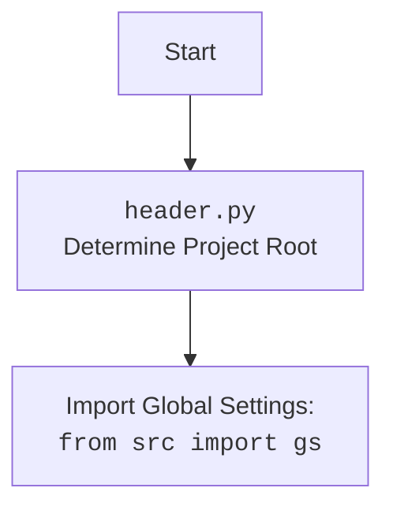

## ИНСТРУКЦИЯ:

Анализируй предоставленный код подробно и объясни его функциональность. Ответ должен включать три раздела:

1. **<алгоритм>**: Опиши рабочий процесс в виде пошаговой блок-схемы, включая примеры для каждого логического блока, и проиллюстрируй поток данных между функциями, классами или методами.
2. **<mermaid>**: Напиши код для диаграммы в формате `mermaid`, проанализируй и объясни все зависимости,
    которые импортируются при создании диаграммы.
    **ВАЖНО!** Убедитесь, что все имена переменных, используемые в диаграмме `mermaid`,
    имеют осмысленные и описательные имена. Имена переменных вроде `A`, `B`, `C`, и т.д., не допускаются!

    **Дополнительно**: Если в коде есть импорт `import header`, добавьте блок `mermaid` flowchart, объясняющий `header.py`:
    ```mermaid
    flowchart TD
        Start --> Header[<code>header.py</code><br> Determine Project Root]

        Header --> import[Import Global Settings: <br><code>from src import gs</code>]
    ```

3. **<объяснение>**: Предоставьте подробные объяснения:
   - **Импорты**: Их назначение и взаимосвязь с другими пакетами `src.`.
   - **Классы**: Их роль, атрибуты, методы и взаимодействие с другими компонентами проекта.
   - **Функции**: Их аргументы, возвращаемые значения, назначение и примеры.
   - **Переменные**: Их типы и использование.
   - Выделите потенциальные ошибки или области для улучшения.

Дополнительно, постройте цепочку взаимосвязей с другими частями проекта (если применимо).

Это обеспечивает всесторонний и структурированный анализ кода.
## Формат ответа: `.md` (markdown)
**КОНЕЦ ИНСТРУКЦИИ**

## <алгоритм>
```mermaid
graph LR
    A[Начало] --> B{Определение корня проекта: set_project_root()};
    B -- Найдено --> C{Обновление sys.path};
    B -- Не найдено --> C;
    C --> D{Загрузка настроек: settings.json};
    D -- Успешно --> E{Загрузка README.MD};
    D -- Ошибка --> E;
    E -- Успешно --> F{Установка переменных};
    E -- Ошибка --> F;
    F --> G[Конец];
   
   
    subgraph "set_project_root()"
    	H[Получение текущего пути] --> I{Поиск маркеров в родительских директориях}
    	I -- Маркер найден --> J[Обновление root_path]
        I -- Маркер не найден --> H
        J --> K[Возврат root_path]
        
    end

   subgraph "Загрузка настроек и readme"
		L[Чтение settings.json]-->M{Обработка ошибки}
        M -- Ошибка -->N[settings = None]
        M-- Успешно --> N[settings = dict]

        O[Чтение README.MD]-->P{Обработка ошибки}
		P -- Ошибка -->Q[doc_str = None]
        P-- Успешно --> Q[doc_str = str]
   
    end

    subgraph "Установка переменных"
		R[Установка __project_name__] --> S[Установка __version__]
        S --> T[Установка __doc__]
        T --> U[Установка __details__]
        U --> V[Установка __author__]
        V --> W[Установка __copyright__]
		W --> X[Установка __cofee__]
    end

```

**Примеры для блоков:**
- **B (set_project_root())**:
    - **Пример с найденным маркером:**  Предположим, что `__file__`  указывает на `/hypotez/src/endpoints/bots/chat_gpt_nodejs/header.py`, а  в `/hypotez` есть  файл `__root__`. Тогда функция вернет `/hypotez`.
    - **Пример без найденного маркера:** Если нет файлов `__root__` или `.git` в родительских директориях, то функция вернет директорию, где находится  `header.py`.
- **D (Загрузка настроек: settings.json):**
    - **Пример успешной загрузки:** Если файл `/hypotez/src/settings.json` существует и содержит корректный JSON, то `settings` будет словарем с настройками.
    - **Пример ошибки:** Если файла `/hypotez/src/settings.json` не существует, или JSON в нем некорректный, `settings` останется `None`.
- **E (Загрузка README.MD):**
    - **Пример успешной загрузки:** Если файл `/hypotez/src/README.MD` существует, то `doc_str` будет строкой с содержимым файла.
    - **Пример ошибки:** Если файла `/hypotez/src/README.MD` не существует, `doc_str` останется `None`.

## <mermaid>
```mermaid
flowchart TD
    Start --> FindRoot[set_project_root()]
    FindRoot --> UpdateSysPath{Update sys.path}
    UpdateSysPath --> LoadSettings{Load settings.json}
    LoadSettings --> LoadReadme{Load README.md}
    LoadReadme --> SetVariables{Set global variables}
    
    classDef file fill:#f9f,stroke:#333,stroke-width:2px
	class FindRoot,LoadSettings,LoadReadme file;
        
     style Start fill:#ccf,stroke:#333,stroke-width:2px
     style SetVariables fill:#ccf,stroke:#333,stroke-width:2px
     style UpdateSysPath fill:#ccf,stroke:#333,stroke-width:2px
     
```



**Анализ зависимостей `mermaid`:**

1.  **`flowchart TD`**:  Определяет тип диаграммы (блок-схема) и направление потока (сверху вниз).
2. **`Start`**:  Начало процесса. Использует `style` для визуального оформления, делая его синим.
3. **`FindRoot[set_project_root()]`**: Вызов функции `set_project_root()`. Класс `file` применен для визуального стиля, выделяя его как операцию работы с файловой системой.
4.  **`UpdateSysPath{Update sys.path}`**: Условный блок, указывающий на обновление пути поиска модулей. Использует стиль, выделяющий его как действие.
5.  **`LoadSettings{Load settings.json}`**:  Загрузка файла настроек. Класс `file` применен для визуального стиля.
6.  **`LoadReadme{Load README.md}`**: Загрузка файла `README.md`. Класс `file` применен для визуального стиля.
7.  **`SetVariables{Set global variables}`**: Установка глобальных переменных. Использует стиль, выделяющий его как действие.

**Анализ дополнительной `mermaid` для `header.py`:**

1.  **`Start`**: Начало процесса, используем стиль для выделения цветом.
2.  **`Header[<code>header.py</code><br> Determine Project Root]`**:  Описание цели файла `header.py` и его основной функции (определение корня проекта).
3.  **`ImportGlobalSettings[Import Global Settings: <br><code>from src import gs</code>]`**:  Указание на импорт глобальных настроек из `src.gs`.

## <объяснение>

**Импорты:**

*   `sys`: Используется для доступа к некоторым переменным и функциям, взаимодействующим с интерпретатором Python. В данном случае `sys.path` используется для добавления пути к корню проекта в список путей поиска модулей.
*   `json`: Используется для работы с данными в формате JSON, в данном случае для загрузки настроек из файла `settings.json`.
*   `packaging.version.Version`: Используется для сравнения версий программного обеспечения. В данном коде не используется напрямую, что можно рассматривать как неиспользуемую зависимость.
*   `pathlib.Path`: Используется для работы с путями в файловой системе в объектно-ориентированном стиле.
*   `src`:  Импортируется `gs` (предположительно "global settings"), который используется для доступа к путям к файлам проекта. Он позволяет получить путь к корневой директории (`gs.path.root`).

**Функции:**

*   `set_project_root(marker_files=('__root__', '.git')) -> Path`:
    *   **Аргументы**: `marker_files` - кортеж с именами файлов или каталогов, которые используются как маркеры для определения корня проекта. По умолчанию (`'__root__'`, `'.git'`).
    *   **Возвращаемое значение**: `Path` - объект, представляющий путь к корневой директории проекта. Если маркеры не найдены, возвращается директория, где находится скрипт.
    *   **Назначение**: Функция ищет корневую директорию проекта, начиная с текущего файла и поднимаясь вверх по дереву каталогов, пока не найдет один из маркеров. Это позволяет правильно определять пути к файлам проекта, независимо от того, где запускается скрипт.
    *   **Пример:** Если файл `header.py` находится в `/path/to/project/src/module/header.py`, а маркер `__root__` находится в `/path/to/project`, то функция вернет `Path('/path/to/project')`.

**Переменные:**

*   `__root__ (Path)`: Хранит путь к корневой директории проекта. Определяется функцией `set_project_root`.
*   `settings (dict)`: Хранит словарь с настройками, загруженными из `settings.json`. Если загрузка не удалась, то равно `None`.
*  `doc_str(str)`: Хранит строковое содержимое файла `README.MD`. Если файл не найден или ошибка чтения, то равно `None`.
*   `__project_name__ (str)`: Название проекта, извлекается из настроек или используется значение по умолчанию `hypotez`.
*  `__version__ (str)`: Версия проекта, извлекается из настроек или используется значение по умолчанию `''`.
*  `__doc__ (str)`: Содержимое файла `README.md` используется как docstring для проекта.
*  `__details__ (str)`: Подробности проекта, всегда равны пустой строке.
*   `__author__ (str)`: Автор проекта, извлекается из настроек или используется значение по умолчанию `''`.
*   `__copyright__ (str)`: Информация об авторских правах проекта, извлекается из настроек или используется значение по умолчанию `''`.
*   `__cofee__ (str)`: Сообщение о поддержке разработчика, извлекается из настроек или используется значение по умолчанию `'Treat the developer to a cup of coffee for boosting enthusiasm in development: https://boosty.to/hypo69'`.

**Цепочка взаимосвязей:**

1.  `header.py`  определяет корень проекта и добавляет его в `sys.path`.
2.  Затем он импортирует `src.gs`, который должен содержать путь к корневой директории (определенному в `header.py`).
3.  `header.py` загружает `settings.json` и `README.MD`  для получения информации о проекте.
4.  На основе этой информации устанавливаются глобальные переменные, такие как имя проекта, версия, автор и т.д.
5.  Этот файл служит для инициализации базовой среды для всех скриптов в проекте, обеспечивая согласованный доступ к ресурсам и информации о проекте.

**Потенциальные ошибки и области для улучшения:**

*   **Обработка исключений:** Используется оператор `...` в блоках `except`, что делает исключения неявными. Лучше логировать ошибки или использовать конкретную обработку ошибок.
*   **Неиспользуемая зависимость:**  `packaging.version.Version`  импортируется, но нигде не используется, что говорит о неоптимизированных зависимостях.
* **Скрытая зависимость:** Использование `src.gs`, без явного определения этого модуля в коде, предполагает что модуль существует и корректно настроен. Это может привести к ошибкам, если `src.gs` не инициализирован или настроен неправильно.
*   **Область видимости переменных:** Использование двойного подчеркивания `__`  в именах переменных обычно обозначает "магические методы"  в Python, что не совсем уместно в данном случае. Лучше использовать обычные имена переменных, чтобы не путать с магическими методами.
*  **Ограниченность настроек:** Код загружает настройки из `settings.json`.  Отсутствует обработка случаев, когда требуется несколько вариантов настроек.
* **Отсутствие проверок:** Нет валидации данных, полученных из JSON. Это может привести к ошибкам, если `settings.json` содержит некорректные данные.
*  **Жёстко заданные пути:** Пути  `'src/settings.json'` и `'src/README.MD'`  заданы в коде, что снижает гибкость. Возможно, следует использовать `gs` для формирования путей.