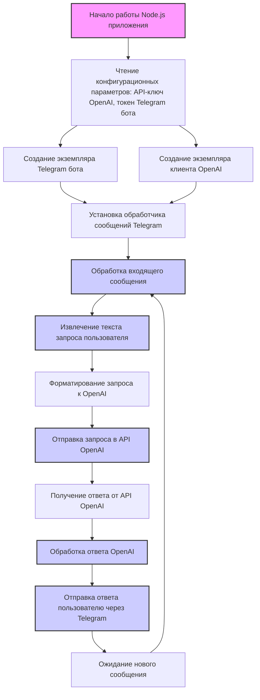

# Анализ реализации ChatGPT бота на Node.js

## ИНСТРУКЦИЯ:

Анализируем реализацию ChatGPT бота на Node.js, представленную в статье [https://habr.com/ru/companies/selectel/articles/731692/](https://habr.com/ru/companies/selectel/articles/731692/).

## <алгоритм>

1.  **Инициализация:**
    *   Начало работы Node.js приложения.
    *   Чтение конфигурационных параметров (например, API-ключ OpenAI, токен Telegram бота) из переменных окружения или файла конфигурации.
    *   Создание экземпляра Telegram бота с использованием токена.
    *   Создание экземпляра клиента OpenAI с использованием API-ключа.
    *   Установка обработчика событий на входящие сообщения от Telegram.
2.  **Обработка входящего сообщения:**
    *   Когда бот получает сообщение от пользователя в Telegram, запускается обработчик событий.
    *   Из сообщения извлекается текст запроса пользователя.
    *   Опционально: Проводится базовая проверка формата сообщения, удаление команд бота.
3.  **Отправка запроса в OpenAI:**
    *   Текст запроса пользователя передается в API OpenAI.
    *   Формируется запрос к API OpenAI, включая текст запроса, модель (например, `gpt-3.5-turbo`), ограничения на длину ответа.
4.  **Получение ответа от OpenAI:**
    *   API OpenAI обрабатывает запрос и возвращает сгенерированный текст.
    *   Ответ обрабатывается (например, извлечение текста ответа из JSON).
    *   Проводится проверка на наличие ответа, в случае ошибки API OpenAI возвращается сообщение об ошибке.
5.  **Отправка ответа пользователю:**
    *   Сгенерированный текст ответа отправляется обратно пользователю через Telegram бота.
    *   Обрабатываются ошибки при отправке сообщений пользователю, в случае их наличия.
6.  **Цикл обработки сообщений:**
    *   Бот переходит в режим ожидания следующего сообщения от пользователя.
    *   Весь процесс повторяется для каждого нового сообщения.

### Пример потока данных:
Пользователь (Telegram) -> Telegram Бот (Node.js) -> OpenAI API -> Telegram Бот (Node.js) -> Пользователь (Telegram)

## <mermaid>

**Объяснение зависимостей `mermaid`:**

*   **`Start`**: Начало процесса, обозначает точку входа в приложение.
*   **`ReadConfig`**: Процесс чтения и загрузки конфигурационных параметров, таких как API-ключи и токены.
*   **`CreateTelegramBot`**:  Создание экземпляра бота Telegram, необходимого для взаимодействия с API Telegram.
*   **`CreateOpenAIClient`**: Создание клиента OpenAI для взаимодействия с API OpenAI.
*   **`SetMessageHandler`**: Установка обработчика для входящих сообщений Telegram, связывающего Telegram бота и логику обработки.
*   **`ProcessMessage`**: Основной блок, обрабатывающий полученное сообщение от пользователя.
*   **`ExtractText`**: Извлечение текста запроса из входящего сообщения, необходимого для отправки в OpenAI.
*   **`FormatRequest`**: Формирование запроса к OpenAI, включая текст запроса и необходимые параметры.
*   **`SendToOpenAI`**: Отправка запроса к API OpenAI, для получения ответа от языковой модели.
*   **`ReceiveFromOpenAI`**: Получение ответа от API OpenAI.
*   **`HandleResponse`**: Обработка полученного ответа, извлечение нужного текста.
*   **`SendToTelegram`**: Отправка обработанного ответа пользователю через Telegram.
*   **`WaitNewMessage`**: Ожидание следующего сообщения от пользователя, обеспечивая непрерывную работу бота.

## <объяснение>

**Импорты (в коде не показаны, описаны на основе статьи):**

*   **`dotenv`**: Пакет для загрузки переменных окружения из файла `.env`. Это позволяет хранить конфиденциальную информацию (токены, ключи) отдельно от кода.
*   **`node-telegram-bot-api`**: Пакет для создания Telegram ботов. Предоставляет API для взаимодействия с Telegram Bot API.
*   **`openai`**: Пакет для работы с OpenAI API, используемый для вызова моделей GPT.

**Классы (в коде не показаны, описаны на основе статьи):**

*   **TelegramBot**:
    *   **Роль**: Представляет Telegram бота.
    *   **Атрибуты**: Токен бота, экземпляр `TelegramBotApi`.
    *   **Методы**: Отправка сообщений пользователю, установка обработчика сообщений.
    *   **Взаимодействие**: Принимает сообщения от пользователей и отправляет ответы.
*   **OpenAIClient**:
    *   **Роль**: Представляет клиента OpenAI.
    *   **Атрибуты**: API-ключ OpenAI, экземпляр `OpenAIApi`.
    *   **Методы**: Отправка запросов к OpenAI API, получение ответов.
    *   **Взаимодействие**: Отправляет текстовые запросы в OpenAI и обрабатывает полученные ответы.

**Функции (в коде не показаны, описаны на основе статьи):**

*   **`main()`**:
    *   **Аргументы**: Нет.
    *   **Возвращает**: Нет.
    *   **Назначение**: Основная функция, которая инициализирует бота и запускает цикл обработки сообщений.
*   **`handleMessage(msg)`**:
    *   **Аргументы**: Объект сообщения `msg` из Telegram.
    *   **Возвращает**: Нет.
    *   **Назначение**: Обрабатывает полученное сообщение, извлекает текст, отправляет запрос в OpenAI и отправляет ответ пользователю.
    *   **Пример**: Вызывается при получении каждого нового сообщения от пользователя.
*   **`sendRequestToOpenAI(prompt)`**:
    *   **Аргументы**: Строка `prompt` - текст запроса для OpenAI.
    *   **Возвращает**: Строку с ответом от OpenAI или `null` в случае ошибки.
    *   **Назначение**: Формирует запрос к API OpenAI и получает ответ.
    *    **Пример:** `sendRequestToOpenAI("Расскажи о ChatGPT")`.
*  **`sendTelegramMessage(chatId, text)`**
    *   **Аргументы**: `chatId` - ID чата пользователя, `text` - текст сообщения для отправки.
    *   **Возвращает**: Нет.
    *    **Назначение**: Отправляет сообщение пользователю через Telegram API.
    *    **Пример:** `sendTelegramMessage(1234567, "Привет, как дела?")`

**Переменные (в коде не показаны, описаны на основе статьи):**

*   **`telegramToken`**: Строка, содержащая токен для доступа к Telegram Bot API.
*   **`openAIApiKey`**: Строка, содержащая API-ключ OpenAI.
*   **`bot`**: Экземпляр `TelegramBot`, представляющий Telegram бота.
*   **`openai`**: Экземпляр `OpenAIClient`, представляющий клиента OpenAI.
*   **`chatId`**: Числовое значение, уникальный идентификатор чата в Telegram.
*   **`prompt`**: Строка, содержащая текст запроса пользователя к OpenAI.
*   **`response`**: Строка, содержащая текст ответа от OpenAI.
*   **`text`**: Строка, содержащая текст сообщения для пользователя.

**Потенциальные ошибки и области для улучшения:**

*   **Обработка ошибок**: В коде может отсутствовать полноценная обработка ошибок при взаимодействии с OpenAI API и Telegram Bot API, что может привести к неожиданному поведению. Необходимо добавить try/catch блоки и логирование.
*   **Безопасность**: Хранение токенов и API-ключей в переменных окружения – это шаг в правильном направлении, но их следует защищать ещё более тщательно (например, используя сервисы управления секретами).
*   **Обработка контекста**: Бот может не помнить историю разговора, каждый запрос обрабатывается отдельно. Можно реализовать кэширование контекста, чтобы бот "запоминал" предыдущие сообщения.
*   **Скорость обработки**: Запросы к API OpenAI могут занимать время, что может привести к задержкам в ответах. Можно добавить индикаторы загрузки или асинхронную обработку сообщений.
*   **Масштабируемость**: В данной реализации бот может иметь сложности при обработке большого количества одновременных запросов. Можно рассмотреть использование очередей сообщений или многопоточности.

**Взаимосвязь с другими частями проекта (если применимо):**

В данном случае, код является самодостаточным ботом, и тесно интегрирован только с пакетами, описанными выше: `dotenv`, `node-telegram-bot-api`, `openai`.

**Цепочка взаимосвязей:**

1.  Пользователь отправляет сообщение в Telegram.
2.  Telegram Bot API пересылает сообщение в приложение Node.js.
3.  Приложение Node.js обрабатывает сообщение, извлекает текст запроса.
4.  Приложение Node.js отправляет запрос в OpenAI API.
5.  OpenAI API обрабатывает запрос и возвращает текст ответа.
6.  Приложение Node.js получает ответ от OpenAI API.
7.  Приложение Node.js отправляет ответ через Telegram Bot API пользователю.

**Заключение:**

Данный анализ предоставляет подробное описание того, как работает бот ChatGPT на Node.js, опираясь на представленную статью. Он описывает алгоритм, диаграммы связей, а также объясняет основные концепции, включая импорты, классы, функции, переменные, и потенциальные проблемы. Это позволяет лучше понять архитектуру и функциональность бота.