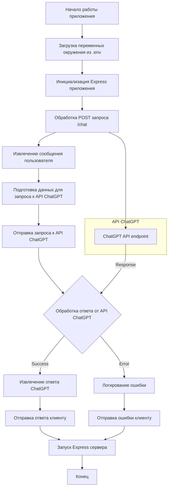

## АНАЛИЗ КОДА: Реализация ChatGPT бота средствами NodeJS

### <алгоритм>
1. **Инициализация:**
   -   Начало работы NodeJS приложения.
   -   Импорт необходимых модулей, включая `express` для веб-сервера, `axios` для HTTP запросов к API ChatGPT и `dotenv` для загрузки переменных окружения.
   -   Загрузка переменных окружения из `.env` файла (например, `API_KEY`).
   -   Инициализация Express приложения `app`.

2. **Обработка POST запроса `/chat`:**
   -   Получение POST запроса по адресу `/chat`.
   -   Извлечение текста сообщения пользователя из тела запроса.
   -   Подготовка данных для запроса к API ChatGPT:
        -   Установка заголовка `Authorization` с использованием API ключа.
        -   Формирование тела запроса с сообщением пользователя.
        -   Пример данных:
             ```json
            {
             "model": "gpt-3.5-turbo",
             "messages": [{ "role": "user", "content": "Привет, как дела?" }]
            }
             ```

3. **Отправка запроса к API ChatGPT:**
   -   Использование `axios.post` для отправки HTTP POST запроса к API ChatGPT.
   -   Указание URL API ChatGPT.
   -   Передача заголовков и данных запроса.
   -   Пример запроса:
      ```javascript
      axios.post('https://api.openai.com/v1/chat/completions', {
          headers: {
              'Authorization': `Bearer ${process.env.API_KEY}`,
              'Content-Type': 'application/json'
              },
           data:{
              "model": "gpt-3.5-turbo",
                "messages": [{ "role": "user", "content": "Привет, как дела?" }]
            }
      }).then(response => {...}).catch(error => {...})
      ```

4. **Обработка ответа от API ChatGPT:**
   -   В случае успешного запроса, извлечение ответа ChatGPT из тела ответа.
      -   Пример ответа:
            ```json
               {
                    "id": "chatcmpl-123",
                   "object": "chat.completion",
                   "created": 1677652288,
                    "model": "gpt-3.5-turbo-0613",
                   "choices": [{
                      "index": 0,
                       "message": {
                            "role": "assistant",
                           "content": "Привет! У меня всё хорошо, спасибо, что спросили. А у вас?"
                       },
                       "finish_reason": "stop"
                       }],
                   "usage": {
                        "prompt_tokens": 9,
                       "completion_tokens": 12,
                      "total_tokens": 21
                    }
               }
            ```
   -   Отправка ответа ChatGPT пользователю в формате JSON.
        - Пример ответа клиенту:
            ```json
                {
                   "message": "Привет! У меня всё хорошо, спасибо, что спросили. А у вас?"
                }
            ```
   -   В случае ошибки, вывод ошибки в консоль и отправка ошибки клиенту в формате JSON.

5. **Запуск сервера:**
   -   Запуск Express сервера на порту, указанном в переменной окружения `PORT` или на порту 3000 по умолчанию.
   -   Вывод сообщения в консоль об успешном запуске сервера.

### <mermaid>


### <объяснение>

**Импорты:**

-   **`express`**: Используется для создания веб-сервера и обработки HTTP запросов. Этот пакет является основой для обработки маршрутов и создания RESTful API.
-   **`axios`**: Применяется для выполнения HTTP запросов к API ChatGPT. `axios` упрощает отправку POST запросов с заголовками и данными, а также обработку ответов.
-   **`dotenv`**: Служит для загрузки переменных окружения из `.env` файла. Это позволяет хранить конфиденциальные данные (например, API ключи) вне исходного кода.

**Классы:**

В данном коде классы не используются, поскольку вся функциональность реализуется через функции и middleware Express.

**Функции:**

-   **`app.post('/chat', async (req, res) => {...})`**: Это функция обработчик POST запросов по адресу `/chat`. 
     -   **Аргументы**: Принимает объект `req` (запрос) и объект `res` (ответ).
     -   **Назначение**:
         -   Извлекает сообщение пользователя из тела запроса.
         -   Формирует запрос к API ChatGPT.
         -   Отправляет запрос и обрабатывает ответ.
         -   Возвращает ответ ChatGPT пользователю или ошибку.
         -   Использует `async/await` для работы с асинхронными операциями.
-   **`app.listen(port, () => {...})`**: Запускает сервер Express на указанном порту.
      -  **Аргументы**: принимает `port` (номер порта) и callback функцию.
      -  **Назначение**:
         -  Запускает HTTP сервер для обработки запросов.
         -  Выводит в консоль сообщение об успешном запуске сервера.

**Переменные:**

-   **`app`**: Экземпляр Express приложения, через который настраиваются маршруты и запускается сервер.
-   **`port`**: Номер порта, на котором будет запущен сервер. Получается из переменной окружения `PORT` или устанавливается в 3000 по умолчанию.
-   **`API_KEY`**: API ключ для доступа к API ChatGPT, полученный из переменных окружения.
-   **`message`**: Сообщение, отправленное пользователем. Извлекается из тела запроса.
-   **`response`**: Ответ, полученный от API ChatGPT.
-   **`chatGPTResponse`**: Сообщение, извлеченное из ответа API ChatGPT.
-   **`req`**: Объект HTTP запроса Express, содержащий данные запроса.
-   **`res`**: Объект HTTP ответа Express, используется для отправки ответа клиенту.

**Потенциальные ошибки и области для улучшения:**

-   **Обработка ошибок:** Код содержит базовую обработку ошибок, но ее можно улучшить, добавив логирование и более подробные сообщения об ошибках для пользователя.
-   **Валидация данных:** Необходимо добавить валидацию входных данных (сообщения пользователя), чтобы избежать некорректных запросов к API ChatGPT.
-   **Конфигурация API ChatGPT**: Следует вынести параметры API ChatGPT (например, `model`) в переменные окружения или конфигурационный файл.
-   **Управление API ключами:** Использовать более безопасные методы хранения API ключей, например, с использованием секретов Kubernetes или других сервисов для управления секретами.
-   **Обработка разных моделей:** Позволить пользователю выбирать модель ChatGPT (gpt-3.5-turbo, gpt-4 и т.д.).
-   **Масштабируемость:** Код не учитывает масштабируемость. Если ожидается большое количество запросов, нужно продумать механизм для распределения нагрузки.

**Цепочка взаимосвязей с другими частями проекта:**

-   Этот код является частью API, который, возможно, используется клиентским приложением, например, веб-приложением или чат-ботом в Telegram.
-   Код взаимодействует с API ChatGPT, являясь посредником между пользователем и моделью языка.
-   В данном контексте код может также взаимодействовать с системой управления конфигурацией для получения переменных окружения, которые необходимы для работы бота.

Этот анализ предоставляет всестороннее понимание логики работы и архитектуры представленного кода, а также рассматривает возможные улучшения и его место в контексте более крупного проекта.