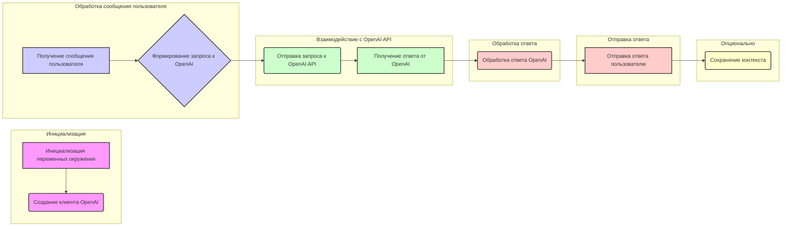

# Анализ кода реализации ChatGPT бота на Node.js

## 1. <алгоритм>

1. **Инициализация:**
   - Настройка переменных окружения (например, API-ключ OpenAI).
   - Создание экземпляра клиента OpenAI.
   - Определение функции обработки сообщений.

2. **Получение сообщения пользователя:**
    -  Бот ожидает сообщения от пользователя, например через веб-сокет или HTTP запрос.
    -  При получении сообщения, текст сообщения извлекается.

3. **Формирование запроса к OpenAI:**
    - Текст сообщения пользователя форматируется в запрос, понятный для OpenAI API.
    - Можно добавлять контекст (история предыдущих сообщений) для сохранения "памяти" у бота.
    -  Запрос может содержать параметры, такие как модель, максимальное количество токенов ответа.

4. **Отправка запроса к OpenAI API:**
    - Запрос отправляется к OpenAI API с помощью клиента OpenAI.

5. **Получение ответа от OpenAI:**
   - Бот ожидает ответ от OpenAI.
   - Ответ может содержать сгенерированный текст и метаданные.

6. **Обработка ответа OpenAI:**
   - Из ответа извлекается текст сгенерированного сообщения.
   - Ответ может дополнительно обрабатываться, например, для удаления лишних символов.

7. **Отправка ответа пользователю:**
    - Бот отправляет обработанный ответ пользователю.
    -  Это может быть отправка сообщения в чат, ответ на HTTP запрос или любое другое взаимодействие.

8. **(Опционально) Сохранение контекста:**
   - Если бот должен помнить предыдущие сообщения, контекст разговора (историю сообщений) обновляется и сохраняется для следующего запроса.

**Примеры:**

*   **Инициализация:** `const openai = new OpenAI({ apiKey: process.env.OPENAI_API_KEY });`
*   **Получение сообщения пользователя:**  `const message = event.message.text;`
*   **Формирование запроса:** `const completion = await openai.chat.completions.create({ messages, model: "gpt-3.5-turbo", max_tokens: 100 });`
*   **Обработка ответа:**  `const response = completion.choices[0].message.content;`
*   **Отправка ответа пользователю:** `return { text: response };`

## 2. <mermaid>



**Анализ зависимостей `mermaid`:**

Диаграмма в формате `mermaid` представляет собой блок-схему, отображающую последовательность действий в боте. Каждый блок представляет собой этап обработки сообщения.

*   `graph LR`: Указывает, что диаграмма является направленным графом, отображаемым слева направо.
*   `subgraph`: Используется для группировки блоков по этапам обработки.
*   `-->`: Обозначает направление потока данных между блоками.
*   `A`, `B`, `C` и т.д.: Представляют собой блоки, каждый из которых соответствует определенному действию или этапу.
*   `style`: Определяет стили для отдельных блоков, например, цвет заливки и обводки.

Диаграмма ясно показывает, как данные (сообщение пользователя) проходят через различные этапы, от получения до отправки ответа.

## 3. <объяснение>

На основе статьи с Хабра, реализация бота ChatGPT на Node.js будет включать следующие компоненты:

### Импорты:

1.  **`openai` (из пакета `openai`):**
    *   **Назначение**:  Основной клиент для взаимодействия с OpenAI API.
    *   **Взаимосвязь с другими частями:**  Этот пакет используется для отправки запросов к OpenAI и получения ответов.
    *   Пример: `const OpenAI = require('openai');`
        `const openai = new OpenAI({ apiKey: process.env.OPENAI_API_KEY });`

2.  **`dotenv` (из пакета `dotenv`):**
    *   **Назначение:** Позволяет загружать переменные окружения из `.env` файла, что безопасно хранит API ключи и другую конфиденциальную информацию.
    *  **Взаимосвязь с другими частями**: Необходим для безопасного хранения API ключа OpenAI
   *  Пример `require('dotenv').config();`

3.  **Другие возможные импорты (зависит от конкретной реализации):**
    *   **`http` или `express`:** Для создания HTTP сервера, если бот будет принимать запросы через HTTP.
    *   **`ws`:** Для работы с веб-сокетами, если бот будет взаимодействовать через веб-сокеты.
    *   **`json`:** Для парсинга JSON-данных, которые возвращает OpenAI.

### Классы:

1.  **`OpenAI` (из пакета `openai`):**
    *   **Роль:** Клиент для взаимодействия с OpenAI API.
    *   **Атрибуты:** Ключ API.
    *   **Методы:** Например, `chat.completions.create()` для генерации текста на основе сообщений.
    *   **Взаимодействие:** Этот класс используется для отправки запросов к OpenAI и получения ответов.

### Функции:

1.  **Функция обработки сообщений (handler):**
    *   **Аргументы:** Объект сообщения пользователя (например, текст сообщения).
    *   **Возвращаемые значения:** Ответ бота в виде текста.
    *   **Назначение:** Принимает сообщение пользователя, отправляет его в OpenAI, получает и обрабатывает ответ, и отправляет его пользователю.
    *   **Пример**:
        ```javascript
        async function processMessage(message){
          const completion = await openai.chat.completions.create({ messages: [{ role: "user", content: message}], model: "gpt-3.5-turbo" })
          return completion.choices[0].message.content
        }
        ```

### Переменные:

1.  **`OPENAI_API_KEY`:**
    *   **Тип:** Строка.
    *   **Использование:** API-ключ для доступа к OpenAI API. Получается из файла `.env`.
2.  **`openai`:**
    *   **Тип:** Объект (экземпляр класса `OpenAI`).
    *   **Использование:** Используется для отправки запросов к OpenAI API.
3.  **`messages`:**
    *   **Тип:** Массив объектов.
    *   **Использование:** Представляет историю сообщений в беседе с ботом. Каждое сообщение имеет `role` (например, "user", "assistant") и `content`.

### Потенциальные ошибки и области для улучшения:

1.  **Отсутствие обработки ошибок:** Код может сломаться, если API OpenAI не ответит или ответит с ошибкой. Необходимо обрабатывать возможные ошибки при взаимодействии с OpenAI API.
2.  **Отсутствие контекста:** Бот будет "забывать" предыдущие сообщения, если не сохранять контекст разговора. Для этого нужно реализовать механизм сохранения истории сообщений и передавать ее при каждом запросе.
3.  **Слишком простые запросы:** Запросы к OpenAI могут быть улучшены, добавив дополнительный контекст или используя более сложные форматы запросов, чтобы получить более точные и полезные ответы.
4.  **Безопасность:** API-ключ не должен храниться в коде, следует использовать переменные окружения.
5.  **Масштабируемость:** Если будет много запросов, необходимо оптимизировать взаимодействие с OpenAI API и возможно использовать очереди сообщений для обработки запросов.
6.  **Отсутствие валидации:** Необходимо валидировать пользовательские данные, поступающие в обработчик.

### Взаимосвязь с другими частями проекта:

*   Данный бот может являться частью большего приложения. Он может быть интегрирован с различными интерфейсами, например веб-сервер, телеграм бот, discord бот и т.д.
*   Бот может взаимодействовать с базой данных для сохранения истории сообщений или других данных.

**В заключение**, код реализации ChatGPT бота на Node.js предполагает создание клиента OpenAI, получение сообщений от пользователя, отправку запроса к OpenAI API, обработку и отправку ответа.