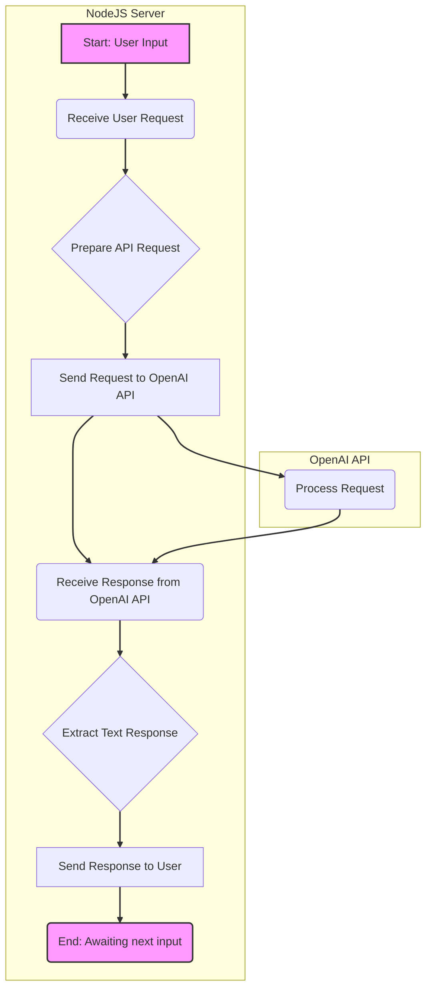

## Анализ реализации ChatGPT бота средствами NodeJS

### <алгоритм>

1.  **Начало**: Пользователь взаимодействует с ботом, отправляя текстовый запрос.
2.  **Обработка запроса**:
    *   Запрос пользователя принимается сервером NodeJS.
    *   Сервер формирует запрос к API ChatGPT, включая текст запроса и параметры модели (например, `gpt-3.5-turbo`).
    *   Пример: Пользователь вводит "Расскажи про NodeJS". Сервер формирует запрос `{ "model": "gpt-3.5-turbo", "messages": [{"role": "user", "content": "Расскажи про NodeJS"}] }`.
3.  **Взаимодействие с OpenAI API**:
    *   Сервер отправляет запрос к API OpenAI.
    *   OpenAI API обрабатывает запрос и генерирует ответ.
    *   Пример: OpenAI возвращает ответ с текстом "Node.js — это программная платформа, основанная на движке JavaScript V8…".
4.  **Обработка ответа**:
    *   Сервер получает ответ от OpenAI API.
    *   Сервер извлекает текстовое сообщение из ответа.
    *   Пример: Из ответа OpenAI извлекается текст "Node.js — это программная платформа, основанная на движке JavaScript V8…".
5.  **Отправка ответа пользователю**:
    *   Сервер отправляет текстовое сообщение пользователю.
    *   Пример: Бот отображает пользователю "Node.js — это программная платформа, основанная на движке JavaScript V8…".
6.  **Конец**: Бот ожидает следующего запроса пользователя.

### <mermaid>

**Объяснение зависимостей в диаграмме `mermaid`:**

*   **`NodeJS Server`**: Обозначает сервер NodeJS, который обрабатывает запросы пользователей и взаимодействует с OpenAI API.
*   **`OpenAI API`**: Обозначает API OpenAI, который обрабатывает запросы на генерацию текста.
*   **`A [Start: User Input]`**: Начало процесса, где пользователь вводит запрос.
*   **`B (Receive User Request)`**: Функция или блок кода, получающий запрос от пользователя.
*   **`C {Prepare API Request}`**: Функция или блок кода, формирующий запрос для OpenAI API (включая текст запроса и параметры модели).
*   **`D [Send Request to OpenAI API]`**: Функция или блок кода, отправляющий запрос к OpenAI API.
*   **`E (Receive Response from OpenAI API)`**: Функция или блок кода, получающий ответ от OpenAI API.
*   **`F {Extract Text Response}`**: Функция или блок кода, извлекающий текст ответа из ответа OpenAI API.
*   **`G [Send Response to User]`**: Функция или блок кода, отправляющий ответ пользователю.
*   **`H (End: Awaiting next input)`**: Завершение обработки запроса, бот ожидает следующего ввода.
*   **`I (Process Request)`**: Функция или блок кода, обрабатывающий запрос внутри OpenAI API.

Диаграмма показывает поток данных от пользователя через NodeJS сервер к OpenAI API и обратно.

### <объяснение>

#### Импорты

В предоставленном коде отсутствует явный код импорта. Однако, основываясь на контексте, подразумевается использование как минимум следующих библиотек:

*   **`http` или `https`**: (NodeJS core) для создания HTTP сервера, который будет принимать запросы пользователей.
*   **`openai`**: (не core, нужно установить) для взаимодействия с API OpenAI.
*   **`dotenv`**: (не core, нужно установить) для загрузки переменных окружения (например, API ключ OpenAI) из файла `.env`.

Эти импорты неявные, но необходимы для работы функциональности бота.

#### Классы

В предоставленном контексте не указаны какие-либо пользовательские классы, но подразумевается использование класса `OpenAI` из библиотеки `openai`. Этот класс предоставляет методы для взаимодействия с OpenAI API:

*   **`OpenAI`**:
    *   **Атрибуты**: Ключ API OpenAI (`apiKey`).
    *   **Методы**: `chat.completions.create` для отправки запросов на генерацию текста.

#### Функции

В контексте реализации подразумеваются следующие функции:

1.  **Обработчик HTTP запросов** (callback функции для сервера). Принимает запрос пользователя и отправляет ответ.
2.  **Функция для взаимодействия с API OpenAI**:
    *   **Аргументы**: Текст запроса пользователя, параметры модели.
    *   **Возвращаемое значение**: Ответ от API OpenAI в формате JSON.
3.  **Функция для извлечения текста ответа**:
    *   **Аргументы**: Ответ от API OpenAI.
    *   **Возвращаемое значение**: Текст ответа.

#### Переменные

*   **`apiKey`**: Переменная, хранящая API ключ OpenAI. Обычно загружается из переменных окружения.
*   **`model`**: Строка, определяющая модель ChatGPT (например, `"gpt-3.5-turbo"`).
*   **`messages`**: Массив объектов, содержащий сообщения для модели.
    *   Каждый объект имеет структуру `{role: 'user' | 'assistant', content: string}`.
*   **`response`**: Переменная, хранящая ответ от OpenAI API.
*   **`text`**: Строка, хранящая текстовый ответ, извлеченный из ответа API.

#### Потенциальные ошибки и области для улучшения

*   **Обработка ошибок**: В коде может отсутствовать полноценная обработка ошибок при запросах к OpenAI API (например, ошибка сети, неверный ключ API, превышение лимита).
*   **Безопасность**: API ключ должен храниться безопасно, например, в переменных окружения и не должен попадать в открытый доступ.
*   **Асинхронность**: Работа с API OpenAI асинхронна, поэтому необходимо корректно обрабатывать Promise/Async/Await.
*   **Логирование**: Отсутствует логирование для отладки и мониторинга.
*   **Масштабируемость**: Код может быть не готов к масштабированию для большого количества пользователей.
*   **Надежность**: Отсутствуют механизмы обработки ошибок в случае сбоя API, а также механизм перезапуска сервиса.

#### Взаимосвязь с другими частями проекта

Обычно этот бот является частью большего веб-приложения или микросервиса, который может включать:

*   **База данных**: Для хранения истории разговоров.
*   **API Gateway**: Для маршрутизации запросов и аутентификации.
*   **Система мониторинга**: Для отслеживания производительности бота.
*   **Конфигурация**: Для хранения параметров бота и API ключа.

#### Заключение

Реализация ChatGPT бота на NodeJS состоит из взаимодействия с HTTP сервером, который обрабатывает запросы пользователя, формирует запросы к OpenAI API и отправляет ответы пользователю. Код требует обработки ошибок, безопасности и масштабируемости.