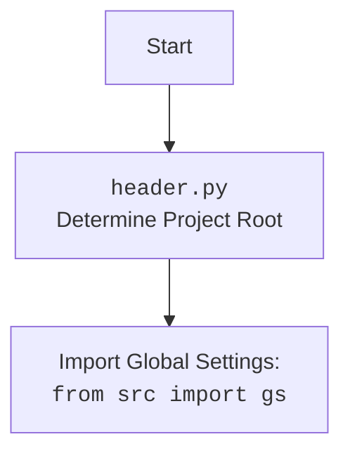

## <алгоритм>

1.  **Инициализация**:
    *   Устанавливаются глобальные переменные и импортируются необходимые библиотеки, включая `telegram`, `header`, `src.gs`, `src.ai.openai.model.training.Model`, `src.utils.jjson`, `src.logger.logger`, `speech_recognition`, `requests`, `pydub`, `gtts`, `src.utils.convertors.tts`.
    *   Создается экземпляр класса `Model` для работы с моделью обучения.
    *   Извлекается токен Telegram-бота из глобальных настроек `gs.credentials.telegram.bot_token` и присваивается переменной `TELEGRAM_TOKEN`.
    *   Пример: `TELEGRAM_TOKEN = "1234567890:ABCDEFGHIJKLMNOPQRSTUVWXYZ"`

2.  **Обработка команды `/start`**:
    *   Функция `start` вызывается при получении команды `/start`.
    *   Отправляет пользователю приветственное сообщение: "Hello! I am your simple bot. Type /help to see available commands."
    *   Пример: Пользователь вводит `/start` -> бот отправляет "Hello! I am your simple bot. Type /help to see available commands."

3.  **Обработка команды `/help`**:
    *   Функция `help_command` вызывается при получении команды `/help`.
    *   Отправляет пользователю список доступных команд: "/start - Start the bot\\n/help - Show this help message"
    *   Пример: Пользователь вводит `/help` -> бот отправляет "Available commands:\\n/start - Start the bot\\n/help - Show this help message"

4.  **Обработка текстовых сообщений**:
    *   Функция `handle_message` вызывается при получении текстового сообщения.
    *   Получает текст сообщения от пользователя.
    *   Отправляет полученный текст в модель `model.send_message`.
    *   Получает ответ от модели.
    *   Отправляет полученный ответ пользователю.
    *   Пример: Пользователь вводит "Как дела?" -> `model.send_message("Как дела?")` -> бот отправляет ответ модели

5.  **Обработка голосовых сообщений**:
    *   Функция `handle_voice` вызывается при получении голосового сообщения.
    *   Получает файл голосового сообщения.
    *   Использует функцию `recognizer` для распознавания речи из голосового сообщения.
    *   Отправляет распознанный текст в модель `model.send_message`.
    *   Получает ответ от модели.
    *    Использует функцию `text_to_speech` для синтеза речи из ответа.
    *   Отправляет ответ пользователя в виде аудио сообщения.
    *   Пример: Пользователь отправляет голосовое сообщение "Привет" -> `recognizer` распознает "Привет" -> `model.send_message("Привет")` -> бот отправляет ответ модели и аудио-версию ответа.

6.  **Обработка документов**:
    * Функция `handle_document` вызывается при получении документа.
    * Получает файл документа.
    * Сохраняет файл локально во временную папку
    * Считывает содержимое файла.
    * Отправляет содержимое файла в модель `model.send_message` для обучения.
    * Получает ответ от модели.
    * Отправляет полученный ответ пользователю.
    * Пример: Пользователь отправляет текстовый файл `training.txt` -> содержимое `training.txt` передается в `model.send_message` -> бот отправляет ответ модели.

7.  **Запуск бота**:
    *   Функция `main` создает приложение Telegram-бота с помощью `Application.builder()` и устанавливает токен.
    *   Регистрирует обработчики команд: `start` для `/start`, `help_command` для `/help`.
    *   Регистрирует обработчики сообщений: `handle_message` для текста, `handle_voice` для голосовых сообщений, `handle_document` для документов.
    *   Запускает бота в режиме прослушивания входящих сообщений `application.run_polling()`.

## <mermaid>

```mermaid
flowchart TD
    Start[Start Telegram Bot] --> Init[Initialize: Load Libraries and Settings, Create Model Instance]
    Init --> TelegramToken[Get Telegram Token]
    TelegramToken --> ApplicationBuilder[Create Telegram Application Builder]
    ApplicationBuilder --> CommandHandlers[Register Command Handlers: /start, /help]
    CommandHandlers --> MessageHandlers[Register Message Handlers: Text, Voice, Document]
    MessageHandlers --> RunPolling[Start Telegram Bot Polling]

    subgraph "Command Handlers"
        CommandHandlerStart[/start Command Handler/]
        CommandHandlerHelp[/help Command Handler/]
        CommandHandlerStart --> StartFunction[start(update, context)]
        CommandHandlerHelp --> HelpFunction[help_command(update, context)]
        StartFunction --> SendStartMessage[Send "Hello! I am your simple bot..." Message to user]
        HelpFunction --> SendHelpMessage[Send "Available commands..." Message to user]
    end

    subgraph "Message Handlers"
        MessageHandlerText[Text Message Handler]
        MessageHandlerVoice[Voice Message Handler]
         MessageHandlerDocument[Document Message Handler]
        MessageHandlerText --> HandleTextMessage[handle_message(update, context)]
        MessageHandlerVoice --> HandleVoiceMessage[handle_voice(update, context)]
        MessageHandlerDocument --> HandleDocumentMessage[handle_document(update, context)]
        HandleTextMessage --> GetText[Get Text from Message]
        GetText --> SendMessageToModelText[model.send_message(text)]
        SendMessageToModelText --> GetModelResponseText[Get Response from Model]
        GetModelResponseText --> SendResponseTextMessage[Send Response Text Message to User]

       HandleVoiceMessage --> GetVoiceFile[Get Voice File from Message]
       GetVoiceFile --> RecognizeSpeech[recognizer(audio_url)]
       RecognizeSpeech --> SendMessageToModelVoice[model.send_message(recognized_text)]
        SendMessageToModelVoice --> GetModelResponseVoice[Get Response from Model]
       GetModelResponseVoice --> TextToSpeechVoice[text_to_speech(response)]
         TextToSpeechVoice --> SendResponseAudioMessage[Send Response Audio Message to User]
         
        HandleDocumentMessage --> GetDocumentFile[Get Document File from Message]
        GetDocumentFile --> SaveDocumentFile[Save Document File to temp]
         SaveDocumentFile --> ReadDocumentFile[Read Document File]
          ReadDocumentFile --> SendMessageToModelDocument[model.send_message(file_content)]
          SendMessageToModelDocument --> GetModelResponseDocument[Get Response from Model]
         GetModelResponseDocument --> SendResponseDocumentMessage[Send Response Text Message to User]

    end
    RunPolling --> End[End Telegram Bot]
        
    
```



## <объяснение>

**Импорты:**

*   `pathlib.Path`: Работа с путями к файлам и директориям.
*   `tempfile`: Создание временных файлов и директорий.
*   `asyncio`:  Для асинхронных операций.
*   `telegram`: Основная библиотека для работы с Telegram Bot API. Включает классы `Update`, `Application`, `CommandHandler`, `MessageHandler`, `filters`, `CallbackContext`.
*   `header`: Пользовательский модуль для определения корневой директории проекта.
*   `src.gs`: Глобальные настройки проекта.
*   `src.ai.openai.model.training.Model`: Модуль, отвечающий за взаимодействие с моделью обучения ИИ.
*   `src.utils.jjson`:  Модуль для работы с JSON.
*   `src.logger.logger`: Модуль для логирования.
*   `speech_recognition as sr`: Библиотека для распознавания речи из аудио.
*   `requests`: Библиотека для HTTP-запросов, используется для скачивания файлов.
*   `pydub`: Библиотека для работы с аудиофайлами (конвертация).
*    `gtts`: Библиотека для преобразования текста в речь.
*   `src.utils.convertors.tts`: Пользовательский модуль для распознавания и синтеза речи.

**Классы:**

*   `telegram.Update`: Представляет входящее обновление от Telegram. Содержит информацию о сообщении, пользователе и т.д.
*   `telegram.ext.Application`: Управляет работой бота, обрабатывает обновления.
*   `telegram.ext.CommandHandler`: Обработчик команд (например, `/start`, `/help`).
*   `telegram.ext.MessageHandler`: Обработчик сообщений (текст, голос, документы и т.д.).
*   `telegram.ext.filters`: Фильтры для определения типов сообщений.
*   `telegram.ext.CallbackContext`: Контекст выполнения обработчика сообщений.
*   `src.ai.openai.model.training.Model`: Класс для взаимодействия с моделью обучения ИИ, в данном коде используется метод `send_message`.

**Функции:**

*   `start(update: Update, context: CallbackContext) -> None`:
    *   Аргументы: `update` (обновление от Telegram), `context` (контекст выполнения).
    *   Назначение: Обрабатывает команду `/start`, отправляет приветственное сообщение.
    *   Пример: Пользователь вводит `/start` -> вызывается `start`, бот отправляет "Hello! I am your simple bot. Type /help to see available commands."
*   `help_command(update: Update, context: CallbackContext) -> None`:
    *   Аргументы: `update` (обновление от Telegram), `context` (контекст выполнения).
    *   Назначение: Обрабатывает команду `/help`, отправляет список доступных команд.
    *    Пример: Пользователь вводит `/help` -> вызывается `help_command`, бот отправляет "Available commands:\\n/start - Start the bot\\n/help - Show this help message"
*  `handle_document(update: Update, context: CallbackContext)`:
     *   Аргументы: `update` (обновление от Telegram), `context` (контекст выполнения).
     *  Назначение: Обрабатывает полученные документы, сохраняет их в временную папку, отправляет контент в модель для обучения.
     *   Пример: Пользователь отправляет файл `training.txt` -> вызывается `handle_document`, содержимое файла отправляется в модель для обучения.
*   `handle_message(update: Update, context: CallbackContext) -> None`:
    *   Аргументы: `update` (обновление от Telegram), `context` (контекст выполнения).
    *   Назначение: Обрабатывает текстовые сообщения, отправляет их в модель и возвращает ответ.
    *   Пример: Пользователь отправляет "Привет" -> вызывается `handle_message`,  ответ модели отправляется пользователю.
*   `handle_voice(update: Update, context: CallbackContext) -> None`:
    *   Аргументы: `update` (обновление от Telegram), `context` (контекст выполнения).
    *   Назначение: Обрабатывает голосовые сообщения, распознает речь, отправляет текст в модель и возвращает ответ в виде текста и аудио.
    *   Пример: Пользователь отправляет голосовое сообщение "Как дела?" -> вызывается `handle_voice`, распознается речь,  ответ модели отправляется пользователю в виде текста и аудио.
*   `main() -> None`:
    *   Аргументы: нет.
    *   Назначение: Основная функция для запуска бота, настраивает обработчики и запускает прослушивание входящих сообщений.

**Переменные:**

*   `MODE`: Устанавливает режим работы бота (например, `'dev'`).
*   `TELEGRAM_TOKEN`: Токен для доступа к Telegram Bot API.
*   `model`: Экземпляр класса `Model`.

**Цепочка взаимосвязей:**

1.  `header.py` определяет корневую директорию проекта.
2.  `gs` (global settings) загружаются из `src/config.json` и содержат, среди прочего, токен для доступа к Telegram Bot API.
3.  `telegram` используется для создания и управления ботом.
4.  `src.ai.openai.model.training.Model` используется для взаимодействия с моделью обучения ИИ.
5.  `src.utils.convertors.tts.recognizer` используется для распознавания речи из голосового сообщения.
6. `src.utils.convertors.tts.text_to_speech` используется для синтеза речи из текстового ответа.

**Потенциальные ошибки и улучшения:**

*   Обработка ошибок при скачивании, чтении и конвертации файлов.
*   Асинхронная загрузка файлов, чтобы не блокировать поток.
*   Использование более точного распознавания речи.
*  Более продвинутая логика обработки документов, возможно, использование разных типов документов (pdf, docx, и т.д.).
*   Добавление кеширования для избежания повторных запросов к модели и синтеза речи.
*  Обработка исключений в обработчиках сообщений, для избежания падения бота при ошибках.
*  Использовать `try-except` блоки при работе с файлами, для избежания ошибок, если файл будет поврежден или не найден.
*  Добавить поддержку других команд и взаимодействий с пользователем.