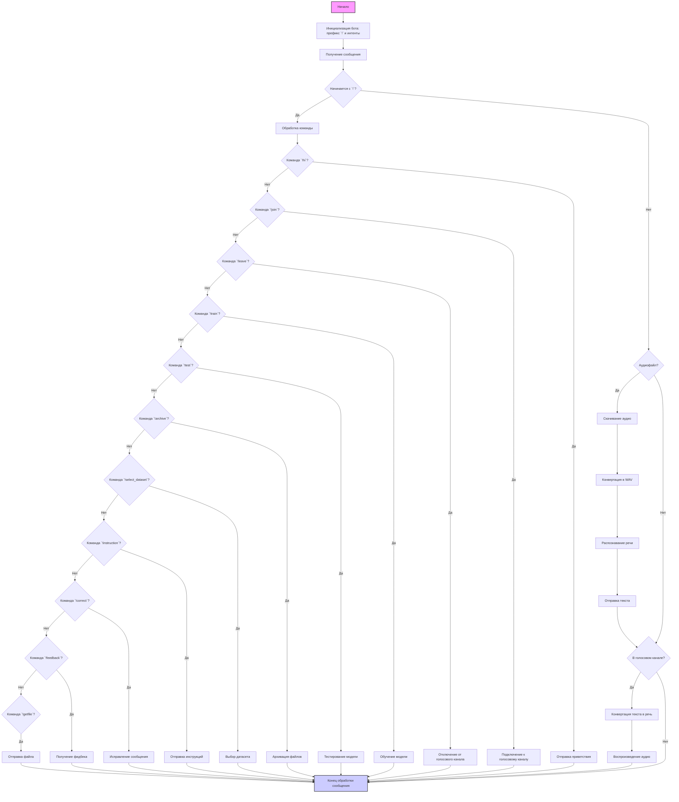

## <алгоритм>

1. **Инициализация бота:**
   - Бот запускается с определенным префиксом команд (`!`) и необходимыми интентами, которые определяют, к каким событиям Discord бот имеет доступ.

2. **Обработка текстовых команд:**
   - Пользователь отправляет сообщение боту.
   - Бот проверяет, начинается ли сообщение с его префикса (`!`).
   - Если сообщение является командой, бот выполняет соответствующую функцию:
     - `!hi`: Отправляет приветственное сообщение.
       *Пример: Пользователь пишет `!hi`. Бот отвечает: "Привет!".*
     - `!join`: Подключается к голосовому каналу пользователя.
       *Пример: Пользователь в голосовом канале пишет `!join`. Бот подключается к этому каналу.*
     - `!leave`: Отключается от голосового канала.
       *Пример: Пользователь в голосовом канале пишет `!leave`. Бот отключается от канала.*
     - `!train`: Начинает тренировку модели, получая данные из файла или текста.
       *Пример: Пользователь пишет `!train` и прикрепляет файл. Бот начинает обучение на основе данных из файла.*
     - `!test`: Тестирует модель на основе предоставленных данных.
       *Пример: Пользователь пишет `!test` и прикрепляет файл. Бот проводит тестирование модели на основе данных из файла.*
     - `!archive`: Архивирует файлы в указанной директории.
        *Пример: Пользователь пишет `!archive /path/to/dir`. Бот архивирует содержимое папки /path/to/dir.*
     - `!select_dataset`: Выбирает датасет для тренировки.
        *Пример: Пользователь пишет `!select_dataset dataset_name`. Бот выбирает датасет с именем dataset_name.*
     - `!instruction`: Выводит инструкции из файла.
        *Пример: Пользователь пишет `!instruction`. Бот отправляет инструкции из файла.*
     - `!correct`: Позволяет пользователю исправить сообщение от бота.
        *Пример: Пользователь пишет `!correct 123 исправление`. Бот обновляет сообщение с ID 123.*
     - `!feedback`: Получает фидбек от пользователя.
        *Пример: Пользователь пишет `!feedback Отличный бот!`. Бот принимает этот фидбек.*
      - `!getfile`: Отправляет файл по указанному пути.
         *Пример: Пользователь пишет `!getfile path/to/file.txt`. Бот отправляет файл path/to/file.txt.*

3. **Обработка сообщений без команд:**
   - Если сообщение не является командой:
     - Бот проверяет, является ли сообщение аудиофайлом.
     - Если это аудиофайл, бот скачивает его, конвертирует в WAV, и распознает речь с помощью Google Speech Recognition.
     - Результат распознавания отправляется пользователю.
       *Пример: Пользователь отправляет голосовое сообщение. Бот отправляет текстовую расшифровку этого сообщения.*

4. **Обработка голосовых сообщений:**
   - Если пользователь находится в голосовом канале:
     - Бот проверяет, есть ли текст для преобразования в речь.
     - Используется `gTTS` для преобразования текста в речь.
     - Аудио воспроизводится в голосовом канале.
       *Пример: Пользователь отправляет текстовое сообщение. Бот преобразует текст в речь и проигрывает в голосовом канале.*

5. **Логирование:**
   - Все важные события и ошибки логируются с помощью модуля `logger`.
   
6. **Работа с файлами**:
  - Бот скачивает файлы по предоставленным URL.
  - Бот использует `tempfile` для создания временных файлов.
  - Бот архивирует директории с использованием `zipfile`.

## <mermaid>

## <объяснение>

### Импорты:

- **`discord`**: Основная библиотека для работы с Discord API. Позволяет боту взаимодействовать с Discord (отправлять сообщения, присоединяться к голосовым каналам и т.д.).
- **`speech_recognition`**: Библиотека для распознавания речи. Используется для преобразования аудио в текст.
- **`pydub`**: Библиотека для работы с аудиофайлами, используется для конвертации аудио в формат WAV.
- **`gtts`**: Библиотека для преобразования текста в речь.
- **`requests`**: Библиотека для выполнения HTTP-запросов, используется для загрузки файлов (аудио).
- **`pathlib`**: Модуль для работы с путями к файлам и директориям.
- **`tempfile`**: Модуль для создания временных файлов и директорий.
- **`asyncio`**: Модуль для работы с асинхронными операциями.
- **`zipfile`**: Модуль для работы с ZIP архивами.
- **`src.gs`**: Глобальные настройки проекта, предположительно, содержат такие параметры, как токен бота.
- **`src.logger`**: Модуль для логирования событий и ошибок.
- **`src.utils`**: Модуль с утилитами, например для генерации уникальных ID.
- **`src.ml`**: Модуль для работы с машинным обучением.

**Взаимосвязи с другими пакетами `src`:**

- `src.gs`: Обеспечивает доступ к глобальным параметрам конфигурации.
- `src.logger`: Используется для ведения логов работы бота и ошибок.
- `src.utils`: Используется для генерации уникальных ID.
- `src.ml`: Используется для работы с моделью машинного обучения.

### Классы:

- В представленном фрагменте кода классы явно не определены. Предполагается, что бот реализован с использованием объекта класса `discord.Client` или `discord.Bot` из библиотеки `discord.py`.

### Функции:

- **`recognizer(url)`**:
  - **Аргументы**:
    - `url` (str): URL аудиофайла для распознавания.
  - **Возвращаемое значение**:
    - `str`: Распознанный текст.
  - **Назначение**: Скачивает аудиофайл по URL, конвертирует его в формат WAV и распознает текст с помощью Google Speech Recognition.
  - **Пример**: `recognizer("http://example.com/audio.mp3")`
-   **`text_to_speech_and_play(voice_channel, text)`**:
  -   **Аргументы**:
      - `voice_channel` (discord.VoiceChannel): Голосовой канал, в котором нужно проиграть звук.
      - `text` (str): Текст, который нужно преобразовать в речь.
  -   **Возвращаемое значение**: `None`.
  -   **Назначение**: Преобразует текст в речь с помощью `gTTS`, подключается к голосовому каналу и воспроизводит аудио.
  -   **Пример**: `text_to_speech_and_play(ctx.author.voice.channel, "Привет!")`
-   **`download_file(url, file_path)`**:
    - **Аргументы**:
        - `url` (str): URL файла для скачивания.
        - `file_path` (str): Путь к файлу, куда нужно сохранить скачанный файл.
    - **Возвращаемое значение**: `None`.
    - **Назначение**: Скачивает файл по URL и сохраняет его по указанному пути.
    - **Пример**: `download_file("http://example.com/file.txt", "/tmp/file.txt")`
-   **`archive_files(source_dir, destination_file)`**:
    - **Аргументы**:
        - `source_dir` (str): Путь к директории, которую нужно заархивировать.
        - `destination_file` (str): Путь к файлу архива, в который нужно сохранить директорию.
    - **Возвращаемое значение**: `None`.
    - **Назначение**: Архивирует указанную директорию в ZIP-архив.
    - **Пример**: `archive_files("/path/to/dir", "/path/to/archive.zip")`

### Переменные:
- `bot`: Объект бота Discord, который управляет взаимодействием с Discord API.
- `gs.credentials.discord.bot_token`: Токен бота, используемый для аутентификации.

### Потенциальные ошибки и области для улучшения:
- **Обработка ошибок**: Не все функции имеют полноценную обработку ошибок. Например, при скачивании файла, распознавании речи или конвертации аудио могут возникнуть исключения. Необходимо добавить обработку исключений, чтобы бот не падал.
- **Асинхронность**: Использование `asyncio` предполагает асинхронные операции, но представленный фрагмент не показывает их. Важно удостовериться, что все блокирующие операции, такие как скачивание файлов, обработка аудио, выполняются асинхронно.
- **Управление голосовым каналом**: В коде может быть недостаточно обработана ситуация, когда бот не может подключиться к голосовому каналу или происходит разрыв соединения.
- **Безопасность**: Хранение токена бота непосредственно в коде или переменных среды может представлять угрозу безопасности. Необходимо рассмотреть использование более безопасных методов хранения секретов.
- **Масштабируемость**: Для более сложного бота следует рассмотреть архитектурные решения, такие как разделение функциональности на отдельные модули и использование очередей для обработки задач.

### Дополнительные замечания:

- Бот представляет собой сложную систему, взаимодействующую с различными API (Discord, Google Speech Recognition) и библиотеками. Важно убедиться, что все зависимости установлены правильно, и бот имеет необходимые разрешения.
- Логирование играет ключевую роль в отладке и мониторинге работы бота.

Этот разбор предоставляет всесторонний анализ функциональности бота, его основных компонентов и возможных областей для улучшения.